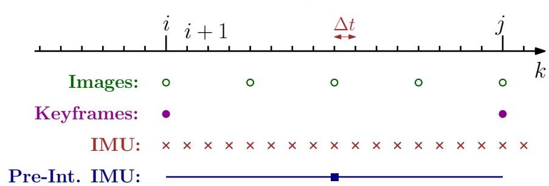
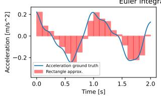
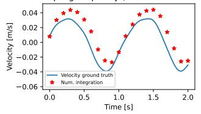
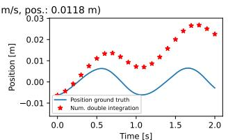
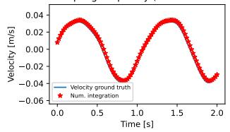
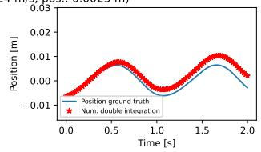
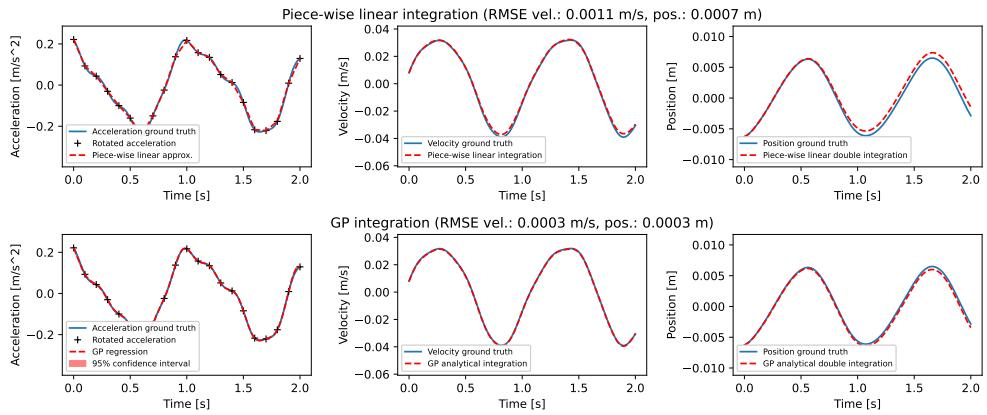
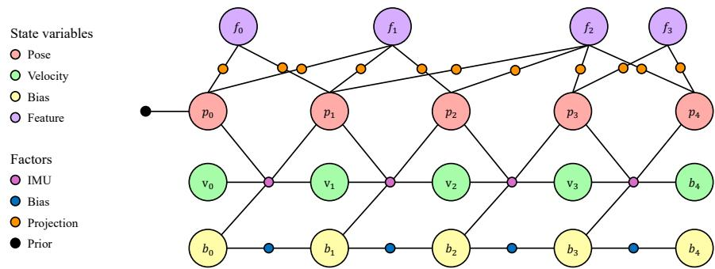
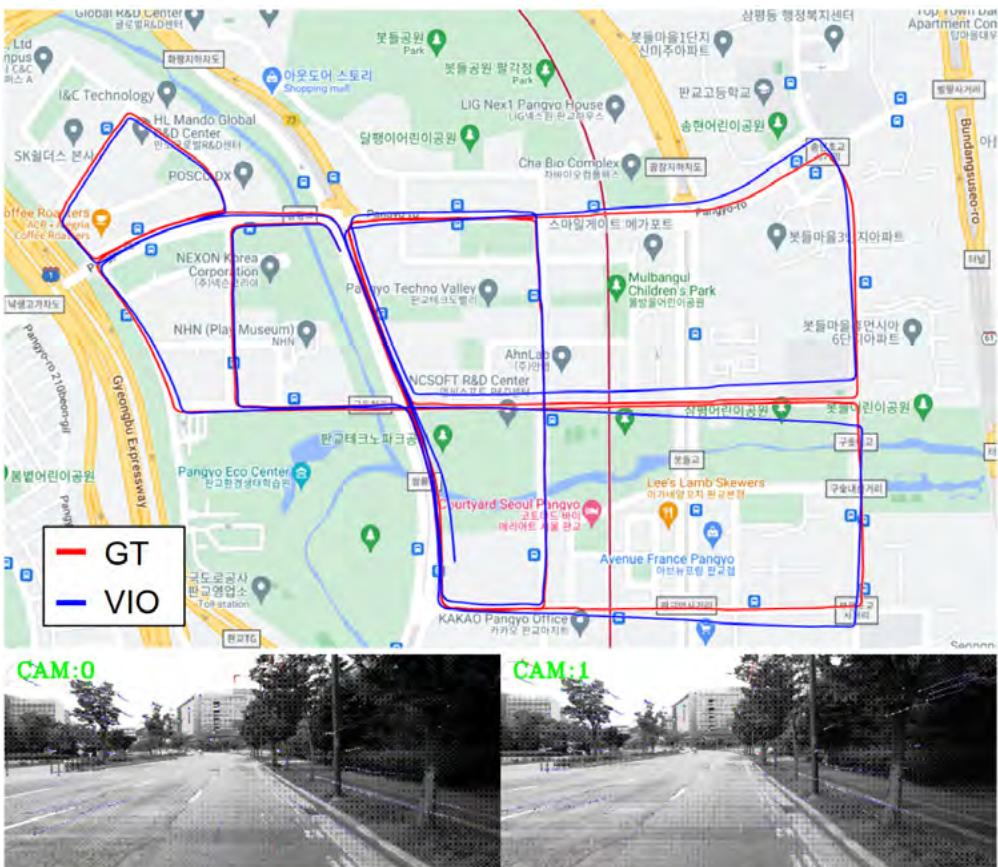

# 《SLAM Handbook：从定位与建图到空间智能》

## 第 11 章  面向 SLAM 的惯性里程计

**作者：** Guoquan（Paul）Huang、Cédric Le Gentil、Teresa Vidal-Calleja、Davide Scaramuzza、Frank Dellaert 和 Luca Carlone

惯性测量单元（IMU）已成为机器人同步定位与建图中最普遍的里程计来源之一。IMU 测量其所附着刚体的线加速度和转速。IMU 的外形、成本和性能覆盖很宽范围：从飞机使用的大型高精度光学传感器，到智能手机及其他消费设备使用的体积小但噪声较大的微机电系统（MEMS）。MEMS IMU 的低尺寸、重量和功耗（SWaP）及低成本特性，使其成为机器人学的理想传感器；面向 SLAM 的相关研究已持续二十多年。

本章先介绍 IMU 基础知识及其测量模型（第 11.1 节），再介绍 IMU 预积分（第 11.2 节），该技术可将高频 IMU 数据加入因子图优化框架。随后说明使用 IMU 数据会在优化中引入额外变量（例如传感器偏置），并讨论 IMU 与相机、LiDAR 等外感传感器组合系统的可观测性1（第 11.3 节）。最后给出现代 IMU 中心 SLAM 系统能够实现的实例（第 11.4 节）并回顾近期趋势（第 11.5 节）。

## 11.1 惯性传感与导航基础

六轴惯性测量单元（IMU）由加速度计和陀螺仪组成：前者测量传感器相对于惯性坐标系的线加速度，后者测量传感器的角速度（或转速）2。惯性导航系统（INS）传统上属于航空航天工程研究范畴，其目标是根据初始状态和 IMU 测量历史，估计 IMU 所安装平台的当前状态（如位姿和速度）[171, 1099]。INS 可分为捷联式系统和稳定式系统：捷联系统将 IMU 固连于平台机架；稳定式系统将 IMU 安装在内万向架、多万向架结构或浮球上，使其方向相对于惯性坐标系保持恒定。机器人中的多数 INS 属于前一类，即使用刚性连接于感知平台、测量局部线加速度和角速度的 IMU。在机器人学中，惯性里程计常作为惯性导航的同义词，以强调估计的里程计性质。

INS 产生的里程计估计显然会随时间漂移，因此大多数应用还依赖 GPS、相机或 LiDAR 等其他传感器；此时称为辅助惯性导航系统（AINS）。机器人学通常直接说明与 IMU 组合使用的传感器。例如，融合相机和 IMU 来提供三维运动跟踪的系统称为视觉惯性里程计；若还包含回环，则称为视觉惯性 SLAM 系统。

### 11.1.1 感知原理与测量模型

IMU 通常包含三轴加速度计和三轴陀螺仪，分别测量传感器平台的线加速度和角速度。陀螺仪设计的基本原理是角动量守恒；加速度计则利用质量块的惯性，测量相对于惯性坐标系的运动学加速度与重力加速度之差。加速度计可以基于多种原理设计，例如采用安装成摆锤质量块的速率陀螺仪、低摩擦外壳中检验质量块的惯性，或利用两条悬挂金属带振动差异、在其间布置检验质量块的结构。

**测量模型。** 下面给出 IMU 测量模型，它将 IMU 测量与机器人状态及待估计的其他量（例如偏置）联系起来。为简化叙述，假设传感器坐标系与机器人机体坐标系 $\mathcal { F } ^ { b }$ 重合，世界坐标系 $\mathcal { F } ^ { w }$ 是惯性坐标系3。时刻 $t$ 的 IMU 测量 $\mathbf{a}(t)$ 与 $\boldsymbol\omega(t)$ 通常认为受到加性白高斯噪声 $\boldsymbol\eta$ 和缓慢变化的传感器偏置 $\mathbf b$ 污染：

$$
\mathbf {a} (t) = \boldsymbol {R} _ {w} ^ {b} (t) \left(\mathbf {a} ^ {w} (t) - \mathbf {g} ^ {w}\right) + \mathbf {b} ^ {a} (t) + \boldsymbol {\eta} ^ {a} (t),\tag{11.1}
$$

$$
\boldsymbol {\omega} (t) = \boldsymbol {\omega} _ {b} ^ {b} (t) + \mathbf {b} ^ {g} (t) + \boldsymbol {\eta} ^ {g} (t).\tag{11.2}
$$

如通常约定，上标 $\mathcal { F } ^ { b }$ 表示相应物理量在机体（IMU）坐标系 $\mathcal { F } ^ { b }$ 中表达。时刻 $t$ 的 IMU 位姿由变换 $\{R_b^w(t),p^w(t)\}$ 描述，它将传感器坐标系 $\mathcal { F } ^ { b }$ 中的点映射到 $\mathcal { F } ^ { w }$（注意 $R_w^b(t)=(R_b^w(t))^\top$）。$\mathbf a^w(t)\in\mathbb R^3$ 是传感器在世界坐标系中的加速度，$\mathbf g^w$ 是世界坐标系中的重力向量；因此 $R_w^b(t)(\mathbf a^w(t)-\mathbf g^w)$ 是 IMU 在机体/IMU 坐标系中感受到的加速度。$\boldsymbol\omega_b^b(t)\in\mathbb R^3$ 是 $\mathcal { F } ^ { b }$ 相对 $\mathcal { F } ^ { w }$ 的瞬时角速度，并在 $\mathcal { F } ^ { b }$ 中表达。噪声项 $\boldsymbol\eta^g(t)$ 和 $\boldsymbol\eta^a(t)$ 假设为零均值高斯随机变量，待估偏置 $\mathbf b^a(t)$ 与 $\mathbf b^g(t)$ 假设服从随机游走。这里噪声和偏置向量的上标表示传感器（加速度计与陀螺仪），而非坐标系；例如 $\mathbf b^a(t)$ 是加速度计偏置。

**扩展模型。** 虽然测量模型 (11.1)--(11.2) 在机器人应用中通常足够，但在重新标定传感器平台等情况下，可能需要更精细的模型以准确刻画感知过程。受制造误差影响，加速度计可能存在失准和尺度误差，模型可扩展为：

$$
\mathbf {a} (t) = \boldsymbol {T} _ {a} \boldsymbol {R} _ {w} ^ {b} (t) (\mathbf {a} ^ {w} (t) - \mathbf {g} ^ {w}) + \mathbf {b} ^ {a} (t) + \boldsymbol {\eta} ^ {a} (t),\tag{11.3}
$$

其中 $\boldsymbol T_a$ 为同时建模加速度计测量失准和尺度误差的形状矩阵。尺度误差可包含静态成分或温度相关成分，并可在传感器内参标定时确定。类似地，陀螺仪测量模型可扩展以刻画失准和尺度误差：

$$
\pmb {\omega} (t) = \pmb {T} _ {g}   \pmb {\omega} _ {b} ^ {b} (t) + \mathbf {b} ^ {g} (t) + \pmb {\eta} ^ {g} (t),\tag{11.4}
$$

其中 $\boldsymbol T_g$ 是同时建模陀螺仪失准和尺度误差的形状矩阵。陀螺仪测量还常受加速度影响，这一现象称为 $g$ 敏感性。若影响量处在加性白噪声 $\boldsymbol\eta^g(t)$ 的范围内，通常可忽略；但某些 MEMS 硬件中该影响更显著，可建模为：

$$
\pmb {\omega} (t) = \pmb {T} _ {g} \pmb {\omega} _ {b} ^ {b} (t) + \pmb {T} _ {s} \pmb {R} _ {w} ^ {b} (t) (\mathbf {a} ^ {w} (t) - \mathbf {g} ^ {w}) + \mathbf {b} ^ {g} (t) + \pmb {\eta} ^ {g} (t),\tag{11.5}
$$

其中 $\boldsymbol T_s$ 为 $g$ 敏感性矩阵，可在标定期间估计。

### 11.1.2 初始对准

在 SLAM 中，通常把全局坐标系设为轨迹起始位姿，即把初始位姿 $\{R_b^w(0),p^w(0)\}$ 设为单位位姿。但 INS 的 IMU 测量包含重力项（参见 (11.1)），世界坐标系通常选为与重力对齐，因此初始位姿也必须与重力方向对齐。换言之，机器人方向不再可以任意选择，必须与重力方向一致。具体地，需要计算把机体（IMU）坐标系对齐到世界坐标系的旋转 $R_b^w(0)$。为简化起见，假设机器人初始静止，即部署开始时未施加比力，常用低成本 MEMS IMU 只测得重力。仅给定局部重力测量 $\mathbf g^b$ 时，无法恢复绕重力方向的旋转（偏航），它可依应用自由选择；但可通过以下静态初始化确定滚转和俯仰对应的旋转：

$$
\left\{ \begin{array}{l} \boldsymbol {z} _ {w} ^ {b} = \frac {\mathbf {g} ^ {b}}{| | \mathbf {g} ^ {b} | |} \\ \boldsymbol {x} _ {w} ^ {b} = \frac {\mathbf {e} _ {1} - \boldsymbol {z} _ {w} ^ {b} \mathbf {e} _ {1} ^ {\top} \boldsymbol {z} _ {w} ^ {b}}{| | \mathbf {e} _ {1} - \boldsymbol {z} _ {w} ^ {b} \mathbf {e} _ {1} ^ {\top} \boldsymbol {z} _ {w} ^ {b} | |} \\ \boldsymbol {y} _ {w} ^ {b} = \boldsymbol {z} _ {w} ^ {b} \times \boldsymbol {x} _ {w} ^ {b} \end{array} \right. \Rightarrow \boldsymbol {R} _ {w} ^ {b} = \left[ \begin{array}{c c c} \boldsymbol {x} _ {w} ^ {b} & \boldsymbol {y} _ {w} ^ {b} & \boldsymbol {z} _ {w} ^ {b} \end{array} \right]\tag{11.6}
$$

这里对 $\mathbf e_1=[1\ 0\ 0]^\top$ 与 $\mathbf g^b$ 作 Gram--Schmidt 正交归一化，$\times$ 表示叉乘。直观地说，旋转矩阵 $R_w^b$ 的最后一列 $\boldsymbol z_w^b$ 是世界坐标系 $z$ 轴相对于机体坐标系的方向。世界 $z$ 轴与重力对齐，因此 (11.6) 由机体坐标系的重力测量计算 $\boldsymbol z_w^b$；随后正交归一化过程计算 $\boldsymbol x_w^b$ 和 $\boldsymbol y_w^b$，以在任意偏航选择下补全 $R_w^b$ 的列。

**使用高端 IMU 的对准。** 高端 IMU 的陀螺仪足够灵敏，可测量地球自转速率 $\boldsymbol\omega_{ie}$。若所选世界坐标系是惯性坐标系（例如地心惯性坐标系 ECI [318]），则可使用机体坐标系中的重力向量 $\mathbf g^b$ 与地球自转速率 $\boldsymbol\omega_{ie}$ 测量进行解析对准：

$$
\left\{ \begin{array}{l} \mathbf {g} ^ {b} = \boldsymbol {R} _ {w} ^ {b} \mathbf {g} ^ {w} \\ \boldsymbol {\omega} _ {i e} ^ {b} = \boldsymbol {R} _ {w} ^ {b} \boldsymbol {\omega} _ {i e} ^ {w} \\ \mathbf {g} ^ {b} \times \boldsymbol {\omega} _ {i e} ^ {b} = \boldsymbol {R} _ {w} ^ {b} \left(\mathbf {g} ^ {w} \times \boldsymbol {\omega} _ {i e} ^ {w}\right) \end{array} \Rightarrow \boldsymbol {R} _ {b} ^ {w} = \left[ \begin{array}{c} \mathbf {g} ^ {w ^ {\top}} \\ \boldsymbol {\omega} _ {i e} ^ {w ^ {\top}} \\ (\mathbf {g} ^ {w} \times \boldsymbol {\omega} _ {i e} ^ {w}) ^ {\top} \end{array} \right] ^ {- 1} \left[ \begin{array}{c} \mathbf {g} ^ {b ^ {\top}} \\ \boldsymbol {\omega} _ {i e} ^ {b ^ {\top}} \\ (\mathbf {g} ^ {b} \times \boldsymbol {\omega} _ {i e} ^ {w}) ^ {\top} \end{array} \right] \right.\tag{11.7}
$$

所得旋转矩阵 $R_b^w$ 通常需投影到 $\mathrm{SO}(3)$，以减弱测量噪声影响。

## 11.2 IMU 预积分与因子图

上一节的 IMU 测量模型 (11.1)--(11.2) 将测量与机器人状态，尤其是位姿、速度及传感器偏置联系起来。原则上可按第 1 章从这些模型导出最大后验估计器，但这会产生不切实际的大因子图：典型 IMU 以高频率（例如 200--1000 Hz）测量，测量模型要求在每一个 IMU 采样时刻向因子图添加状态，所得因子图很快无法求解。连续时间表述虽可避免以 IMU 速率添加变量，却仍须为每次测量添加一个高频因子，因子图依旧臃肿。

IMU 预积分的核心思想是避免以 IMU 速率向因子图添加状态或测量：将一段时间内的 IMU 测量积分为相对运动测量，再将较少的运动测量加入因子图。然而，朴素积分（第 11.2.1 节）仍要求在因子图求解器每次迭代时重新积分，因为积分初始条件可能改变。预积分通过分离依赖状态变量的项和依赖测量的项来避免该问题。预积分思想可追溯至 [709]，并由 [334, 335] 扩展到流形；第 11.2.2 节紧随 [334, 335] 的表述，第 11.2.3 节讨论更高级技术，近期工作留待第 11.5 节介绍。

### 11.2.1 运动积分

本节从 IMU 测量推断机器人运动。为此，引入如下运动学模型 [790, 318]：

$$
\dot {\boldsymbol {R}} _ {b} ^ {w} = \boldsymbol {R} _ {b} ^ {w} (\boldsymbol {\omega} _ {b} ^ {b}) ^ {\wedge}, \qquad \dot {\boldsymbol {v}} ^ {w} = \mathbf {a} ^ {w}, \qquad \dot {\boldsymbol {p}} ^ {w} = \boldsymbol {v} ^ {w},\tag{11.8}
$$

它描述机体坐标系 $\mathcal F^b$ 相对于世界坐标系 $\mathcal F^w$ 的旋转 $R_b^w$、平移 $\mathbf p^w$ 和速度 $\mathbf v^w$ 的演化。设 $\Delta t$ 为 IMU 采样周期，时刻 $t+\Delta t$ 的状态由对 (11.8) 积分得到：

$$
\begin{array}{l} \pmb {R} _ {b} ^ {w} (t + \Delta t) = \pmb {R} _ {b} ^ {w} (t) \mathrm{Exp} \left(\int_ {t} ^ {t + \Delta t} \pmb {\omega} _ {b} ^ {b} (\tau) d \tau\right) \\ \pmb {v} ^ {w} (t + \Delta t) = \pmb {v} ^ {w} (t) + \int_ {t} ^ {t + \Delta t} \pmb {\mathbf {a}} ^ {w} (\tau) d \tau \end{array}\tag{11.9}
$$

$$
\pmb {p} ^ {w} (t + \Delta t) = \pmb {p} ^ {w} (t) + \int_ {t} ^ {t + \Delta t} \pmb {v} ^ {w} (\tau) d \tau,\tag{11.10}
$$

上式第一行假设角速度 $\boldsymbol\omega_b^b$ 的方向在区间 $[t,t+\Delta t]$ 内不变4。进一步假设 $\mathbf a^w$ 与 $\boldsymbol\omega_b^b$ 在该时间区间内恒定，可写为：

$$
\begin{array}{r l} & {\pmb {R} _ {b} ^ {w} (t + \Delta t) = \pmb {R} _ {b} ^ {w} (t) \mathrm{Exp} (\pmb {\omega} _ {b} ^ {b} (t) \Delta t)} \\ & {\pmb {v} ^ {w} (t + \Delta t) = \pmb {v} ^ {w} (t) + \pmb {a} ^ {w} (t) \Delta t} \\ & {\pmb {p} ^ {w} (t + \Delta t) = \pmb {p} ^ {w} (t) + \pmb {v} ^ {w} (t) \Delta t + \frac {1}{2} \pmb {a} ^ {w} (t) \Delta t ^ {2}.} \end{array}\tag{11.11}
$$

更一般地，(11.11) 可理解为使用 Euler 积分数值求解 (11.9) 中的积分。利用 (11.1)--(11.2)，可将 $\mathbf a^w$ 与 $\boldsymbol\omega_b^b$ 写成 IMU 测量的函数，得到：

$$
\begin{array}{r l} \boldsymbol {R} (t + \Delta t) = & \boldsymbol {R} (t) \mathrm{Exp} \left(\left(\tilde {\boldsymbol {\omega}} (t) - \mathbf {b} ^ {g} (t) - \boldsymbol {\eta} ^ {g d} (t)\right) \Delta t\right) \\ \boldsymbol {v} (t + \Delta t) = & \boldsymbol {v} (t) + \mathbf {g} \Delta t + \boldsymbol {R} (t) \left(\tilde {\mathbf {a}} (t) - \mathbf {b} ^ {a} (t) - \boldsymbol {\eta} ^ {a d} (t)\right) \Delta t \\ \boldsymbol {p} (t + \Delta t) = & \boldsymbol {p} (t) + \boldsymbol {v} (t) \Delta t + \frac {1}{2} \mathbf {g} \Delta t ^ {2} + \frac {1}{2} \boldsymbol {R} (t) \left(\tilde {\mathbf {a}} (t) - \mathbf {b} ^ {a} (t) - \boldsymbol {\eta} ^ {a d} (t)\right) \Delta t ^ {2}, \end{array}\tag{11.12}
$$

为便于阅读，以下省略坐标系下标。该速度和位置数值积分在两次测量之间的积分时间内假设方向 $R(t)$ 恒定；对于非零转速测量，它并非微分方程 (11.8) 的精确解。实践中，高频 IMU 可减轻此近似的影响。这里采用 (11.12)，因为它简单且便于建模与不确定性传播；第 11.2.3 节再讨论更高级的积分技术。离散时间噪声 $\boldsymbol\eta^{gd}$ 的协方差依赖采样率，并与连续时间噪声 $\boldsymbol\eta^g$ 满足 $\mathrm{Cov}(\boldsymbol\eta^{gd}(t))=\frac{1}{\Delta t}\mathrm{Cov}(\boldsymbol\eta^g(t))$；$\boldsymbol\eta^{ad}$ 同理（参见 [232, Appendix]）。

尽管 (11.12) 可直接视为因子图中的概率约束，但它要求以高频将状态加入因子图：它联系时刻 $t$ 和 $t+\Delta t$ 的状态，而 $\Delta t$ 正是 IMU 采样周期，因此每到一条 IMU 测量都要增加一个状态 [503]。

  
图 11.1 IMU 与相机具有不同采样速率。引自 [335]（©2016 IEEE）。

可以通过在更长时间区间上积分来避免这一问题。若因子图已经建模其他传感器测量（例如第 7 章的视觉测量），即可在因子图中两个时间相邻状态之间积分 IMU 测量，称这些状态为“关键帧状态”5。对两个连续关键帧间的所有 $\Delta t$ 区间迭代 (11.12)，得到6：

$$
\begin{array}{l} \boldsymbol {R} _ {j} = \boldsymbol {R} _ {i} \prod_ {k = i} ^ {j - 1} \mathrm{Exp} \left(\left(\tilde {\omega} _ {k} - \mathbf {b} _ {k} ^ {g} - \boldsymbol {\eta} _ {k} ^ {g d}\right) \Delta t\right), \\ \boldsymbol {v} _ {j} = \boldsymbol {v} _ {i} + \mathbf {g} \Delta t _ {i j} + \sum_ {k = i} ^ {j - 1} \boldsymbol {R} _ {k} \Big (\tilde {\mathbf {a}} _ {k} - \mathbf {b} _ {k} ^ {a} - \boldsymbol {\eta} _ {k} ^ {a d} \Big) \Delta t \\ \boldsymbol {p} _ {j} = \boldsymbol {p} _ {i} + \sum_ {k = i} ^ {j - 1} \Big [ \boldsymbol {v} _ {k} \Delta t + \frac {1}{2} \mathbf {g} \Delta t ^ {2} + \frac {1}{2} \boldsymbol {R} _ {k} \Big (\tilde {\mathbf {a}} _ {k} - \mathbf {b} _ {k} ^ {a} - \boldsymbol {\eta} _ {k} ^ {a d} \Big) \Delta t ^ {2} \Big ] \end{array}\tag{11.13}
$$

这让因子图以较低频率连接关键帧状态；但若在优化过程中关键帧起始状态或偏置变化，必须重新进行积分 [645]，仍会造成很大计算负担。这正是预积分要解决的问题。

### 11.2.2 流形上的 IMU 预积分

预积分把关键帧间相对旋转、速度和位置变化表达在第一个关键帧坐标系中，从而把依赖起始状态的项移到因子一侧。下面使用流形上的旋转表示，以保证优化中始终满足旋转矩阵的正交约束。

#### 11.2.2.1 预积分 IMU 测量

定义关键帧 $i$ 至 $j$ 的预积分测量为：

$$
\begin{array}{l} \Delta \boldsymbol {R} _ {i j} \doteq \boldsymbol {R} _ {i} ^ {\mathsf {T}} \boldsymbol {R} _ {j} = \prod_ {k = i} ^ {j - 1} \mathrm{Exp} \left(\left(\tilde {\omega} _ {k} - \mathbf {b} _ {k} ^ {g} - \boldsymbol {\eta} _ {k} ^ {g d}\right) \Delta t\right) \\ \Delta \boldsymbol {v} _ {i j} \doteq \boldsymbol {R} _ {i} ^ {\mathsf {T}} (\boldsymbol {v} _ {j} - \boldsymbol {v} _ {i} - \mathbf {g} \Delta t _ {i j}) = \sum_ {k = i} ^ {j - 1} \Delta \boldsymbol {R} _ {i k} \big (\tilde {\mathbf {a}} _ {k} - \mathbf {b} _ {k} ^ {a} - \boldsymbol {\eta} _ {k} ^ {a d} \big) \Delta t \\ \Delta \boldsymbol {p} _ {i j} \doteq \boldsymbol {R} _ {i} ^ {\mathsf {T}} (\boldsymbol {p} _ {j} - \boldsymbol {p} _ {i} - \boldsymbol {v} _ {i} \Delta t _ {i j} - \frac {1}{2} \mathbf {g} \Delta t _ {i j} ^ {2}) \\ = \sum_ {k = i} ^ {j - 1} \left[ \Delta \boldsymbol {v} _ {i k} \Delta t + \frac {1}{2} \Delta \boldsymbol {R} _ {i k} (\tilde {\mathbf {a}} _ {k} - \mathbf {b} _ {k} ^ {a} - \boldsymbol {\eta} _ {k} ^ {a d}) \Delta t ^ {2} \right], \end{array}\tag{11.14}
$$

为了使这些量仅依赖于 IMU 测量，通常在区间内把偏置近似为常数：

$$
\mathbf {b} _ {i} ^ {g} = \mathbf {b} _ {i + 1} ^ {g} = \ldots = \mathbf {b} _ {j - 1} ^ {g}, \quad \mathbf {b} _ {i} ^ {a} = \mathbf {b} _ {i + 1} ^ {a} = \ldots = \mathbf {b} _ {j - 1} ^ {a}.\tag{11.15}
$$

令 $\Delta\tilde R_{ij}$、$\Delta\tilde v_{ij}$ 和 $\Delta\tilde p_{ij}$ 分别为无噪声积分值。使用指数映射的一阶近似及旋转交换关系：

$$
\mathrm{Exp} (\phi + \delta \phi) \approx \mathrm{Exp} (\phi) \mathrm{Exp} (\mathsf {J} _ {r} (\phi) \delta \phi),\tag{11.16}
$$

$$
\mathrm{Exp} (\phi) \boldsymbol {R} = \boldsymbol {R} \mathrm{Exp} (\boldsymbol {R} ^ {\mathsf {T}} \phi).\tag{11.17}
$$

可将预积分旋转写为名义预积分和小旋转噪声的乘积：

$$
\begin{array}{l} \Delta \boldsymbol {R} _ {i j} \stackrel {{\text {eq. (11.16)}}} {{\simeq}} \prod_ {k = i} ^ {j - 1} \left[ \operatorname{Exp} \left((\tilde {\boldsymbol {\omega}} _ {k} - \mathbf {b} _ {i} ^ {g})   \Delta t\right) \operatorname{Exp} \left(- \mathrm{J} _ {r} ^ {k}   \boldsymbol {\eta} _ {k} ^ {g d}   \Delta t\right) \right] \\ \stackrel {{\text {eq. (11.17)}}} {{=}} \Delta \tilde {\boldsymbol {R}} _ {i j} \prod_ {k = i} ^ {j - 1} \operatorname{Exp} \left(- \Delta \tilde {\boldsymbol {R}} _ {k + 1 j} ^ {\mathsf {T}}   \mathrm{J} _ {r} ^ {k}   \boldsymbol {\eta} _ {k} ^ {g d}   \Delta t\right) \\ \doteq \Delta \tilde {\boldsymbol {R}} _ {i j} \operatorname{Exp} (- \delta \phi_ {i j}) \end{array}\tag{11.18}
$$

进一步使用小角度近似及叉乘矩阵恒等式：

$$
\exp (\phi^ {\wedge}) \approx \mathbf {I} + \phi^ {\wedge},\tag{11.19}
$$

$$
\mathbf {a} ^ {\wedge} \mathbf {b} = - \mathbf {b} ^ {\wedge} \mathbf {a}, \quad \forall \mathbf {a}, \mathbf {b} \in \mathbb {R} ^ {3},\tag{11.20}
$$

即可得到速度和位置预积分误差：

$$
\begin{array}{l} \Delta \boldsymbol {v} _ {i j} \stackrel {{\text {eq. (11.19)}}} {{\simeq}} \sum_ {k = i} ^ {j - 1} \Delta \tilde {\boldsymbol {R}} _ {i k} (\mathbf {I} - \delta \phi_ {i k} ^ {\wedge}) \left(\tilde {\mathbf {a}} _ {k} - \mathbf {b} _ {i} ^ {a}\right) \Delta t - \Delta \tilde {\boldsymbol {R}} _ {i k} \boldsymbol {\eta} _ {k} ^ {a d} \Delta t \\ \stackrel {{\text {eq. (11.20)}}} {{=}} \Delta \tilde {\boldsymbol {v}} _ {i j} + \sum_ {k = i} ^ {j - 1} \left[ \Delta \tilde {\boldsymbol {R}} _ {i k} \left(\tilde {\mathbf {a}} _ {k} - \mathbf {b} _ {i} ^ {a}\right) ^ {\wedge} \delta \phi_ {i k} \Delta t - \Delta \tilde {\boldsymbol {R}} _ {i k} \boldsymbol {\eta} _ {k} ^ {a d} \Delta t \right] \\ \doteq \Delta \tilde {\boldsymbol {v}} _ {i j} - \delta \boldsymbol {v} _ {i j} \end{array}\tag{11.21}
$$

$$
\begin{array}{l} \Delta \boldsymbol {p} _ {i j} \stackrel {{\text { eq. (11.19)}}} {{\simeq}} \sum_ {k = i} ^ {j - 1} \Big [ (\Delta \tilde {\boldsymbol {v}} _ {i k} - \delta \boldsymbol {v} _ {i k}) \Delta t + \frac {1}{2} \Delta \tilde {\boldsymbol {R}} _ {i k} (\mathbf {I} - \delta \phi_ {i k} ^ {\wedge})   (\tilde {\mathbf {a}} _ {k} - \mathbf {b} _ {i} ^ {a})   \Delta t ^ {2} \\ \qquad - \frac {1}{2} \Delta \tilde {\boldsymbol {R}} _ {i k} \boldsymbol {\eta} _ {k} ^ {a d}   \Delta t ^ {2} \Big ] \\ \stackrel {{\text { eq. (11.20)}}} {{=}} \Delta \tilde {\boldsymbol {p}} _ {i j} + \sum_ {k = i} ^ {j - 1} \Big [ - \delta \boldsymbol {v} _ {i k} \Delta t + \frac {1}{2} \Delta \tilde {\boldsymbol {R}} _ {i k}   (\tilde {\mathbf {a}} _ {k} - \mathbf {b} _ {i} ^ {a}) ^ {\wedge}   \delta \phi_ {i k} \Delta t ^ {2} \\ \qquad - \frac {1}{2} \Delta \tilde {\boldsymbol {R}} _ {i k} \boldsymbol {\eta} _ {k} ^ {a d}   \Delta t ^ {2} \Big ] \\ \doteq \Delta \tilde {\boldsymbol {p}} _ {i j} - \delta \boldsymbol {p} _ {i j}, \end{array}\tag{11.22}
$$

因此，带噪预积分测量可重写为：

$$
\begin{array}{l} \Delta \tilde {\boldsymbol {R}} _ {i j} = \boldsymbol {R} _ {i} ^ {\mathsf {T}} \boldsymbol {R} _ {j} \mathrm{Exp} (\delta \phi_ {i j}) \\ \Delta \tilde {\boldsymbol {v}} _ {i j} = \boldsymbol {R} _ {i} ^ {\mathsf {T}} (\boldsymbol {v} _ {j} - \boldsymbol {v} _ {i} - \mathbf {g} \Delta t _ {i j}) + \delta \boldsymbol {v} _ {i j} \\ \Delta \tilde {\boldsymbol {p}} _ {i j} = \boldsymbol {R} _ {i} ^ {\mathsf {T}} (\boldsymbol {p} _ {j} - \boldsymbol {p} _ {i} - \boldsymbol {v} _ {i} \Delta t _ {i j} - \frac {1}{2} \mathbf {g} \Delta t _ {i j} ^ {2}) + \delta \boldsymbol {p} _ {i j} \end{array}\tag{11.23}
$$

这一表示将预积分量的名义值与由陀螺仪、加速度计噪声引起的小误差显式分开。

#### 11.2.2.2 噪声传播

预积分噪声向量由旋转、速度和位置误差构成，并假设为零均值高斯变量：

$$
\boldsymbol {\eta} _ {i j} ^ {\Delta} \doteq [ \delta \boldsymbol {\phi} _ {i j} ^ {\mathsf {T}}, \delta \boldsymbol {v} _ {i j} ^ {\mathsf {T}}, \delta \boldsymbol {p} _ {i j} ^ {\mathsf {T}} ] ^ {\mathsf {T}} \sim \mathcal {N} (\mathbf {0} _ {9 \times 1}, \boldsymbol {\Sigma} _ {i j}).\tag{11.24}
$$

由旋转误差乘积表达式、对数映射的一阶近似，可导出旋转误差及其线性化递推：

$$
\operatorname{Exp} \left(- \delta \phi_ {i j}\right) \doteq \prod_ {k = i} ^ {j - 1} \operatorname{Exp} \left(- \Delta \tilde {\boldsymbol {R}} _ {k + 1 j} ^ {\intercal} \mathbb {J} _ {r} ^ {k} \boldsymbol {\eta} _ {k} ^ {g d} \Delta t\right).\tag{11.25}
$$

$$
\delta \phi_ {i j} = - \mathrm{Log} \left(\prod_ {k = i} ^ {j - 1} \mathrm{Exp} \left(- \Delta \tilde {\boldsymbol {R}} _ {k + 1 j} ^ {\mathsf {T}} \mathbb {J} _ {r} ^ {k}   \boldsymbol {\eta} _ {k} ^ {g d}   \Delta t\right)\right).\tag{11.26}
$$

$$
\mathrm{Log} \big (\mathrm{Exp} (\phi) \mathrm{Exp} (\delta \phi) \big) \approx \phi + \mathrm{J} _ {r} ^ {- 1} (\phi) \delta \phi .\tag{11.27}
$$

$$
\delta \phi_ {i j} \simeq \sum_ {k = i} ^ {j - 1} \Delta \tilde {\boldsymbol {R}} _ {k + 1 j} ^ {\intercal} \mathsf {J} _ {r} ^ {k} \boldsymbol {\eta} _ {k} ^ {g d} \Delta t\tag{11.28}
$$

$$
\delta \boldsymbol {v} _ {i j} \simeq \sum_ {k = i} ^ {j - 1} \left[ - \Delta \tilde {\boldsymbol {R}} _ {i k} \left(\tilde {\mathbf {a}} _ {k} - \mathbf {b} _ {i} ^ {a}\right) ^ {\wedge} \delta \phi_ {i k} \Delta t + \Delta \tilde {\boldsymbol {R}} _ {i k} \boldsymbol {\eta} _ {k} ^ {a d} \Delta t \right]\tag{11.29}
$$

$$
\delta \pmb {p} _ {i j} \simeq \sum_ {k = i} ^ {j - 1} \left[ \delta \pmb {v} _ {i k} \Delta t - \frac {1}{2} \Delta \tilde {\pmb {R}} _ {i k} (\tilde {\mathbf {a}} _ {k} - \mathbf {b} _ {i} ^ {a}) ^ {\wedge} \delta \phi_ {i k} \Delta t ^ {2} + \frac {1}{2} \Delta \tilde {\pmb {R}} _ {i k} \pmb {\eta} _ {k} ^ {a d} \Delta t ^ {2} \right]
$$

这些递推关系可在预积分过程中累积协方差 $\Sigma_{ij}$，从而将 IMU 噪声正确地传递到关键帧之间的九维预积分测量。

#### 11.2.2.3 纳入偏置更新

前述预积分是在某个线性化偏置 $\bar{\mathbf b}_i$ 下计算的。优化后偏置发生小变化时，不必重新积分原始 IMU 数据；可用一阶雅可比修正预积分旋转、速度和位置：

$$
\begin{array}{r} \Delta \tilde {\pmb {R}} _ {i j} (\mathbf {b} _ {i} ^ {g}) \simeq \Delta \tilde {\pmb {R}} _ {i j} (\bar {\mathbf {b}} _ {i} ^ {g}) \mathrm{Exp} \Big (\frac {\partial \Delta \bar {\pmb {R}} _ {i j}}{\partial \mathbf {b} ^ {g}} \delta \mathbf {b} ^ {g} \Big) \\ \Delta \tilde {\pmb {v}} _ {i j} (\mathbf {b} _ {i} ^ {g}, \mathbf {b} _ {i} ^ {a}) \simeq \Delta \tilde {\pmb {v}} _ {i j} (\bar {\mathbf {b}} _ {i} ^ {g}, \bar {\mathbf {b}} _ {i} ^ {a}) + \frac {\partial \Delta \bar {\pmb {v}} _ {i j}}{\partial \mathbf {b} ^ {g}} \delta \mathbf {b} _ {i} ^ {g} + \frac {\partial \Delta \bar {\pmb {v}} _ {i j}}{\partial \mathbf {b} ^ {a}} \delta \mathbf {b} _ {i} ^ {a} \\ \Delta \tilde {\pmb {p}} _ {i j} (\mathbf {b} _ {i} ^ {g}, \mathbf {b} _ {i} ^ {a}) \simeq \Delta \tilde {\pmb {p}} _ {i j} (\bar {\mathbf {b}} _ {i} ^ {g}, \bar {\mathbf {b}} _ {i} ^ {a}) + \frac {\partial \Delta \bar {\pmb {p}} _ {i j}}{\partial \mathbf {b} ^ {g}} \delta \mathbf {b} _ {i} ^ {g} + \frac {\partial \Delta \bar {\pmb {p}} _ {i j}}{\partial \mathbf {b} ^ {a}} \delta \mathbf {b} _ {i} ^ {a} \end{array}\tag{11.30}
$$

这里 $\delta\mathbf b_i^g$ 与 $\delta\mathbf b_i^a$ 分别是陀螺仪和加速度计偏置的更新量。这一近似正是预积分在迭代优化中高效的关键。

#### 11.2.2.4 预积分 IMU 因子与偏置模型

预积分因子将第 $i$、$j$ 个关键帧的位姿、速度和偏置关联起来；其旋转、速度、位置残差为：

$$
\begin{array}{r l} & {\pmb {r} _ {\Delta \pmb {R} _ {i j}} \doteq \mathrm{Log} \left(\left(\Delta \tilde {\pmb {R}} _ {i j} (\bar {\mathbf {b}} _ {i} ^ {g}) \mathrm{Exp} \left(\frac {\partial \Delta \bar {\pmb {R}} _ {i j}}{\partial \mathbf {b} ^ {g}} \delta \mathbf {b} ^ {g}\right)\right) ^ {\top} \pmb {R} _ {i} ^ {\top} \pmb {R} _ {j}\right)} \\ & {\pmb {r} _ {\Delta \pmb {v} _ {i j}} \doteq \pmb {R} _ {i} ^ {\top} (\pmb {v} _ {j} - \pmb {v} _ {i} - \mathbf {g} \Delta t _ {i j})} \\ & {\qquad - \left[ \Delta \tilde {\pmb {v}} _ {i j} (\bar {\mathbf {b}} _ {i} ^ {g}, \bar {\mathbf {b}} _ {i} ^ {a}) + \frac {\partial \Delta \bar {\pmb {v}} _ {i j}}{\partial \mathbf {b} ^ {g}} \delta \mathbf {b} ^ {g} + \frac {\partial \Delta \bar {\pmb {v}} _ {i j}}{\partial \mathbf {b} ^ {a}} \delta \mathbf {b} ^ {a} \right]} \\ & {\pmb {r} _ {\Delta \pmb {p} _ {i j}} \doteq \pmb {R} _ {i} ^ {\top} (\pmb {p} _ {j} - \pmb {p} _ {i} - \pmb {v} _ {i} \Delta t _ {i j} - \frac 12 \mathbf {g} \Delta t _ {i j} ^ {2})} \\ & {\qquad - \left[ \Delta \tilde {\pmb {p}} _ {i j} (\bar {\mathbf {b}} _ {i} ^ {g}, \bar {\mathbf {b}} _ {i} ^ {a}) + \frac {\partial \Delta \bar {\pmb {p}} _ {i j}}{\partial \mathbf {b} ^ {g}} \delta \mathbf {b} ^ {g} + \frac {\partial \Delta \bar {\pmb {p}} _ {i j}}{\partial \mathbf {b} _ {a}} \delta \mathbf {b} ^ {a} \right],} \end{array}\tag{11.31}
$$

常把 IMU 偏置建模为连续时间随机游走：

$$
\dot {\mathbf {b}} ^ {g} (t) = \pmb {\eta} ^ {b g}, \qquad \dot {\mathbf {b}} ^ {a} (t) = \pmb {\eta} ^ {b a}.\tag{11.32}
$$

$$
\mathbf {b} _ {j} ^ {g} = \mathbf {b} _ {i} ^ {g} + \boldsymbol {\eta} ^ {b g d}, \qquad \mathbf {b} _ {j} ^ {a} = \mathbf {b} _ {i} ^ {a} + \boldsymbol {\eta} ^ {b a d},\tag{11.33}
$$

由此得到连接相邻关键帧偏置的偏置因子残差：

$$
\left\| \boldsymbol {r} _ {\mathbf {b} _ {i j}} \right\| ^ {2} \doteq \left\| \mathbf {b} _ {j} ^ {g} - \mathbf {b} _ {i} ^ {g} \right\| _ {\boldsymbol {\Sigma} ^ {b g d}} ^ {2} + \left\| \mathbf {b} _ {j} ^ {a} - \mathbf {b} _ {i} ^ {a} \right\| _ {\boldsymbol {\Sigma} ^ {b a d}} ^ {2}\tag{11.34}
$$

### 11.2.3 高级预积分技术

本节考察标准预积分方法的若干局限及较新的替代方案。首先分析 (11.14) 隐含的信号与运动假设，随后介绍放宽这些假设的代表性工作。更准确的预积分测量能够在辅助惯性导航中改善定位与建图精度；这里侧重说明方法的基本思想，完整推导请参阅相应论文。

#### 11.2.3.1 数值积分精度

标准预积分使用 Euler 方法把惯性信号积分为离散时刻的旋转、速度和位置伪测量。该方法快速高效，但会引入积分误差并造成漂移。Euler 方法实质上对信号应用矩形求积法，以给定频率采样的分段常值片段近似原信号；在惯性系统中，这些样本就是加速度计或陀螺仪测量。

采样频率较低时，分段常值假设不能准确表示输入信号，二重积分因而会迅速累积误差，如图 11.2 上行所示。提高采样频率可减小误差（图 11.2 下行），但真实惯性导航系统的采样频率受传感器硬件限制。[631] 使用高斯过程（Gaussian Process，GP）回归7，在任意选定时间戳对陀螺仪与加速度计信号进行虚拟上采样。该方案优于标准预积分，但仍依据分段常值假设实施数值积分，未充分利用 GP 模型的连续性。下面介绍更精细的积分方法。

  
图 11.2 已知初始条件下的 Euler 积分示例：上行采用低采样率，下行采用高采样率。随积分步长变小，离散积分更接近连续时间真值。

#### 11.2.3.2 连续加速度预积分

另一种减小积分误差的方法，是采用不局限于离散时间戳的连续时间表示，更准确地逼近真实惯性信号并进行解析积分。除提高精度外，连续时间表示还能异步查询预积分测量；当辅助传感器没有硬件同步，或具有完全异步的采样过程（例如事件相机）时，这一点尤其有用。

预积分的一项困难在于处理旋转空间：旋转运算不满足交换律，经典 Riemann 积分中的许多工具不能直接使用。因此，一些工作将预积分的旋转部分和平移部分分开。本节先假定旋转积分已经求得，讨论平移分量的连续时间积分；旋转空间中的连续积分留待下一小节。

[300] 先用零阶积分器 [1105] 对陀螺仪测量积分，再通过求解连续时间线性时变微分方程，给出速度和位置预积分测量的连续表述。该工作讨论了常加速度计测量和局部坐标系恒加速度两种模型。与假设全局坐标系恒加速度的标准预积分 [335] 相比，局部坐标系恒加速度更符合真实场景；在 EuRoC 数据集 [131] 上，它相对于标准预积分和常加速度计测量模型均使整体 VIO 精度提高约 5%。

  
图 11.3 上行：采用分段线性近似（对应恒加加速度运动假设）的连续积分；下行：采用高斯过程回归的无模型积分。

为进一步放宽恒加速度运动模型假设，可用能够解析积分的函数近似输入数据。在假定旋转预积分已求解的条件下，[632] 连续表示旋转校正后的加速度计测量 $\hat{\mathbf a}_k=\Delta\boldsymbol R_{ik}\tilde{\mathbf a}_k$。图 11.3 展示了分段线性表示和基于 GP 的连续表示相对于图 11.2 中 Euler 方法的精度提升。分段线性近似从 $\hat{\mathbf a}_k$ 到 $\Delta\boldsymbol v_{ik}$ 的第一次积分就是经典梯形求积法；它可解释为恒加加速度运动模型，已经能显著提高积分精度。

若进一步采用 $\hat{\mathbf a}\sim\mathcal{GP}(0,k_a(t,t')\mathbf I)$，其中 $k_a(t,t')$ 为平方指数协方差核，则可通过在线性算子作用下对 GP 进行推断，直接解析求得 $\hat{\mathbf a}$ 的积分和二重积分 [969]。平方指数核无限可微，因此该方法不依赖显式运动模型。图 11.3 下行表明，非参数 GP 模型比分段线性方法具有更高的积分精度。核函数超参数控制信号平滑度，可由数据学习或依据先验经验设定。

#### 11.2.3.3 连续旋转预积分

连续表示提高了平移和速度预积分精度，自然也希望把这一思想扩展到旋转部分。然而，旋转 $\boldsymbol R$ 属于非欧氏的李群 $\mathrm{SO}(3)$，群运算不满足交换律，不能像欧氏向量一样直接积分。求解运动学模型 (11.8) 的乘积积分为：

$$
\boldsymbol {R} _ {b} ^ {w} (t + \Delta t) = \boldsymbol {R} _ {b} ^ {w} (t) \prod_ {t} ^ {t + \Delta t} \mathrm{Exp} \left(\boldsymbol {\omega} _ {b} ^ {b} (\tau)\right) ^ {d \tau}\tag{11.35}
$$

$$
\dot {\mathbf {r}} = \left(\mathrm{J} _ {r} (\mathbf {r})\right) ^ {- 1} \boldsymbol {\omega} _ {b} ^ {b},\tag{11.36}
$$

式 (11.35) 不存在已知的通用解析解 [109]，因此需要新的方法在旋转空间中完成连续、无显式运动模型的积分。[630] 将旋转写为 $\boldsymbol R(t)=\mathrm{Exp}(\mathbf r(t))$，利用李代数中的旋转向量 $\mathbf r(t)$ 构成线性向量空间，并在其中使用线性工具进行连续积分。其动力学由 (11.36) 给出，其中 $\mathrm J_r(\mathbf r)$ 是在 $\mathbf r$ 处计算的 $\mathrm{SO}(3)$ 右雅可比。

IMU 并不直接观测 $\mathbf r$ 或 $\dot{\mathbf r}$。[630] 的核心思想是用 GP 和一组虚拟观测 $\dot{\mathbf r}_{t_\bullet}$ 对 $\dot{\mathbf r}$ 建模，再借助 GP 上的线性算子表示连续旋转向量函数。虚拟观测可理解为连续旋转动力学的控制点，通过非线性最小二乘问题估计；该问题采用基于 (11.36) 的残差，并把陀螺仪测量作为 $\boldsymbol\omega_b^b$ 的观测。所得方法实现了无显式运动模型的连续旋转预积分，相比标准离散预积分至少提高一个数量级的精度。

这一连续方法与 [47] 中的 STEAM 连续时间状态估计十分相似：二者均在李代数中进行基于 GP 的插值。主要区别是这里采用平方指数核，产生稠密线性系统，而 STEAM 使用稀疏的 Markov 表述。不过，IMU 预积分窗口通常足够短，求解稠密系统并非问题。[376] 进一步扩展优化诱导值的思想，同时估计旋转向量与旋转校正后的加速度，从而能够刻画预积分测量协方差矩阵中旋转和平移部分的相关性。

## 11.3 辅助惯性导航的可观测性

受测量噪声、传感器偏置和数值积分误差影响，纯惯性里程计会迅速漂移，使用低精度惯性传感器时尤其如此。常见的抑制方法是把 IMU 与相机或 LiDAR 等外感传感器组合，形成辅助惯性导航系统（AINS）。引入外感传感器通常还会扩大待估状态，例如增加外部路标变量，因此需要判断传感器数据是否足以无歧义地估计系统的 SLAM 状态。可观测性分析正是用于判定现有测量包含的信息能否无歧义地估计状态或参数 [117, 453]。

可观测性分析通常通过推导线性化测量模型并计算可观测性矩阵完成；该矩阵与状态估计的 Fisher 信息矩阵（以及协方差矩阵）密切相关 [487, 485]（见第 6 章）。系统可观测时，可观测性矩阵满秩；否则，研究其零空间即可确定估计器信息不足的状态空间方向。分析结果可用于提高估计一致性 [1234, 456, 653]、确定初始化估计器所需的最少测量 [456, 737]，以及识别会产生额外不可观测方向、实践中应避免或告警的退化运动 [1235]。因此，AINS [1234]、特别是视觉惯性系统 [457, 654, 1235] 的可观测性受到广泛研究。

本节讨论辅助 IMU 的传感器产生点、线和平面等几何特征时的可观测性。这一统一处理适用于相机和 LiDAR 等多种传感器，也有助于理解退化构型。为便于讨论，以包含 IMU、外感测量和一个或多个环境特征的 AINS 状态为例：

$$
\boldsymbol {x} = \left\{\boldsymbol {R} _ {b} ^ {w}, \mathbf {b} ^ {g}, \boldsymbol {v} ^ {w}, \mathbf {b} ^ {a}, \boldsymbol {p} ^ {w}, \boldsymbol {x} _ {\mathrm{f}} ^ {w} \right\}\tag{11.37}
$$

### 11.3.1 线性化测量模型

假定辅助 IMU 的传感器前端输出基于路标的点、线或平面几何特征。大多数 AINS，特别是相机辅助系统，使用点特征 [456, 653, 645, 896, 375, 335]；条件允许时也可使用线和平面特征 [599, 455, 414, 1236]。此时需要把这些几何特征加入待估状态。式 (11.37) 中，$\boldsymbol R_b^w$ 表示机体坐标系相对于世界坐标系的旋转，$\boldsymbol p^w$ 和 $\boldsymbol v^w$ 分别是世界坐标系中的机器人位置与速度，$\mathbf b^g$ 和 $\mathbf b^a$ 是机体坐标系中的陀螺仪和加速度计偏置；$\boldsymbol x_f^w$ 可以是点、线、平面或它们的组合，并在世界坐标系中表达。

可观测性分析既需要由 IMU 加速度和角速度测量决定的系统动力学模型，也需要外感测量模型。下面先在线性化点附近线性化 IMU 运动学，再给出几何特征的外感测量方程。该分析既揭示理论上不可观测的自由度，也能指出由运动条件引起的退化。

#### 11.3.1.1 线性化 IMU 运动学模型

由 IMU 运动学及偏置随机游走模型得到：

$$
\dot {\pmb {R}} _ {b} ^ {w} = \pmb {R} _ {b} ^ {w} (\pmb {\omega} _ {b} ^ {b}) ^ {\wedge}, \quad \dot {\pmb {v}} ^ {w} = \mathbf {a} ^ {w}, \quad \dot {\pmb {p}} ^ {w} = \pmb {v} ^ {w},\tag{11.38}
$$

$$
\dot {\mathbf {b}} ^ {g} (t) = \boldsymbol {\eta} ^ {b g}, \quad \dot {\mathbf {b}} ^ {a} (t) = \boldsymbol {\eta} ^ {b a}\tag{11.39}
$$

在标称状态附近对误差状态一阶线性化，可写成连续时间系统：

$$
\dot {\tilde {\boldsymbol {x}}} (t) \simeq \left[ \begin{array}{c c} \mathbf {F} _ {c} (t) & \mathbf {0} _ {1 5 \times n _ {\mathrm{f}}} \\ \mathbf {0} _ {n _ {\mathrm{f}} \times 1 5} & \mathbf {0} _ {n _ {\mathrm{f}}} \end{array} \right] \tilde {\boldsymbol {x}} (t) + \left[ \begin{array}{c} \mathbf {G} _ {c} (t) \\ \mathbf {0} _ {n _ {\mathrm{f}} \times 1 2} \end{array} \right] \boldsymbol {\eta} (t) =: \mathbf {F} (t) \tilde {\boldsymbol {x}} (t) + \mathbf {G} (t) \boldsymbol {\eta} (t)\tag{11.40}
$$

其中，误差状态向量 $\tilde{\boldsymbol{x}}=\{\tilde{\boldsymbol\theta},\tilde{\mathbf b}^{g},\tilde{\mathbf v}^{w},\tilde{\mathbf b}^{a},\tilde{\mathbf p}^{w},\tilde{\mathbf x}_{f}^{w}\}$（按列向量表示）描述状态相对于线性化点的偏差，例如 $\tilde{\mathbf b}^{g}$ 表示相对于线性化点的陀螺仪偏置变化；旋转部分在该线性化点使用切空间表示 $\tilde{\boldsymbol\theta}$8。其中 $n_f$ 是 $\tilde{\mathbf x}_{f}^{w}$ 的维数，$\mathbf F_c(t)$ 和 $\mathbf G_c(t)$ 分别是 IMU 状态的连续时间线性化转移矩阵与噪声雅可比矩阵，$\boldsymbol\eta(t)$ 是堆叠噪声，包含驱动陀螺仪偏置和加速度计偏置的噪声，以及用加速度计和陀螺仪测量替代式（11.38）中的实际加速度和角速度时产生的 IMU 噪声（推导见第 11.2.1 节）。

离散化后，相邻时刻误差状态转移矩阵具有分块结构：

$$
\boldsymbol {\Phi} _ {(k + 1, k)} = \left[ \begin{array}{c c c c c c} \boldsymbol {\Phi} _ {1 1} & \boldsymbol {\Phi} _ {1 2} & \mathbf {0} _ {3} & \mathbf {0} _ {3} & \mathbf {0} _ {3} & \mathbf {0} _ {n _ {\mathrm{f}} \times 3} \\ \mathbf {0} _ {3} & \mathbf {I} _ {3} & \mathbf {0} _ {3} & \mathbf {0} _ {3} & \mathbf {0} _ {3} & \mathbf {0} _ {n _ {\mathrm{f}} \times 3} \\ \boldsymbol {\Phi} _ {3 1} & \boldsymbol {\Phi} _ {3 2} & \mathbf {I} _ {3} & \boldsymbol {\Phi} _ {3 4} & \mathbf {0} _ {3} & \mathbf {0} _ {n _ {\mathrm{f}} \times 3} \\ \mathbf {0} _ {3} & \mathbf {0} _ {3} & \mathbf {0} _ {3} & \mathbf {I} _ {3} & \mathbf {0} _ {3} & \mathbf {0} _ {n _ {\mathrm{f}} \times 3} \\ \boldsymbol {\Phi} _ {5 1} & \boldsymbol {\Phi} _ {5 2} & \boldsymbol {\Phi} _ {5 3} & \boldsymbol {\Phi} _ {5 4} & \mathbf {I} _ {3} & \mathbf {0} _ {n _ {\mathrm{f}} \times 3} \\ \mathbf {0} _ {3 \times n _ {\mathrm{f}}} & \mathbf {0} _ {3 \times n _ {\mathrm{f}}} & \mathbf {0} _ {3 \times n _ {\mathrm{f}}} & \mathbf {0} _ {3 \times n _ {\mathrm{f}}} & \mathbf {0} _ {3 \times n _ {\mathrm{f}}} & \mathbf {I} _ {n _ {\mathrm{f}}} \end{array} \right]\tag{11.41}
$$

#### 11.3.1.2 外感测量模型

外感传感器可测量点、线和平面等几何特征。以单目/双目相机、声呐或 LiDAR 提供的点特征为例，可将测量统一建模为传感器坐标系中路标相对位置的距离和/或方位观测：

$$
\boldsymbol {z} _ {p} = \underbrace {\left[ \begin{array}{c c} \lambda_ {r} & \mathbf {0} _ {1 \times 2} \\ \mathbf {0} _ {2 \times 1} & \lambda_ {b} \mathbf {I} _ {2} \end{array} \right]} _ {\boldsymbol {\Lambda}} \left[ \begin{array}{c} z _ {r} \\ \boldsymbol {z} _ {b} \end{array} \right] = \boldsymbol {\Lambda} \left[ \begin{array}{c} \| \boldsymbol {p} _ {\mathrm{f}} ^ {c} \| + \eta^ {r} \\ h _ {b} (\boldsymbol {p} _ {\mathrm{f}} ^ {c}) + \boldsymbol {\eta} ^ {b} \end{array} \right]\tag{11.42}
$$

$$
\tilde {\boldsymbol {z}} _ {p} = \boldsymbol {z} _ {p} - \hat {\boldsymbol {z}} _ {p} \simeq \boldsymbol {\Lambda} \left[ \begin{array}{l} \frac {\partial z _ {r}}{\partial \boldsymbol {p} _ {\mathrm{f}} ^ {c}} \frac {\partial \boldsymbol {p} _ {\mathrm{f}} ^ {c}}{\partial \boldsymbol {x}} \\ \frac {\partial \boldsymbol {z} _ {b}}{\partial \boldsymbol {p} _ {\mathrm{f}} ^ {c}} \frac {\partial \boldsymbol {p} _ {\mathrm{f}} ^ {c}}{\partial \boldsymbol {x}} \\ \end{array} \right] _ {\hat {\boldsymbol {x}}} ^ {\boldsymbol {\tilde {x}}} + \eta^ {r} =: \boldsymbol {\Lambda} \left[ \begin{array}{l} \mathbf {H} _ {r} \\ \mathbf {H} _ {b} \end{array} \right] \mathbf {H} _ {\mathrm{f}} \tilde {\boldsymbol {x}} + \boldsymbol {\Lambda} \left[ \begin{array}{l} \eta^ {r} \\ \eta^ {b} \end{array} \right] =: \mathbf {H} _ {x} \tilde {\boldsymbol {x}} + \eta^ {p}\tag{11.43}
$$

三维直线可使用 Plücker 坐标表示。其到原点的距离为 $d_\ell^w=\|\mathbf n_\ell^w\|/\|\mathbf v_\ell^w\|$，并可依据相机位姿从世界坐标系变换到相机坐标系 [1021]：

$$
\mathbf {l} ^ {w} = \left[ \begin{array}{c} \mathbf {n} _ {\ell} ^ {w} \\ \mathbf {v} _ {\ell} ^ {w} \end{array} \right] = \left[ \begin{array}{c} \mathbf {p} _ {1} ^ {w} \times \mathbf {p} _ {2} ^ {w} \\ \mathbf {p} _ {2} ^ {w} - \mathbf {p} _ {1} ^ {w} \end{array} \right]\tag{11.44}
$$

$$
\left[ \begin{array}{c} \mathbf {n} _ {\ell} ^ {c} \\ \mathbf {v} _ {\ell} ^ {c} \end{array} \right] = \left[ \begin{array}{c c} \boldsymbol {R} _ {c} ^ {w ^ {\top}} & - \boldsymbol {R} _ {c} ^ {w ^ {\top}} (\boldsymbol {p} _ {c} ^ {w}) ^ {\wedge} \\ \boldsymbol {0} & \boldsymbol {R} _ {c} ^ {w ^ {\top}} \end{array} \right] \left[ \begin{array}{c} \mathbf {n} _ {\ell} ^ {w} \\ \mathbf {v} _ {\ell} ^ {w} \end{array} \right]\tag{11.45}
$$

给定图像中线段的两个端点 $\mathbf q_1=[u_1,v_1,1]^\top$ 和 $\mathbf q_2=[u_2,v_2,1]^\top$，二维直线测量可表示为这两个端点到投影直线的距离 [1315]。使用已知相机内参将三维 Plücker 直线投影到图像平面 [1021]：

$$
\boldsymbol {\ell} = \underbrace {\left[ \begin{array}{c c c} f _ {2} & 0 & 0 \\ 0 & f _ {1} & 0 \\ - f _ {2} c _ {1} & - f _ {1} c _ {2} & f _ {1} f _ {2} \end{array} \right]} _ {\mathbf {K}} \left[ \begin{array}{c c} \mathbf {I} _ {3} & \mathbf {0} _ {3} \end{array} \right] \left[ \begin{array}{c} \mathbf {n} _ {\ell} ^ {c} \\ \mathbf {v} _ {\ell} ^ {c} \end{array} \right] =: \left[ \begin{array}{c} \ell_ {1} \\ \ell_ {2} \\ \ell_ {3} \end{array} \right]\tag{11.46}
$$

$$
\boldsymbol {z} _ {\ell} = \left[ \begin{array}{c} \frac {\mathbf {q} _ {1} ^ {\top} \boldsymbol {\ell}}{\sqrt {\ell_ {1} ^ {2} + \ell_ {2} ^ {2}}} \\ \frac {\mathbf {q} _ {2} ^ {\top} \boldsymbol {\ell}}{\sqrt {\ell_ {1} ^ {2} + \ell_ {2} ^ {2}}} \end{array} \right] + \boldsymbol {\eta} ^ {\ell}\tag{11.47}
$$

平面特征可用世界坐标系中的单位法向量及到原点的有符号距离表示，并转换到局部传感器坐标系。若平面由 LiDAR 或深度传感器等点云中提取，可采用从平面到原点的最近点 $\mathbf p_\pi^c=d_\pi^c\mathbf n_\pi^c$ 作为 AINS 状态中的平面表示 [374]：

$$
\left[ \begin{array}{c} \boldsymbol {n} _ {\pi} ^ {c} \\ d _ {\pi} ^ {c} \end{array} \right] = \left[ \begin{array}{c c} \boldsymbol {R} _ {w} ^ {c} & \mathbf {0} _ {3 \times 1} \\ - (\boldsymbol {p} _ {c} ^ {w}) ^ {\top} & 1 \end{array} \right] \left[ \begin{array}{c} \boldsymbol {n} _ {\pi} ^ {w} \\ d _ {\pi} ^ {w} \end{array} \right]\tag{11.48}
$$

$$
\pmb {z} _ {\pi} = d _ {\pi} ^ {c} \pmb {n} _ {\pi} ^ {c} + \pmb {\eta} ^ {\pi} = \pmb {p} _ {\pi} ^ {c} + \pmb {\eta} ^ {\pi}\tag{11.49}
$$

### 11.3.2 可观测性分析

根据前述线性化系统与测量模型，可以构造可观测性矩阵以分析系统 [486]。该矩阵堆叠沿轨迹各离散时刻的测量雅可比与状态转移矩阵：

$$
\mathbf {M} (\hat {\boldsymbol {x}}) = \left[ \begin{array}{c} \mathbf {H} _ {x _ {1}} \boldsymbol {\Phi} _ {(1, 1)} \\ \mathbf {H} _ {x _ {2}} \boldsymbol {\Phi} _ {(2, 1)} \\ \vdots \\ \mathbf {H} _ {x _ {k}} \boldsymbol {\Phi} _ {(k, 1)} \end{array} \right]\tag{11.50}
$$

对于一般运动和典型点、线、平面特征，AINS 至少具有四个固有不可观测自由度：全局平移三维和绕重力方向的全局偏航。它们对应可观测性矩阵的零空间：

$$
\mathrm{null} (\mathbf {M}) = \mathrm{span} [ \boldsymbol {u} _ {1} \boldsymbol {u} _ {2: 4} ] = \mathrm{span} \left[ \begin{array}{c c} \boldsymbol {u} _ {g} & \mathbf {0} _ {1 2 \times 3} \\ - \boldsymbol {p} _ {1} ^ {w} \times \mathbf {g} ^ {w} & \mathbf {I} _ {3} \\ - \boldsymbol {p} _ {\mathrm{f}} ^ {w} \times \mathbf {g} ^ {w} & \mathbf {I} _ {3} \\ - \mathbf {g} ^ {w} & \frac {\mathbf {v} _ {\ell} ^ {w}}{d _ {\ell} ^ {w} | | \mathbf {v} _ {\ell} ^ {w} | |} (\boldsymbol {R} _ {\ell} ^ {w} \mathbf {e} _ {1}) ^ {\top} \\ 0 & - (\boldsymbol {R} _ {\ell} ^ {w} \mathbf {e} _ {3}) ^ {\top} \\ - d _ {\pi} ^ {w} \mathbf {n} _ {\pi} ^ {w} \times \mathbf {g} ^ {w} & \mathbf {n} _ {\pi} ^ {w} (\boldsymbol {R} _ {\pi} ^ {w} \mathbf {e} _ {3}) ^ {\top} \end{array} \right]\tag{11.51}
$$

其中，$\boldsymbol u_g$ 表示绕重力方向的不可观测旋转，其构造使用时刻 $k=1$ 的传感器位置 $\mathbf p_1^w$、从传感器坐标系 $C_1$ 到世界坐标系 $W$ 的旋转 $\boldsymbol R_{C_1}^{w}$ 以及重力和速度向量。$\boldsymbol R_{\pi}^{w}$ 是利用平面法向量 $\mathbf n_{\pi}^{w}$ 通过 Gram--Schmidt 正交归一化（参见式（11.6））构造的旋转矩阵；$\boldsymbol R_{\ell}^{w}$ 则由直线法向量 $\mathbf n_{\ell}^{w}$ 和直线方向 $\mathbf v_{\ell}^{w}$ 构造，其三列分别为归一化法向量、归一化方向向量及二者的叉积。可以看出，第一个零向量 $\boldsymbol u_1$ 与绕重力方向的旋转（因而与偏航）相关，而 $\boldsymbol u_{2:4}$ 与机器人的运动相关；更详细的分析见 [1234, 1233]。

总之，可观测性矩阵具有四维零空间（参见式（11.51）），准确表达了系统全局位置和偏航不可观测这一事实。直观地说，IMU 数据以及未知点、线、平面路标的测量都不包含全局坐标系信息；唯一例外是由加速度计测得的重力方向，它使滚转和俯仰可观测。这种不可观测性在 SLAM 中很常见9，并非病态现象：它只表示由于这些变量只有相对测量，我们可以任意设置世界坐标系的偏航和三维原点。加入提供绝对测量的传感器（例如 GPS）后，这种不可观测性会消失。更值得关注的是，对于某些运动（和线性化点），可观测性矩阵的零空间可能扩大，从而产生额外的不可观测维度；下一节将讨论这种现象。

这些不可观测方向不是算法缺陷，而是由相对传感器测量的物理对称性决定的。即使使用不同的优化器或滤波器，也无法仅凭此类测量消除全局位置和航向基准的不确定性。

### 11.3.3 退化运动

某些运动会给 AINS 引入额外不可观测方向，除前述预期的四维自由度外，还会使状态空间某些方向产生大误差并导致导航失败。表 11.1 总结了 AINS 的退化运动（完整推导见 [1234]）。纯平移对所有特征类型都退化，使完整全局方向不可观测；直观而言，系统不旋转时，重力测量与加速度计偏置会相互混淆，滚转和俯仰也不再可观测。恒加速度（包括零加速度的匀速运动）、纯旋转和朝向单点特征运动，在单目相机（仅方位测量）情况下使尺度不可观测。其中恒加速度使整个系统（位置、速度、加速度偏置和特征）的尺度不可观测；纯旋转和朝向特征运动则只使特征尺度不可观测。这后三种退化仅在传感器到特征距离显著大于传感器与机器人机体间外参平移时成立，即 $\|p_f^c\|\gg\|p_b^c\|$，实践中通常满足。

表 11.1 AINS 的退化运动。

| 运动 | 传感器 | 不可观测量 |
| --- | --- | --- |
| 1. 纯平移 | 通用 | 全局方向 |
| 2. 恒加速度 | 单目相机 | 系统尺度 |
| 3. 纯旋转 | 单目相机 | 特征尺度 |
| 4. 朝向点特征运动 | 单目相机 | 特征尺度 |

## 11.4 视觉惯性里程计与实际考虑

如上所述，惯性测量通常与其他传感器数据融合，以抑制里程计漂移。本节特别讨论使用因子图融合相机视觉测量与 IMU 测量的情形10。相机和 IMU 都价格低、重量轻、功耗低，而且具有互补性：IMU 能捕获快速加速度和转动，相机则能提供丰富的环境观测。一方面，相机能相较纯惯性里程计显著减少漂移；另一方面，IMU 可使原本无法估计的量变得可观测。特别是在单目相机 SLAM 中，若无先验信息就无法估计场景尺度（尺度不可观测）；只要机器人运动不退化（第 11.3.3 节），加入 IMU 即可恢复尺度。由一个或多个相机及 IMU 组成的系统通常称为视觉惯性里程计（VIO）系统；纳入回环后则成为视觉惯性 SLAM 系统。

### 11.4.1 视觉惯性里程计

VIO 系统常作为里程计来源，并常用于轨迹跟踪与控制的闭环。在虚拟现实等应用中，VIO 用于补偿用户在虚拟环境中的运动。两种情形都要求极低延迟的估计，通常约为 10--50 ms。例如 Meta Quest 3 的刷新率介于 72 Hz 和 120 Hz [761]，VIO 延迟直接影响 VR 体验质量，并是缓解晕动症的关键。对于轨迹跟踪，保持低延迟同样重要，因为较大延迟可能引起跟踪控制器不稳定和发散。

  
图 11.4 使用预积分 IMU 因子的视觉惯性里程计因子图示例 [335]。紫色为预积分 IMU 因子，约束连续位姿、速度和偏置；蓝色为偏置因子，约束 IMU 偏置随时间的演化；橙色为视觉因子，关联相机位姿与外部地标位置；黑色为先验。

基于这些考虑，因子图 VIO 系统通常实现固定滞后平滑器（也称滑动窗口优化），只在滚动时间窗内估计状态（例如最近 5--10 秒）。图 11.4 展示了相应因子图。时间窗长度需要在计算量和精度之间权衡：窗口越长，待估状态空间越大。随着时间推进，超出滚动窗口的因子和变量被逐步边缘化。很多优化实现还通过 Schur 补消去视觉地标，以进一步缩小状态空间，例如 [335]。固定滞后平滑器的替代方案是 iSAM2 等增量求解器（第 1.7 节），它在计算当前时刻估计时复用先前优化结果。该方法实践中可获得很高精度 [335]，但无法保证系统延迟，运行时间可能突增，对某些应用不利。

**VIO 系统与性能。** 过去十年中，视觉惯性里程计/SLAM 系统大量涌现，其中许多拥有开源实现。常用方案包括 ORB-SLAM 的视觉惯性版本 [786]、Direct Sparse Visual-Inertial Odometry [1116]、VINS-Mono [896]、OpenVINS [375]、Kimera [3, 942]、BASALT [1118] 和 DM-VIO [1043]。优秀 VIO 系统的漂移低于行驶距离的 1%（例如行驶 100 m 后累计误差小于 1 m），在一些情况下可低至 0.1%。

  
图 11.5 近期基于滑动窗口优化的 VIO 算法 [180] 在 KAIST 城市自动驾驶数据集第 38 序列上的示意图。该序列持续 36 分钟，长度为 11.42 km；VIO 估计和真值叠加在 Google 地图上，底部为两幅样例图像。VIO 的最终 ATE（不含回环）为 2.05 度和 21.2 m（0.18%）。

VINS-Mono [896] 等滑动窗口优化方法已在实践中取得巨大成功。以 First-Estimate Jacobian（FEJ）-based Window Bundle Adjustment（WBA）-VINS [180, 181] 为例，它在 KAIST Urban Dataset [515] 上运行。该数据集面向挑战性复杂城市环境下的自动驾驶与定位，由装有双目相机、二维/三维 LiDAR、Xsens IMU、光纤陀螺（FoG）、轮编码器和 RTK GPS 的车辆在韩国采集。相机以 10 Hz 运行，IMU 感知速率为 100 Hz；真值轨迹由 FoG、RTK GPS 和轮编码器融合获得。图 11.5 将第 38 序列的 FEJ-WBA-VINS [180, 181]（VIO）估计轨迹与真值轨迹叠加于 Google 地图。对 11.42 km 路径，最终绝对轨迹误差约为 2.05 度和 21.2 m（所行轨迹的 0.18%）；值得注意的是，这些结果来自不使用回环的纯在线 VIO。

[3, 4] 还讨论了 VIO 在自动驾驶汽车及其他自主系统中的应用，以及特征跟踪、关键帧选择和不同传感器模态融合（包括单目、双目与 RGB-D 相机图像，以及轮式里程计）相关挑战。

### 11.4.2 外参标定

为实现准确的辅助惯性导航，必须进行传感器外参标定。外参标定是估计不同传感器之间的相对位姿，例如相机相对于 IMU 的位姿。相关方法大致分为离线与在线标定。离线方法要求在系统部署前执行标定流程，常使用标定靶 [350]、已知运动模式 [686] 或环境先验 [631, 714]；流程可能耗时，且需要专用设备与受训操作人员。因此，尽管通常更准确，离线标定对希望由非专业人员大规模使用的系统可能繁琐且不受欢迎。在线方法则无需专门流程 [301, 633, 1211, 1237]，而是在状态估计问题中把外参标定参数一并估计。它能适应传感器位移等系统变化，无需重新标定；但在线法精度可能低于离线法，并可能使状态估计问题更复杂甚至病态 [1235]。

### 11.4.3 时间同步

惯性辅助系统的另一关键问题是传感器数据的时间同步。未被建模的错误同步会导致轨迹估计出现显著误差和/或在基准指标中引入偏差。同步可通过硬件或软件完成。底层硬件方法通常依赖专用硬件，通过专用同步输入引脚以共同的时钟信号触发多个传感器的数据采集；当传感器经不同通信协议连接到计算机时，这并非总能实现。一些传感器自带同步机制，可无需专用硬件输入便同步不同传感器的时钟。PTP（Precision Time Protocol）是在以太网上进行软件同步的一个例子，许多 LiDAR、雷达和 INS 方案均可通过该协议同步。另一种方案是在传感器层级给数据加时间戳，再在后处理中对齐时间戳；它通常不如前述方案准确和鲁棒。若系统不能同步且无法后处理（例如在线应用），一些状态估计算法会把时间偏移量作为状态变量纳入估计 [301, 376, 1237]。

## 11.5 延伸阅读与近期趋势

惯性里程计的进展正稳步进入工业产品，但辅助惯性导航仍是活跃研究领域。

**扩展位姿预积分。** 面向 SLAM 的惯性里程计近期趋势包括使用扩展位姿流形和高阶噪声传播 [120]，改善 IMU 预积分的不确定性建模。Brossard 等 [120] 扩展预积分理论以考虑地球自转及科里奥利力、离心力。Vial 等 [1126] 给出结合线速度传感器与导航级 IMU 的扩展位姿预积分实例；在 1.8 km 海上航迹航行一小时后，报告的平移误差约为 5 m。

**连续时间状态表示。** 本章主要从预积分角度使用 IMU，以减少因子图中离散状态变量数目。但连续时间状态表示也能在不增加估计状态维度的情况下处理大量 IMU 测量。例如，[349] 使用 B 样条基函数，[47] 使用高斯过程先验；两种表述都可在基于固定状态变量集之间插值动力学的残差中，以高频使用 IMU 测量。[130] 比较了把 IMU 测量作为连续时间 GP 先验的直接输入，与直接在残差中使用 IMU 测量两种方式，并得出在 LiDAR--惯性传感器组合中把惯性信息作为状态测量可获得更好的里程计精度。[659] 比较了 [47] 的 GP 状态表示和 [376] 的连续 GP 预积分；在事件 VIO 情形中，后者在精度和计算效率上都略有优势。

**仅本体感知的里程计。** 近期工作利用本体传感器进行辅助惯性导航。用于里程计时，[441] 的足式机器人和 [813] 的轮载 IMU 表明，可利用系统运动学知识提供具有亚百分比位置误差的有竞争力的 IMU 里程计估计。在 [441] 中，关键信息是机器人足端与地面的接触；在 [813] 中，单平面旋转运动用于约束 IMU 偏置，从而限制航位推算漂移。[813] 还被扩展为完整 SLAM 系统 [1200]，通过道路横坡角随时间的模式识别检测回环，展示了能进行回环检测和校正的基于 IMU 本体感知系统。需注意，惯性传感器通常能提高性能和鲁棒性，但 IMU 丢失数据或饱和会对整个系统造成灾难性影响。[266] 研究了陀螺仪饱和时使用加速度计数据估计角速度的方法，从而提高下游 SLAM 算法的鲁棒性。

**纯惯性里程计（IOO）。** 对 IMU 测量进行朴素积分，而没有视觉等辅助信息，通常会使里程计估计迅速发散；即使在辅助惯性里程计中，辅助来源不可用时也存在此问题。例如，在移动 AR/VR 的手部跟踪中，高动态手部很容易离开跟踪相机视场，只有 IMU 数据可维持运动跟踪；无纹理场景也会妨碍特征检测和跟踪，使 VIO 只能依赖 IMU。因此，近期工作研究利用学习和神经网络降低纯惯性里程计漂移 [1215, 179, 1055, 451, 452, 220, 898]，包括用神经网络以数据驱动方式建模 IMU 偏置 [225]，或从带噪 IMU 测量序列直接预测位移 [682]。例如，可借助可微积分模块积分去除预测偏置的 IMU 读数 [1276, 898]，使用真值偏置监督 [123]，或使用条件扩散模型近似作为概率分布建模的偏置 [1298]。这些方法表明可大幅降低纯惯性里程计漂移，但目前泛化能力有限，例如难以泛化至不同传感器或训练时未见的运动。

**边缘端超高效且鲁棒的 VIO。** 尽管 SLAM 已取得进展，嵌入式机器人系统的计算约束仍是关键挑战。由于严格的尺寸、重量和功耗（SWaP）限制，在小尺寸平台构建鲁棒 VIO 很困难，主要难点往往是数据管理而非计算。例如，在 Meta XR 可穿戴设备的 SLAM 和手部跟踪模块中，主要能耗来自 RAM 数据访问 [623]。为减少数据传输，[390] 提出了传感器上计算架构，[865, 867] 开发了量化视觉惯性里程计（QVIO）算法。对于计算单元仅支持单精度浮点运算、或需要借此加速并实现实时性能的低 SWaP 平台，研究者提出了新的平方根（信息或协方差）滤波器 [866, 1194]，以在保持数值稳定性的同时提高效率。[1279, 1048] 给出了片上视觉惯性里程计系统的 ASIC 设计与实现。

1 可观测性说明在何种条件下估计问题是适定的，即给定测量时，是否可能计算出接近真值的估计。  
2 IMU 通常还包括测量磁北方向的罗盘。由于室内和城市等许多机器人应用中存在大型金属结构和电子设备造成的局部磁扰动，该传感器会呈现较大偏置，因此在 SLAM 中较少使用。  
3 航空航天通常区分非惯性导航坐标系（如 Earth-Centered Earth-Fixed，ECEF 和 Local Geodetic Vertical，LGV）与惯性坐标系（如 Earth-Centered Inertial，ECI）[318]。机器人近地小尺度应用常使用噪声较大的低成本 IMU，地球自转影响相对测量噪声可以忽略，因此通常将固定在地球某处的世界坐标系 $\mathcal F^w$ 近似视为惯性坐标系。  
4 更严格地说，此处隐含假设为角速度方向在区间内不变；否则旋转积分一般需使用时间有序指数。  
5 此处“关键帧状态”不必等同于视觉前端检测到的图像关键帧，而是指因子图中选取的离散状态节点。  
6 为简化起见，假设 IMU 与其他传感器已同步，且 IMU 测量恰在时刻 $t_i$ 和 $t_j$ 采样。实际中可对测量进行插值，以近似这一条件；时间同步的进一步讨论见第 11.4.3 节。  
7 高斯过程回归是一种用于插值的非参数概率方法；关于高斯过程回归的深入介绍，参见 [909]。  
8 直观地说，为线性化旋转变量，可将任意旋转写成线性化点处旋转的扰动：$\boldsymbol R_b^w=\hat{\boldsymbol R}_b^w\,\mathrm{Exp}(\tilde{\boldsymbol\theta})$，其中 $\tilde{\boldsymbol\theta}$ 是适当的切空间向量；再使用小角度近似 $\mathrm{Exp}(\tilde{\boldsymbol\theta})\simeq\mathbf I+\tilde{\boldsymbol\theta}^{\wedge}$。  
9 不使用 IMU 时，基于路标的 SLAM 问题的零空间至少为六维，因为除三维位置外，系统的完整三维旋转也不可观测。  
10 LiDAR--惯性等其他辅助惯性组合也遵循相同基本原则。
