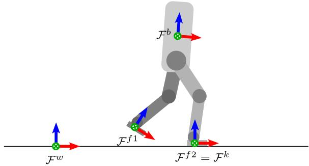
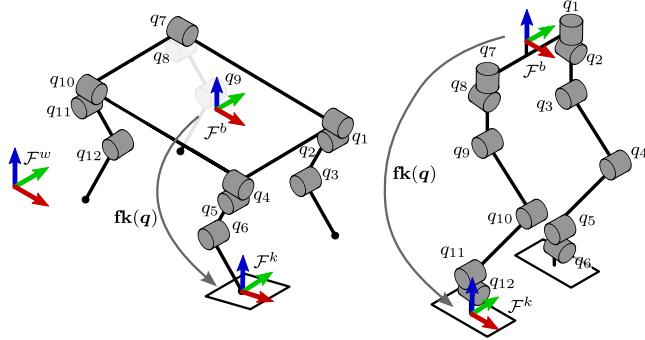
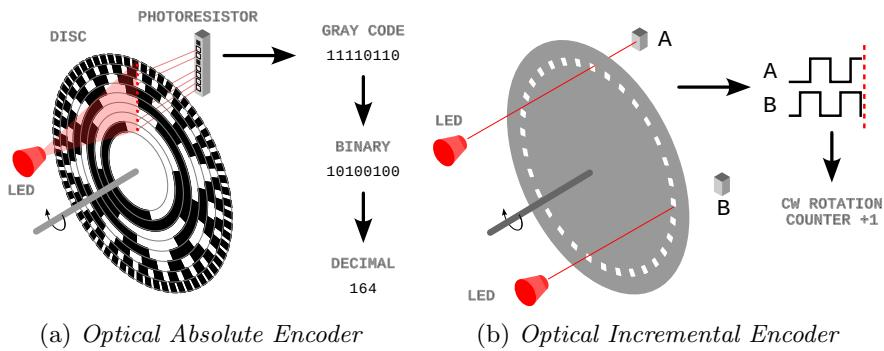
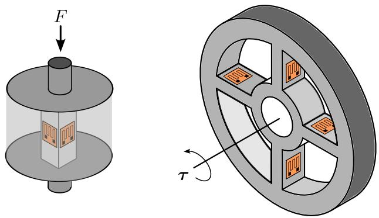
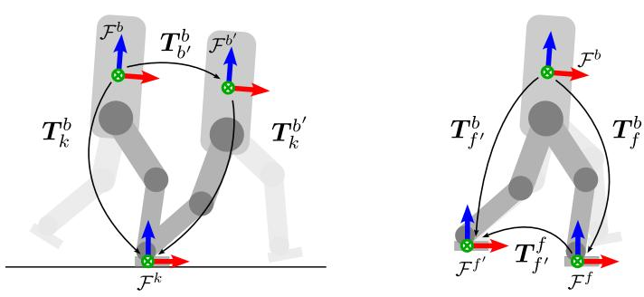
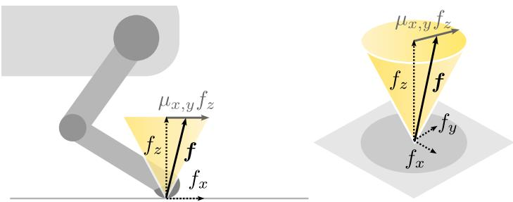
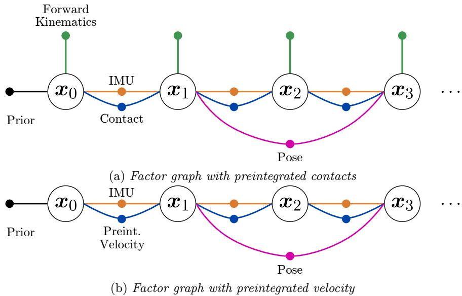
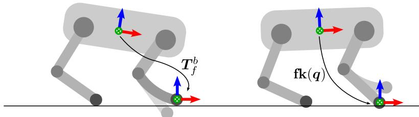
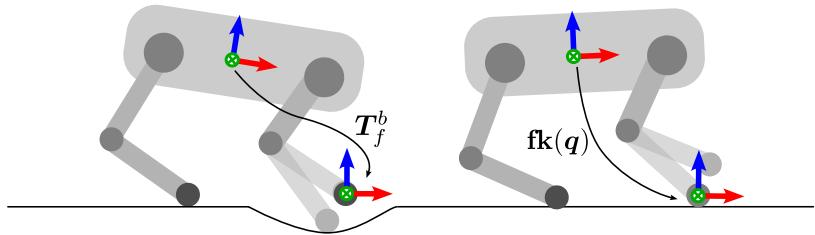

# 《SLAM Handbook：从定位与建图到空间智能》

## 第 12 章  面向 SLAM 的腿部里程计

**作者：** Marco Camurri 和 Matías Mattamala

足式机器人凭借穿越高度非结构化地形的能力正日益普及。其主要优势在于，腿部提供主动悬架，使机器人机体运动与地形轮廓解耦 [988]。因此，足式机器人能够通过楼梯、不平整地面和其他轮式平台难以应对的地面障碍 [218, 500]。虽然其他章节回顾的 SLAM 算法同样适用于足式机器人，但腿部带来的额外感知是可用于里程计的有价值新信息源。对于足式运动控制与规划，这一点尤其重要：为避免跌倒和失效，需要高频、低漂移的实时位姿和速度估计，而这本身颇具挑战。

本章讨论配备机载 IMU 和关节传感器（位置与力矩）的足式机器人实时位姿与速度估计基础，重点关注腿部里程计，即根据腿部感知确定机器人机体的相对运动。首先给出历史背景和预备知识（第 12.1 节），然后介绍估计腿部里程计所需的关键理论工具（第 12.2 和 12.3 节）。在已知支撑腿的前提下，解释如何由腿部关节测量获得相对运动（第 12.2 节），从实践上可将腿部里程计作为 SLAM 问题中的一项测量，类似轮式里程计或惯性预积分。随后描述接触状态的估计及实践中采用的主要技术（第 12.3 节），讨论如何使用因子图将腿部里程计与不同传感器模态融合（第 12.4 节）。最后回顾领域中的开放问题（第 12.5 节），并讨论应对这些问题的新趋势（第 12.6 节）。

## 12.1 历史背景与预备知识

尽管现代多数足式平台都搭载其他章节研究过的传感器，如相机（第 7 章）、LiDAR（第 8 章）和惯性测量单元（第 11 章），足式平台还可以利用机器人腿部的运动学和动力学信息，获取机体相对运动测量，这一技术称为腿部里程计。该术语类比轮式车辆的里程计：轮式车辆通过测量车轮随时间的转动量推断行驶距离。

与轮式车辆不同，足式机器人通过腿部与地面不断建立和解除接触来运动。每个腿步周期包含一个腿暂时离开地面的阶段（腾空或摆动阶段），随后进入与地面无滑动接触的阶段（支撑阶段）。支撑阶段的腿负责推动机器人前进，因此腿部里程计可分解为两个子问题：

1. **接触估计：** 确定给定时间段内哪些腿处于支撑阶段。
2. **运动估计：** 根据这些腿在支撑阶段的测量确定增量运动。

在深入腿部里程计之前，本节简要回顾历史背景和预备概念。

### 12.1.1 历史背景

腿部里程计与行走机器的发展直接相关。足式机器人起源于 20 世纪 50、60 年代；当时人们首次尝试制造能够克服崎岖地形中轮式车辆局限的运输系统 [674]。通用电气的 Walking Truck [776] 重 1400 kg，是这一时期设计的人操作机器的典型例子。随着 20 世纪 60 年代新控制策略的发展，研究转向能够自动行走的小型平台 [750, 751, 1100]。20 世纪 80 年代末 Raibert 开发的单足、双足和四足机器人展现了卓越的运动能力 [902]，推动足式平台用于现实任务。实现现实世界自主性成为发展腿部里程计和状态估计系统的主要驱动力。

Roston 和 Krotkov [947] 最早利用腿部运动学估计足式平台运动之一，研究对象是用于太空探索、重 2.5 吨的 Ambler 六足机器人。随后，研究者将类似方法用于具有不同腿部形态的其他六足机器人，例如 RHex [669]。后续工作通过粒子滤波器 [208] 或卡尔曼滤波器 [202, 926] 将腿部里程计与 IMU、视觉等其他传感器模态结合。Bloesch 等 [88] 的里程碑工作为四足机器人建立了基于滤波、适用于全地形的运动学--惯性里程计估计器基础 [89]，并为扩展到双足平台 [948, 874] 铺平道路。

2012--2015 年开展的 DARPA Robotics Challenge（DRC）推动了人形机器人全身状态估计系统的发展，目标不仅是估计 6 自由度位姿，还要估计机器人身体的完整状态。为此，各团队将运动学和动力学信息 [1203] 与惯性和关节感知相结合，并融合 LiDAR [315]、双目视觉 [316] 等外感模态。当时多数方案依赖卡尔曼滤波，但也有少量工作探索基于优化的方法 [1204] 和因子图 [336]。

近年来，特别是四足平台的兴起和商业化，使发展更具原理性、鲁棒性更强的腿部里程计和状态估计算法受到关注。四足 [1191] 和双足 [439] 平台的因子图估计方案不断发展，支持与其他传感器模态进行有原则的融合。另一些方向研究建模方面更基础的挑战 [19] 及不变估计框架 [441, 438]。近期 DARPA Subterranean（SubT）挑战赛（2018--2021）还在极端场景下为足式状态估计提出新问题，不同足式、轮式和空中平台利用互补传感器模态构建联合估计方案 [558, 1287, 838]。第 12.6 节将进一步讨论这些趋势及其对足式平台状态估计研究的重塑作用。

### 12.1.2 参考坐标系

图 12.1 展示与估计问题相关的参考坐标系。惯性坐标系 $\mathcal F^w$ 和基座坐标系 $\mathcal F^b$ 分别刚性连接到地面和机器人浮动基座。无损失地，假设 IMU 与 $\mathcal F^b$ 重合。每个末端执行器都附着一个坐标系，对应各足端（图 12.1 示例中的 $\mathcal F^{f1}$ 和 $\mathcal F^{f2}$）。

此外，当足端与地面接触时，会创建一个或多个临时惯性坐标系 $\mathcal F^k$。对人形机器人，该坐标系在触地时与足端坐标系重合；对点足四足机器人，它与足端具有相同笛卡尔位置。

### 12.1.3 状态定义

足式机器人的状态由基座位姿和速度以及关节状态定义。本章假设关节状态由专用传感器直接测量（第 12.1.6 节），因此估计目标仅为机器人基座位姿和速度。于是，“状态估计”和“里程计”可互换使用，后者等价于不含回环的 SLAM [136]。

更形式化地，机器人状态由位置、方向、线速度和角速度组成：

  
图 12.1 足式机器人的参考坐标系约定。世界坐标系 $\mathcal F^w$ 固定于地球，基座坐标系 $\mathcal F^b$ 附着在主机架上。无损失地，图中未显示 IMU 坐标系，因为可认为其与 $\mathcal F^b$ 重合。足端接触地面时定义接触坐标系 $\mathcal F^k$；它刚性固定于地面、垂直于地面，并与足端坐标系 $\bar{\mathcal F}^{f2}$ 重合。

$$
\boldsymbol {x} _ {k} = \left[ \begin{array}{c c c c} \boldsymbol {t} _ {k} & \boldsymbol {R} _ {k} & \boldsymbol {v} _ {k} & \boldsymbol {\omega} _ {k} \end{array} \right] ^ {\mathsf {T}}\tag{12.1}
$$

约定机器人位置 $t=t_b^w\in\mathbb R^3$ 和方向 $R=R_b^w\in\mathrm{SO}(3)$ 表示世界坐标中的基座位姿；机器人速度 $v=v_b^b$、$\omega=\omega_b^b\in\mathbb R^3$ 在基座坐标中表示基座的 twist。

### 12.1.4 足式机器人运动学

足式机器人由承载身体的主连杆（也称躯干）和连接在其上的一条或多条运动链（腿）组成。本章考虑实践中最常见的配置：每条腿具有 6 个驱动自由度且足端为平足的双足机器人，以及每条腿具有 3 个自由度且足端为点足的四足机器人（图 12.2）。假设机器人为刚体（例如没有可动脊柱），忽略其他上肢（例如手臂）。

腿部里程计关注建模平足或点足相对于机器人身体的相对位姿（或位置）。令 $q\in\mathbb R^N=[q_1,\ldots,q_N]^\mathsf T$ 为具有 $N$ 个主动自由度的关节型机器人关节位置集合，对应腿部转动关节的角位置。本章图 12.1 及后文中，四足和双足机器人的主动自由度数均取 $N=12$，其他平台可以不同。关节位置 $q$ 通常由安装在每个关节上的旋转编码器直接测量（第 12.1.6.1 节）；也可利用机器人运动学模型和电机与关节之间传动机构上的编码器间接测量，例如通过线性编码器测量液压活塞位移，再计算活塞驱动的转动关节角度。

  
图 12.2 典型足式机器人的运动链：四足机器人和人形机器人。

关节位置的时间导数是关节速度 $\dot q=[\dot q_1,\ldots,\dot q_N]^\mathsf T$，通常通过对编码器读数数值微分估计。当读数噪声很大时，也可利用安装在连杆上的 IMU 等额外传感器估计关节速度 [1205]。

给定 $q$，对每只足端 $f$ 定义正向运动学函数 $\mathrm{fk}(q):\mathbb R^{12}\to\mathrm{SE}(3)$ [717]，将关节位置映射为足端相对于机器人基座的位姿：

$$
\boldsymbol {T} _ {f} ^ {b} = \mathbf {f k} (\boldsymbol {q}) = \left[ \begin{array}{c c} \mathbf {f} _ {R} (\boldsymbol {q}) & \mathbf {f} _ {p} (\boldsymbol {q}) \\ \mathbf {0} & 1 \end{array} \right]\tag{12.2}
$$

其中 $f_R:\mathbb R^{12}\to\mathrm{SO}(3)$ 和 $f_p:\mathbb R^{12}\to\mathbb R^3$ 分别表示足端在基座坐标中的方向和笛卡尔位置。对点足四足机器人，腿部里程计只使用 $f_p(q)$，因为足端可绕接触点转动而关节位置不变。

足端 $f$ 的正向运动学函数 (12.2) 的时间导数是雅可比矩阵 $J(q)$，可用于计算单个足端相对于基座的速度 [718]：

$$
\left[ \begin{array}{c} \boldsymbol {v} _ {f} ^ {b} \\ \boldsymbol {\omega} _ {f} ^ {b} \end{array} \right] = \boldsymbol {J} (\boldsymbol {q}) \dot {\boldsymbol {q}} = \left[ \begin{array}{c} \boldsymbol {J} _ {v} (\boldsymbol {q}) \\ \boldsymbol {J} _ {\omega} (\boldsymbol {q}) \end{array} \right] \dot {\boldsymbol {q}}\tag{12.3}
$$

其中 $J_v(q)\in\mathbb R^{3\times12}$ 和 $J_\omega(q)\in\mathbb R^{3\times12}$ 分别是雅可比矩阵的线速度和角速度部分（一些参考文献 [319, 441] 先定义角速度块）。由于 $q$ 表示全部 $N=12$ 个关节的位置，而每条腿在运动学上相互独立，因此 $J(q)$ 是稀疏分块矩阵，非零块记为 $\bar J(q)$。这些块可将某条腿的关节角速度子集映射为对应足端的线速度和角速度。例如，人形机器人第二条腿的雅可比矩阵为：

$$
\boldsymbol {J} _ {2} (\boldsymbol {q}) = \left[ \begin{array}{c c} \mathbf {0} _ {6} & \bar {\boldsymbol {J}} _ {2} (\boldsymbol {q}) \end{array} \right] = \left[ \begin{array}{c} \boldsymbol {J} _ {2, v} (\boldsymbol {q}) \\ \boldsymbol {J} _ {2, \omega} (\boldsymbol {q}) \end{array} \right] = \left[ \begin{array}{c c} \mathbf {0} _ {3 \times 6} & \bar {\boldsymbol {J}} _ {2, v} (\boldsymbol {q}) \\ \mathbf {0} _ {3 \times 6} & \bar {\boldsymbol {J}} _ {2, \omega} (\boldsymbol {q}) \end{array} \right]\tag{12.4}
$$

其中 $\bar J_2(q)\in\mathbb R^{6\times6}$ 表示雅可比矩阵的非零块。式 (12.2)--(12.3) 是设计足式平台状态估计器的基础，它们建立了关节状态与机器人基座运动的关系。本章假设关节状态可以通过编码器直接测量，详见第 12.1.6 节。

### 12.1.5 足式机器人动力学

浮动基座刚体系统的动力学可表示为两条耦合动力学方程，并使用递归 Newton--Euler 算法计算 [319]。第一条描述浮动基座刚体（欠驱动的 6 自由度）的动力学，第二条描述通过主动关节连接在其上的 $N=12$ 个刚体（主动自由度）的动力学。两条运动方程可写为矩阵形式：

$$
\boldsymbol {M} (\boldsymbol {q}) \left[ \begin{array}{c} \dot {\boldsymbol {v}} \\ \dot {\boldsymbol {\omega}} \\ \ddot {\boldsymbol {q}} \end{array} \right] + \boldsymbol {h} (\boldsymbol {q}, \dot {\boldsymbol {q}}) = \left[ \begin{array}{c} \boldsymbol {J} _ {b} ^ {\mathsf {T}} \\ \boldsymbol {J} _ {q} ^ {\mathsf {T}} \end{array} \right] \boldsymbol {f} + \left[ \begin{array}{c} \boldsymbol {0} _ {6} \\ \boldsymbol {\tau} \end{array} \right]\tag{12.5}
$$

第一项 $M(q)$ 是质量矩阵，与 $\dot v\in\mathbb R^3$、$\dot\omega\in\mathbb R^3$ 和 $\ddot q\in\mathbb R^{12}$ 的堆叠相乘，分别表示浮动基座线加速度、角加速度和主动关节加速度。第二项 $h\in\mathbb R^{18}$ 是偏置项，包含科里奥利、离心和重力效应。右侧最后一项描述基座力矩和主动关节力矩 $\tau\in\mathbb R^{12}$；由于基座不驱动，其力矩为零。

(12.5) 中倒数第二项与腿部里程计最相关，其维度取决于机器人构型（人形或四足）和接触腿数。令 $c$ 为接触腿数量，$d$ 为单腿主动关节数（四足 $d=3$，人形 $d=6$）。$J_b\in\mathbb R^{dc\times6}$ 是将基座 twist 映射到足端速度的雅可比矩阵，取决于机器人正向运动学及其在惯性坐标系 $\mathcal F^w$ 中的绝对身体方向；$J_q\in\mathbb R^{dc\times12}$ 是 (12.3) 中雅可比矩阵的堆叠，其排列取决于机器人类型及接触腿数量。双腿站立的人形机器人有：

$$
\boldsymbol {J} _ {q} = \left[ \begin{array}{c} \boldsymbol {J} _ {1} (\boldsymbol {q}) \\ \boldsymbol {J} _ {2} (\boldsymbol {q}) \end{array} \right]\tag{12.6}
$$

对于四足机器人，腿可绕接触点转动，因此 $J_q$ 只使用线速度雅可比块 $J_v$。例如，第一、第三和第四条腿站立时：

$$
\boldsymbol {J} _ {q} = \left[ \begin{array}{c} \boldsymbol {J} _ {1, v} (\boldsymbol {q}) \\ \boldsymbol {J} _ {3, v} (\boldsymbol {q}) \\ \boldsymbol {J} _ {4, v} (\boldsymbol {q}) \end{array} \right]\tag{12.7}
$$

最后，$f\in\mathbb R^{dc}$ 是所有接触足端作用于地面的力和/或力矩的集合。四足机器人四足着地时，$f$ 是四个线力的堆叠：

$$
\boldsymbol {f} = \left[ \begin{array}{c} \boldsymbol {f} _ {1} \\ \boldsymbol {f} _ {2} \\ \boldsymbol {f} _ {3} \\ \boldsymbol {f} _ {4} \end{array} \right].\tag{12.8}
$$

人形机器人双足着地时，还包含接触点三个轴上的线力和力矩：

$$
\boldsymbol {f} = \left[ \begin{array}{c} \boldsymbol {f} _ {1} \\ \boldsymbol {\tau} _ {1} \\ \boldsymbol {f} _ {2} \\ \boldsymbol {\tau} _ {2} \end{array} \right].\tag{12.9}
$$

如第 12.3.4 节将进一步说明，可根据上述力和力矩推断腿部接触状态。

### 12.1.6 关节感知

与固定基座机械臂类似，足式机器人的关节和末端执行器配备多种传感器，主要用于规划和控制 [1012]。这里简述也用于腿部里程计的三类重要传感器：编码器、力/力矩传感器和接触传感器。

#### 12.1.6.1 旋转编码器

旋转编码器是将旋转轴角位置转换为模拟或数字信号的机电装置。在足式机器人中，它们用于测量关节角并确定机器人运动学，也可安装在其他部件上。例如，机械式 LiDAR 利用编码器测量光束阵列的方位角（见第 8 章）。编码器可按工作原理（光学或磁性）、读数类型（绝对式或增量式）和输出类型（模拟或数字）分类。足式机器人最常采用绝对式和相对式光学数字编码器；相关文献 [719] 还介绍了其他编码器。

  
图 12.3 (a) 8 位光学绝对编码器的工作原理：红外光束照射旋转圆盘，圆盘按照编码旋转角度的特定图案遮挡光线；光敏电阻阵列将各扇区有无光照转换为 Gray 码二进制数，再译为表示绝对旋转角的十进制数。示例编码器分辨率为 $360/256=1.41^\circ$。(b) 光学增量编码器原理：光敏电阻 A、B 相差 90°；A 上升沿随后 B 下降沿表示顺时针旋转，$AB=11$ 到 $AB=10$ 的变化使计数器增加。

绝对式光学数字编码器（图 12.3a）以绝对方式测量关节角，同一关节构型会得到相同读数。其工作原理是：红外光源（如 LED）照射静止部分径向排列的光敏元件；光源与光敏元件之间有一块与轴一起旋转的圆盘，圆盘划分为不透明或透明的同心扇区，并按特定图案将角度范围编码为二进制数。二进制数按 Gray 码排序，连续自然数对应的二进制数仅相差一位，从而降低读数错误概率。编码角度的二进制字所用位数（即同心扇区数）决定角分辨率；8 位传感器有 256 个可能值，角分辨率为 $360/256=1.41^\circ$。

相反，增量式光学编码器（图 12.3b）测量相对于初始构型的角度变化：上电时角度为零，随后测量相对该参考点的角度。根据转动方向加减小角增量即可得到角度。它不使用 Gray 码，而是采用带规则径向槽的不透明码盘，使单个光敏电阻 A 在恒速转动时输出方波；第二个光敏电阻 B 与 A 相差 90°。两路信号组成的 2 位字 AB 随时刻可取四种值，状态转换用于判断旋转方向及计数增减 [719]。由于结构简单、成本更低，高分辨率增量编码器曾与低分辨率绝对编码器配合，用于在后者测得初始角后计算关节角 [987]。随着绝对编码器分辨率提高、成本降低，增量编码器正被快速替代。

#### 12.1.6.2 力与力矩传感器

力和力矩传感器分别将施加在表面某点的线力或施加在轴上的机械力矩转换为电信号，主要用于执行器力矩控制或感知末端执行器与环境的交互。足式运动的每一步都会对地面施加力，需要直接或间接测量这些力以识别支撑腿。

两类传感器的工作原理通常相同而几何形状不同：传感器内部表面设计为在待测力方向的应力作用下轻微变形；表面粘贴柔性的可变电阻元件，即应变计。应变计电阻随变形量成比例变化，压缩会降低电阻率，拉伸会提高电阻率。图 12.4 展示将应变计贴在称重元件上测量线力的示例 [719]；测量力矩时，可将一组应变计贴在与电机轴相连的轮状柔性辐条上。

为测量末端执行器承受的全部力和力矩，可使用六轴传感器，在足够多的构型上布置应变计，以测量各方向的力和力矩。这类传感器常用于操作任务，也可安装在人形机器人的足部，直接测量其与地面的交互。

  
图 12.4 力和力矩传感器的工作原理示例。应变计粘贴在可压缩的称重元件上，通过元件的微小变形测量线力。

可回驱电机设计 [544] 使经济型动态足式机器人得以出现后，还可以由电机电流估计力矩，因为电流与力矩成比例。

#### 12.1.6.3 接触传感器

力和力矩传感器在腿部里程计中的主要用途是确定支撑腿；另一种成本更低的方案是接触传感器，其输出为表示某只足是否接触地面的二值信号。这类传感器主要为小型和中型四足机器人开发，这些机器人的足端通常采用球形或圆形橡胶足垫。

接触传感器主要分为光学式 [397] 和机械式 [794]。光学接触传感器在概念上类似编码器：LED 与光电二极管对通过小孔感测光线。足端接触地面后，足垫表面发生足够变形，带动遮光片移动并遮住小孔，从而检测接触。机械式接触传感器则在足垫内部设置简单的按钮开关；足端承受足够大的力时，开关被压下。

与价格较高的力/力矩传感器相比，接触传感器的主要缺点是响应较慢。此外，它们具有与力/力矩传感器相同的局限：需要把电缆布设到足端，而且足端承受的频繁冲击容易损坏传感器。因此，这类传感器主要见于面向室内运行的小型四足机器人。

## 12.2 运动估计

已知关节状态和机器人运动学后，便可计算基座的增量运动。主要有两种方式：利用正向运动学获得两个时刻间的相对位姿，或利用微分运动学瞬时估计机器人速度。二者都假设新建立的接触坐标系在一段时间内保持静止。

  
图 12.5 理想接触下腿部里程计的工作方式。左：假设接触坐标系 $\mathcal F^k$ 刚性固定在地面（黄色），即可确定机器人身体的相对运动。右：也可表示连续两个时刻腿相对于身体坐标系（黄色）的运动。

### 12.2.1 相对位姿估计

图 12.5 展示人形机器人沿 $zx$ 平面行走的简化示例。两个连续时刻的机器人基座分别用 $\mathcal F^b$ 和 $\mathcal F^{b'}$ 表示；同两时刻的足端坐标系和关节位置以类似方式定义。接触坐标系保持静止，因此当足端坐标系与接触坐标系重合时，机器人身体向前运动的位移等于足端相对身体向后运动的位移：

$$
\pmb {T} _ {b ^ {\prime}} ^ {b} = \pmb {T} _ {k} ^ {b} (\pmb {T} _ {k} ^ {b ^ {\prime}}) ^ {- 1} = (\pmb {T} _ {f ^ {\prime}} ^ {f}) ^ {- 1} = (\pmb {T} _ {f ^ {\prime}} ^ {b}) ^ {- 1} \pmb {T} _ {f} ^ {b} = \mathbf {f k} (\pmb {q} ^ {\prime}) ^ {- 1} \mathbf {f k} (\pmb {q})\tag{12.10}
$$

(12.10) 建立了关节状态与机器人相对位姿之间的映射。连接这些相对位姿即可仅凭关节感知通过航位推算获得有效运动估计 [947]，但只在支撑阶段成立。对于点足机器人，还要求始终至少有三只足接触地面，这对四足平台并不实用。

四足机器人的标准方案 [88] 是在 (12.1) 状态中加入与各腿关联、用世界坐标表达的接触坐标系位置 $c_i=t_k^w\in\mathbb R^3$。人形机器人具有脚踝，因此还可将接触点方向 $B_i=R_k^w\in\mathrm{SO}(3)$ 加入状态 [948]。

任意时刻不一定有足够数量的腿接触地面（例如疾驰步态可能存在所有腿离地的阶段），因此通常还假设存在 IMU，忽略 (12.1) 中的角速度 $\omega$，并将 IMU 偏置纳入状态（见第 11 章）。四足和双足机器人的相应状态分别为：

$$
\boldsymbol {x} _ {k} = \left[ \begin{array}{c c c c c c c c c} \boldsymbol {t} _ {k} & \boldsymbol {R} _ {k} & \boldsymbol {v} _ {k} & \mathbf {b} _ {k} ^ {a} & \mathbf {b} _ {k} ^ {\omega} & \boldsymbol {c} _ {1} & \boldsymbol {c} _ {2} & \boldsymbol {c} _ {3} & \boldsymbol {c} _ {4} \end{array} \right] ^ {\mathsf {T}}\tag{12.11}
$$

$$
\boldsymbol {x} _ {k} = \left[ \begin{array}{c c c c c c c c c} \boldsymbol {t} _ {k} & \boldsymbol {R} _ {k} & \boldsymbol {v} _ {k} & \mathbf {b} _ {k} ^ {a} & \mathbf {b} _ {k} ^ {\omega} & \boldsymbol {c} _ {1} & \boldsymbol {c} _ {2} & \boldsymbol {B} _ {1} & \boldsymbol {B} _ {2} \end{array} \right] ^ {\mathsf {T}}\tag{12.12}
$$

(12.11) 表示四足机器人状态，(12.12) 表示人形机器人状态。对任意第 $i$ 条腿，运动估计关系可精确写成：

$$
\pmb {T} _ {k} ^ {b} = \mathbf {f k} (\pmb {q}) = (\pmb {T}) ^ {- 1} \pmb {C} _ {i}\tag{12.13}
$$

$$
\boldsymbol {T} = \left[ \begin{array}{c c} \boldsymbol {R} & \boldsymbol {t} \\ \boldsymbol {0} & 1 \end{array} \right]\tag{12.14}
$$

$$
\boldsymbol {C} _ {i} = \left[ \begin{array}{c c} \boldsymbol {B} _ {i} & \boldsymbol {c} _ {i} \\ \boldsymbol {0} & 1 \end{array} \right]\tag{12.15}
$$

$$
(T) ^ {- 1} C _ {i} = \left[ \begin{array}{c c} R ^ {\top} & - R ^ {\top} t \\ 0 & 1 \end{array} \right] \left[ \begin{array}{c c} B _ {i} & c _ {i} \\ 0 & 1 \end{array} \right] = \left[ \begin{array}{c c} R ^ {\top} B _ {i} & R ^ {\top} c _ {i} - R ^ {\top} t \\ 0 & 1 \end{array} \right]\tag{12.16}
$$

$$
\mathbf {f} _ {p} (\boldsymbol {q}) = \boldsymbol {R} ^ {\mathsf {T}} (\boldsymbol {c} _ {i} - \boldsymbol {t})\tag{12.17}
$$

$$
\mathbf {f} _ {R} (\pmb {q}) = \pmb {R} ^ {\mathsf {T}} \pmb {B} _ {i}\tag{12.18}
$$

其中 $f_p(q)$ 表示足端相对于固定坐标系的位置变化，$f_R(q)$ 表示方向变化，二者均由关节角决定。对于四足点足，只使用 (12.17)，因为点足不能提供方向估计。式 (12.17) 和 (12.18) 是滤波器或因子图等估计框架中的基本腿部里程计测量，详见第 12.4 节。

### 12.2.2 速度估计

(12.3) 的微分运动学函数可用于从每条支撑腿直接得到速度测量。该方法广泛用于四足机器人 [89, 143, 578]，较少用于双足机器人 [1085]。优点是速度测量可方便地（预）积分到滤波器或因子中；它不保留历史，避免位置误差累积 [315]，也不需维护额外状态（接触位姿或位置）。但关节速度通常由关节位置数值微分得到，舍入误差可能降低估计性能。

类似于相对位姿测量，考虑刚性接触的腿运动关系。支撑腿的接触点 $k$ 必须静止，因此其在固定坐标系中观察到的速度为零：

$$
\pmb {v} _ {k} ^ {w} = \mathbf {0}.\tag{12.19}
$$

$$
\boldsymbol {v} _ {k} ^ {b} = \boldsymbol {v} _ {f} ^ {b} = \boldsymbol {J} _ {v} (\boldsymbol {q}) \dot {\boldsymbol {q}}.\tag{12.20}
$$

$$
\begin{array}{c} \boldsymbol {v} _ {k} ^ {w} = \boldsymbol {v} _ {b} ^ {w} + \boldsymbol {\omega} _ {b} ^ {w} \times \boldsymbol {t} _ {k} ^ {b} + \boldsymbol {v} _ {k} ^ {b} \\ \boldsymbol {0} = \boldsymbol {v} _ {b} ^ {w} + \boldsymbol {\omega} _ {b} ^ {w} \times \mathbf {f} _ {p} (\boldsymbol {q}) + \boldsymbol {J} _ {v} (\boldsymbol {q}) \dot {\boldsymbol {q}} \\ \boldsymbol {v} _ {b} ^ {w} = - \boldsymbol {\omega} _ {b} ^ {w} \times \mathbf {f} _ {p} (\boldsymbol {q}) - \boldsymbol {J} _ {v} (\boldsymbol {q}) \dot {\boldsymbol {q}} \end{array}\tag{12.21}
$$

上式考虑了基座与足端之间杠杆臂造成的附加线速度 [270]，将机器人绝对速度映射到正向和微分运动学函数，可作为图中的测量更新或因子。由于约定在机体坐标中表达速度，可使用机器人方向 $R=R_b^w$ 将其转换。到此为止假设支撑腿已知，下一节介绍识别支撑腿的不同方法。

## 12.3 接触估计

接触估计的定义取决于应用。在协作机器人中，末端执行器一旦“接触”某物（即受到不可忽略的外力）就可能被视为接触；但在腿部里程计中，只有接触点随时间保持静止时足端才算接触，对于点足机器人还必须确保没有滑动。

  
图 12.6 四足机器人腿部的接触点。当足端施加的力 $\bar f=[f_x,\bar f_y,f_z]^\top$ 位于摩擦锥内时，可将该腿视为支撑腿。

技术上，当地面反作用力（GRF）的垂直分量 $f_z$ 满足摩擦锥条件时，足端不会滑动 [949]：

$$
\sqrt {f _ {x} ^ {2} + f _ {y} ^ {2}} \leq \mu_ {x, y} f _ {z}\tag{12.22}
$$

$$
\left[ \begin{array}{c} - \tau_ {y} / f _ {z} \\ \tau_ {x} / f _ {z} \end{array} \right] \leq \left[ \begin{array}{c} C o P _ {x} \\ C o P _ {y} \end{array} \right]\tag{12.23}
$$

$$
| \tau_ {z} | \leq \mu_ {z} f _ {z}\tag{12.24}
$$

其中 $f_x$、$f_y$ 是相对于接触平面的切向 GRF 分量，取决于地形局部形态；$\mu_{x,y}$ 是摩擦系数，取决于地面和接触足端的机械性质。平足人形机器人还可向地面施加力矩，这给不滑动条件 (12.22) 增加了足端不旋转的约束；$\tau$ 是接触力矩，$\mu_z$ 是旋转摩擦系数，$CoP_x$、$CoP_y$ 是压力中心分量上界，它们由接触表面几何定义支撑多边形边界。

只要法向力 $f_z$ 足够大，无论其他接触扳手（力和力矩）分量如何，(12.22)--(12.24) 都能满足。因此最常见的接触估计方法是直接对 $f_z$ 阈值化。不同实现的区别在于如何测量或估计该力（接触传感器、F/T 传感器、关节感知或 IMU）以及机器人的具体特性。

### 12.3.1 使用接触传感器

接触传感器在硬件中隐式地对 $f_z$ 阈值化：只有当测得的力超过标称 $f_z$ 时，调好的二值信号才会激活。这是最简单的情况，腿部里程计可直接依赖传感器提供的二值状态。

### 12.3.2 使用力/力矩传感器

若足端安装 F/T 传感器，可直接随时间测量 $f_z$，并将特定力模式与非二值事件关联。例如，持续时间超过阈值、幅值虽小但不断上升的力，表示足端正在撞击地面但尚未进入支撑；相反，力降到某值以下（例如单腿预期负载的一半）表示足端即将解除接触，此时该腿的信息应丢弃或增大其不确定性 [315]。

### 12.3.3 使用 IMU

如第 11 章所述，IMU 能提供加速度和角速度测量。通常我们用它们测量相对于机器人身体的量，也可将 IMU 安装在腿部或足端。作用于足端的任何力（例如触地时的冲击）都会导致其加速度变化，因此一些工作使用腿部 IMU 隐式检测支撑腿 [1230, 949, 729]。该方法的主要优点是传感器不直接承受冲击，不易损坏；代价是需要额外信号处理才能有效检测加速度变化。

### 12.3.4 根据关节力矩感知

在足端增加接触传感器看似直接，但不同机器人形态、设计和集成难题使其并非总能实现。此时可利用机器人动力学（第 12.1.5 节）由关节力矩估计 GRF。以四足平台为例，可利用 $J_q$ 的分块结构，由 (12.5) 计算末端力：

$$
\boldsymbol {f} _ {i} = - (\bar {\boldsymbol {J}} _ {i, v} ^ {\top}) ^ {- 1} \big (\boldsymbol {\tau} _ {i} - \boldsymbol {h} _ {q, i} - \boldsymbol {F} ^ {\top} \dot {\boldsymbol {v}} \big)\tag{12.25}
$$

其中 $f_i\in\mathbb R^3$ 和 $\tau_i\in\mathbb R^3$ 分别是第 $i$ 条腿的 GRF 和力矩；$\bar J_{i,v}$ 是第 $i$ 个足端雅可比 $J_v$ 的非零块（对四足机器人为方阵）；$F\in\mathbb R^{3\times3}$ 是质量矩阵的一个分块；$h_{i,q}\in\mathbb R^3$ 是第 $i$ 条腿的离心/科里奥利/重力力矩向量。

$f_i$ 的估计只能在机体坐标中给出。要恢复真实 GRF，还缺少两类信息：其一是地形局部倾角，接触力方向取决于此；人形机器人的脚踝可给出较好近似，而四足机器人无法在没有外感知的情况下确定接触坐标系方向，只能由其他接触足（例如拟合平面）启发式推断 [329]。其二是摩擦系数，力的水平分量取决于它；摩擦系数由机器人踩踏材料决定，只能先验给定或根据滑移量推断 [513]。

总体而言，从关节感知确定接触状态仍是开放问题。研究者已发展概率式接触检测（例如结合机器人运动学和动力学 [497]）及学习方法（见第 12.6 节）。

## 12.4 使用腿部里程计进行状态估计

明确获得腿部里程计测量的步骤后，本节说明如何将其纳入估计框架以求解状态估计问题。主流方案基于滤波，在闭环控制所需的高频下融合 IMU 与腿部里程计。前几章介绍的因子图平滑方案直到近几年才用于足式平台，且重点通常不是为控制提供估计，而是提供较低频、用于建图的估计，以便融合 LiDAR 或相机等慢速传感器。

无论采用哪种方法，要将腿部里程计与其他传感器最优融合，都必须量化其不确定性。下面先讨论这一问题，再介绍滤波和平滑方法。

### 12.4.1 编码器噪声传播

腿部里程计的不确定性主要来自测量关节位置且受噪声影响的关节编码器。可将该噪声建模为加性零均值高斯项 $\eta_q\in\mathcal N(0,\Sigma_q)$，真实值 $q$ 与测量值 $\tilde q$ 的关系为：

$$
\tilde {\boldsymbol {q}} = \boldsymbol {q} + \boldsymbol {\eta} _ {q}.\tag{12.26}
$$

$$
\mathbf {f} _ {p} (\boldsymbol {q} + \boldsymbol {\eta} _ {q}) \approx \mathbf {f} _ {p} (\boldsymbol {q}) + \boldsymbol {J} _ {c} (\boldsymbol {q}) \boldsymbol {\eta} _ {q}\tag{12.27}
$$

$$
\boldsymbol {J} (\boldsymbol {q} + \boldsymbol {\eta} _ {q}) (\dot {\boldsymbol {q}} + \boldsymbol {\eta} _ {\dot {q}}) \approx \boldsymbol {J} (\boldsymbol {q}) \dot {\boldsymbol {q}} + \frac {\partial}{\partial \boldsymbol {q}} (\boldsymbol {J} (\boldsymbol {q}) \dot {\boldsymbol {q}}) \boldsymbol {\eta} _ {q} + \boldsymbol {J} (\boldsymbol {q}) \boldsymbol {\eta} _ {\dot {q}}.\tag{12.28}
$$

由于正向和微分运动学函数包含旋转，是非线性的，不会保持编码器噪声的高斯性质。不过，可以像前面章节一样采用一阶近似；该近似局部线性并保持高斯性，$J_c(q)$ 是身体机械臂雅可比，即以接触坐标表达的机械臂雅可比 [439]。速度测量同样可对编码器位置噪声和速度噪声作高斯近似；与给定编码器测量对应的多个噪声线性组合可合并为一个噪声项。

### 12.4.2 因子图平滑

为生成运动行为并避免跌倒等灾难性失效，足式机器人要求严格的实时控制和高频状态估计。历史上通常使用扩展卡尔曼滤波（EKF）[88, 143]、无迹卡尔曼滤波（UKF）[89] 或不变 EKF [441, 1255, 670] 等非线性卡尔曼滤波变体，将惯性和运动学等高频传感器数据融合并馈送给控制器。控制回路中加入外感传感器更新也已得到演示 [144]，但通常用于建图和规划。

基于卡尔曼滤波的方法必须同时指定过程模型和测量模型；过程模型不可用时，通常以恒速模型或更常见的 IMU 传播替代。因子图方法更为一般，它把过程模型和测量模型都统一表示为状态与测量之间的关系。

足式系统的因子图方法主要区别在于估计状态的数量与时间范围。只考虑连续两个状态时，因子图类似滤波器，Two-State Implicit Filter（TSIF）[92] 就属于这一情形。增大窗口后，因子图不再只估计最新状态，而能校正窗口内的一段历史状态。状态频率是一项设计选择：以 IMU 等高频率加入更多状态可简化估计器设计，但必须缩短时间窗口以限制计算量；固定状态数量时，则可通过预积分测量获得更长的时间范围，如第 11 章的 IMU 预积分。

下面用两个代表性方法说明如何在因子图估计框架中结合预积分理论和腿部里程计：面向双足机器人的接触预积分 [440]，以及面向四足机器人的速度预积分 [1191]。二者都把第 12.2 节的测量重新表述为图中因子的残差与协方差。

#### 12.4.2.1 接触预积分

接触预积分把人形机器人的运动学相对运动增量进行积分，形成连接 (12.12) 所定义的两个机器人状态的因子 [440]。图 12.7a 中，黑色先验因子固定图的规范自由度，橙色预积分 IMU 因子提供运动先验，绿色正向运动学因子约束接触坐标系位姿，蓝色接触预积分因子则编码两腿接触状态之间的相对运动。

正向运动学因子依据支撑腿的正向运动学，把惯性坐标系中的足端接触坐标系位姿与机器人位姿关联起来。将 (12.27) 的编码器噪声代入 (12.17)--(12.18) 的相对位姿测量，可得相应残差与协方差：

$$
\boldsymbol {r} _ {\mathcal {F}} = \operatorname{Log} \left(\boldsymbol {C} _ {i} ^ {- 1} \boldsymbol {T} \mathbf {f k} (\tilde {\boldsymbol {q}})\right)\tag{12.29}
$$

$$
\pmb {\Sigma} _ {\mathcal {F}} = \pmb {J} _ {c} (\tilde {\pmb {q}}) \pmb {\Sigma} _ {q} \pmb {J} _ {c} ^ {\mathsf {T}} (\tilde {\pmb {q}})\tag{12.30}
$$

$$
\Delta \tilde {\pmb {B}} _ {i j} = \pmb {B} _ {i} ^ {\mathsf {T}} \pmb {B} _ {j} \mathrm{Exp} (\delta \pmb {\theta} _ {i j}) = \mathbf {I}\tag{12.31}
$$

$$
\Delta \tilde {\pmb {c}} _ {i j} = \pmb {B} _ {i} ^ {\mathsf {T}} (\pmb {c} _ {j} - \pmb {c} _ {i}) + \delta \pmb {d} _ {i j} = \pmb {0}\tag{12.32}
$$

$$
\boldsymbol {r} _ {\mathcal {C}} = \left[ \begin{array}{c} \operatorname{Log} \left(\boldsymbol {B} _ {i} ^ {\mathsf {T}} \boldsymbol {B} _ {j}\right) \\ \boldsymbol {B} _ {i} ^ {\mathsf {T}} (\boldsymbol {c} _ {j} - \boldsymbol {c} _ {i}) \end{array} \right]\tag{12.33}
$$

$$
\boldsymbol {\Sigma} _ {\mathcal {C}} = \left[ \begin{array}{c c} \boldsymbol {\Sigma} _ {w} & \mathbf {0} \\ \mathbf {0} & \boldsymbol {\Sigma} _ {v} \end{array} \right] \Delta t _ {i j}\tag{12.34}
$$

  
图 12.7 预积分接触（上）和速度（下）的因子图表述。还可加入 IMU、视觉或 LiDAR 因子，以构建完整状态估计系统。

#### 12.4.2.2 速度预积分

点足平台（例如四足机器人）的运动学不能约束两个状态之间完整的 6 自由度相对运动，因此不能直接使用前述正向运动学因子和接触预积分因子。另一种方案是利用第 12.2.2 节的腿部里程计线速度测量，将其预积分为约束机器人位姿相对变化的因子 [1191, 578]。该因子假设可由 (12.28) 确定机体瞬时线速度，并受高斯噪声 $\boldsymbol\eta_v$ 影响：

$$
\tilde {\boldsymbol {v}} = - \boldsymbol {J} _ {v} (\boldsymbol {q}) \dot {\boldsymbol {q}} - \boldsymbol {\omega} \times \mathbf {f} _ {p} (\boldsymbol {q}) + \boldsymbol {\eta} _ {v}.\tag{12.35}
$$

$$
\Delta \tilde {\boldsymbol {t}} _ {i j} = \Delta \boldsymbol {t} _ {i j} + \delta \boldsymbol {p} _ {i j} = \sum_ {k = i} ^ {j - 1} \left[ \Delta \tilde {\boldsymbol {R}} _ {i k} \tilde {\boldsymbol {v}} _ {k} \Delta t \right] + \delta \boldsymbol {p} _ {i j},\tag{12.36}
$$

其中，与接触预积分因子类似，$\delta\boldsymbol p_{ij}$ 是预积分速度噪声项 [1190, 578]。据此可得到速度预积分因子及其协方差：

$$
\pmb {r} _ {\mathcal {V}} = \pmb {R} _ {i} ^ {\top} (\pmb {t} _ {j} - \pmb {t} _ {i}) - \Delta \pmb {t} _ {i j}\tag{12.37}
$$

$$
\boldsymbol {\Sigma} _ {\mathcal {V}, i j} = \sum_ {j - 1} ^ {k = i} \boldsymbol {\Sigma} _ {\mathcal {V}, i k} + \boldsymbol {A} \boldsymbol {\Sigma} _ {v} \boldsymbol {A} ^ {\top},\tag{12.38}
$$

速度预积分不需要显式保存接触位置状态，但需处理速度测量噪声及各时刻机器人方向变化。

#### 12.4.2.3 多测量处理

当多条腿同时处于支撑阶段时，每条腿都产生一项测量。可以把各腿（及其测量）独立处理；当接触位姿或位置明确作为状态时，这种做法较容易 [440, 578]。否则，虽然同时采集的各腿速度测量仍可视为独立，但通常更适合将其平均为一项测量，以降低滤波器或因子图的计算负担 [1191]。

### 12.4.3 与外感传感器融合用于 SLAM

腿部里程计为计算连续状态之间的增量运动提供了额外途径。其主要用途是改善里程计估计，使建立在其上的 SLAM 系统获得低漂移的节点间边，从而在回环时减少突兀校正。

LiDAR 和相机等额外传感器可自然地与滤波和平滑方法集成：前者增加测量，后者增加因子。但不同独立来源以不同频率、噪声水平和失效率运行，多源融合并非简单。如果某种传感器不满足零均值高斯噪声假设或完全失效，滤波器（或因子图）状态可能受到破坏。因此受 DARPA SubT 挑战推动，松耦合方法日益增多：不同子系统（视觉惯性、腿部惯性、LiDAR 惯性）并行运行，再对输出进行分诊，从各子系统选择最佳估计 [299, 558]。

松耦合的替代方案是紧耦合方法。[1191] 使用固定滞后平滑器，在同一因子图中融合腿部里程计、IMU、相机和 LiDAR。为解决不同因子之间不一致或传感器失效问题，分诊直接发生在因子层面：某传感器失效时，不向图中添加相应因子；对于非零均值高斯噪声，则可在因子内使用鲁棒代价函数。

## 12.5 开放挑战

前文介绍了如何计算腿部里程计并将其与其他传感器融合，同时作出了一些实践中往往不成立的假设。放宽这些假设仍是开放问题，下面简要介绍由此产生的挑战。

### 12.5.1 腿部变形

本章腿部里程计方程均假设机器人是完美刚体。该假设不成立时，腿部里程计测量会产生偏差，因为正向运动学函数计算的是足端理想位置而非真实位置（见图 12.8）。同样，当接触点不动但所受力使腿弯曲时，关节角也会变化。若问题只持续很短时间，过去的策略是分析力曲线检测冲击，并在冲击期间拒绝相应测量 [143]。

腿部里程计  
  
图 12.8 四足机器人腿部变形示例。左侧为基座与接触点之间的真实变换；由于正向运动学假设腿刚性，右侧错误地估计出向上运动。

  
图 12.9 四足机器人地面变形示例。机器人最初接触平坦地面；保持接触状态时地面发生变形，足端陷入地面（左）。足端下沉使关节角发生变化，该运动被解释为相对于初始触地点的向上运动（右）。

双足机器人往往具有更长的腿，因此腿部柔性问题可能更加严重。一种方法是利用腿部负载与柔性之间的相关性（直观地说，负载越大，腿部弯曲越明显），结合机器人结构几何和材料属性对弯曲特性进行精细建模；但这种方法复杂，且通常泛化能力较差。更常用的方案是在连杆上安装额外 IMU，估计连杆方向并与关节读数比较 [1128]。

### 12.5.2 非刚性接触与滑移

若机器人在松软或可塌陷地面上行走，腿会伸展并穿入地形（图 12.9 左）。若在地面开始变形前检测到接触，并假设接触点静止，则正向运动学会将其解释为向上运动（图 12.9 右）。其效果虽类似腿部变形，但此时破坏的是接触点零速度假设 [314]：地面变形使接触点向下移动。足端被视为接触但施加在地面上的力违反 (12.22) 和/或 (12.24) 时，就会发生类似滑移的问题。

此时需要相机等外感传感器，在非退化运动和机器人构型下使接触点速度可观测 [1085]。可以在 [1191] 中将接触速度显式作为附加状态，也可以在 [578] 中将其作为足端位置的导数。

## 12.6 延伸阅读与近期趋势

本节聚焦状态估计和足式机器人学近期趋势。其中一些趋势针对接触估计等开放挑战，另一些则代表当前技术（特别是学习算法辅助技术）的重要范式转变。

**基于学习的接触估计。** 接触估计假设刚性接触，但滑移、松软地形或腿部变形都容易破坏该假设。鉴于准确建模这些问题存在挑战，研究者提出数据驱动的接触估计方法，通常学习一个决定何时建立接触的二值信号。既有工作以有监督方式学习接触分类器 [143]，也有工作通过聚类以无监督方式学习 [948]，其中关节和惯性等本体感知是模型的主要信号。

随着深度学习方法兴起，人们开始使用神经网络架构确定足端接触状态，并在更广泛的结构化和非结构化环境中取得更好泛化 [670]。视觉触觉传感器利用机器学习和计算机视觉进展 [641]，也是改善力和接触估计的有希望方向 [1003]。

**端到端学习。** 高频腿部里程计和本体状态估计最初是为闭环、基于模型的运动控制而发展；近期强化学习（RL）进展对其必要性提出挑战。RL 运动控制器表明，运动只需基座速度和方向即可，这些量可由标准本体状态估计器显式提供 [498]，甚至可直接由关节与惯性感知原始数据提供 [638, 763]。

后者似乎使人质疑状态估计的必要性，但这与特定 RL 控制器的训练方式有关。训练目标是跟踪速度命令，模拟人类操作员或规划系统控制机器人的方式。为实现该目标，运动控制器只需知道基座相对于重力向量的方向以及瞬时机体速度。如第 11 章所示，这些量可由惯性数据完全观测，因此能在训练期间隐式估计。

另一方面，运动学习的另一个趋势旨在获得能够探索世界的高级机动技能：学习可穿越不同障碍物并相对于起始位置到达目标的运动控制器，机器人跑酷就是例子 [1311, 464]。这种导航行为必须有里程计估计，因为机器人需要在惯性坐标系中跟踪朝向目标的进展。这说明复杂运动和导航任务仍需要状态估计。

已有少量工作将状态估计作为运动策略学习的一部分 [516]，显式估计机体速度、足端高度和接触状态。虽然目前仅用于运动控制，但它有望为本体状态估计或 SLAM 中的里程计因子提供更准确的腿部里程计。

**人形机器人。** 人形机器人承载着机器人学发展的部分愿景，即创造能够承担人类不愿从事的枯燥、危险和肮脏任务的人工智能体。原则上，类人的身体应使机器人能够在以人为中心的环境中无缝工作，使用为人设计的工具、设备乃至车辆。

第 12.1.1 节简要介绍的 DARPA Robotics Challenge 是实现这一目标的主要努力之一。其任务既包括崎岖地形运动，也包括操作工具和驾驶车辆，带来诸多挑战。挑战赛于 2015 年结束后，足式机器人研究大多转向四足平台，因为四足在控制和鲁棒性方面具有明显优势，并推动其用于工业巡检和监测。直到 2021 年，受人工智能（AI）的乐观预期、快速进展以及四足机器人成功的推动，人形平台才重新引起商业兴趣。

近期多家公司致力于开发新的人形平台，将 AI 系统具身化到现实世界。人形机器人目标是解决配送、仓储和制造中的复杂任务，在高要求环境中与人并肩工作。这为本章主题提出了尚未充分探索的新挑战：人形机器人需要长期、准确且可靠的全身估计，才能完成最后一公里配送；在仓库搬运包裹或其他物体时，足端以及躯干、手臂和手部都可能产生间歇接触；在人附近作业还要求具备柔顺性，这也需要放宽本章采用的刚性接触假设。

## 致谢

作者感谢 Michele Focchi（特伦托大学）在本章部分内容准备过程中提供的建议。
