# 《SLAM Handbook：从定位与建图到空间智能》

## 第 13 章  通过深度学习增强 SLAM

**作者：** Zachary Teed、Jia Deng、Boris Chidlovskii、Jérôme Revaud、Felix Wimbauer 和 Daniel Cremers

随着大规模、高质量标注数据集的出现 [608]，研究者已将深度神经网络应用于众多挑战，从图像分割 [690]、光流估计 [278] 到蛋白质预测 [388, 528]。这些系统能够利用大规模标注数据，并借助具有强大内部表示的高度过参数化神经网络，学习从输入集合到标签空间的映射。一个自然的问题是：如何将深度学习的成功拓展到 SLAM？

如前几章所述，现代 SLAM 系统包含许多相互连接的组件，包括特征检测、特征匹配、离群值剔除和重定位。一条有前景的研究路线是用学习系统替代其中的单个组件。例如，特征检测网络 [267]、描述子网络 [214]、匹配网络 [1052, 1137, 971, 1138, 671] 以及离群值剔除网络 [971] 可以在大规模数据集上训练，且通常能够超过经典方法的性能。训练完成后，这些组件可以重新接入完整 SLAM 流水线，从而得到更准确、更鲁棒的系统。还可以训练深度神经网络，直接从输入图像预测有用的三维属性，例如单目深度 [91, 1228, 302] 或图像帧对之间的相对位姿 [1229]。随后，深度或相对位姿可以自然地集成到现有 SLAM 系统中，例如作为因子图中的附加损失项 [1229]。

模块化方法的一个问题是，各组件的误差可能相互传递并不断累积。越来越多的研究表明，深度网络能够将流水线中越来越多的部分组合为端到端可训练的模块，包括将 BA 等优化问题集成为神经网络层 [1082, 1068, 1155]（另见第 4 章）。DUSt3R [1164] 系列工作更进一步：它用一个网络替代完整技术栈，直接从未标定图像预测点图（pointmap，即结构化三维点云的一种参数化表示）。

本章将讨论把神经网络能力引入 SLAM 流水线的若干有前景途径。图 13.1 概览了本章介绍的一些工作。从许多方面看，这些技术都试图结合两类方法的优点：有些方法将神经网络预测的深度、位姿和不确定性输入基于优化的 SLAM 流水线；有些方法将端到端学习组件与因子图结合；还有一些方法利用经过适当训练的网络，以新颖方式估计帧间运动和三维结构。由此得到的方法可以显著增强视觉 SLAM，在提高精度和鲁棒性的同时，通常还能很好地泛化到训练域之外。具体而言，第 13.1 节回顾使用深度学习预测深度和相机位姿的方法；第 13.2 节讨论特征匹配和跟踪应用；第 13.3 节聚焦可微优化，并介绍 DROID-SLAM，可将其视为展示这种集成方式的首个成功系统。随后各节讨论从未标定图像生成点图的基于 Transformer 的架构，包括 DuSt3R（第 13.4 节）、MASt3R（第 13.5 节），以及它们与 SLAM 和 SFM 流水线的集成（第 13.6 节）。本章最后综述开放性挑战（第 13.7 节）。

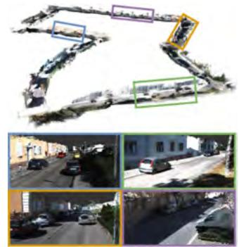

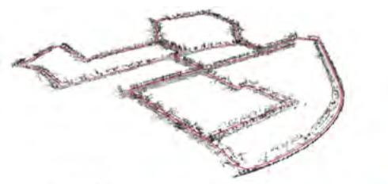

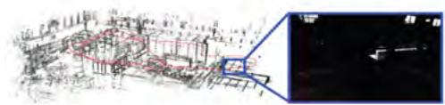  
(a) D3VO [1229]（©2020 IEEE）  
(b) MonoRec [1187]（©2021 IEEE）

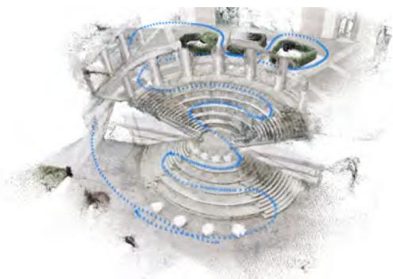

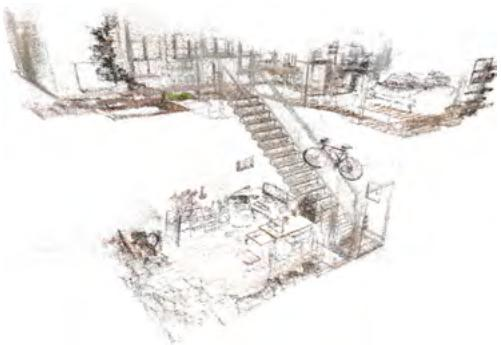

(c) DROID-SLAM [1082]  
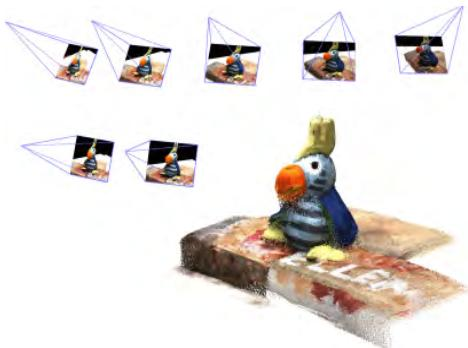  
(e) DuSt3R [1164]（©2024 IEEE）

(d) DPVO [1084]  
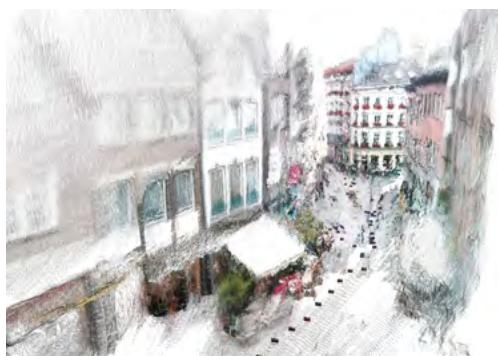  
(f) MUSt3R [135]（©2025 IEEE）  
图 13.1 过去数年中，人们开展了大量工作，将深度网络的预测能力引入视觉 SLAM。本章将回顾其中的一些方法。

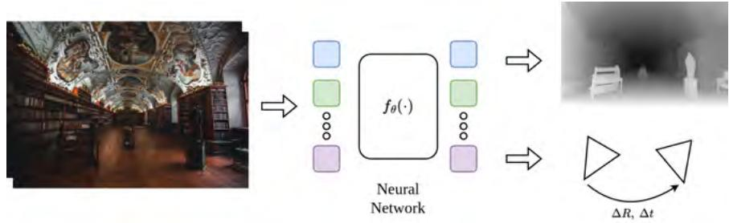  
图 13.2 可以训练神经网络，从输入图像或图像集合预测深度或相对位姿等三维属性。这些三维属性可用于增强 SLAM 系统。

## 13.1 深度和相机位姿的深度学习

可以训练深度神经网络，学习从输入空间（例如图像）到标签空间（例如深度）的映射。现代神经网络由大量可微层组成，这些层可以组合为端到端可训练系统。网络参数通过损失函数上的梯度下降变体进行优化，该损失函数衡量网络预测与真实标签的匹配程度。

借助现代深度传感器和激光扫描仪，如今可以采集大量三维数据。例如，可以使用深度传感器或 LiDAR 采集与深度图配对的图像；此外，还可以使用渲染引擎生成大规模合成三维数据集。如图 13.2 所示，可以在这些数据上训练神经网络，直接从输入图像预测深度或相对相机位姿等三维属性。本节将说明如何利用这些网络的预测来增强 SLAM 系统。

### 13.1.1 深度预测的深度学习

给定大量图像--深度对，可以训练神经网络，直接从单幅输入图像预测深度（或深度的某种参数化）。Eigen 等人 [302] 首次展示了利用卷积神经网络从单幅图像预测深度。多年来，得益于网络架构的改进和三维数据集的扩充，单图像深度网络不断发展。现代深度网络通常使用预训练视觉 Transformer（ViT）骨干网络 [280]，并配合卷积解码器对低分辨率 ViT 特征进行上采样，生成最终深度估计 [1162, 480]。为提高泛化能力，这些网络往往在包含合成数据和真实数据的二十多个数据集组合上训练。

深度预测在 SLAM 中有许多直接应用，尤其适用于单目场景。单目 SLAM 系统通常只能生成带尺度因子的重建结果，并且会受到尺度漂移影响。Yang 等人 [1228] 和 Hu 等人 [480] 表明，度量深度预测可以用于抑制单目 SLAM 的尺度漂移。在纯相机旋转、相机参数变化和动态物体等具有挑战性的情况下，深度预测还可以增强系统鲁棒性并避免失败 [660]。

此外，视觉 SLAM 系统往往只跟踪一组稀疏特征点，因而得到场景的稀疏重建。例如，纹理较少的区域几乎不会出现在最终点云中。虽然稀疏点云已经很有用，但机器人导航或自动驾驶等许多下游应用需要稠密重建。下面给出一些旨在获得更稠密三维重建的方法实例。

**MonoRec：单目稠密重建 [1187]。** 将稀疏 SLAM 系统输出稠密化的一种方法，是为视频的每一帧预测稠密深度图。可以利用 SLAM 系统产生的位姿，将所有像素提升到三维并累积到全局参考坐标系，从而获得如图 13.1(b) 所示的稠密重建。然而，直接使用深度网络生成的深度图并非最优，原因有二。第一，单图像深度网络在相邻帧之间往往产生几何不一致的输出。第二，许多场景包含动态物体，会在静态重建中引入拖影伪影。MonoRec [1187] 在深度网络中加入代价体积，通过预测运动物体掩膜来过滤动态物体，从而改善几何一致性。

为提高几何一致性，MonoRec [1187] 针对每一帧 $I _ { t }$ 构造代价体积 $C _ { t } ( d )$，该体积由连续帧 $\left\{ I _ { t _ { 1 } ^ { \prime } } , \ldots , I _ { t _ { n } ^ { \prime } } \right\}$ 聚合得到。具体而言，在若干离散深度步长 $d$ 上计算每个像素的光度一致性，并将结果聚合为三维体积。MonoRec 使用同时接收输入图像 $I _ { t }$ 和代价体积 $C _ { t } ( d )$ 的深度网络来预测深度。代价体积为网络提供额外上下文，以生成几何上一致的深度。

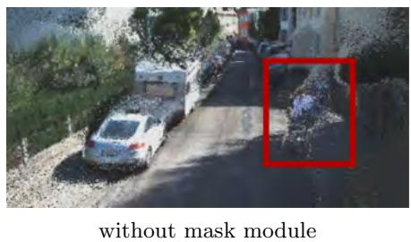

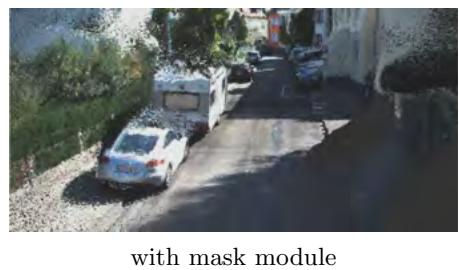  
图 13.3 MonoRec：网络架构中的掩膜模块可依据跨时间的亮度不一致过滤运动物体 [1187]（©2021 IEEE）。

代价体积假设世界是静态的；如果场景中有物体运动，就会提供错误信号。因此，MonoRec 依赖额外的掩膜网络，从代价体积预测运动物体分割掩膜 $M_t$。将预测深度提升至三维时，利用该运动物体分割掩膜过滤动态点。图 13.1(b) 表明，掩膜模块可以在稠密重建中滤除运动物体。

MonoRec 使用 SLAM 系统的稀疏三维点预测进行训练。掩膜模块可从准确深度中获益，而深度模块可从准确的动态掩膜中获益，因此联合训练两个组件可以进一步提升性能，得到准确且一致的深度图。

**Behind the Scenes（BTS）[1188]。** MonoRec [1187] 生成的稠密点云能够准确表示视频中观测到的三维世界。然而，被遮挡的区域不会成为重建三维场景的一部分。Behind the Scenes（BTS）通过预测体积重建而不是深度图来解决这一不足。在该表示中，会重建相机视锥内的全部内容，包括当前帧中被遮挡的区域。BTS 将场景表示为体积密度场 $\phi ( \pmb { x } ) : \mathbb { R } ^ { 3 } \to \mathbb { R } _ { + }$，它将相机视锥中的任意点 $x$ 映射到体积密度 $\sigma$。通过成熟的体积渲染技术，可以从该场景表示合成任意新视图。总体而言，体积重建为许多下游应用提供了有用的附加信息，尤其是自动驾驶和机器人领域。

### 13.1.2 相机位姿预测的深度学习

与训练神经网络预测深度类似，也可以训练网络预测帧对或视频序列之间的相机位姿。设 $I _ { 1 }$ 和 $I _ { 2 }$ 是一对输入图像，可以设计神经网络 $f _ { \theta }$，以两幅图像为输入，预测从 $I _ { 1 }$ 到 $I _ { 2 }$ 的相对相机位姿 $f _ { \theta } ( I _ { 1 } , I _ { 2 } ) = { \cal T } _ { 1 } ^ { 2 } \in \mathrm { S E } ( 3 )$。给定真实位姿 $T _ { 1 } ^ { 2 ^ { * } } \in \mathrm { S E } ( 3 )$，可定义损失

$$
\mathcal {L} _ {p o s e} = \left\| \left(\boldsymbol {T} _ {1} ^ {2}\right) ^ {- 1} \cdot \boldsymbol {T} _ {1} ^ {2 ^ {*}} \right\|, \qquad \mathrm{where} \boldsymbol {T} _ {1} ^ {2} = f _ {\theta} (I _ {1}, I _ {2})\tag{13.1}
$$

该损失衡量预测位姿与真实位姿之间的相对变换。还可以定义其他损失，例如最小化旋转角，或计算预测相对旋转与真实相对旋转的四元数表示之间的距离。

早期相机位姿估计工作将两帧拼接为输入，并回归轴角 [1114] 或欧拉角 [1299] 等相机位姿参数。给定帧对之间的相对位姿，可以通过复合这些位姿来串联恢复相机的完整轨迹。TartanVO [1167] 在输入图像中加入预测光流和相机内参，提高了相对位姿估计及其在下游数据集上的泛化能力。

两视图位姿预测的一个问题是，在较长视频序列中，相对位姿误差会不断累积。DeepVO [1163] 提出使用循环神经网络，以帧序列为输入并预测相机位姿序列。DeepVO 从输入视频序列提取特征以生成特征图序列，再通过 LSTM 处理这些特征图，预测一系列相机位姿估计。

尽管这些工作展示了有前景的结果，但直接预测相机位姿通常不如经典的 SfM 或 SLAM 技术准确，因为后者在系统中更深入地嵌入了几何约束 [1082]。此外，这类技术容易过拟合训练分布，需要在大量数据集组合上训练，以促进更好的泛化。

### 13.1.3 深度和相机位姿的无监督学习

深度和位姿的监督学习需要真实三维数据，而这些数据可能并不总是可用，或者难以获取。事实证明，无需显式三维监督，也可以训练位姿网络和深度网络。一种常见技术是使用视图合成作为监督信号 [387, 1299]。给定具有相对位姿 $\pmb { T } _ { 1 } ^ { 2 }$ 的两幅图像 $I _ { 1 }$ 和 $I _ { 2 }$，可以使用从 $I _ { 2 }$ 采样的像素，生成从 $I _ { 1 }$ 视点观察到的新图像。

具体而言，设相机投影 $\pi _ { c } : \mathbb { R } ^ { 3 } \mapsto \mathbb { R } ^ { 2 }$ 将三维点映射到二维像素坐标，逆投影函数 $\pi _ { c } ^ { - 1 } : \mathbb { R } ^ { 2 } \times \mathbb { R } ^ { + } \mapsto \mathbb { R } ^ { 3 }$ 将带深度 $d$ 的二维像素映射到其三维点。给定这些函数和相对位姿 $\pmb { T } _ { 1 } ^ { 2 }$，可以将 $I _ { 1 }$ 中的 $( \pmb { x } ^ { 1 } , d ^ { 1 } )$ 对映射到其在 $I _ { 2 }$ 中的位置：

$$
\pmb {x} ^ {2} = \pi_ {c} \left(\pmb {T} _ {1} ^ {2} \pi_ {c} ^ {- 1} (\pmb {x} ^ {1}, d ^ {1})\right) = \omega_ {1 \rightarrow 2} (\pmb {x} ^ {1}, d ^ {1})\tag{13.2}
$$

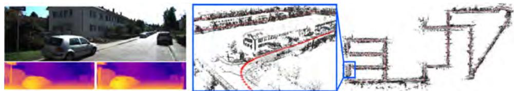  
图 13.4 DVSO：将深度神经网络的单目深度预测输入 DSO [308] 等经典 SLAM 方法后，单目方法“Deep Virtual Stereo Odometry”（DVSO）[1228] 获得了与当前最先进双目方法相当的高精度相机轨迹。该深度网络使用双目视频以自监督方式训练，显著提高了精度，并使单个运动相机能够恢复带尺度的重建。

忽略遮挡，并简记为 $\omega _ { 1 \rightarrow 2 }$。给定深度图 $d$，式（13.2）可用于将 $I _ { 2 }$ 变形到 $I _ { 1 }$ 的视点，定义变形图像

$$
\tilde {I} _ {2} (x) = I _ {1} (\omega _ {1 \rightarrow 2} (\boldsymbol {x}, \boldsymbol {d} (x)))\tag{13.3}
$$

其中 $I _ { 1 } ( \cdot )$ 表示双线性插值。由于双线性插值相对于像素坐标是局部可微的，因此可以计算合成图像 $\tilde { I } _ { 2 }$ 对深度和相机位姿的导数。Godard 等人 [387] 表明，可以利用视图合成损失在双目图像上训练深度网络。后续工作进一步表明，可以利用视图合成监督联合训练深度网络和位姿网络 [1299, 1129]。

**Deep Virtual Stereo Odometry（DVSO）[1228]。** 单目 SLAM 系统的一个局限是鲁棒性通常低于双目系统，且更容易发生漂移。DVSO 表明，可以利用在双目帧对之间通过视图合成监督训练的神经网络深度预测 [387]，增强经典视觉里程计系统 DSO [308]。如图 13.4 所示，DVSO 获取神经网络的深度预测，并加入一个附加因子，鼓励预测深度图与 DSO 计算所得深度保持一致。

神经网络预测的深度提高了重建质量，也提高了 VO 系统预测位姿的精度和鲁棒性。此外，由于深度预测采用度量单位，该方法甚至可以从单个相机恢复尺度准确的重建结果。这项工作被称为“虚拟立体里程计”，因为在单目应用中，深度网络实际上虚构了第二个相机的作用。

**D3VO：用于单目视觉里程计的深度、位姿和不确定性预测 [1229]。** 除单目深度预测外，还可以将相对相机运动的预测输入经典 SLAM 流水线，以确保恢复的轨迹与连续帧相机运动预测保持一致。DSO [308] 等直接视觉 SLAM 方法依赖跨帧颜色一致性来推断定位和建图。在真实世界中，这种颜色一致性并不总能保证，尤其对于有光泽、金属或玻璃等非 Lambert 表面，对应点很可能具有不同颜色。虽然可以显式建模世界的反射属性，但这会带来很高的计算负担，在实时场景中往往不可行。

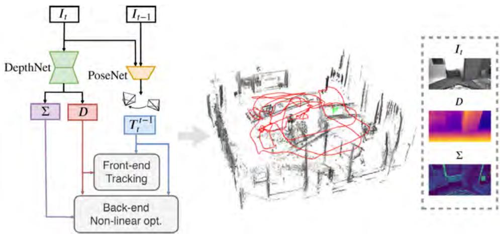  
图 13.5 D3VO [1229] 将用于位姿、深度和不确定性预测的自监督神经网络与直接 SLAM 系统 [308] 结合。网络的位姿和深度预测作为因子图中的附加因子集成到 SLAM 系统中，促使 SLAM 状态变量与神经网络预测对齐。通过结合深度学习与因子图，D3VO 同时受益于神经网络的鲁棒性和直接 SLAM 的精度。图像来自 [1229]（©2020 IEEE）。

事实证明，可以训练神经网络预测跨帧颜色很可能保持不变的位置。这些预测同样可以输入直接 SLAM 流水线，在预期颜色不一致的位置降低残差权重。D3VO [1229] 以这种方式将神经网络对单目深度、帧间相对相机运动和不确定性的预测输入 SLAM 流水线。如图 13.5 所示，D3VO 使用通过视图合成损失以自监督方式训练的深度网络和位姿网络。预测结果以前端因子图项和后端相应损失项的形式进入系统。通过将神经网络的深度、位姿预测与直接视觉里程计 [308] 结合，D3VO 能够获得高精度相机轨迹，并对单目 VO 常见的失败情况具有鲁棒性。基于学习的深度细化模块也已用于改进基于特征的 SLAM [514]。

## 13.2 特征匹配和光流的深度学习

前几节展示了如何使用神经网络直接从输入图像预测深度和相机位姿等三维信息。这种前馈方法不同于典型 SLAM 流水线，后者通常将推理写成优化问题：给定特征匹配等带噪测量 $z$，求解 $\scriptstyle \mathbf { x } ^ { \mathrm { M A P } }$。

预测相机位姿或深度并非易事。网络需要从头学习多视图几何，例如深度、相机位姿和相机内参之间的关系。另一种思路是预测测量量（如特征匹配），而不是直接预测状态变量。

### 13.2.1 特征检测器和描述子的学习

间接式 SLAM 方法依靠特征检测器和描述子，从输入图像提取一组稀疏视觉测量。首先识别图像中的显著区域，通常称为关键点；随后利用每个关键点的局部邻域计算向量描述子，用于在图像之间匹配关键点。

可以训练神经网络，替代 SLAM 和 SfM 流水线中常用的手工设计特征检测器与描述子。例如，SuperPoint [267] 提出使用卷积神经网络同时完成：(1) 检测显著图像区域；(2) 为检测到的关键点分配特征描述子。类似地，Universal Correspondence Network [214] 表明，神经网络生成的特征描述子可以提高下游特征匹配精度。这类网络通常使用对比损失训练，使匹配点的特征描述子相似，并使不匹配关键点的描述子距离尽可能大。

### 13.2.2 特征匹配

给定从一对图像中提取的关键点集合，也可以使用神经网络改善图像间关键点匹配。SuperGlue [971] 首次提出利用神经网络引导特征匹配。SuperGlue 在一对输入图像提取的关键点上运行，通过自注意力层和交叉注意力层迭代更新与每个关键点关联的特征向量，如图 13.6 所示。网络输出一个分配矩阵，给出第一幅图像中的每个关键点与第二幅图像中每个关键点匹配的可能性（另有一列表示未匹配关键点）。SuperGlue 预测的关键点匹配可以提高包括位姿估计在内的多个下游任务的精度。LightGlue [671] 通过一系列架构和训练改进，提高了 SuperGlue 的精度和速度。

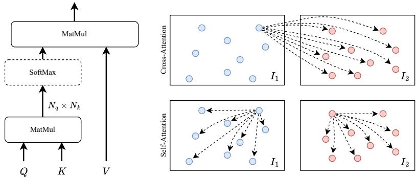  
图 13.6 SuperGlue [971]、LightGlue [671] 和 LoFTR [1052] 等特征匹配网络中常用的多头自注意力与交叉注意力示意图。SuperGlue 和 LightGlue 在与图像关键点关联的特征向量上执行自注意力和交叉注意力；LoFTR 不依赖关键点检测，而是在稠密特征网格上执行自注意力和交叉注意力。

SuperGlue 和 LightGlue 的一个潜在局限是，它们只处理一组稀疏图像关键点。这样虽然可以减少计算量，却无法利用完整图像；在纹理有限等困难样例上，可用的高质量匹配数量可能因此受限。LoFTR [1052] 提出了一种稠密像素匹配网络。与 SuperGlue 和 LightGlue 类似，LoFTR 使用自注意力和交叉注意力（图 13.6），并首先在低分辨率特征网格上进行稠密匹配，再在更高分辨率上细化预测，以降低计算量。

这些系统产生的特征匹配可以作为视觉测量及其对应因子，直接集成到间接式 SLAM 系统中。在传统特征描述子不可靠的情况下，深度特征匹配可以提高 SLAM 系统的鲁棒性。

### 13.2.3 光流与 RAFT

光流与特征匹配问题密切相关。光流的任务是估计一对图像帧之间逐像素的运动。这种逐像素运动（即光流场）可以作为基于因子图的视觉 SLAM 系统中的测量。

最初，光流被表述为一个优化问题，其代价函数平衡两个项：数据项和正则化项。数据项鼓励视觉上相似的图像区域对齐，正则化项则鼓励物理上合理的运动场。近年来，深度学习成为一种有前景的替代方法 [278, 1051, 502, 907]。本节介绍其中一种方法 RAFT [1081]（图 13.7），因为它是 DROID-SLAM [1082]（第 13.3 节）的基础。较新的光流网络通过加入图 13.6 所示的多头注意力和 Transformer 模块 [494]，进一步改进了 RAFT。

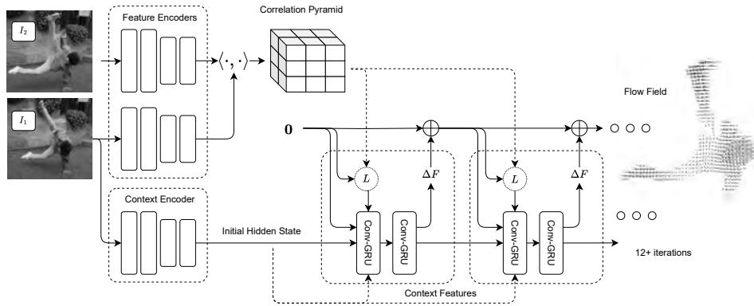  
图 13.7 RAFT（Recurrent All Pairs Field Transforms）光流架构。使用一对残差网络从输入图像提取特征；随后，RAFT 对 $I _ { 1 }$ 和 $I _ { 2 }$ 的特征执行全对内积，构造相关体积。从初始化为 0 的光流场开始，RAFT 反复利用当前光流估计在相关金字塔中查询，并通过循环卷积 GRU 更新光流估计。

图 13.7 展示了 RAFT 的整体设计。RAFT 同时结合深度学习和传统一阶优化的要素。首先从输入图像提取特征，再据此构造四维相关体积。将光流场初始化为零，并用它在相关金字塔中执行查询。相关特征与当前光流场估计一起输入卷积 GRU，由 GRU 生成光流场更新以及更新后的隐状态。RAFT 在带真实光流的合成数据集组合上训练 [743, 278]，但对真实数据也表现出良好泛化能力 [757]。

**特征提取器。** 特征提取器将输入图像编码为较低分辨率的稠密特征图。RAFT 使用一对特征提取器：(1) 外观编码器 $g _ { \theta }$；(2) 上下文编码器 $c _ { \theta }$。二者将尺寸为 $( h _ { i n } , \ w _ { i n } , 3 )$ 的输入图像映射为形状为 $( h , \ w , c )$ 的低分辨率特征图，其中 $c$ 是特征通道数。默认情况下，RAFT 以 $1/8$ 分辨率提取特征，因此 $(h,w)=(h_{in}/8,w_{in}/8)$；不过，其他网络也会使用更高分辨率。

**相关金字塔。** 利用外观特征构建多分辨率相关金字塔。相关体积是一个四维张量，形状为 $h \times w \times h \times w$，其中 $h$ 和 $w$ 是上述外观特征图的尺寸。相关体积 $C$ 通过计算 $g _ { \boldsymbol { \theta } } ( I _ { 1 } )$ 中所有像素与 $g _ { \boldsymbol { \theta } } ( I _ { 2 } )$ 中所有像素之间的内积构造：

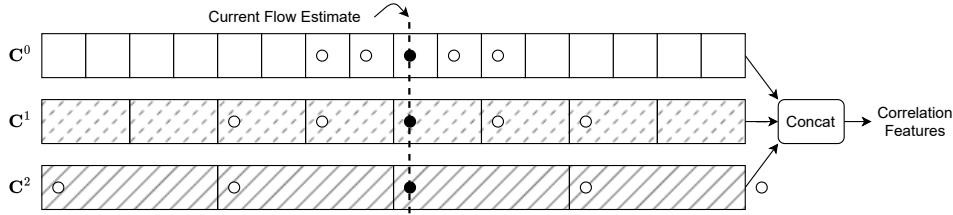  
图 13.8 RAFT 相关查询算子。该图展示了查询操作的一个一维切片。对于当前光流估计，RAFT 构造一个局部邻域，并从相关金字塔的每一层提取特征，再将这些特征展平并拼接。

$$
\mathbf {C} _ {i j k l} (I _ {1}, I _ {2}) = \langle g _ {\theta} (I _ {1}) _ {i j}, g _ {\theta} (I _ {2}) _ {k l} \rangle = \sum_ {m} g _ {\theta} (I _ {1}) _ {i j m} \cdot g _ {\theta} (I _ {2}) _ {k l m}.\tag{13.4}
$$

该操作可以通过一次矩阵乘法实现（展平空间维度并对第一个参数转置），因此可在 GPU 上高度优化。RAFT 不只使用单个相关体积，而是构造多分辨率相关金字塔。具体做法是对相关体积的最后两个维度迭代执行平均池化，得到四层金字塔 $\{ { \bf C } ^ { 0 } , { \bf C } ^ { 1 } , { \bf C } ^ { 2 } , { \bf C } ^ { 3 } \}$，其中第 $l$ 层体积 $\mathbf { C } ^ { l }$ 的形状为 $h \times w \times h/2^l \times w/2^l$。

**相关查询。** RAFT 定义了查询算子，利用当前光流 $f$ 在相关金字塔中建立索引（图 13.8）。对于 $g _ { \boldsymbol { \theta } } ( I _ { 1 } )$ 中的像素 $(u,v)$，光流场通过光流向量 $(u',v')=\mathbf f(u,v)+(u,v)$ 计算其在 $I _ { 2 }$ 中的估计对应位置。

RAFT 随后在 $(u',v')$ 周围构造 $(2r+1)\times(2r+1)$ 的邻域网格

$$
N (u ^ { \prime}, v ^ { \prime}) = \{(u ^ { \prime} + \Delta u, v ^ { \prime} + \Delta v) \mid \Delta u, \Delta v \in \{- r,..., r \} \}\tag{13.5}
$$

其中 $r$ 是定义查询半径的超参数。利用双线性插值，该邻域网格用于从 $\mathbf C^0$ 建立索引。对于低分辨率 $\mathbf C^l$，在缩放后的对应坐标 $N(u'/2^l,v'/2^l)$ 周围构造邻域网格并采样特征。最终特征向量如图 13.8 所示，由各层特征拼接而成，同时包含小位移的细分辨率特征和大位移的粗分辨率信息。

**更新算子。** RAFT 的权重绑定更新算子从零场开始，估计光流场 $(f^1,\ldots,f^N)$。在每次更新迭代中，算子产生一个更新方向，并将其应用于当前估计，得到下一次估计 $\pmb f^{k+1}=\delta\pmb f^k+\pmb f^k$。

更新算子使用基于 GRU [217] 的门控激活单元，其中线性层由卷积替代。卷积允许信息在图像空间传播；权重绑定和有界激活则有助于收敛到不动点。每次迭代接收四个输入（每个输入都是二维特征图）：(1) 上一次迭代的隐状态；(2) 上下文特征；(3) 当前光流估计；(4) 查询算子输出的相关特征。这些特征输入 Conv-GRU 后，生成更新后的隐状态和光流更新 $\delta f^k$。

### 13.2.4 作为视觉测量的光流

在静态场景中，两帧之间的光流是深度和相机位姿的函数。设 $I_i$ 和 $I_j$ 是两幅图像，其相机位姿（相机到世界变换）为 $\pmb T_i^w$ 和 $\pmb T_j^w$。给定深度为 $d$ 的像素 $(u,v)$，首先将该点反投影到深度 $d$，再把三维点从帧 $i$ 变换到帧 $j$，最后投影到相机 $j$，即可计算诱导光流：

$$
\hat {\boldsymbol {f}} (u, v) = \boldsymbol {\pi} \left(\boldsymbol {T} _ {i} ^ {j} \cdot \boldsymbol {\pi} ^ {- 1} (u, v, d)\right) - (u, v) \quad \boldsymbol {T} _ {i} ^ {j} = (\boldsymbol {T} _ {j} ^ {w}) ^ {- 1} \cdot \boldsymbol {T} _ {i} ^ {w}.\tag{13.6}
$$

其中，$\pi : \mathbb R^3\mapsto\mathbb R^2$ 将三维点投影到像素坐标，逆投影函数 $\pi^{-1}:\mathbb R\times\mathbb R^2\mapsto\mathbb R^3$ 则将带深度 $d$ 的像素坐标 $(u,v)$ 反投影到其三维坐标。

这里假设使用针孔相机；如果已知畸变模型，也可以在预处理阶段先去畸变，从而使用包含径向或切向畸变的复杂相机模型。为方便记号，将 $\pi$ 和 $\pi^{-1}$ 重载为作用于尺寸为 $h\times w$ 的稠密像素网格 $(\pmb u,\pmb v)$ 的向量化算子，使光流场可写为

$$
\boldsymbol {h} _ {i j} (\boldsymbol {T} _ {i} ^ {w}, \boldsymbol {T} _ {j} ^ {w}, \boldsymbol {d} _ {i}) = \boldsymbol {\pi} \left(\boldsymbol {T} _ {i} ^ {j} \cdot \boldsymbol {\pi} ^ {- 1} (\boldsymbol {u}, \boldsymbol {v}, \boldsymbol {d} _ {i})\right) - \left[ \begin{array}{c} \boldsymbol {u} \\ \boldsymbol {v} \end{array} \right]\tag{13.7}
$$

其中 $d$ 是一个 $h\times w$ 的稠密深度图。

### 13.2.5 根据光流估计位姿和深度

可以利用因子图反向求解：使用光流估计来求解深度和相机位姿。考虑图像集合 $\{I_1,\ldots,I_n\}$，构建一个图，其边连接具有光流估计的图像（图 13.9(a)）；$(i,j)\in\mathcal G$ 表示图像 $I_i$ 和 $I_j$ 之间有光流估计。将帧 $I_i$ 与 $I_j$ 之间的光流估计记为测量 $z_{ij}$（帧图中的每条边对应一个因子，为便于记号，使用元组 $(i,j)$ 对因子索引），状态变量 $x$ 则由位姿 $(T_1^w,\ldots,T_n^w)$ 和稠密深度图 $(d_1,\ldots,d_n)$ 组成。可以构造一个描述给定状态变量时应观测到的光流的代价函数：

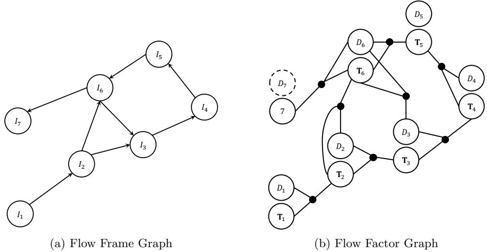  
图 13.9 光流帧图和光流因子图。

$$
J (\boldsymbol {x}) \triangleq \sum_ {(i, j) \in \mathcal {G}} \left\| \boldsymbol {z} _ {i j} - \boldsymbol {h} _ {i j} \left(\boldsymbol {T} _ {i} ^ {w}, \boldsymbol {T} _ {j} ^ {w}, \boldsymbol {d} _ {i}\right) \right\| _ {\boldsymbol {\Sigma} _ {i j}} ^ {2}\tag{13.8}
$$

其中测量预测函数 $h_{ij}$ 在式（13.7）中定义。

该代价函数对应图 13.9(b) 中的因子图，其中每个因子涉及三个状态变量：源位姿、目标位姿和源深度。参数化有几点需要注意：实践中最好使用逆深度参数化深度变量，因为这样可得到更好的代价函数局部近似。由于位姿是流形状态变量，还应使用局部参数化 $\exp(\pmb\xi_i^\wedge)\pmb T_i^w$。

## 13.3 可微束调整与 DROID-SLAM

可以使用 RAFT（或其他现成方法）计算光流，再最小化最小二乘优化问题求解位姿和深度。单独这样做的效果并不理想。光流网络针对光流任务训练，而不是三维重建或位姿估计；其损失函数未必能很好地刻画 SLAM 真正关心的目标，尤其是相机位姿的精度。第二个问题是，光流网络的输出包含离群值，且代价函数对所有像素赋予相同权重。

一种解决方案是将光流等中间表示作为可微优化层的输入。利用第 4 章介绍的技术，可以通过优化层进行反向传播，对该中间表示实施监督，并进一步训练网络权重。此外，还可以让网络输出相应置信度权重，以进一步塑造优化景观。为具体说明这一思想，回顾第 1 章：因子图产生如下形式的代价函数

$$
J (\pmb {x}) \stackrel {\Delta} {=} \sum_ {i} \| \pmb {e} _ {i} (\pmb {x} _ {i}) \| _ {\pmb {\Sigma} _ {i}} ^ {2} = \| \pmb {e} (\pmb {x}) \| _ {\pmb {\Sigma}} ^ {2} \qquad \pmb {e} _ {i} (\pmb {x}) = \pmb {z} _ {i} - \pmb {h} _ {i} (\pmb {x} _ {i})\tag{13.9}
$$

其中 $e_i$ 是误差向量，表示世界模型与观测测量之间的差异。误差向量 $e_i$ 通常表示重投影误差（间接法）或光度误差（直接法）。

与其直接建模误差，不如使用神经网络生成误差及其置信度。定义神经网络函数 $e_\theta$，将当前状态 $x$（例如位姿）和测量 $z$（例如图像）映射为误差向量 $e\in\mathbb R^m$，并以类似方式参数化协方差。代入学习得到的函数 $e_\theta$ 和 $\Sigma_\theta$，代价函数可改写为

$$
J (\pmb {x}) \triangleq \| \pmb {e} _ {\theta} (\pmb {z}, \pmb {x}) \| _ {\pmb {\Sigma} _ {\theta} (\pmb {z}, \pmb {x})} ^ {2}\tag{13.10}
$$

从而允许神经网络塑造代价函数。

BANet [1068] 是最早将 BA 集成到端到端可训练架构的工作之一，它在神经网络提取的特征图上定义光度误差。本节概述 DROID-SLAM [1082] 和 DPVO [1084]，这两个系统都将光流作为可微 BA 的中间表示来构建 SLAM 和 VO 系统。

### 13.3.1 DROID-SLAM 架构

DROID-SLAM 的架构（图 13.10）复用了 RAFT 的许多组件。它接收两个输入：输入图像序列 $\left(I_1,\ldots,I_n\right)$，以及连接共视图像帧对的帧图；输出位姿和深度估计序列。

**特征提取与视觉相似性。** 网络输入是帧序列 $\left(I_1,\ldots,I_n\right)$ 和帧图 $\mathcal G$。与 RAFT 一样，DROID-SLAM 使用两个特征提取器：上下文编码器 $c_\theta$ 和外观编码器 $g_\theta$；二者都是残差网络，输出分辨率为输入的 $1/8$ 的特征。

外观特征按照 RAFT 的方式构造一组相关金字塔。对帧图中的每条边 $(i,j)$，利用 $I_i$ 与 $I_j$ 的外观特征相关性构造一个相关金字塔。如果帧图有 $E$ 条边，总共会构造 $E$ 个相关金字塔。

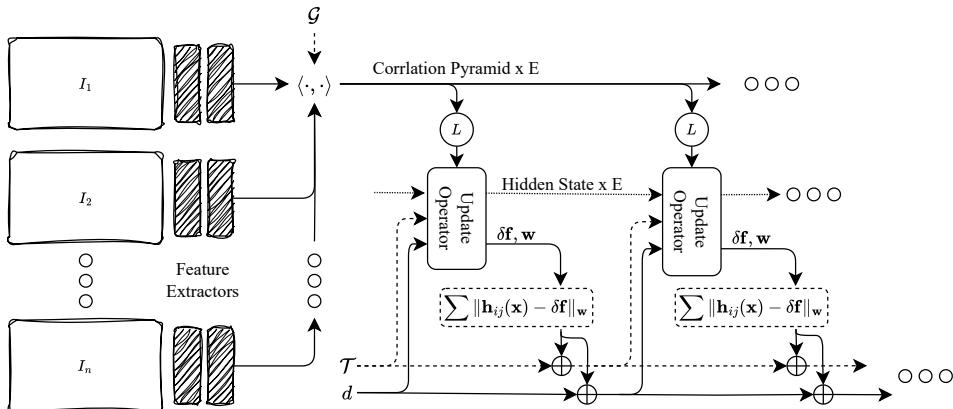  
图 13.10 DROID-SLAM 架构：从 $N$ 幅输入图像提取特征，并构造 $E$ 个相关体积（帧图每条边对应一个）。更新算子在帧图的每条边上对称运行。在每次迭代中，算子利用当前位姿估计 $\mathbf{\mathcal T}_1,\ldots,\mathbf{\mathcal T}_n$ 和深度 $d_1,\ldots,d_n$ 在相关金字塔中查询。相关特征和隐状态用于生成光流修正 $\delta f$ 及置信度权重 $w$，进而参数化代价函数。随后执行若干次 Gauss--Newton 更新，产生位姿和深度更新。

**更新算子。** 更新算子作用于帧图，产生全局位姿和深度更新。帧图中的每条边 $(i,j)$ 都有关联的相关金字塔 $C_{ij}$ 和隐状态 $\mathbf{\Delta q}_{ij}$。隐状态 $\mathbf{\Delta q}_{ij}$ 从源帧 $I_i$ 的上下文特征初始化。

更新算子的每次迭代使用当前位姿和深度估计，根据式（13.7）定义的测量函数计算帧图每条边的诱导光流。与 RAFT 类似，更新算子是一个卷积 GRU，但在此会针对帧图中的每条边复制一个实例。每次迭代中，更新算子使用：(1) 隐状态；(2) 相关特征；(3) 光流特征；(4) 上一次迭代的残差，生成更新后的隐状态。随后由更新后的隐状态预测测量误差 $\delta f_{ij}$（例如光流场更新）及关联置信度图 $\pmb w_{ij}$。

**可微束调整。** 利用误差估计和置信度图，可以构造如下形式的非线性最小二乘（NLS）BA 代价函数：

$$
J (\boldsymbol {x}) \triangleq \sum_ {(i, j) \in \mathcal {G}} \left\| \delta \boldsymbol {f} _ {i j} - \left[ \boldsymbol {h} _ {i j} (\boldsymbol {x} _ {i j}) - \boldsymbol {h} _ {i j} (\boldsymbol {x} _ {i j} ^ {0}) \right] \right\| _ {\boldsymbol {\Sigma} _ {i j}} ^ {2}\tag{13.11}
$$

其中，先将 $\pmb w_{ij}$ 转换为块对角矩阵 $\pmb\Sigma_{ij}=\mathrm{diag}\ \pmb w_{ij}$，以构造协方差；$\pmb x_{ij}^0$ 是该迭代开始时的初始位姿和深度估计。该代价函数要求更新状态，使测量函数的变化 $h_{ij}(\pmb x_{ij})-h_{ij}(\pmb x_{ij}^0)$ 与网络预测的误差 $\delta f_{ij}$ 一致。权重 $\pmb w_{ij}$ 使网络能够进一步控制优化景观：对网络有信心的图像区域赋予更大权重。通过展开 Gauss--Newton 迭代来更新深度和相机位姿。利用第 4 章介绍的技术，可以对每一个 Gauss--Newton 步骤执行反向传播，从而端到端训练网络。

**训练。** DROID-SLAM 在合成 TartanAir 数据集 [1166] 上训练，该数据集包含真实深度和相机位姿。训练使用位姿损失和光流损失的加权组合。位姿损失惩罚网络预测位姿与真实位姿之间的差异；类似地，光流损失惩罚由预测位姿和深度通过式（13.6）诱导的光流与由真实位姿和深度诱导的光流之间的差异。

### 13.3.2 DROID-SLAM 推理

网络在固定规模设置（in-place setting）中训练，即接收固定数量的帧作为输入。若要在帧图动态变化、帧不断加入和移除的在线设置中运行，则需要进行若干修改。

**运动过滤。** 初始化时，选择运动足够的帧很重要。DROID-SLAM 根据相对于上一关键帧的相对运动，使用一个简单探测器过滤帧。设 $I_{t-1}$ 是上一关键帧、$I_t$ 是输入帧，算法构造只有一条边 $I_{t-1}\to I_t$ 的帧图，然后运行更新算子计算光流修正 $\delta f$。若 $\delta f$ 的幅度低于阈值，则丢弃该帧；否则保留。

**初始化。** 累积足够数量的帧后，DROID-SLAM 尝试初始化。它构造一个将每帧与时间邻居连接的帧图，然后运行若干轮更新算子。尽管初始化策略很简单，但在所有基准数据集上都表现良好。当然，在纯旋转情况下该方法会失败。

**前端。** 加入新帧后，将相应边加入帧图。关键帧与前两帧之间总是双向加入时间边。系统还利用诱导光流计算所有关键帧对之间的距离，并在共视度高的帧之间添加新边。DROID-SLAM 通过对邻近边执行非极大值抑制等方式，避免加入过多边。

**全局优化。** DROID-SLAM 还使用后端过程联合优化完整帧图。它首先在时间相邻帧之间添加边，再利用当前位姿和深度估计计算所有帧对之间的光流。如果光流低于某一阈值，则将长距离边加入图中。这些长距离边可以在漂移不太严重的前提下实现中距离回环；但 DROID-SLAM 不包含重定位模块，因此无法闭合具有大量漂移的大回环。如图 13.11 所示，带中距离回环的全局优化能够显著提高估计轨迹的精度。

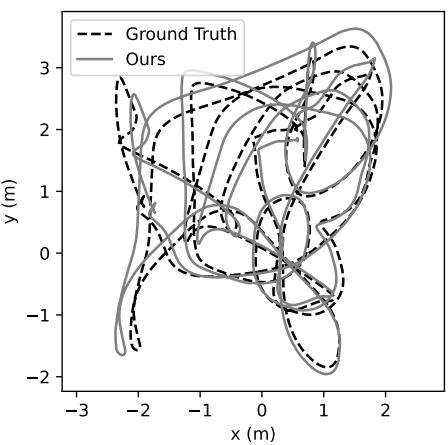  
(a) 仅前端

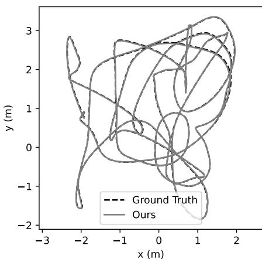  
(b) 全局优化后
图 13.11 EuRoC 基准 V1 02 medium 场景中估计轨迹与真实轨迹的比较。全局优化将 RMSE ATE 从 16.5 cm 降至 1.2 cm。

### 13.3.3 泛化到其他模态

因子图表述使 DROID-SLAM 很容易推广到 RGB-D 和双目视频，而无需重新训练网络。除 RGB-D 和双目外，该方法还已推广到视觉惯性 SLAM [864] 和事件相机 [760]。

**RGB-D 视频。** 对于深度视频，只需加入一个附加因子，鼓励预测深度接近传感器深度即可。传感器深度估计通常是稀疏的，因此只在传感器读数有效的像素上应用该因子，得到更新后的代价函数

$$
J (\boldsymbol {x}) \triangleq \sum_ {(i, j) \in \mathcal {G}} \| \boldsymbol {z} _ {i j} - \boldsymbol {h} _ {i j} (\boldsymbol {x}) \| ^ {2} + \sum_ {i} \left\| \bar {\boldsymbol {d}} _ {i} - \boldsymbol {d} _ {i} \right\| _ {\boldsymbol {\Sigma} _ {d}} ^ {2}\tag{13.12}
$$

其中 $\bar d_i$ 是传感器深度观测，$\Sigma_d$ 是传感器协方差，用对缺失传感器值置零的对角矩阵表示。

**双目视频。** 推广到双目视频并不困难。在双目情况下，每个输入由双目装置同步采集的左帧和右帧组成，并假设左右帧之间的相对位姿已知。DROID-SLAM 只需将左右帧都加入帧图；对于每个左帧，再加入连接其右侧对应帧的边。优化期间固定左右帧的相对位姿。图 13.12 表明，双目帧对能够改善性能；此外，全局优化还会带来额外收益。

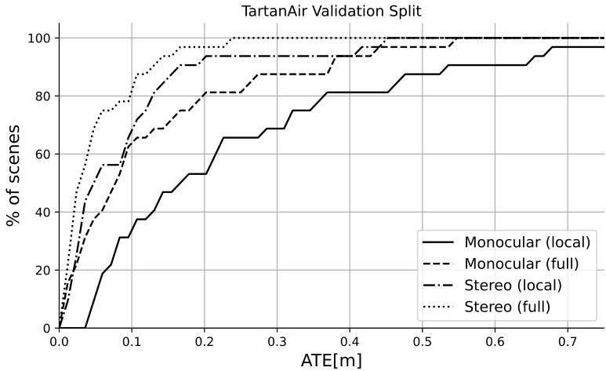  
图 13.12 DROID-SLAM 单目和双目版本在有、无全局优化时的比较。DROID-SLAM 在 TartanAir 验证集的 32 个序列上运行，并绘制绝对轨迹误差（ATE）低于各阈值的轨迹百分比。双目帧显著改善了性能，部分原因是解决了尺度漂移问题。单目和双目系统都受益于全局优化。

### 13.3.4 Deep Patch Visual Odometry（DPVO）

Deep Patch Visual Odometry [1084] 与 DROID-SLAM 密切相关，但它处理的是稀疏图像块而非稠密帧。这不仅提高了计算效率，也带来精度方面的若干优势。

**图像块图。** DPVO 不处理完整帧，而是处理图像块，并使用图像块图数据结构存储图像块与图像之间的关联。图像块图是表示图像块生命周期的二部图，图中的边连接图像块与帧。

每个图像块被表示为其提取图像中的前视平面。因此，每个图像块只用一个（逆）深度参数化。为在帧之间重新投影图像块，需要更新测量函数：

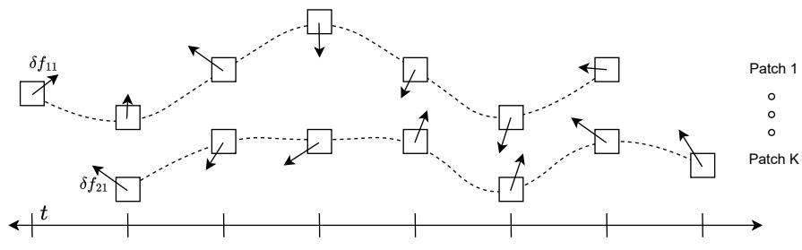  
图 13.13 DPVO 图像块图：每个图像块都随时间跟踪。更新算子为图中每条边输出光流修正 $\delta f$，图中用误差向量表示。

为在帧之间重新投影图像块，需要更新测量函数

$$
\pmb {h} _ {i j} (\pmb {T} _ {s (i)} ^ {w}, \pmb {T} _ {j} ^ {w}, d _ {i}) = \pmb {\pi} \left(\pmb {T} _ {s (i)} ^ {j} \cdot \pmb {\pi} ^ {- 1} (\pmb {u}, \pmb {v}, d _ {i})\right) - \left[ \begin{array}{c} \pmb {u} \\ \pmb {v} \end{array} \right]\tag{13.13}
$$

其中 $i$ 是图像块索引，$s(i)$ 是源索引，即提取图像块 $i$ 的帧索引。$u$ 和 $v$ 是图像块的像素坐标，$d_i$ 是在整个图像块上共享的单个标量深度。

**图像块提取。** 每幅输入图像都由特征编码器和上下文编码器处理，输出 $1/4$ 分辨率的特征。随机采样图像块中心，并以此构造带一个像素偏移的 $3\times3$ 图像块（这里的 1 px 是提取特征图分辨率下的像素，因此对应原图中的 4 px）。DPVO 使用非常简单的方法构造图像块图：每个图像块与时间半径为 $r$ 的所有帧相连。通过选择更多图像块并延长其生命周期，可以在计算量和精度之间进行权衡。

**更新算子。** 更新算子作用于图像块图的边。与 RAFT 和 DROID-SLAM 一样，DPVO 的更新算子是一个循环式、权重绑定的单元，但加入了若干新组件。它在图像块生命周期上执行时间卷积，并使用聚合层在帧和图像块之间池化特征。更新算子为每条边产生光流更新 $\delta f$ 及其置信度权重 $w$。利用式（13.7）作为测量函数，可以据此构造代价函数，并通过展开两次 GN 迭代产生位姿和深度更新。

**推理。** DPVO 首先累积帧以完成初始化。累积到指定数量的帧后，通过运行若干轮更新算子进行初始化。之后，每加入一帧新图像，就从新帧提取图像块，并将边加入图像块图：包括连接先前图像块与新帧的前向边，以及连接新图像块与先前帧的后向边。随后运行更新算子细化深度和位姿估计。与 DROID-SLAM 一样，DPVO 还使用关键帧机制，确保优化窗口足够大。

**回环与全局优化。** DPVO 纯粹是视觉里程计系统，无法在优化窗口之外执行回环。Deep Patch Visual SLAM（DPVS）[672] 在 DPVO 基础上加入全局优化和回环。DPVS 借助重定位模块执行长距离回环，并根据邻近性检测执行短距离回环。与 DROID-SLAM 不同，DPVS 可以在单个 GPU 上保持实时性能。

## 13.4 DuSt3R

如前几节所示，从高层次看，现代 SLAM 系统可以描述为一系列步骤组成的流水线：首先获取帧之间的像素对应关系，包括关键点、图像块或稠密光流；然后对状态变量 $x$（例如相机参数和深度图）与观测对应关系之间的因子图建模；最后求解使整体代价函数 $J(x)$ 最小的状态变量更新。需要注意，在更广义的 SfM 场景中，待估计的相机参数还包括每台相机的内参标定，而在 SLAM 场景中通常假设内参已知。前几章介绍了如何在每个步骤中插入基于学习的方法（例如用于估计光流的神经网络），但总体而言，SLAM 流水线仍然高度依赖手工设计且相当复杂。

近来出现了一类新型的基于学习的方法。DUSt3R [1164] 不再将 SLAM 问题拆分为一系列原子步骤，而是让一个神经网络一次性解决所有步骤：仅给定图像，便可直接输出相机位姿、稠密深度图甚至内参，无需任何显式求解器或迭代算法。此类网络的应用远不止 SLAM，因为它不对输入图像之间的时间关系作任何假设，因此更一般地适用于 SfM 和稠密三维重建。

然而，要求网络从可能数千帧图像重建大型场景目前仍然难以实现。实践中，DUSt3R 只解决包含两幅输入图像的局部三维重建问题。后文将看到，在给定一组局部三维重建、执行 SLAM（或大规模三维重建）时，最终仍需要某种形式的因子图。与以往方法相比，DUSt3R 的输出更丰富，因此简化并拓展了 SLAM 系统的可能性，使系统更加鲁棒，并支持处理变化的相机内参（例如动态缩放）。

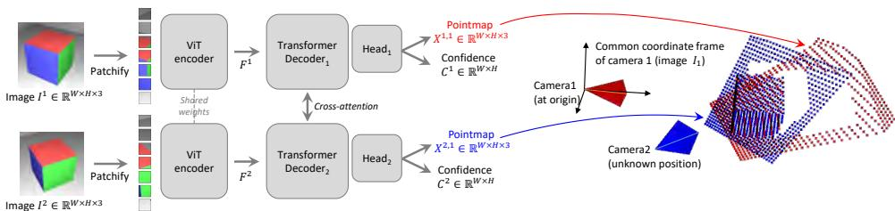  
图 13.14 网络架构。首先使用共享的 ViT 编码器，以 Siamese 方式对场景的两个视图 $(I^1,I^2)$ 编码。得到的 token 表示 $F^1$ 和 $F^2$ 随后输入两个 Transformer 解码器，解码器通过交叉注意力不断交换信息。最后，两个回归头输出对应的两个点图及其置信度图。需要强调的是，两个点图均表示在第一幅图像 $I^1$ 的同一坐标系中。网络使用简单的回归损失（式（13.17））训练。图像来自 [1164]（©2024 IEEE）。

**概述。** 简言之，DUSt3R 能够从未标定、未定姿的相机执行稠密、无约束立体三维重建。其核心组件是一个网络，仅从一对图像回归稠密且准确的场景表示，无需关于场景或相机的先验信息（甚至不需要内参）。所得场景表示基于具有丰富属性的三维点图，同时封装：(a) 场景几何；(b) 像素与场景点之间的关系；(c) 两个视点之间的关系。仅凭该输出，几乎所有场景参数（即相机和场景几何）都可以直接提取。这是因为网络联合处理输入图像和生成的三维点图，从而学习到强大的几何与形状先验，类似于多视图立体中常用的纹理形状、阴影形状或轮廓形状等先验 [997]。

**点图。** 将稠密二维三维点场表示为点图 $\pmb X\in\mathbb R^{W\times H\times3}$。与分辨率为 $W\times H$ 的对应 RGB 图像 $I$ 关联后，$X$ 在图像像素与三维场景点之间建立一一映射，即对所有像素坐标 $(i,j)\in\{1\ldots W\}\times\{1\ldots H\}$，都有 $I_{i,j}\leftrightarrow X_{i,j}$。这里假设每条相机射线只与一个三维点相交，即忽略半透明表面情况。

给定相机内参 $\pmb K\in\mathbb R^{3\times3}$，根据真实深度图 $\pmb D\in\mathbb R^{W\times H}$ 可以直接得到观测场景的点图 $X$：$\begin{array}{r}{X_{i,j}=K^{-1}D_{i,j}[i,j,1]^{\intercal}}\end{array}$。这里 $X$ 表示在相机坐标系中。下文用 $X^{n,m}$ 表示相机 $n$ 的点图 $X^n$ 在相机 $m$ 坐标系中的表达：

$$
\boldsymbol {X} ^ {n, m} = h ^ {- 1} \left(\boldsymbol {P} _ {m} \boldsymbol {P} _ {n} ^ {- 1} h \left(\boldsymbol {X} ^ {n}\right)\right)\tag{13.14}
$$

其中 $P_m,P_n\in\mathrm{SE}(3)$ 是图像 $m$ 和 $n$ 的世界到相机位姿；函数 $h:(x,y,z)\to(x,y,z,1)$ 是齐次映射，$h^{-1}:(x,y,z,1)\to(x,y,z)$ 是其逆映射。

### 13.4.1 广义立体重建网络

**问题定义。** 构建一个通过直接回归解决广义立体情形三维重建任务的网络。网络 $f$ 接收两幅 RGB 图像 $I^1,I^2\in\mathbb R^{W\times H\times3}$，输出两个对应的点图 $X^{1,1},X^{2,1}\in\mathbb R^{W\times H\times3}$ 及其置信度图 $C^{1,1},C^{2,1}\in\mathbb R^{W\times H}$。需要注意，两个点图都表示在 $I^1$ 的同一坐标系中；这与现有方法有根本不同，但带来了多项关键优势（见第 13.4.3 节）。

**网络架构。** 如图 13.14 所示，网络由两个相同分支组成，每个分支包含图像编码器、解码器和回归头。两幅输入图像首先通过同一个共享权重的 ViT 编码器 [280] 以 Siamese 方式编码，得到两个 token 表示 $F^1$ 和 $F^2$：

$$
F ^ {1} = \operatorname{Encoder} (I ^ {1}), \quad F ^ {2} = \operatorname{Encoder} (I ^ {2}).
$$

随后，网络在解码器中联合处理这两个表示。解码器是配备交叉注意力的通用 Transformer 网络。每个解码器块依次执行自注意力（一个视图的每个 token 关注同一视图的 token）、交叉注意力（一个视图的每个 token 关注另一视图的所有 token），最后将 token 输入 MLP。重要的是，在解码过程中两个分支不断共享信息，这对于输出正确对齐的点图至关重要。具体而言，每个解码器块都会关注另一个分支的 token：

$$
\begin{array}{l} G _ {i} ^ {1} = \text {DecoderBlock} _ {i} ^ {1} \left(G _ {i - 1} ^ {1}, G _ {i - 1} ^ {2}\right), \\ G _ {i} ^ {2} = \text {DecoderBlock} _ {i} ^ {2} \left(G _ {i - 1} ^ {2}, G _ {i - 1} ^ {1}\right), \end{array}
$$

其中 $i=1,\ldots,B$，解码器包含 $B$ 个块，并以编码器 token $G_0^1:=F^1$ 和 $G_0^2:=F^2$ 初始化。这里，$\mathrm{DecoderBlock}_i^v(G^1,G^2)$ 表示分支 $v\in\{1,2\}$ 中的第 $i$ 个块，$G^1$ 和 $G^2$ 是输入 token，其中 $G^2$ 是另一个分支的 token。最后，在每个分支中，独立的回归头接收解码器 token 集合，并输出点图及关联置信度图：

$$
\begin{array}{l} \boldsymbol {X} ^ {1, 1}, \boldsymbol {C} ^ {1, 1} = \mathrm{Head} ^ {1} (G _ {0} ^ {1}, \ldots , G _ {B} ^ {1}), \\ \boldsymbol {X} ^ {2, 1}, \boldsymbol {C} ^ {2, 1} = \mathrm{Head} ^ {2} (G _ {0} ^ {2}, \ldots , G _ {B} ^ {2}). \end{array}
$$

需要注意，这种通用架构从未显式施加几何约束。因此，点图不一定对应任何物理上合理的相机模型（但在实践中能够很好地拟合）。相反，我们让网络学习训练集中的所有相关先验，而训练集只包含几何一致的点图。通用架构可以利用强大的预训练技术，最终超过现有特定任务架构所能达到的性能。

### 13.4.2 回归损失与置信度感知损失

**三维回归损失。** 唯一的训练目标基于三维空间中的回归。记由式（13.14）得到的真实点图为 $\hat{\pmb X}^{1,1}$ 和 $\hat{\pmb X}^{2,1}$，并令 $\mathcal D^1,\mathcal D^2\subseteq\{1\ldots W\}\times\{1\ldots H\}$ 表示真实值有定义的两组有效像素。视图 $v\in\{1,2\}$ 中有效像素 $i\in\mathcal D^v$ 的回归损失定义为欧氏距离：

$$
\ell_ {\mathrm{regr}} (v, i) = \left\| \frac {1}{z} \boldsymbol {X} _ {i} ^ {v, 1} - \frac {1}{\bar {z}} \hat {\boldsymbol {X}} _ {i} ^ {v, 1} \right\|.\tag{13.15}
$$

为处理预测与真实值之间的尺度歧义，分别用缩放因子 $z=\mathrm{norm}(X^{1,1},X^{2,1})$ 和 $\bar z=\mathrm{norm}(\hat X^{1,1},\hat X^{2,1})$ 对预测点图和真实点图归一化。这两个因子表示所有有效点到原点的平均距离：

$$
\mathrm{norm} (\boldsymbol {X} ^ {1}, \boldsymbol {X} ^ {2}) = \frac {1}{| \mathcal {D} ^ {1} | + | \mathcal {D} ^ {2} |} \sum_ {v \in \{1, 2 \}} \sum_ {i \in \mathcal {D} ^ {v}} \| \boldsymbol {X} _ {i} ^ {v} \|.\tag{13.16}
$$

**置信度感知损失。** 实际上，有些三维点定义不明确，例如天空或半透明物体上的点。更一般地说，图像中的某些区域通常比其他区域更难预测。因此，我们联合学习为每个像素预测一个分数，表示网络对该像素的置信程度。最终训练目标是在所有有效像素上计算式（13.15）的置信度加权回归损失：

$$
\mathcal {L} _ {\mathrm{conf}} = \sum _ {v \in \{1, 2 \}} \sum _ {i \in \mathcal {D} ^ {v}} C _ {i} ^ {v, 1} \ell_ {\mathrm{regr}} (v, i) - \alpha \log C _ {i} ^ {v, 1},\tag{13.17}
$$

其中 $C_i^{v,1}$ 是像素 $i$ 的置信度分数，$\alpha$ 是控制正则项的超参数 [221]。为确保置信度严格为正，通常定义 $C_i^{v,1}=1+\exp c_i^{v,1}\gg0$，其中 $c_i^{v,1}\in\mathbb R$。这样会迫使网络在较困难区域（例如仅被单个视图覆盖的区域）进行外推。以该目标训练网络 $f$，无需显式监督即可估计置信度分数。图 13.15 展示了输入图像对及其对应输出的实例。

### 13.4.3 下游应用

输出点图的丰富属性使我们能够恢复下面介绍的所有场景参数。

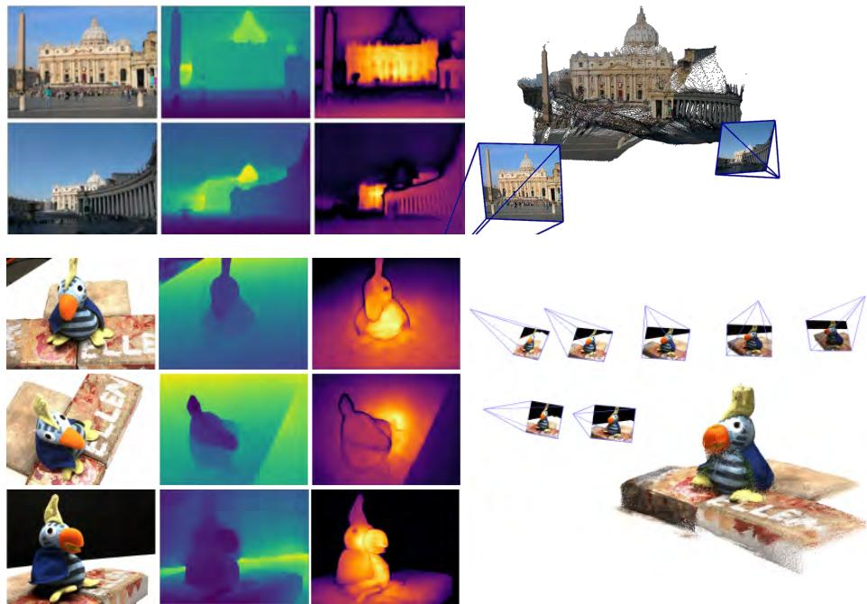  
图 13.15 两个训练期间未见过的场景的重建示例。从左到右依次为 RGB 图像、深度图、置信度图和重建结果。上方场景显示 $f(I^1,I^2)$ 的原始输出；下方场景显示全局对齐后的结果（第 13.4.4 节）。图像来自 [1164]（©2024 IEEE）。

**恢复内参。** 根据定义，点图 $X^{1,1}$ 表示在 $I^1$ 的相机坐标系中。因此，可以通过求解一个简单优化问题估计相机内参。假设主点近似位于图像中心且像素为正方形，此时只需估计焦距 $f_1^*$：

$$
f _ {1} ^ {*} = \arg \min _ {f _ {1}} \sum _ {i = 0} ^ {W} \sum _ {j = 0} ^ {H} C _ {i, j} ^ {1, 1} \left\| (i ^ {\prime}, j ^ {\prime}) - f _ {1} \frac {(X _ {i , j , 0} ^ {1 , 1} , X _ {i , j , 1} ^ {1 , 1})}{X _ {i , j , 2} ^ {1 , 1}} \right\|,
$$

其中 $i'=i-W/2$，$j'=j-H/2$。快速迭代求解器（例如基于 Weiszfeld 算法 [878] 的求解器）可以在几次迭代内找到最优 $f_1^*$。对于第二台相机的焦距 $f_2^*$，最简单的选择是对图像对 $(I^2,I^1)$ 执行推理，并使用上述公式，将 $X^{1,1}$ 换成 $X^{2,2}$。

**相对位姿估计。** 一种方法是执行二维匹配，按上文方法恢复内参，然后估计本质矩阵并恢复相对位姿 [437]。另一种更直接的方法，是使用 Procrustes 对齐 [708] 比较点图 $X^{1,1}$ 和 $X^{1,2}$（或者等价地比较 $X^{2,2}$ 和 $X^{1,2}$），得到带尺度的相对位姿 $P^*=\sigma^*[R^*|t^*]$：

$$
\boldsymbol {P} ^ {*} = \underset {\sigma , \boldsymbol {R}, \boldsymbol {t}} {\arg \min} \sum _ {i} C _ {i} ^ {1, 1} C _ {i} ^ {1, 2} \left\| \sigma (\boldsymbol {R} \boldsymbol {X} _ {i} ^ {1, 1} + \boldsymbol {t}) - \boldsymbol {X} _ {i} ^ {1, 2} \right\| ^ {2},
$$

该问题可以闭式求解。不过，Procrustes 对齐对噪声和离群值较敏感。更鲁棒的方案是结合 RANSAC [328] 与 PnP [437, 640]。

### 13.4.4 全局对齐

上一节介绍的网络 $f$ 一次只能处理一对图像。DUSt3R [1164] 还提出了一种针对大场景的简单后处理优化，将多幅图像预测的点图对齐到联合三维空间。这得益于点图包含的丰富内容：它们按设计包含两幅已对齐的点云，以及像素到三维点的对应映射。

**成对图。** 给定场景图像集合 $\{I^1,I^2,\ldots,I^N\}$，首先构造连通图 $\mathcal G=(\mathcal V,\mathcal E)$，其中 $N$ 幅图像构成顶点集合 $\mathcal V$，边 $e=(n,m)\in\mathcal E$ 表示图像 $I^n$ 与 $I^m$ 共享一些视觉内容。为此，可以使用现成的图像检索方法，也可以将所有图像对输入网络 $f$（在 H100 GPU 上一次推理耗时约 25 ms），根据每一对图像的平均置信度测量重叠程度，再过滤低置信度图像对。

**全局优化。** 利用连通图 $\mathcal G$，为所有相机 $n=1\ldots N$ 恢复全局对齐的点图 $\{\chi^n\in\mathbb R^{W\times H\times3}\}$。对于每个图像对 $e=(n,m)\in\mathcal E$，首先预测成对点图 $X^{n,n},X^{m,n}$ 及其置信度图 $C^{n,n},C^{m,n}$。为清晰起见，定义 $X^{n,e}:=X^{n,n}$ 和 $X^{m,e}:=X^{m,n}$。由于目标是将所有成对预测表示在同一坐标系中，因此为每条边 $e\in\mathcal E$ 引入成对位姿 $P_e\in\mathbb R^{3\times4}$ 和尺度 $\sigma_e>0$，并构造如下优化问题：

$$
\chi^ {*} = \underset {\boldsymbol {\chi}, \boldsymbol {P}, \sigma} {\arg \min} \sum _ {e \in \mathcal {E}} \sum _ {v \in e} \sum _ {i = 1} ^ {H W} C _ {i} ^ {v, e} \left\| \boldsymbol {\chi} _ {i} ^ {v} - \sigma_ {e} \boldsymbol {P} _ {e} \boldsymbol {X} _ {i} ^ {v, e} \right\|.\tag{13.18}
$$

这里略去了一点记号细节：若 $e=(n,m)$，则 $v\in e$ 表示 $v\in\{n,m\}$。对于给定图像对 $e$，同一个刚体变换 $P_e$ 应将两个点图 $X^{n,e}$ 和 $X^{m,e}$ 分别与世界坐标点图 $\chi^n$ 和 $\chi^m$ 对齐，因为按定义它们已经表示在同一坐标系中。为避免 $\sigma_e=0,\ \forall e\in\mathcal E$ 的平凡最优解，约束 $\prod_e\sigma_e=1$。

**恢复相机参数。** 对该框架进行直接扩展即可恢复所有相机参数。只需将

$$
\boldsymbol {\chi} _ {i, j} ^ {n} := \boldsymbol {P} _ {n} ^ {- 1} h (\boldsymbol {K} _ {n} ^ {- 1} \boldsymbol {D} _ {i, j} ^ {n} [ i, j, 1 ] ^ {\top})
$$

替代点图（即像式（13.14）一样强制采用标准针孔相机模型），便可以估计所有相机位姿 $\{P_n\}$、对应内参 $\{K_n\}$ 和深度图 $\{D^n\}$，其中 $n=1\ldots N$。

## 13.5 MASt3R

DUSt3R [1164] 首创的双视图三维重建先验，利用精心整理的三维数据集，给运动恢复结构（SfM）带来了范式转变。除了内参和相对位姿外，DUSt3R 还可以从点图中获取可靠的像素对应关系：方法是在某个不变特征空间中寻找互为匹配的特征 [1164, 295, 990, 1193]。即使存在极端视点变化，这种方案也能良好工作；但所得对应关系相当不精确，导致次优精度。这是自然结果，因为：(i) 回归本身会受到噪声影响；(ii) DUSt3R 从未针对匹配任务进行显式训练。

### 13.5.1 匹配头

因此，MASt3R 在 DUSt3R 基础上增加第二个头，输出两个稠密特征图 $D^1$ 和 $D^2\in\mathbb R^{H\times W\times d}$，其中 $d$ 是特征维数：

$$
\boldsymbol {D} ^ {1} = \mathrm{Head} _ {\mathrm{desc}} ^ {1} ([ H ^ {1}, H ^ {\prime 1} ]),\tag{13.19}
$$

$$
\pmb {D} ^ {2} = \mathrm{Head} _ {\mathrm{desc}} ^ {2} ([ H ^ {2}, H ^ {\prime 2} ]).\tag{13.20}
$$

该头由两个线性层组成，中间交错使用非线性 GELU 激活函数 [447]。每个局部特征都归一化为单位范数。

### 13.5.2 匹配目标

MASt3R 的匹配目标是鼓励一幅图像中的每个局部描述子，至多与另一幅图像中表示同一三维场景点的一个描述子匹配。为此，MASt3R 在真实对应关系集合 $\hat{\mathcal M}=\{(i,j)\mid\hat X_i^{1,1}=\hat X_j^{2,1}\}$ 上使用 InfoNCE [1120] 损失：

$$
\mathcal {L} _ {\mathrm{match}} = - \sum_ {(i, j) \in \hat {\mathcal {M}}} \left(\log \frac {s _ {\tau} (i , j)}{\sum _ {k \in \mathcal {P} ^ {1}} s _ {\tau} (k , j)} + \log \frac {s _ {\tau} (i , j)}{\sum _ {k \in \mathcal {P} ^ {2}} s _ {\tau} (i , k)}\right).\tag{13.21}
$$

其中相似度定义为

$$
s _ {\tau} (i, j) = \exp \left[ - \tau \pmb {D} _ {i} ^ {1 \top} \pmb {D} _ {j} ^ {2} \right].\tag{13.22}
$$

这里，$\mathcal P^1=\{i\mid(i,j)\in\hat{\mathcal M}\}$ 和 $\mathcal P^2=\{j\mid(i,j)\in\hat{\mathcal M}\}$ 分别表示两幅图像中参与计算的像素子集，$\tau$ 是温度超参数。需要注意，该匹配目标本质上是交叉熵分类损失：不同于 DUSt3R 的回归损失，只有预测出正确像素而不是邻近像素时网络才能获得奖励。因此，它强烈鼓励网络实现高精度匹配。最后，将回归损失和匹配损失组合，得到最终训练目标：

$$
\mathcal {L} _ {\mathrm{total}} = \mathcal {L} _ {\mathrm{conf}} + \beta \mathcal {L} _ {\mathrm{match}}.\tag{13.23}
$$

## 13.6 将 MASt3R 扩展到 SfM 和 SLAM

DUSt3R 和 MASt3R 旨在估计图像对之间的点图。如前所述，全局优化可以将 MASt3R 和 DUSt3R 扩展为多帧重建。本节介绍将 MASt3R 集成到完整 SfM 和 SLAM 系统的工作，这些系统能够重建完整视频序列和大规模帧集合。

### 13.6.1 MASt3R-SfM

MASt3R [642] 能够在一次前向传播中执行局部三维重建和匹配。MASt3R-SfM [289] 因此将其扩展为完整集成的 SfM 流水线，处理完全无约束的输入图像集合，从单视图到大规模场景均可适用，甚至允许相机不发生运动。由于 MASt3R 的基本单元是图像对，对大规模图像集合的扩展性较差。为解决这一问题，MASt3R-SfM 修改冻结的编码器，执行快速图像检索而几乎不增加计算开销，得到关于图像数量近似线性复杂度的可扩展 SfM 方法。得益于 MASt3R 对离群值的鲁棒性，该方法完全不需要 RANSAC。SfM 优化分为两次连续梯度下降，均基于 MASt3R 输出的冻结局部重建：首先使用三维空间中的匹配损失，再使用二维重投影损失细化上一步估计。

### 13.6.2 MUSt3R

MASt3R-SfM 可以无缝处理几十幅图像；然而，当输入更多图像时，DUSt3R 和 MASt3R 的成对性质反而成为缺点。由于预测点图表示在每一对图像第一幅图像定义的局部坐标系中，所有预测都位于不同坐标系。因而，若采用朴素方法，需要全局后处理步骤将所有预测对齐到一个全局坐标系；对于大规模集合，这很快变得难以处理。这引出了成对方法的二次复杂度问题，以及实时场景下鲁棒快速优化的问题。MASt3R-SfM [289] 部分解决了这些问题，而 MUSt3R [135] 采取不同思路，设计了一种可扩展到任意规模大图像集合的新架构，并能够以高帧率在同一坐标系中推断相应点图。为实现这一点，MUSt3R 在 DUSt3R 架构上进行若干关键修改，包括使架构对称化并加入工作记忆机制，同时只增加有限复杂度。除处理 SfM 场景中无序图像集合的离线重建外，该模型还可处理稠密视觉里程计和 SLAM，即在线预测运动相机记录的视频流中的相机位姿和三维结构。MUSt3R 可以无缝利用记忆机制覆盖这两种场景，无需改变架构，同一网络即可以任务无关的方式执行两种任务（见图 13.16）。

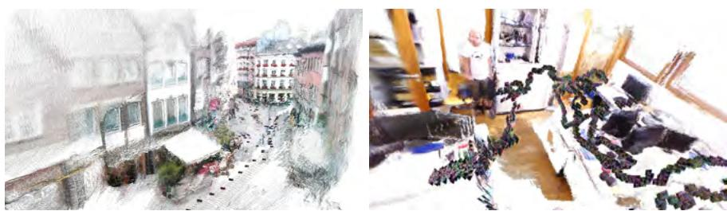  
图 13.16 MUSt3R 在 Aachen Day-Night [1284] nexus4 序列 5（离线，顶部）和 TUM-RGBD [1045] room 序列（在线，底部）上的重建定性示例。图像来自 [135]（©2025 IEEE）。

### 13.6.3 MASt3R-SLAM

最后介绍一种使 MASt3R 具备可扩展性的替代方案。MASt3R-SLAM [789] 是一个实时 SLAM 框架，将 MASt3R 的双视图三维重建先验作为跟踪、建图和重定位的统一基础，如图 13.17 所示。MASt3R-SfM 在无序图像集合的离线设置中将这些先验应用于 SfM [289]；而 SLAM 以增量方式接收数据，并必须保持实时运行，因此需要低延迟匹配、谨慎的地图维护以及高效的大规模优化方法。一方面，MASt3R-SLAM 借鉴 SLAM 系统的滤波和优化技术 [1080, 1081]，在前端对点图执行局部滤波，以支持后端的大规模全局优化。另一方面，与 MASt3R 类似，它不对每幅图像的相机模型作假设，只要求存在一个所有射线通过的唯一相机中心。由此得到一个实时稠密单目 SLAM 系统，能够使用通用的、随时间变化的相机模型重建场景。在已知标定参数时，MASt3R-SLAM 在轨迹精度和稠密几何估计方面展示了当前最先进的性能。

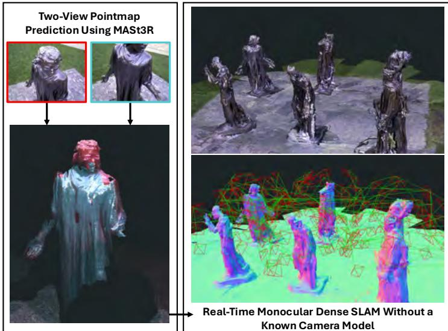  
图 13.17 Burghers 序列 [1296] 上稠密单目 SLAM 系统的重建结果。利用左侧所示的 MASt3R 双视图预测，该系统无需已知相机模型即可实时实现全局重建 [789]（©2025 IEEE）。

## 13.7 延伸阅读与近期趋势

基于深度学习的 SLAM 系统正沿多条不同路线发展。研究者一方面继续提升其精度和鲁棒性，另一方面也在努力改善这类 SLAM 系统的可扩展性。

一条研究路线继续将 DUSt3R 等前馈网络扩展到数百幅图像 [1156, 1225]。VGGT [1156] 可以在数秒量级重建数百幅图像，并直接预测相机位姿、内参、深度、点图和特征轨迹，无需三维优化和后处理。不过，VGGT 仍可利用预测的特征轨迹，通过束调整进一步细化相机位姿和内参；因此，在需要高精度预测时，因子图仍发挥关键作用。为了将 VGGT 用于更长图像序列，VGGT-SLAM [724] 构建了一个 SLAM 框架：使用 VGGT 重建局部子地图，再借助因子图将其对齐到全局坐标系。

另一条研究路线持续改进因子图与深度学习模型的组合。DROID-SLAM 要求输入时已知相机标定，并且在中等动态环境中会失败；MegaSAM [660] 和 Video Pose Engine（ViPE）[489] 则可在高度动态环境中运行，且无需已知标定。相反，它们在推理期间联合优化相机标定。这些方法利用最新的深度估计和语义分割模型，并依靠因子图融合多个模型的预测。

SLAM 和三维重建模型的一个近期趋势，是建立在预训练视觉 Transformer 之上。利用自监督学习技术训练的视觉基础模型 [1177, 831]（另见第 17 章）已被证明能为下游三维重建任务提供出色的初始化。随着预训练方法改进，这些改进也可能转化为下游三维任务的性能提升。

这些发展的最终成果，是能够无缝处理包含动态物体、纯旋转和未知相机标定等挑战的视频的系统。近期利用深度学习的方法已足够鲁棒，可以大规模重建互联网视频，例如 10 万个 YouTube 视频 [489, 931]。
