# 《SLAM Handbook：从定位与建图到空间智能》

## 第 15 章  动态与可变形 SLAM

**作者：** Lukas Schmid、Jose Maria Martinez Montiel、Shoudong Huang、Daniel Cremers、Jose Neira 和 Javier Civera

长期以来，SLAM 系统一直面临这样的环境挑战：不仅传感器在运动，场景本身也在运动。为应对这一挑战，数据关联结合 RANSAC 等离群值剔除方法，试图区分两类传感器数据：一类对应相对于传感器运动呈现一致位姿变化的实体，另一类描绘独立运动的实体。这类似于星星在天空中看似协同移动，而行星却四处游走，因而得名。1

本手册前面介绍的方法，均围绕根据传感器观测估计机器人位姿和环境表示展开。但这些方法有一个重要假设，即环境是静态的：场景保持不变，只有机器人运动。这一假设带来多项重要影响。例如，第 1 章说明，如果检测到的特征保持在原处，重新检测它们就可以直接更好地约束机器人位姿。相反，第 5 章展示了只要底层环境保持不变，就可以通过融合多个带位姿观测高效地重建稠密场景模型。

然而，真实世界场景往往高度动态，违反了“环境中的一切都刚性连接且不可移动”的静态假设。例如，设想自动驾驶车辆要在城市中安全行驶，需要在地图表示中记录哪些信息：环境不仅有静态背景，还有其他车辆、骑行者和行人等各种运动元素。再考虑家庭或服务机器人：人类经常在机器人周围移动，修改物体或重新布置房间。更极端的例子是手术机器人在人体内导航，那里没有静态背景，整个场景都在持续变形。这些因素使动态和可变形场景中的机器人状态估计与环境表示都成为困难问题。

为应对这些局限，本章分析动态和可变形 SLAM 的挑战。第 15.1 节首先定义并分类不同类型的动态效应和动态 SLAM 目标；第 15.2 节和第 15.3 节分别介绍短期和长期动态 SLAM 中的主要问题及当前解决方法；第 15.4 节讨论可变形 SLAM；最后，第 15.5 节回顾尚存挑战，并展望这一快速发展领域的未来研究方向。

1 希腊语 $\pi\lambda\alpha\nu\eta\tau\eta\varsigma$（planētēs）意为“漫游者”。

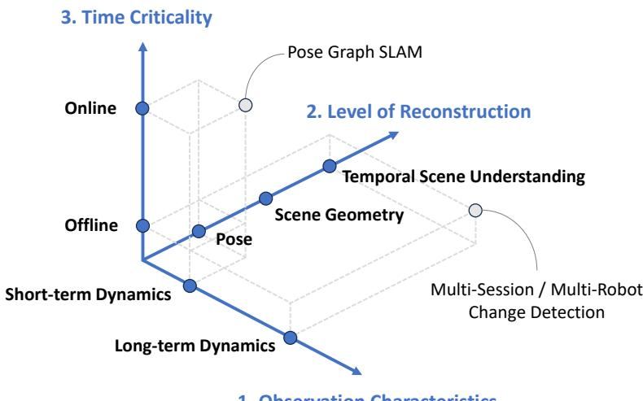  
1. 观测特性  
图 15.1 动态 SLAM 的主要考量概览：(1) 机器人观测中存在哪些动态效应；(2) 为完成任务，机器人需要以何种细节层次理解环境；(3) 机器人何时以及以多快的速度处理这些信息。例如，典型位姿图 SLAM 可以通过将动态部分作为离群值剔除，实时估计机器人位姿。另一方面，多会话变化检测旨在从不频繁的观测（会话）中详细理解场景演化。需要注意，有些解决方案可以在这些坐标轴张成的空间中清晰描述；另一些方法则覆盖一个“区域”或“体积”，同时处理短期和长期动态、联合状态估计与场景表示、在线与离线组件，以及这些维度的组合。

## 15.1 动态 SLAM 问题的刻画

建模动态环境时需要重点考虑：(1) 机器人观测中存在哪些动态效应；(2) 为完成任务，机器人需要以何种细节层次理解环境；(3) 机器人何时以及以多快的速度处理这些信息。理想情况下，通用机器人可以实时构建任何动态场景的丰富描述，但在许多情况下，只需处理与具体应用相关的问题子集就足够且更高效。图 15.1 概览了这些维度，下面分别讨论各个坐标轴。

### 15.1.1 动态特性的刻画

我们根据动态效应在机器人观测中的表现来刻画动态。遵循 [693] 的定义，将动态区分为短期动态和长期动态，分别指机器人观测中更瞬态或更突发的特征。关键思想是：从足够短的时间尺度看，几乎所有物理过程在根本上都是连续的。因此，机器人观测有多大差异、变化属于短期还是长期动态，并不取决于现象的绝对持续时间，而取决于场景变化速率与机器人观测速率之间的关系。图 15.2 展示了这种关系，并给出多个例子说明它适用于广泛时间尺度。

虽然上述定义具有一般性并适用于很大的时间尺度，但需要指出，在大多数机器人应用中，相关变化速率（人或物体通常以约 $10^{-1}$ 到 $10^2\,\mathrm{m/s}$ 的速度运动）与观测速率（大多数机器人传感器的频率约为 $10^0$ 到 $10^3\,\mathrm{Hz}$）处于同一数量级。在这种情况下，区分往往简化为机器人当前是否正在观测运动。于是，短期动态指机器人视野内发生的所有运动；对动态实体的连续观测会表现为瞬态变化。例如，连续观测到的滚动球的平滑轨迹，或人在相机前行走时的协调运动。第 15.2 节将讨论应对短期动态的技术。

另一方面，长期动态指发生在机器人视野之外的动态。虽然运动在局部仍是连续的，但机器人只能观测测量间隔内累积的运动结果，因此通常表现得更突发。例如，一个人拿起瓶子，再将它放回初始位置旁边。如果机器人只在交互前后观察桌面上的瓶子，从机器人角度看，瓶子似乎在两次观测之间瞬移。多会话或多机器人建图是更极端的例子：单次访问期间场景可能静态，但机器人不在场时的多次访问之间会累积变化。

因此，这一观点的重要含义是：短期与长期动态的区别取决于机器人的观测，而非环境或运动物体的固有属性，如图 15.3 所示。不过，长期动态发生的概率通常与观测之间的时间间隔相关。第 15.3 节将概述长期动态方法。

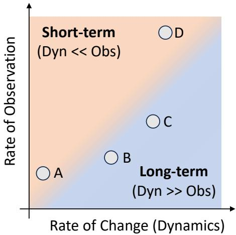  
图 15.2 短期与长期动态的定义：机器人表现出的动态特征由场景变化速率与机器人观测速率的关系决定，而非由绝对时间跨度决定。注意，在多数机器人领域，传感速率足以捕获视野内的连续运动，因此可简化为：机器人视野内运动的物体（短期动态）与在机器人视野外发生变化的物体（长期动态）。示例：A）每天测量植物生长。虽然观测频率很低，植物也只生长很少，因此跟踪植物的方法类似于跟踪人 [175]。B）每天巡逻建筑。观测频率相当，但场景部分区域可能已完全变化，适合采用多会话变化检测等长期方法 [565]。C）机器人背后物体的重新布置。机器人可能只离开一分钟，但两次观测间物体配置可能已显著改变 [976]。D）Hawk-Eye 系统以 340 Hz 观测网球，可跟踪速度高达 250 km/h 的网球，得到短期动态观测和毫米级跟踪精度 [675]。

最后，上述情况通常假设场景有静态背景及多个动态实体。但在内窥手术和医疗机器人等相关应用中，场景可能完全变形并在机器人周围运动，通常属于上文所述的短期动态。没有任何静态场景部分的设置通常称为可变形 SLAM，第 15.4 节将讨论这一问题。

#### 15.1.1.1 更多术语

需要指出，在相关研究社群中，还使用许多术语描述与上述概念相关的内容。除短期动态外，常用术语包括 dynamic 和 high-dynamic，通常指当前正在运动的物体（可能位于机器人视野内）。

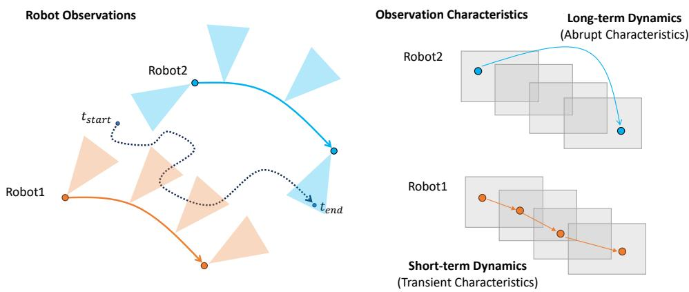  
图 15.3 机器人作为观测者的作用。同一物体的物理运动（虚线）对于 Robot1 可以表现为短期动态，对于 Robot2 则表现为长期动态。类似地，多会话或多机器人建图可能包含物体在观测时运动（短期动态），也可能包含物体在机器人视野外、通常是在会话或访问之间发生变化（长期动态）。

另一方面，描述长期动态效应时，会使用 semistatic、quasi-static 或 low-dynamic 等术语。这些术语通常指可能移动但在被观测时静止的物体，或多次访问之间发生的变化，后者是长期动态的特殊情形。

除处理三维 SLAM 中的动态效应外，有些方法还旨在重建场景的历史、演化或更高层理解。这通常称为时空场景模型，或四维场景模型（即三维空间加时间）。2

2 注：这不同于雷达 SLAM（第 9 章）中使用的 4D 或 3+1D，其中第四维指雷达测量的速度。

此外，lifelong、persistent 和 continuous 等术语有时用于描述能够应对变化环境的 SLAM、建图或定位系统，这些系统往往在很长时间跨度内运行。最后需要注意，不仅几何动态会影响传感器读数，纹理、光照和昼夜或季节变化等其他变化也会影响传感器读数，尤其是在使用视觉传感器时 [1169, 1008]。

#### 15.1.1.2 动态程度

上述刻画似乎将问题明确分为三种情况：静态背景、短期动态和长期动态。但在实践中，边界往往模糊，不同效应可能组合出现，且每种效应具有不同强度。例如，场景可能包含单个刚性运动物体（如汽车或箱子 [691]）、单个运动且变形的物体（如人 [449]）、只有长期变化（如建筑的定期巡逻 [321]）、同时运动和变化的多个实体（如家庭中的机器人和人 [976]），甚至完全没有静态实体（如内窥手术 [893]）。理想情况下，通用机器人能够联合估计所有这些效应，但考虑的效应越多，问题复杂度呈指数增长。因此，预先知道可能出现或与任务相关的动态效应，可以针对具体场景设计更专业、性能更好且更易处理的解决方案。

### 15.1.2 状态估计与场景表示

第 5 章介绍过，SLAM 是同时估计机器人位姿和环境表示的双重过程。动态环境中的 SLAM 也适用同样的考量。如果应用只需估计机器人状态，通常可以将动态观测视为离群值或噪声。此时，类似静态场景中的 SLAM，可以忽略或拒绝对应特征或测量，并相对于静态背景跟踪或定位，从而获得准确结果。第 15.2.1 节和第 15.3.1 节将分别讨论短期和长期动态下的相关问题。可变形 SLAM 是一种特殊情况，因为不存在可用于定位的静态部分，第 15.4 节将讨论这一设置。

相反，如果需要稠密地图，重建运动和变化的场景就要求机器人检测并表示场景中的部分或全部运动与变化。第 15.2.3 节讨论短期动态表示和技术，第 15.3.2 节讨论长期动态，第 15.3.3 节介绍首批统一动态 SLAM 方法。此外，第 15.3.4 节还将简要介绍用于更高层理解动态和变化场景的方法。

### 15.1.3 在线与离线方法

我们考虑的最后一个坐标轴是感知系统的时间紧迫性，即必须实时处理动态，还是可以离线处理数据。由于大多数机器人应用要求机器人立即与环境交互，尤其是在动态场景中，本章主要关注实时方法。但在建筑定期监测等应用中，也可以先采集传感器数据再离线处理。类似于（离线）运动恢复结构与（在线）SLAM 的区别，离线处理可以利用更多计算资源，以更高分辨率处理数据，通常能得到更准确结果。在线和离线方法的另一个重要区别是，离线方法已经拥有全部数据。具体而言，要检测时刻 $t$ 的帧 $F_t$ 中的运动或变化物体，未来测量 $F_{t+1,\ldots,T}$ 都已可用，它们能提供在线方法无法获得的重要信息。本章主要关注在线方法，同时在第 15.3.2 节简要介绍地图清理和变化检测等离线问题，在第 15.4.1 节介绍非刚性运动恢复结构（NRSfM）。

最后，虽然本手册第二部分按感知模态组织，但动态场景对 SLAM 的影响在多种感知模态之间往往相似。因此，本章按不同动态特性组织。不过，各节仍会讨论不同感知模态的考量；迄今为止，视觉、LiDAR 和本体传感器在动态与可变形 SLAM 中的应用最为显著。

## 15.2 短期动态与动态 SLAM

下面各节进一步讨论单个短期动态物体对 SLAM 的影响。早期方法使用数据关联识别可由传感器运动解释的测量，并将它们与对应物体独立改变位姿的测量区分开。初始技术包括统计检验 [797]、RANSAC [222] 和 Hough 变换 [1073] 等经典算法。这些方法可以简单地将动态物体的测量丢弃为离群值。之后，研究者不再满足于忽略动态物体，还尝试重建被其遮挡的环境区域，例如插值缺失数据 [1071]、从未发生遮挡的替代传感器位姿恢复数据 [75]，或使用机器学习进行图像“修复” [77]。这样得到的地图对定位更加有用，因为渲染地图中不再存在“孔洞”。第 15.2.1 节将讨论把动态物体视为离群值的处理。

相关研究还探索了另一种方案：在 SLAM 框架中跟踪动态物体。在计算机视觉中，这一问题称为多体运动恢复结构，是经典 SfM 的扩展。其数学基础和实用算法与 SLAM 视角有许多共同之处 [835]。由于计算成本高昂，该方案最初被认为不可行 [1149]；近年来已成为可能 [76]，并且为了避免机器人与动态物体碰撞，可能必须采用该方案。第 15.2.2 节将讨论动态物体跟踪。

为更详细地理解动态场景，还可以进一步以稠密方式重建场景，包括动态物体。获得详细的运动物体模型有助于操作等应用，因为机器人需要理解物体形状和运动才能与之交互。第 15.2.3 节将讨论稠密动态 SLAM。

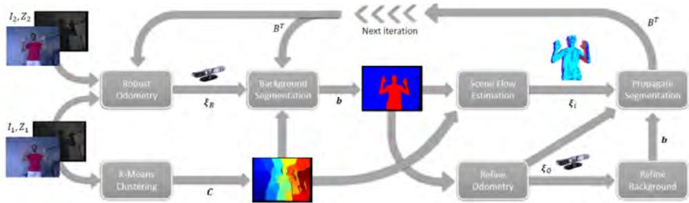  
图 15.4 文献 [509] 介绍了一种从 RGB-D 视频序列联合估计相机运动和运动物体三维场景流的方法。首先使用鲁棒里程计，根据各聚类的残差将聚类后的帧划分为动态区域和静态（背景）区域；随后利用该分割结果进一步细化里程计。（©2017 IEEE）

### 15.2.1 动态物体移除

在部分动态场景中，最简单但仍有效的 SLAM 方法之一，是丢弃场景动态部分的传感器测量，并从地图状态中移除这些部分。其依据有两点。第一，持久物体和地标通常是建图的主要关注对象，而动态实体很多时候兴趣有限（例如经过的行人）。第二，大多数几何估计技术假设场景刚性，因此可以将动态部分检测为刚性模型中的伪测量。围绕这一目标，研究者提出了大量方法。下面总结主要方法族。需要注意，现代动态 SLAM 往往组合使用这些原则，以取得最佳性能。

**本体传感。** 本体传感的一个关键属性是，顾名思义，它不依赖机器人外部的观测。因此也不会受到场景运动等外部效应影响。惯性和内部里程计测量携带机器人状态信息，有助于根据相对测量区分机器人自身运动和场景动态部分的运动 [1024]。关于如何融合惯性或运动学测量与外感知测量，详见第 11 章和第 12 章。

**鲁棒估计。** 大多数场景和传感器提供的测量数量远多于几何估计的最小需求。在动态内容占比较低时，可以利用冗余，将动态物体的测量识别为刚性几何模型的离群值。

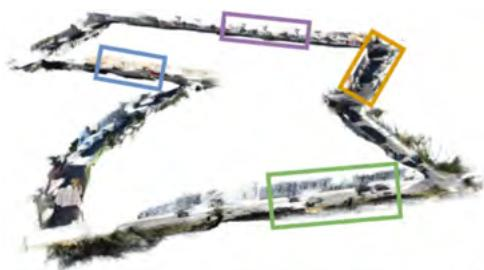

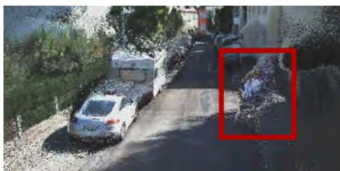  
无掩膜模块

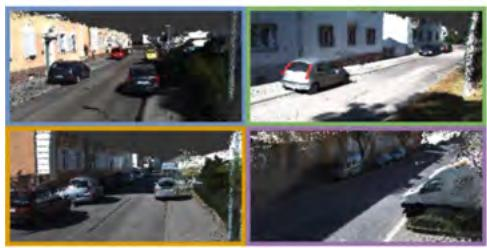

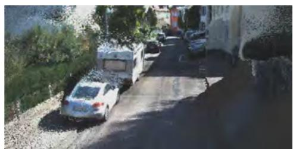  
带掩膜模块  
图 15.5 MonoRec [1187] 训练深度网络，从单个运动相机恢复稠密重建。掩膜模块利用亮度一致性代价体积，识别与主导自运动不相容的结构（连续帧之间的颜色），并过滤运动物体。（©2021 IEEE）

主要使用两种方法。第一，通常使用 RANSAC [328] 初始化状态估计：从完整测量集合中选择具有最大一致性的最小样本集。但在遮挡严重的情况下，最大一致性集可能来自运动物体，导致失败。第二，在初始化之后和迭代优化期间，使用鲁棒损失函数替代典型的 $\ell_2$ 范数。对于被视为离群值的大残差，鲁棒损失的增长低于二次增长，因此可以降低其对状态的影响。关于 RANSAC 和鲁棒损失的详细信息，参见第 3 章。

**多视图运动线索。** 除了在初始化阶段丢弃动态内容，并通过鲁棒损失降低甚至消除其影响外，另一种常见方法是在测量提供足够非刚性证据后移除动态状态。证据通常实现为高残差测量累积数量的阈值。图 15.4 展示了一个例子：将 RGB-D 图像聚类为多个区域，再根据区域残差将每个区域分类为动态或静态（背景）。

**语义信息。** 语义分割深度网络可以预先分割可能对应动态物体的图像区域。这当然有帮助，但封闭集词汇可能无法分割图像中的所有物体。此外，物体具有潜在动态性并不意味着它此刻正在运动，例如停放的汽车。因此，将潜在动态物体的语义分割与多视图几何检查结合起来可能更合适 [44]。例如，MonoRec [1187] 提出使用深度网络从单个运动相机进行稠密重建，将亮度代价体积（由一组连续重映射帧计算）与掩膜模块结合，过滤运动物体。这些物体既根据训练数据确定，也根据重映射帧之间的颜色不一致确定，如图 15.5 所示。

**领域知识。** 如果可用，可以集成额外先验和领域知识，以区分静态场景特征和动态离群值。自动驾驶车辆的无侧滑约束就是常见例子。由于知道汽车不能横向移动，因此可以将所有暗示侧向运动的特征作为动态离群值移除。

**运动感知传感器。** 视觉和 LiDAR 传感器通常只在给定时刻采集场景，因此不能直接测量动态物体的运动。事件相机等其他传感器能够以高时间分辨率提供连续测量；此外，雷达和某些 LiDAR 利用多普勒效应直接测量每个观测点的速度。虽然使用这些传感器的动态 SLAM 仍在积极研究，但此类信息可以成为识别动态物体及其运动的重要线索。事件相机和雷达的更多细节参见第 10 章和第 9 章。

### 15.2.2 动态物体跟踪

如果目标只是估计机器人状态，上一节介绍的动态物体移除可能很方便。但在许多其他情况下，例如为了避免碰撞导航，可能需要跟踪这些动态实体的三维运动。该问题与多目标跟踪（MOT）或多实例动态 SLAM（MID）高度相关，有时也使用这些名称。计算机视觉和机器人领域对二维、三维物体跟踪投入了大量研究 [1246]，相关文献非常庞大，本章无法穷尽；这里聚焦与 SLAM 最相关的部分技术。

同步定位、建图和动态物体跟踪的联合问题可以如下表述。核心思想是将场景中的每个动态物体建模为刚性运动体。第 7 章介绍的静态 SLAM 因子图表示可以扩展到单独运动的物体，如图 15.6 所示。与之前一样，大多数方法采用跟踪与建图并行的方案。对于每个输入帧，跟踪线程提取显著特征（例如 ORB [953]）；为将点分配给单个物体，通常还会提取语义分割掩膜。

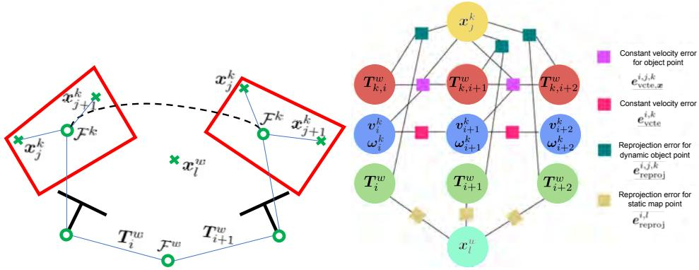  
图 15.6 带动态物体跟踪的 SLAM 概览 [76]（©2021 IEEE）。左：刚体运动假设。相机位姿 $\pmb T_i^w$ 相对于静态背景估计；动态物体 $k$ 相对于世界坐标系 ${\mathcal F}^w$ 建模为刚体。注意，每个物体 $k$ 上的所有特征点 $\boldsymbol x_j^k$ 都遵循其刚体运动 $\Delta T_{k,i+1}^{k,i}$。右：问题对应的因子图表示。相机位姿通过里程计因子连接，动态物体位姿通过恒速度因子连接。

令 $T_i^w\in\mathrm{SE}(3)$ 表示时刻 $t_i$ 相机在世界参考坐标系 ${\mathcal F}^w$ 中位姿的刚体变换，$\pmb x_l^w\in\mathbb R^3$ 表示以世界坐标系表达的刚性地图点 $l$ 的坐标。每个动态物体 $k$ 在时刻 $t_i$ 由六自由度变换 $\pmb T_{k,i}^w\in\mathrm{SE}(3)$ 表示，该变换将时刻 $t_i$ 运动物体坐标系 ${\mathcal F}^k$ 中的点变换到世界坐标系；同时还用物体坐标系中的线速度和角速度 $\pmb v_i^k,\pmb\omega_i^k\in\mathbb R^3$ 表示其运动。动态物体 $k$ 上的地图点 $j$ 在局部物体坐标系中表示为 $\pmb x_j^k\in\mathbb R^3$。对于刚体运动学，局部坐标系 ${\mathcal F}^k$ 中物体点的坐标不随时间变化，因此不依赖 $i$。于是，对应 $\pmb x_j^k$ 的重投影误差变为

$$
\boldsymbol {e} _ {\text { reproj }} ^ {i, j, k} = \boldsymbol {z} _ {j} ^ {i} - \pi \left((\boldsymbol {T} _ {i} ^ {w}) ^ {- 1} \boldsymbol {T} _ {k, i} ^ {w} \tilde {\boldsymbol {x} } _ {j} ^ {k}\right),\tag{15.1}
$$

其中 $\tilde{\pmb x}_j^k\in\mathbb R^4$ 是每个物体点 $\pmb x_j^k$ 的齐次坐标，$\pmb z_j^i$ 是与 $\pmb x_j^k$ 对应的图像点，$\pi(\cdot)$ 表示投影函数，此处将其重载为作用于齐次坐标点的函数。

为了进一步约束每个动态物体 $k$ 随时间的运动，通常在动态物体连续观测之间假设线速度和角速度恒定。需要最小化的相应残差为

$$
\boldsymbol {e} _ {\mathrm{vcte}} ^ {i, k} = \left[ \begin{array}{c} \boldsymbol {v} _ {i + 1} ^ {k} - \boldsymbol {v} _ {i} ^ {k} \\ \boldsymbol {\omega} _ {i + 1} ^ {k} - \boldsymbol {\omega} _ {i} ^ {k} \end{array} \right].\tag{15.2}
$$

为耦合物体速度和位姿，还需加入误差项 $e_{\mathrm{vcte},x}^{i,j,k}$，最小化运动模型计算的 ${\mathcal F}^w$ 中物体点 $j$ 位置与根据位姿估计得到的同一位置之间的不匹配：

$$
\pmb {e} _ {\mathrm{vcte}, \pmb {x}} ^ {i, j, k} = h ^ {- 1 } \left(\left(\pmb {T} _ {k, i + 1} ^ {w} - \pmb {T} _ {k, i} ^ {w} \Delta \pmb {T} _ {k, i + 1} ^ {k, i}\right) \tilde {\pmb {x}} _ {j} ^ {k}\right),\tag{15.3}
$$

其中使用 $h^{-1}:(x,y,z,\lambda)\to(x/\lambda,y/\lambda,z/\lambda)$ 将齐次坐标变换为欧氏坐标。根据恒速度模型，时刻 $t_i$ 到 $t_{i+1}$ 的位姿增量计算为

$$
\Delta \boldsymbol {T} _ {k, i + 1} ^ {k, i} = \left[ \begin{array}{c c} \operatorname{Exp} \left(\boldsymbol {\omega} _ {i} ^ {k} \left(t _ {i + 1} - t _ {i}\right)\right) & \boldsymbol {v} _ {i} ^ {k} \left(t _ {i + 1} - t _ {i}\right) \\ \boldsymbol {0} & 1 \end{array} \right].\tag{15.4}
$$

图 15.6（左）展示了这些建模假设，（右）展示了待优化的因子图。

这一通用表述已在多项工作中取得显著成功。例如，早期的 Multimotion Visual Odometry（MVO）[527] 检测轨迹片段，并将其分割为满足每个聚类刚体运动约束的簇。Visual Dynamic Object-aware SLAM（VDO-SLAM）[1270]、Dynamic SLAM [448] 和 DynaSLAM II [76] 引入基于因子图的方法，并在观测之间加入运动一致性因子。AirDOS [897] 又将其推广到由多个相连刚体组成的关节物体，例如人体骨架。

### 15.2.3 稠密动态 SLAM

与第 5 章讨论的静态稠密 SLAM 类似，稠密动态 SLAM 还要估计包含动态实体的场景稠密重建。为此，大多数方法将过程分为定位和建图两步。

定位步骤旨在相对于静态背景跟踪机器人位姿，可以使用动态物体移除（第 15.2.1 节）和 MOT（第 15.2.2 节）中介绍的任意稀疏动态 SLAM 方法。也可以先从输入中移除动态点，再对背景执行稠密跟踪。

建图步骤旨在同时表示静态背景和动态实体。表示的选择是关键设计决策，因为它决定了连续更新表示时需要估计哪些量。背景重建自然与静态稠密建图相同，但也可以使用相同或相似的表示建模动态实体。背景和动态实体不必采用相同表示，但为便于解释和处理机器人地图，实践中通常如此。本节讨论几类常见方法：第 15.2.3.1 节从运动物体分割（MOS）和传感器级表示开始，第 15.2.3.2 节讨论目标物体或类别已知时的参数化表示，第 15.2.3.3 节讨论任意运动物体的重建。

#### 15.2.3.1 运动物体分割

处理稠密动态 SLAM 的最小方案，是检测输入数据中的所有动态部分，例如所有点或像素。这一问题通常称为运动物体分割（MOS）。与动态物体移除（第 15.2.1 节）类似，检测到这些点后，可以忽略它们以避免静态背景重建中的不一致和伪影；也可以将其作为场景中动态实体的低层表示保存。检测动态或不一致点时，可以采用前文类似的思想。但关键区别是，稠密 SLAM 还需要稠密的动态点检测，即必须对传感器数据中的每个点进行分类，而非只分类选定特征，如图 15.7 所示。因此，大多数方法依赖几何一致性和/或语义信息作为稠密分割的主要运动线索。前一种方法在相机到模型跟踪期间稠密计算配准残差，将输入图像中高残差区域分类为动态 [984]；或者利用单次测量之间 [1254]、或融合到地图中的测量之间 [975] 的一致性，识别不一致、因而动态的点。通常还会加入聚类步骤，以处理传感数据中的噪声 [984, 1254, 975]。后一种方法通过稠密语义分割判断输入数据哪些部分反映可能动态的类别或实例（如人），并将其屏蔽 [941]。相机图像和 LiDAR 点云的语义分割已得到广泛研究，可直接重新用于屏蔽动态类别；而利用深度学习方法直接在单次或连续测量上分类动态像素或点，也已成为不断增长的研究领域 [871, 758, 664]。基于学习的方法能够纳入典型运动物体的形状、运动模式和传感器特性等先验，可提升目标域性能，但未必能泛化到域外环境。

#### 15.2.3.2 参数化模型

对某些应用而言，丢弃动态测量并重建静态背景可能已经足够；但对于操作或人机交互等应用，机器人可能还需要估计场景中动态实体的详细表示。在这些情况下，第 15.2.3.1 节的基于检测的跟踪方法表达能力有限，因为它们只在每一帧动态区域的噪声、局部测量层面运行。

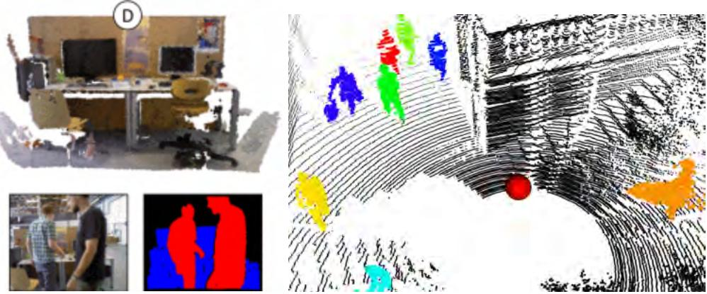  
图 15.7 稠密运动物体分割（MOS）。（左）StaticFusion [984] 根据跟踪残差，将每帧 RGB-D 图像（下）分割为动态（红色）和静态（蓝色）部分，并重建静态背景（上）。（右）Dynablox [975] 利用体积地图一致性，将 LiDAR 扫描稠密分割为动态（彩色）和静态（黑色）点。（[984] ©2018 IEEE，[975] ©2023 IEEE）

如果已知感兴趣物体的类型，其形状通常可以用参数化模型表示。给定这种结构，每个测量都可以视为真实底层参数的观测，并用于优化这些参数。类似 MOT（第 15.2.2 节），可以将这些参数作为变量加入因子图，与模型特定的观测因子、传感器运动和背景一起估计。这一方法尤其受到人体运动捕获和跟踪领域关注：人体可以表示为骨架模型 [897] 或稠密 SMPL [694] 网格 [943, 449, 450] 等。

#### 15.2.3.3 同时跟踪与重建

另一条路线是同时跟踪与重建，旨在重建任意运动物体。多数情况下，可以简化假设每个运动物体都是刚体，目标则是跟踪和重建一个或多个刚性运动物体。核心思想是为每个物体及背景分别建立稠密表示。大多数方法遵循四个主要步骤 [962, 958, 1206, 927]：第一，在输入图像中进行物体检测，通常将语义或实例分割与几何细化和/或几何运动线索结合；第二，相对于背景跟踪相机运动；第三，相对于当前图像跟踪每个运动物体。第二、三步可以采用多种技术，通常使用最小化每个物体投影深度残差和光度残差的直接法，因为这类跟踪方法可以直接作用于物体或背景的稠密表示。最后，将各物体和背景的测量分别融合到对应模型中，增量估计每个物体的稠密重建。最常见的是将物体表示为截断有符号距离函数（TSDF）体积（TSDF 详情见第 5.2.2 节），因为它能够融合带传感噪声的测量 [962, 958, 1206, 927]。图 15.8 给出一个例子。另一种方案 DirectTracker [386] 使用更稀疏的基于点云的重建，联合估计物体分组及各物体的刚体运动。

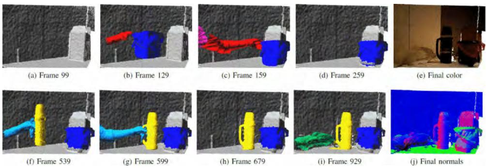  
图 15.8 Co-Fusion [962] 的同时跟踪与重建。三个物体依次放置在桌上：小箱子（蓝色标签）、烧瓶（黄色）和泰迪熊（绿色）。结果表明，所有物体都被成功分割、跟踪和建模。（©2017 IEEE）

同时跟踪与重建的主要优点是通用性更强，因为不需要预先给定物体模型。但所需步骤较多，计算成本可能很高，特别是在大场景和动态物体数量较多的情况下。另一个局限是，物体跟踪误差可能导致错位测量被融合到物体表示中，降低重建质量，并进一步妨碍未来的准确跟踪；例如，基于关键点的跟踪方法 BundleTrack [1179] 可以更加鲁棒。

通过估计连接到完整物体的每个刚性部分的变换，可以将刚性物体假设放宽到关节物体 [977]，也可以推广到一般可变形物体。后者包括 DynamicFusion [802] 和 KillingFusion [1016]，第 15.4 节将进一步介绍。图 15.9 所示的 AnyCam [1189] 是一种基于学习的方法，它使用基于 Transformer 的神经网络，从普通单目视频联合估计相机运动以及动态场景中非刚性运动物体的四维重建。

最后，额外重建的物体也可用于改善机器人自运动跟踪。不过，只有在一些特殊情况下，重建物体才会明显改善机器人状态估计，例如机器人视野的大部分被遮挡（超过 70%），且有良好的运动物体模型 [691]，导致相对于背景跟踪不足。

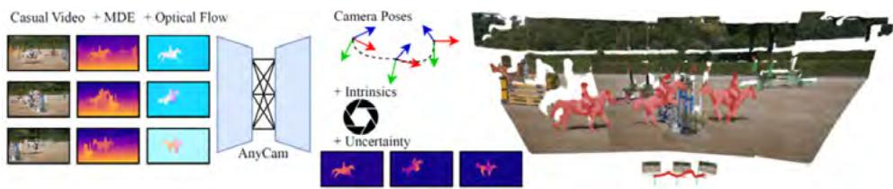  
图 15.9 AnyCam [1189] 是一种基于 Transformer 的神经网络，从普通输入视频联合估计相机运动和四维非刚性重建。（©2025 IEEE）

## 15.3 长期动态与终身 SLAM

上一节讨论了处理短期动态观测的考量。本节讨论长期动态对 SLAM 的挑战和影响。

总体而言，长期动态 SLAM 存在若干显著挑战。第一，与短期动态相比，观测到的变化更加突发，原则上可以任意增大（机器人越长时间没有观察某个空间，该空间与上次观测的差异就越大）。这使数据关联显著更加困难。例如，短期运动按定义在观测之间很小，可以通过跟踪处理数据关联；而长期动态下的数据关联可能需要求解潜在的全局重新识别和匹配问题。此外，感知混叠问题会加剧：一个独特地标（或同一物体上的多个特征点）可能因移动而在多个位置被观测到。

第二，由于变化幅度更大，许多在短期情况下可忽略的效应在长期情况下变得重要。这包括从运动引起的几何变化（例如物体被加入、移动或移出场景 [974]）到结构变化（例如建筑工地每次访问时都可能完全不同 [1057]），以及从光照变化（不同天气、时间或季节 [1169]）到表面纹理或反射率变化等外观变化。

最后，长期动态观测通常伴随着更长的时间间隔和更远的机器人运动，因此观测之间可能出现较大的视点变化以及传感器退化或更换。

为应对这些挑战，第 15.3.1 节先简要考虑其对状态估计的影响，第 15.3.2 节介绍持久场景表示的离线方法；第 15.3.3 节讨论在线 SLAM 的扩展以及统一短期、长期动态 SLAM；第 15.3.4 节介绍时间场景理解模型，其目标超越空间变化捕获，重建时间模式。

### 15.3.1 用于定位的终身 SLAM

终身 SLAM 系统的核心能力，是尽管存在上述挑战，仍能准确定位机器人。这一问题在概念上与地点识别或回环检测非常相似，后者要解决的是在存在变化时判断两个视图是否来自同一地点。本节将这些思想扩展到连续的长期定位。虽然已有多种方法，这里只总结其中少数最相关的方法。

#### 15.3.1.1 并行地图与摘要地图

第一类方法类似第 15.2.1 节的动态物体移除，利用这样一个事实：通常可以从匹配到的内点子集估计机器人位姿。但与将点作为离群值移除不同，这里当特征外观变化到无法与先前观测匹配时，会继续向地图添加额外特征点。通常将对场景的一次访问称为一次经历或会话；在每次经历内部，变化足够小，可以跟踪机器人位姿 [219, 852]。如果当前经历能够相对于之前经历定位，说明地图具有足够表达能力，无需添加更多数据；如果定位较弱或失败，则将新数据加入地图。这样只有在需要时才添加新点，地图复杂度也因此反映场景外观的变化 [219]。

通过加入跨经历约束，还可以进一步改善相对于单一参考帧的定位性能。例如，经历 $\mathcal E_A$ 可能无法充分相对于 $\mathcal E_C$ 定位，但若二者都能定位到中间经历 $\mathcal E_B$，则约束 $\mathcal E_C\to\mathcal E_B\to\mathcal E_A$ 可以提高地图一致性和定位精度 [296, 780, 852]。为解决经历过多导致地图过大，以及移动物体产生的误导性特征仍留在地图中的问题，有时会离线优化并摘要化地图：在所有经历之间执行完整 BA，只保留最可能有助于未来定位的特征 [780, 296]。

#### 15.3.1.2 外观不变表示

近期工作不再针对每种外观分别建图，而是关注特征检测、描述和匹配算法，使同一特征能够在变化的外观之间匹配。这主要得益于深度学习进步：(i) 可以在覆盖多种条件的大规模数据集上训练这些方法；(ii) 可以考虑更多上下文，例如整个图像，而不是经典方法的像素邻域 [971, 35, 267]。

值得特别强调的一类外观不变特征是语义信息。例如，如果能在不同视觉环境下识别某个物体是椅子，那么“它是椅子”这一事实不会随时间变化。因此，特定物体及其配置可以用于在巨大视觉变化（例如空中视点和地面视点）之间定位 [369]。

提取出这类外观不变特征和描述子后，可以将其作为地标集成到 SLAM 流水线，以支持地图优化和长期定位。虽然基于深度学习的方法性能出色，但通常需要 GPU，而并非所有机器人都配备 GPU；其计算成本也可能高于经典特征。最后，尽管这可以解决部分外观相关挑战，物体移动或变化造成的离群匹配仍然需要识别和剔除。

#### 15.3.1.3 内存、扩展与边缘化

对于长时间甚至无限期运行的机器人，一个根本问题是机器人不断采集信息并加入地图，最终导致计算机内存和处理时间受限。

**遗忘。** 部分缓解方法是引入遗忘机制。通常为地图点设置随时间衰减的权重或持久概率，使长时间未观测的点较不可能在当前定位中作为离群值造成破坏，并最终从地图中剪枝 [936, 262]。另一种方案是运行地图摘要 [296, 780]（通常作为离线过程），仅保留最可能支持未来定位的特征。这种方法的优点是提供重要性排序，可以在内存预算约束下只保留前 $N$ 个点。机器人因而可以尽量在内存中保存信息，只有内存不足时才开始遗忘。

**内存管理。** 不进行遗忘的另一种选择，是动态地将地图特征从机器人内存中保存和加载。RTAB-Map [616] 就采用了这种方法：节点可以在短期内存、工作内存和长期内存之间移动，确保当前处理的节点数量足够少以满足实时计算。这避免了完全删除节点的需要，但会增加内存管理的计算开销，并且最终可能耗尽容量。

**边缘化。** 除地图点数量外，基于位姿图的 SLAM 方法还要优化机器人位姿历史，其规模通常随经过时间线性增长。为避免节点和因子无限增长，边缘化过程旨在删除旧节点而不丢失信息。核心思想是用一个节点替换一组节点（或更一般的信息），该节点的属性反映或概括被替换节点中存储的信息。在概率模型中，这相当于被移除节点的边缘分布（更多细节见 [255] 第 5.3 节）。这可以有效压缩图并减小问题规模，而不必完全丢弃节点。然而，实践中边缘化节点时仍会损失部分信息，最重要的是，边缘化节点的拓扑不能再改变。例如，如果某些因子（尤其是观测或回环检测）究竟是内点还是噪声存在不确定性，边缘化会将当前归类冻结到单个节点中；即使未来测量与之矛盾或能够消除歧义，也无法撤销。总之，边缘化过去测量可以在保留信息的同时有效减小问题规模，但会通过“固化”难以事后纠正的错误，降低优化灵活性。因此，何时执行边缘化仍是重要开放问题。

### 15.3.2 地图清理与变化检测

即使最终会遗忘点或物体，第 15.3.1 节介绍的基于检测方法仍往往会累积过时测量，例如已移动物体的旧观测。具体而言，检测器触发时，只能证明某个物体或特征存在，可以将其加入地图；但反过来并不成立。这体现为“无证据不等于证据表明不存在”的问题。设机器人访问房间，在角落观察到一把椅子（正检测）。之后机器人再次访问却未观察到椅子，这可能是因为机器人没有看向同一角落，椅子仍然存在（无证据）；也可能是机器人确实观察了角落并确定椅子消失（不存在的证据，或负检测）。另外，由于检测器并不完美，机器人即使看向角落也可能因光照变化等原因未识别椅子，此时判断椅子已不存在同样错误。

建立这种负观测或变化，正是变化检测的目标。历史上，该问题主要在离线或后处理设置中解决，因为目标通常是机器人采集数据后保留静态地图。本节将详细介绍这一设置，并在第 15.3.3 节讨论在线 SLAM 的近期扩展。

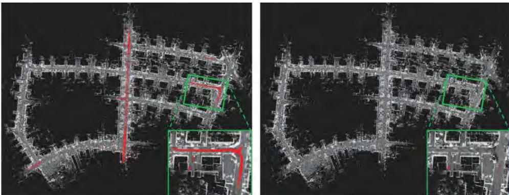  
图 15.10 ERASOR [662] 的地图清理示例。动态物体测量产生的路径伪影（红色）大多被检测并从静态地图中移除。（©2021 IEEE）

#### 15.3.2.1 地图清理

地图清理的目标是从地图中移除动态和伪测量，只保留场景高质量、静态且持久的特征。最常见的用途是在一次建图会话中滤除短期动态物体产生的伪点和观测 [564, 662]；同样技术也适用于长期和多会话建图 [882]。

从概念上看，其底层检测机制和原则与第 15.2.3.1 节讨论的稠密动态点检测非常相似。但离线处理可以利用更多资源。第一步通过鲁棒 BA 估计全局一致的机器人位姿，将动态点和伪点忽略为离群值 [564, 662]。固定传感器位姿后，重新检查所有测量以确保一致性并移除伪数据。与第 15.2.3.1 节类似，主要方法包括将所有测量融合到场景体积地图中（通常通过向占据或 TSDF 体素栅格执行光线投射），在每个地图单元检查测量一致性 [973]。虽然该方法考虑全部数据，但可能消耗大量内存并需要很长处理时间。为避免这些问题，基于可见性的方法不构建全局融合地图，而是选择附近测量的子集，计算其中点的一致性，通常直接在传感数据上完成 [564, 662, 882]。

离线处理的显著优点是所有测量都可用于地图清理，还可以执行地面平面分割 [662]、逐步加入高置信度检测的迭代算法 [564] 等额外步骤。图 15.10 给出了一个例子。

#### 15.3.2.2 变化检测

历史上，变化检测一词在多个研究社群中使用。最突出的是，二维或基于图像的变化检测在计算机视觉中得到广泛研究，目标是识别同一场景甚至同一视点的两幅图像之间的差异，应用包括背景减除、监控和医学成像等 [900]。此外，基于卫星数据的图像变化检测也是遥感领域的活跃方向 [39]。

在机器人学中，检测图像之间的变化同样很有用。但在建图语境下，目标是根据全部观测估计场景底层三维结构，因此可以直接在子地图或会话层面于三维空间执行变化检测。当测量最终被边缘化或融合到地图中、可能不再可用时，这尤其有用。虽然随着高质量新视图合成发展，机器人图像变化检测重新受到关注 [706]，本节主要讨论三维和基于地图的变化检测方法。

需要注意，地图清理和变化检测的区别可能模糊，因为二者处理相关问题。最典型的情况是多会话建图：机器人早上扫描房间，晚上再次扫描；每次会话都能重建内部一致（可能已清理）的地图，目标是在场景层面识别和记录两次访问之间的变化。为此，通常需要详细场景表示并使用稠密重建方法。此外，有意义的变化表示往往需要对象级推理，把对象视为一致变化的单元。本节重点关注物体（例如杯子或椅子）被加入、移除或移动的情况；但原则上也可以包含其他几何或非几何变化，例如坐垫变形、墙面重新粉刷或按钮被打开/关闭。

**几何变化检测。** 和本章前文一样，可以使用多种线索对比测量，并将其用于变化检测 [565]。但要直接对比地图，占据图或 TSDF 图等体积表示已被证明最有用 [321, 951]。主要原因是，相比单纯的稠密表面表示，它们显式区分未观测空间和已观测为空闲空间，这对于消除“无证据”歧义至关重要。变化检测时，可以通过体积差分、地图差分或场景差分比较两个体积地图：原先观测为空闲的表面若重新出现，说明出现了新表面；原先存在、现在观测为空闲的表面则说明消失。最后，可以加入只在一个会话中观测到的区域以补全地图，并融合两次观测到的表面以提高重建精度。

为创建一致地图并避免误报，首先需要将所有子地图或会话准确配准到公共参考坐标系。由于每个会话内部可能存在里程计漂移或状态估计不准，仅刚性对齐各会话通常不够；最佳结果通常通过会话间约束和 BA 联合优化会话对齐获得 [321, 951, 565]。

**语义信息。** 变化检测经常纳入语义信息，原因有多项。第一，物体语义标签具有外观不变性，因此可以作为强大抽象，对比不同条件下创建的子地图。语义并不能消除外观变化问题，只是将问题交给可在大规模数据集上训练的检测网络，或针对不同传感器和条件使用专用检测器。第二，语义可以提供有价值的非几何信息，例如从桌面移除一张纸不会改变几何表面，但在语义上可能容易检测。最后，变化检测的目标往往是将物体作为一致变化的整体。由于协调运动也是人类场景理解的重要方面，物体的这一概念与大多数封闭集语义标签高度重叠（杯子、椅子等对象往往作为整体移动）。为获得最佳性能，许多系统结合几何和语义信息 [625, 974]。

**语义一致性。** 场景通常以协调单元发生变化，但机器人通常只能获得场景局部测量，这两点共同导致语义一致性问题。设机器人观察一张桌子；当天晚些时候返回时发现桌子消失，但视野的一半被遮挡。如果在该场景的观测或地图上执行变化检测，只会移除观测到的半张桌子，留下半张悬空的桌子；对人类而言，这显然不合理，因为我们强烈先验认为桌子通常作为整体移动。图 15.11 展示了这一问题。为避免这类伪影，可以遗忘旧地图、每次从头建图，这能保证语义一致性，但也阻止机器人逐渐构建更完整的场景模型。更常见的方法是在对象或语义类别层面执行变化检测，以防止形成此类伪影。最后，未来观测在发现变化后也可能移除伪影，但地图中存在伪影会降低整体保真度，妨碍规划和自主运行。

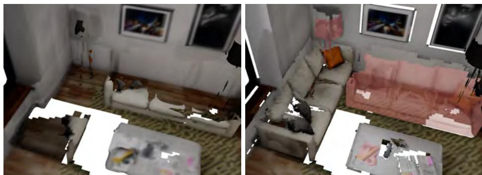  
图 15.11 语义一致性问题示意图。两次机器人观测之间，场景中的沙发和灯被调换，桌面上的物体也发生变化。左图显示融合所有测量得到的重建；右图显示执行语义感知变化检测后的结果 [974]。由于第二次访问只观测到沙发的一部分，左图仍有部分沙发残留，而右图会移除整张沙发（红色阴影）。此外，左图融合了自由空间和沙发的冲突测量，导致新位置的沙发只有部分重建。最后，桌上的杂志等几何变化较小的物体未被识别，而是与其他观测合并。（©2022 IEEE）

#### 15.3.2.3 通过变化理解对象

**从变化检测对象。** 变化与语义物体之间的内在联系可以双向推理。前文已说明语义信息可以改进变化检测；反过来，发生变化这一事实也可以作为物体检测线索。为此，通常先在稠密重建中检测变化，识别所有运动表面，再将这些表面进行空间聚类，以识别潜在物体 [321, 28, 327]。几何与语义的互补性在没有语义物体检测器，或需要通过检测未正确分割的物体来补充语义分割时尤其有用。但与之前一样，单独的几何物体分割容易受局部观测影响。例如，两个相互接触的物体同时被移除时，可能被欠分割为一个物体；通过遮挡只观测到部分物体时，则可能被过分割为多个部分。

**物体实例重定位。** 为构建随时间变化、以物体为中心的场景理解，而不仅是估计当前或静态状态，物体实例重定位的目标是通过长期动态观测跟踪物体。从概念上说，该问题及其大多数解决方案与地点识别和回环检测类似，但还有若干额外因素使其更具挑战。

第一，长期动态具有突发性，物体原则上可以在两次观测之间任意改变或移动很远。当然，根据经过时间和假设的物体运动模型，物体上次观测状态可能为当前观测关联提供有用线索 [951, 96]，但一般并不总是如此。

第二，单个物体远小于场景，其几何和纹理变化往往较少，因此能唯一描述它的特征也少得多。对于小物体，如果没有近距离观测，可提取的测量会更少且分辨率更低，从而进一步加剧这一挑战。

第三，一个环境中可能存在多个相同或相似类型的物体实例，因此感知混叠是重大挑战。这还引出一个更具哲学意味的问题：什么才算物体的唯一实例，是否应该单独跟踪它们。例如，在有几十或几百把相同椅子的会议室或研讨室中，很难判断哪把椅子是哪把，以及它们随时间如何移动。不过，对于大多数任务，这种信息可能并不重要；更好的做法可能是将所有椅子的观测融合为一个代表性模型，再复制多次。另一方面，办公室或建筑中可能有许多相同咖啡杯，但人们可能非常在意追踪自己的杯子。应对感知混叠的一种方案是考虑解的唯一性：高度独特物体的唯一匹配可以直接接受；对于具有多个相似匹配候选的物体，则采用多假设方法或适当的不确定性度量。

最后，可以在封闭集或开放集设置下考虑物体实例重定位。前者假设空间中的物体集合固定，重定位基本上成为最优匹配问题；后者更一般，允许物体被加入或移除场景，同时引出“物体观测相似到什么程度才应视为同一物体”的问题，因为总有一个新出现但相似物体的替代解释。

针对这些挑战，主流方案主要关注描述子提取与匹配。一类方法在每个物体上提取关键点集合和描述子，直接用于识别对应关系并求解六自由度变换。自然的第一步是直接使用 SLAM 前端的视觉特征 [748]。另一类方法使用三维关键点和描述子，例如快速点特征直方图（FPFH）[960] 和方向直方图签名（SHOT）[965]，这些方法已广泛用于变化物体的重定位。其优点是可以从某次会话的稠密三维重建中提取，并且对外观变化不敏感；但它们只表示局部几何块，描述能力较弱，通常需要进一步几何验证 [351]。近年来，基于深度学习的局部形状（有时也包含外观）描述子性能最佳，因为可以训练网络强调形状或物体中最具信息的部分 [1140]。图 15.12 给出了一个例子。

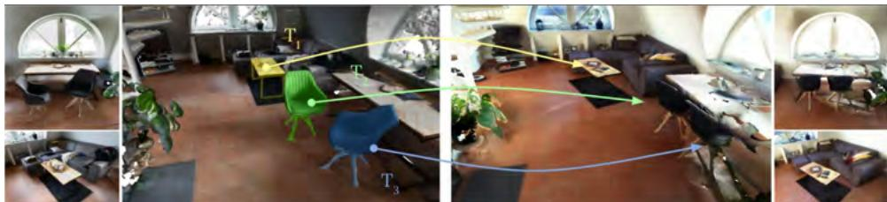  
图 15.12 RIO 数据集 [1140] 中的物体实例重定位任务。目标是确定初始扫描（左）和后续重新扫描（右）之间哪些物体实例相互对应，并估计每个物体与其新位置之间的六自由度位姿 $T_1$、$T_2$ 和 $T_3$。（©2019 IEEE）

这也催生了第二类方法：为每个物体计算一个描述子，而非多个关键点 [951, 1307]。当需要维护大型关键点数据库并穷举匹配时，这种方法更有优势，因为后者计算成本高昂。此类方法的一个重要方面，是构造或训练网络，使其对 SE(3) 不变或对 SE(3) 等变，以分别支持跨不同视点匹配和对匹配物体进行配准。

当变化物体的多个局部观测都完成重定位和配准后，不仅可以获得每个物体历史的有价值信息，还能随着时间推移重建更完整的物体模型和更丰富的场景描述 [351, 1307]。

### 15.3.3 变化感知 SLAM

多会话建图是长期动态观测的典型案例，但绝不是唯一设置。实践中，变化可能在更短时间尺度内发生。例如，机器人从客厅走到厨房取东西；如果客厅在此期间发生变化，机器人一周后返回还是几分钟后返回并无区别。极端情况下，机器人或传感器只需转过视线，再转回来时场景就可能已经改变。变化感知 SLAM 的目标，就是在机器人或系统在线运行时检测并表示这类长期变化。

**挑战。** 与假设所有变化发生在会话之间的多会话建图相比，变化感知 SLAM 允许变化在任意两次观测之间发生。

因此，只能在短窗口内假设场景平稳，可用于融合和消除观测歧义的数据也更少。此外，不准确的相对定位与观测场景的变化在感知上可能相似，使两个问题难以区分。例如，如果机器人位姿估计偏移一米，先前地图物体的表面在当前偏移视图中可能看似缺失，尽管实际并非如此。变化检测与定位之间的相互作用（即为每个定位约束分类内点和离群值）还会因一个问题的解影响另一个问题而加剧。考虑两个极端解可清楚看出潜在问题：如果无视场景可能存在的大幅变化，将所有测量都视为未变的内点，则所得配准可能不准确，表示真实和错误测量的“平均值”；相反，如果将整个先前场景视为已变化且现在不存在，则当前开环估计会平凡地达到最优，但所得位姿估计和场景重建可能不完整且不一致。最后，变化检测必须连续运行，并基于机器人截至当前收集的局部数据。这要求变化检测以较高频率运行，以便机器人及时理解环境；理想情况下，随着更多数据收集，还应能纠正错误的内点/离群值变化决策。

**对象级变化感知 SLAM。** 由于直接在低层传感器数据上全局推理变化场景很快变得难以处理，绝大多数变化感知 SLAM 方法首先在局部对测量进行摘要。由于大多数变化发生在刚性语义物体层面，对象级表示是直观选择 [974, 891, 345, 892, 976]。在这种设置中，提取对象级场景表示，并在每个物体层面进行定位和变化推理；相比对单个传感器测量进行推理，这一问题更易处理，而且从构造上保证了场景表示的语义一致性。

**局部一致性。** 变化感知 SLAM 的一个重要考量，是区分噪声测量和场景真实变化，并据此决定如何将测量融合到地图中。例如，如果对每一帧原始数据运行变化检测，某些噪声点可能穿透已有物体并错误标记为变化；而若采用更保守的变化检测规则，则很容易产生假阴性，将实际上不属于同一物体的测量融合在一起，形成损坏且不一致的重建（见图 15.11）。解决这一问题的核心思想，是使用局部一致性建立可保证无变化的测量序列。至少，当测量在帧间被跟踪时可以做到这一点 [974, 1130]，直观上对应于机器人观测期间场景不会在无人察觉时变化。实践中，基于对场景变化速率的合理假设以及短时间内较低的里程计误差，还可以将这一思想扩展到滑动窗口 [345] 或活动窗口 [976]。

**变化感知建图。** 结合上述思想，Panoptic Multi-TSDFs [974] 提出了首个实时变化感知建图系统。在给定全局一致位姿的假设下，Panoptic Multi-TSDFs 前端只更新能够逐帧跟踪、且测量语义与目标子地图匹配的子地图（称为活动子地图），从而估计一组语义一致且局部一致的子地图。通过对比活动子地图与重叠的非活动子地图，可以在这一更高层次的子地图抽象上高效检测变化；如果先前子地图分别与当前子地图不一致或一致，则可以丢弃或合并。这样既保留了与当前地图匹配的历史子地图信息，又通过移除完整子地图从构造上保证语义一致性。随后不久提出的 POCD [891] 采用另一种方法：也将输入帧分割为物体，但随后相对于当前地图进行跟踪和配准。该方法能够容忍并校正一定程度的里程计噪声。为处理噪声变化观测，它为每个物体建立概率持久模型，并在观测到物体或未能配准本应观测到的物体时更新该模型。

**全局一致的变化感知 SLAM。** 在大规模场景且没有全局位姿时，需要与场景变化联合估计位姿。对于对象级表示，可以直接使用基于因子图的方法，将局部一致的物体观测作为地标。为处理变化检测中的数据关联问题，NeuSE [345] 学习高度描述性且对 SE(3) 等变的神经物体表示。这些潜在描述子从局部观测捕获完整形状，允许直接关联和配准物体实例。因此，这类关联可以作为回环约束，空间不一致或缺失的关联则可作为变化信号。POV-SLAM [892] 采用期望最大化（EM）算法，在物体观测关联条件下优化机器人和物体位姿，并在给定场景空间布局的情况下优化物体观测和持久概率；这样可以持续细化定位和变化检测，尤其是在未来获得新观测时。Khronos [976] 则在相近物体之间创建候选关联因子，并使用基于逐步非凸性的鲁棒因子图优化 [1222] 确定内点关联。此外，将（假设静态的）背景变形纳入额外因子以辅助空间优化，并在回环后执行可变形几何变化检测，以解决“证据表明不存在”与“无证据”之间的歧义。

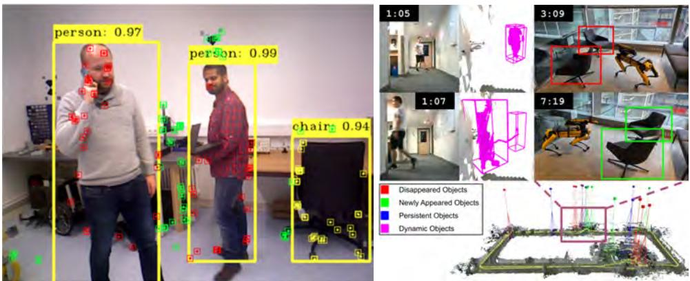  
图 15.13 统一短期和长期动态 SLAM。Changing-SLAM [1130]（左，©2023 Springer）跟踪短期动态物体的关键点（红色）和背景关键点（绿色），并关联潜在长期动态物体（黄色）。Khronos [976]（右）则在在线运行中稠密检测和重建短期运动（紫色）及长期变化（移除和添加分别以红色/绿色表示）。

**统一短期和长期动态 SLAM。** 最后，可以利用局部一致性，将短期动态物体跟踪与变化感知方法结合，同时捕获多种动态模式，如图 15.13 所示。Changing-SLAM [1130] 给出了首个此类表述。Changing-SLAM 构建在 ORB-SLAM [787] 之上，采用稀疏 SLAM 表述；每帧中，利用语义掩膜将特征点分组到物体。随后使用 Kalman 滤波器逐帧跟踪这些点，以捕获短期运动。未被跟踪的物体点（长期变化）则在全局范围内与附近、同语义类别的物体关联。最后，为每个物体估计持久分数，使长时间未检测到的物体被遗忘并从地图中移除。

Khronos [976] 提出了首个稠密时空度量--语义 SLAM 方法。Khronos 采用类似思想，使用体积局部地图重建背景以及跟踪到的静态、运动物体。在回环后优化全局一致位姿，再通过额外变化检测步骤估计每个物体发生变化的时间，从而恢复场景状态的历史和演化。

### 15.3.4 时间场景理解

建图时，目标是构建场景的数字表示和理解。如前文所述，建模动态环境时，所需理解层次可能从构建场景持久部分的模型（不包含运动和变化），到构建详细的四维重建，并理解何时、如何发生了哪些运动和变化。然而，这种理解还可以超越捕获单个运动和变化实体，进一步估计底层时间变化模式并预测场景未来演化。本节简要概述三类关键时间模型。

**动态规律地图。** 动态地图关注检测和跟踪运动物体；动态规律地图（Maps of Dynamics，MoD）则将这些轨迹或其他运动信息作为输入，估计场景中的典型运动模式 [610]。模式可以是恒定的（例如单向道路上的主导运动方向），也可以依赖时间（例如人们早晨进入办公室、晚上离开）。理解这些模式可以为动态场景导航或人类运动预测提供有价值信息。

**周期事件。** 周期或循环事件是一类特殊但常见的动态模式，例如场景每日或每年的变化。如果假设场景状态由某个周期性隐藏过程控制，就可以将场景观测视为该周期过程的观测，并用于估计其属性。Krajnik 等人 [603] 首创了频率地图：在时间域分析观测的不同周期过程，在频域通过傅里叶变换进行谱分析。只存储频谱中的主导模式，就能得到紧凑的地图表示，捕获频率各异（周期可以任意长）的周期事件。由于场景的完整四维模型由这些模式定义，一旦从历史观测中估计出模式，就可以预测场景所有未来状态，从而改善未来定位和路径规划 [602]。

**基于学习的方法。** 除结构化或手工设计的动态统计模型外，还可以使用基于学习的方法预测场景未来变化。通常利用场景图作为物体及其与周围环境关系的紧凑表示，预测对象级变化或运动 [851, 693, 393]。基于学习的方法具有多项优势，包括更灵活地表示复杂动态模式，并能将语义先验（例如“午餐时间前后餐桌容易发生变化”）与特定环境观测相结合。相比更静态的共现先验或纯频率模型 [851, 393]，这可以带来更好的预测性能，改善机器人未来的主动和前瞻性行为 [851, 693]。缺点是，复杂模型可能需要更多训练数据，而变化数据相对于场景静态观测可能稀少且分布不均衡。

## 15.4 可变形 SLAM

除刚性运动和变化物体外，机器人经常运行在不仅具有动态性、还包含可变形实体的环境中。如果场景只有部分区域发生变形且需要建模，通常相对于第 15.2.3 节介绍的静态背景估计机器人运动，将问题简化为已知传感器位姿条件下的可变形重建。该问题可作为非刚性运动恢复结构（NRSfM）处理，第 15.4.1 节将介绍。

更一般地，可变形 SLAM（或可变形环境中的 SLAM）指在没有刚性背景的环境中执行 SLAM，即场景中没有任何可见的刚性或静态部分。一个特别相关的案例是微创机器人手术：唯一可用传感器是单目相机，只能观测人体内部的可变形器官 [893]。此时需要估计相机相对于持续变形场景的自运动。由于没有静态部分，可变形 SLAM 问题严重欠约束，比静态和动态 SLAM 更具挑战。

下文首先在第 15.4.1 节讨论可变形 SLAM 与 NRSfM 的差异；然后在第 15.4.2 节介绍可变形 SLAM 中存在深度信息（例如来自 RGB-D 或双目相机）的较简单情况；第 15.4.3 节介绍单目相机这一更具挑战的情况下的可变形 SLAM 流水线；最后第 15.4.4 节介绍地图初始化和扩展。

### 15.4.1 NRSfM 与可变形 SLAM

正如刚性视觉 SLAM 与 SfM 相联系，非刚性 SLAM 也与其非刚性对应问题 NRSfM 有密切联系。

#### 15.4.1.1 非刚性运动恢复结构（NRSfM）

NRSfM 是计算机视觉中的经典主题，研究如何使用单目视觉建模变形三维环境，为从视频序列进行变形场景三维建模提供理论基础。场景中的每个三维点在每一帧都有不同的三维位置，因此地图表示的不是单个位置，而是每个地图点的一条三维轨迹。结果是，单目问题严重欠约束，需要额外先验约束解。常用选择包括时间平滑先验（假设三维点轨迹随时间平滑）和空间先验（假设一个点的变形与邻域点相似）。

经典 NRSfM 表述假设静态单目相机观测没有静态背景的运动物体。大多数视频帧观测到完整物体范围，即大部分图像在观测同一变形物体时相互重叠。典型例子包括相机前运动的手、飘动的旗帜或跳跃的人。需要注意，即使相机固定，每个点的运动通常也包括物体的显著刚体变换及其局部变形。刚体运动不会被显式计算，而是作为每个点相对于固定相机的非刚性场景运动的一部分（图 15.14(a)）。尽管不计算刚体运动，它会产生显著视差，使估计问题条件良好。

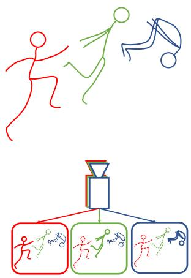  
(a)

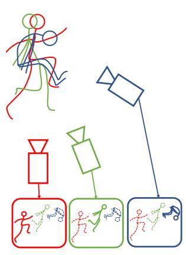  
(b)

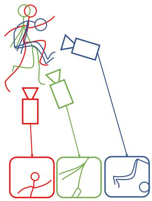  
(c)  
图 15.14 三帧中 NRSfM 与可变形 SLAM 的示意图。场景没有刚性背景。(a) 经典 NRSfM 假设单目相机固定，而三维物体发生包含刚体变换和局部变形的非刚性运动。(b) 可变形 SLAM 假设场景物体主要发生非刚性运动，而运动相机在没有静态背景的情况下关注刚性运动。(c) 可变形 SLAM 还通常假设相机处于近距离视点，只能观测变形场景的一部分，即相机沿探索轨迹运动。

**从模板恢复形状。** 第一类 NRSfM 方法是 Shape from Template（SfT）。它们假设有一个作为先验的、带纹理的观测物体静止三维形状，然后利用该先验恢复变形，从而显著简化问题。这一带纹理的物体静止三维形状称为模板。方法依赖模板的变形模型。一方面，解析等距变形模型假设表面点之间的测地距离保持不变；这一假设适定，并迅速发展出稳定、实时的 SfT 方法 [227, 59, 198]。另一方面，能量方法 [966, 21, 804, 619, 422] 联合最小化相对于静止形状的变形能量和图像对应关系的重投影误差。这些方法还被嵌入带鲁棒核的序列数据关联，以检测和剔除离群值 [619, 620, 422]。

**非刚性运动恢复结构（NRSfM）。** 为处理没有 SfT 强先验的完整 NRSfM 问题，早期方法假设正交相机模型，但该模型只适用于远离相机的运动物体。最早的方法见 [113]，其奠基性工作催生了基于低维基的方法，用于从序列帧计算三维轨迹 [837, 775, 239]。这些方法分别使用空间 [239, 368]、时间 [23]、时空 [20, 394, 395] 或较新的拓扑先验 [989] 作为正则化器。

可变形 SLAM 典型的近距离序列（如医学内窥镜）必须使用透视相机模型。SfT 中首先提出的等距假设在 NRSfM 中也取得了出色结果 [1076, 1127, 196, 197, 843, 844]。其中，等距方法 [843] 对 SLAM 尤其有用，它是一种能够自然处理可变形 SLAM 中常见遮挡和缺失数据的局部方法。在 SfT 和 NRSfM 之间，Agudo 等人 [22] 提出基于 Navier 方程和有限元法（FEM）的变形模型，并以 EKF-SLAM 的序列方式处理视频帧。

#### 15.4.1.2 可变形 SLAM

相比之下，可变形 SLAM 研究上述问题的一种变体：场景发生变形，相机也在运动。目标是同时估计观测场景的变形历史和相机轨迹。假设观测到的变形中凡是可以由刚体变换解释的部分，都纳入相机轨迹（图 15.14(b)）。将运动中的刚性和非刚性成分分离是一个不适定问题，所谓“浮动地图歧义” [621] 突出体现了这一点。但可以通过对可变形物体的位移引入先验，实现这种分离。

SLAM 的一个重要挑战是相机通常沿探索轨迹运动，即并非所有帧都观测相同的场景区域（图 15.14(c)）。相机还经常靠近变形表面，此时正交相机假设不再成立。图 15.15 展示了观测变形曼陀罗序列中的典型近距离视图 [620]。

最后一个常见假设是过程必须具有因果性并实时运行，即要在时刻 $k$ 生成地图和相机位姿，只能处理第 1 到第 $k$ 帧。这与通常批量处理全部图像的 NRSfM 形成鲜明对比。

鉴于涉及的困难，第 15.4.2 节先讨论带深度信息的可变形 SLAM，随后在第 15.4.3 节回到使用单目相机的可变形 SLAM。

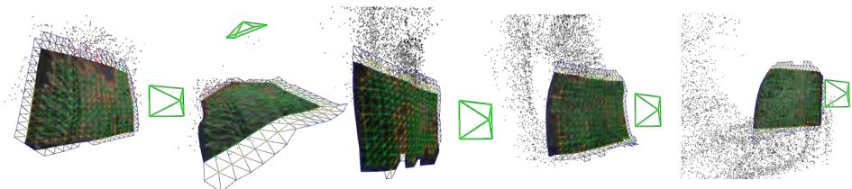  
图 15.15 可变形 SLAM 中的典型探索轨迹 [620]。相机位姿（绿色视锥）与变形场景的局部可变形模板（网格）联合估计。全局地图点以黑色显示。（©2021 IEEE）

### 15.4.2 带深度信息的可变形 SLAM

RGB-D 或双目相机等三维传感器能够提供深度测量，使估计问题变为超约束，相较纯单目方法大幅降低复杂度。DynamicFusion [802] 是首个基于 RGB-D 数据的可变形三维 SLAM 工作。它构建场景的规范地图（即静止状态下的形状），并将其变形以解释当前深度观测，将嵌入变形图模型（ED）[1049] 与尽可能刚性（as-rigid-as-possible）正则化器 [1025] 结合。ED 模型在图结构中离散化变形空间，从而加速稠密重建。DynamicFusion 奠定了后续工作的基础，例如 VolumeDeform [504] 纳入光度信息以改善结果；随后 KillingFusion [1016] 提出强制变形平滑且近似等距，图 15.16 给出了示例。上述方法都使用 SDF 表示地图，但其随地图规模扩展性较差，限制了探索应用。Surfelwarp [364] 提出使用 surfel 表示替代经典 SDF，提高可扩展性。在医疗领域，MIS-SLAM [1023] 提出适用于双目系统的可变形 SLAM，将尽可能刚性变形与 ED 模型结合。在双目医疗应用中，Zhou 和 Jayender [1294] 将期望最大化与对偶四元数（EMDQ）算法同 SURF 特征结合，以跟踪相机运动并估计视频帧之间的组织变形。

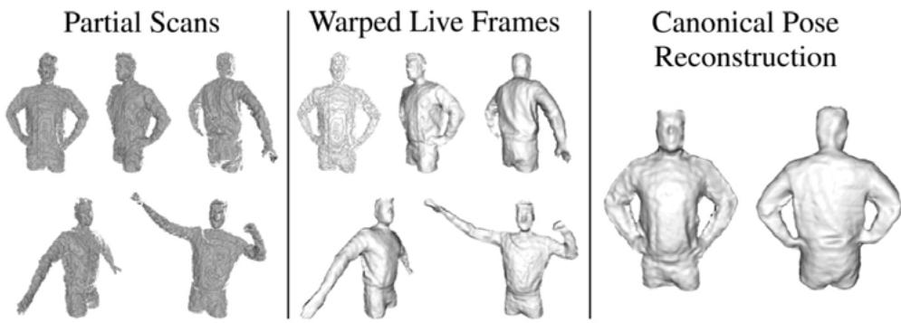  
图 15.16 KillingFusion [1016] 从运动 RGB-D 相机观测中恢复非刚性运动物体。通过使用有符号距离函数（SDF）和 killing 正则化器，它能够恢复发生拓扑变化的结构，例如双手与躯干融合。（©2017 IEEE）

### 15.4.3 使用单目相机的可变形 SLAM 流水线

典型可变形 SLAM 系统的流水线模仿视觉 SLAM 中以帧频率跟踪、以关键帧频率建图的方式，但针对变形情形进行了调整，例如 DefSLAM [620]。

**跟踪。** 可变形跟踪类似 SfT 方法。假设探索局部区域的静止形状可用，如 [619] 首次提出的方案，并使用受基于物理的弹性模型启发的变形能量。随后，Gómez Rodríguez 等人 [422] 提出可变形跟踪系统，使用空间、尽可能刚性以及黏性时间正则化器。这些方法分别集成到完整可变形 SLAM 系统 DefSLAM [620] 和 NR-SLAM [933] 中。

**建图。** 可变形建图线程以序列中的点跟踪为输入，负责以关键帧频率重新计算模板。首个可变形 SLAM 系统 DefSLAM [620] 使用等距 NRSfM [843] 完成该计算。NRSfM 处理一组共视关键帧，为每个地图关键帧生成一个模板；在假设场景具有平面拓扑的条件下，将这些模板与早期局部建图操作中计算的前一批模板对齐。为放宽平面拓扑假设，NR-SLAM [933] 引入动态可变形图，以处理任意场景拓扑。在变形模型方面，作者比 [422] 更进一步，提出直观的黏弹性变形模型，同时包含时间和空间正则化。该模型用于局部建图可变形 BA，构成可变形建图核心，替代 DefSLAM 中的等距 NRSfM。

**特征匹配。** DefSLAM 继承 ORB-SLAM [787] 的 ORB 特征 [953]。但研究表明，在医学场景的近帧跟踪中，ORB 描述子并不理想；由于 Lukas--Kanade（LK）光流 [707] 对仿射光照变化不变，具有更好性能 [391]。此外，作者将 ORB 描述子与 DBoW 词袋 [362] 结合进行地点识别，以在跟踪丢失后实现相机重定位。NR-SLAM [933] 的特征跟踪同样使用 LK 跟踪。

### 15.4.4 初始化与地图扩展

从零初始化始终是任何单目视觉 SLAM 系统的挑战步骤，在可变形情况下尤为明显。DefSLAM [620, 391] 依赖等距 NRSfM 算法 [843]，可以从零计算初始关键帧的模板。唯一问题是如何计算关键帧之间的初始匹配，该问题通过假设场景为平面来解决。对于 NR-SLAM [933]，可变形 BA 需要初始猜测；初始地图和相机运动使用刚性 SfM 计算。通过分割初始关键帧之间的图像光流，初始化动态变形图。

当相机探索新区域时，需要向地图中加入新点，使其覆盖新区域。对于 DefSLAM，只要能在关键帧中找到这些新点的匹配，等距 NRSfM 就能自然处理地图扩展。对于 NR-SLAM，则利用已有相机位姿，从新点与已定位帧中的匹配对三角化新地图点。为此，提出模型选择方法：分别使用刚性和非刚性算法对地图点三角化，再为新探索区域选择正确模型。

## 15.5 延伸阅读与近期趋势

动态、变化和变形场景中的 SLAM 是一个高度活跃、持续发展的研究方向。本章旨在概览该领域的关键挑战和解决方案，但无法涵盖所有正在进行的工作，希望这些内容能促使读者深入阅读相关主题，并在未来参与研究。尽管已经取得显著进展，仍有许多开放问题。下面强调其中一些问题及其他有前景的未来方向。

**极端环境下的状态估计。** 即使不显式建模环境变化和动态，现代 SLAM 系统也已对其具有相当鲁棒性。然而，在存在大面积遮挡 [691, 450]、运动物体占比很高 [897] 或强运动先验 [450, 76] 时，将动态物体跟踪纳入状态估计可以提高鲁棒性和精度。但这些优势会增加计算成本，当前每种挑战通常分别处理。能够高效且鲁棒地应对多种极端条件（或“边界情形”）的 SLAM 方案仍是开放问题。

**可微场景表示。** 第 14 章介绍的 NeRF 和 3DGS 等可微渲染模型虽然仍较新，但已经显示出作为动态场景表示的巨大潜力。早期工作展示了它们对动态、变形物体进行高保真重建 [1192] 以及变化检测 [706] 的能力。不过，该领域仍面临实时 SLAM 的内存和计算成本、移动传感器产生的局部且带噪观测，以及实现空间和时间一致地图的规模扩展与地图管理等开放挑战。

**数据关联与深度学习先验。** 数据关联仍是根本且困难的问题，尤其是局部观测、遮挡，以及长期地点识别和实例重定位。为克服这些问题，研究者似乎正转向纳入先验的深度学习方法，从局部观测补全并关联物体 [345, 1307, 1207]。特别是提取 SE(3) 不变或 SE(3) 等变特征的几何深度学习技术，有望解决这些挑战。但在移动部署的泛化能力、可靠性和可扩展性方面，仍有开放问题。

**终身运行与持续学习。** 终身运行 SLAM 方法的可扩展性和性能是另一个开放问题。这涉及从外观到几何变化的一系列感知挑战，以及传感器随时间可能发生的退化。此外，如果机器人能够长时间运行，也应能够持续学习 [1134]，随时间适应并改进。最后，这两个方向都需要某种形式的内存管理，以决定保留哪些信息、如何摘要或边缘化，以及何时遗忘什么信息。

**可变形 SLAM。** 可变形环境中的 SLAM 研究仍处于早期阶段，存在许多开放问题 [492]。例如，在什么条件下可以同时准确估计相机轨迹和地图变形？能否清晰区分可变形物体的刚体运动与相机的刚体运动？能否准确估计可变形 SLAM 结果的不确定性？可变形 SLAM 中是否存在局部极小值？如何判断得到的结果是否为全局极小值？

**迈向时空智能。** 除动态和可变形场景中的 SLAM 外，时空智能旨在构建超越定位和重建的整体场景理解，同时捕获并学习时间模式。

理想情况下，这种地图或“世界模型”将机器人语义先验与观测相结合，提供对场景及其动态的深入、机制化理解。它能够估计一致且完整的过去历史，预测未来结果，并促进高层次、长期的推理和决策。
