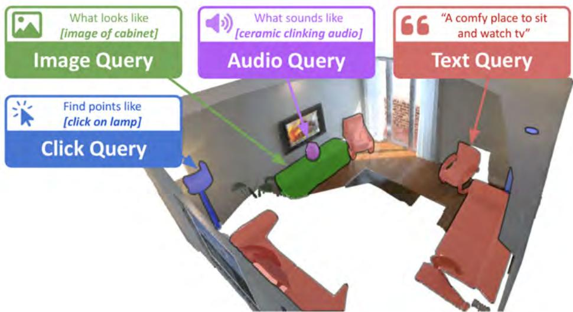
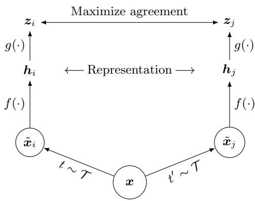
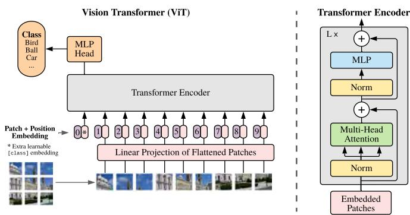
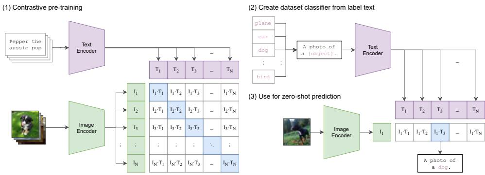
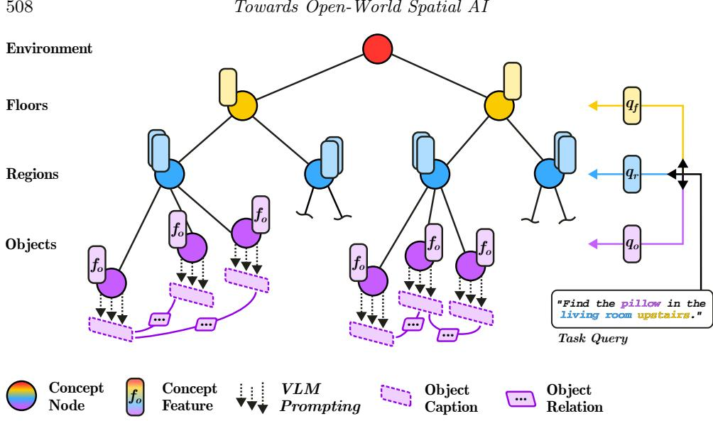
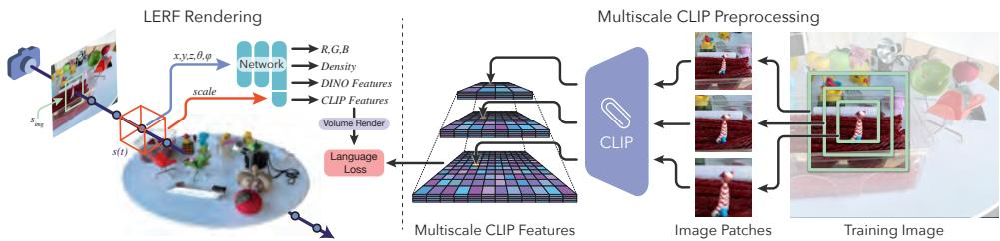
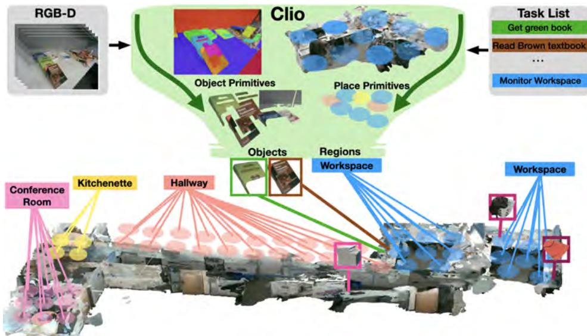
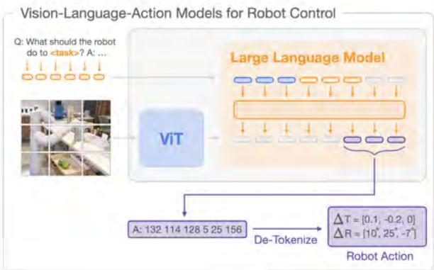

# 《SLAM Handbook：从定位与建图到空间智能》

## 第 17 章  迈向开放世界空间智能

**作者：** Liam Paull、Sacha Morin、Dominic Maggio、Martin Büchner、Cesar Cadena、Abhinav Valada 和 Luca Carlone

前面各章介绍了多种地图表示：将世界建模为稀疏路标集合的稀疏表示（第 1 章）、存储三维空间详细几何信息的稠密表示（第 5 章），以及试图灵活平衡二者的分层表示（如三维场景图，第 16 章）。这些表示还依赖输入传感器模态，例如视觉（第 7 章）、LiDAR（第 8 章）和雷达（第 9 章）。然而，地图中包含的信息大多仍限于环境的几何属性（或第 14 章所述的光度属性）。

第 16 章展示了现代 SLAM 可以超越几何、编码语义，从而支持某种形式的空间智能，即更抽象、更高层次的推理。这使机器人能够执行以更直观方式指定的复杂任务，例如用高层自然语言而非低层几何指令指定目标。此类表示通常由深度学习训练的感知模型查询得到，但第 16 章中的模型多以封闭集方式训练，潜在类别、物体类型和概念的字典在训练时预先确定，因而固定且有限。

近年来出现了在海量数据集上训练的“基础模型”（foundation model）。它们能够学习开放世界（也称开放集或开放词汇）表示，潜在地泛化到可能遇到的任何类别、物体类型或概念。将 CLIP [899] 等多模态基础模型的表示嵌入 SLAM 地图，可以用全新的方式交互和查询地图元素，如图 17.1 所示。

图 17.1 将 CLIP 等多模态基础模型的表示嵌入 SLAM 地图后，可以用文本查询地图。例如查询“一个可以舒适地坐着看电视的地方”，将文本送入文本编码器，再查找与查询嵌入在余弦距离意义下足够接近的地图点，便可找到椅子和沙发。只要不同模态的基础模型具有对齐的嵌入空间，同一方法也适用于其他模态；示例改编自 ConceptFusion [512]。

本章探讨如何在 SLAM 中利用基础模型。第 17.1 节介绍基础模型研究背景和基本术语；第 17.2 节回顾多模态基础模型；第 17.3 节讨论基础模型和开放集语义在 SLAM 与空间智能中的近期应用；第 17.4 节总结近期趋势。

## 17.1 背景与术语

### 17.1.1 基础模型简史

基础模型是用足够海量的数据训练的机器学习模型，通常可以泛化到广泛运行条件。训练此类模型需要两项关键条件：能够高效更新大量参数的深度学习架构，以及用于训练的超大规模（例如互联网规模）数据集。计算机视觉中最早可能符合这一描述的模型是 AlexNet [608]：它是一个在 ImageNet [260] 上以监督方式训练的 CNN，数据集包含 320 万幅人工标注图像。传统 CNN 的问题是梯度消失：梯度通过许多层后变得很小，基于该梯度训练参数的效率很低。

残差网络 [443]（ResNet）通过在层之间引入直接通路，使训练更稳定、高效，缓解了这一问题。基于 ImageNet 预训练 ResNet 的视觉编码器成为闭集视觉感知系统的基础，例如 YOLO [919]、RCNN [384] 等物体检测模型。

构建 ImageNet 这样的人工标注数据集十分艰巨。自然语言处理领域则可以自动化标注过程。BERT [268] 使用语料库自动生成训练任务和标签以学习有意义表示：从句子中删除一个词，再预测缺失词。英语 Wikipedia（约 25 亿词）和 BookCorpus（约 8 亿词）是最早使用的语料库，这一过程通常称为无监督学习1。BERT 还展示了基于注意力机制 [43] 的 Transformer 架构 [1123] 对捕获长期依赖的优势；同期发布的 GPT 也基于 Transformer，并展现了类似能力。

将这种无监督训练扩展到图像等高维输入并不直接，因为词语具有明确语义，而随机图像块未必具有明确含义。结合视觉 Transformer 的对比学习方法 [280] 开始解决这一问题。SimCLR [185] 等方法通过裁剪、翻转或删除图像块生成增强图像，并构造损失，使原图和增强图在表示空间中接近（正样本），而与其他输入远离（负样本），从而学习对增强不变、适合下游视觉任务的表示。

图 17.2 对比学习示意（改编自 [185]）。输入 $x$ 经两个增强算子 $t\sim\mathcal{T}$ 和 $t'\sim\mathcal{T}$ 产生相关视图，再由编码器 $f(\cdot)$ 和投影头 $g(\cdot)$ 得到表示，通过对比损失最大化二者的一致性。

与此同时，研究者开始将 Transformer 应用于视觉领域 [280]。视觉 Transformer 将图像分割为固定大小的图像块，与位置嵌入一起线性嵌入，并将向量序列输入标准 Transformer 编码器；分类时额外加入可学习的分类 token。

图 17.3 视觉 Transformer 结构（改编自 [280]）：图像块和位置嵌入经过多头注意力及 MLP 编码，分类 token 由 MLP 头输出类别。

DINO（无标签自蒸馏）[154] 使用教师--学生蒸馏而非对比学习训练视觉 Transformer 编码器，在学习视觉表示方面非常有效。对比学习还能够对齐不同模态的表示空间：CLIP [899] 使用互联网图像--文本对，通过对比损失使配对图像和文本在特征空间中接近，而使不匹配样本远离。海量数据、模型和工作流的改进不断增强基础模型对未见任务和场景的泛化能力，但 LiDAR、雷达等 SLAM 常用模态尚缺少同等规模的公开数据。

图 17.4 CLIP 训练和零样本预测（改编自 [899]）：(1) CLIP 以对比学习得到图像和文本特征；(2) 训练后将类别文本标签编码为分类器；(3) 将图像特征与类别特征比较，实现零样本预测。

### 17.1.2 术语与范围

本章关注的关键区别是“开放世界”。一种范式是在 SLAM 前端使用开放世界感知系统，例如 YOLO-World [194] 和 OV-DETR [1264]。它们允许开放词汇文本条件查询，但查询必须在感知模型运行、地图构建时指定。因此地图本身仍是封闭世界：地图表示哪些概念在创建时已经确定。第二种范式是将开放世界表示嵌入 SLAM 地图，使地图在使用时支持开放世界查询；本章第 17.3 节主要关注这一范式。

还需区分定位、建图与 SLAM。基础模型表示已用于视觉地点识别和定位/回环检测，例如 AnyLoc [547] 研究从 DINO [154] 的不同层提取并聚合特征，在空间、时间和视点变化下构造视觉地点描述子。本章更直接地关注支持开放世界查询和任务指定的数据结构与算法。后续讨论的大多数方法是纯建图算法，假设已有带位姿的相机帧（例如由前面各章的 SLAM 系统提供），问题转化为如何将基础模型表示嵌入 SLAM 地图。

## 17.2 面向空间智能的基础模型

本节介绍有助于构建开放世界地图表示的三类基础模型，并区分基于特征和生成式基础模型。CLIP [899] 等基于特征的模型从文本或图像中提取实值向量，通过特征空间计算完成任务，例如用两个向量之间的距离衡量文本或图像相似性。生成式基础模型则根据文本和/或图像提示生成新数据。二者并非完全互斥：基于特征的模型可作为生成式模型的子模块，生成式模型也能提取特征；但在地图应用中，输出形式和典型用途支持这种区分。

### 17.2.1 基于特征的基础模型

特征也称为嵌入、表示或编码，是深度神经网络对输入数据点编码后得到的实值向量。本章只简要提及网络架构和训练目标，并将不同特征提取器记为函数；有关深度学习的完整概述可参见[392]。设模态 $X$ 的编码器 $f_X$（通常是深度神经网络）作用于输入 $x$，得到 $d$ 维特征 $f_x=f_X(x)\in\mathbb{R}^d$。

深度学习的目标，是学习具有有用性质的编码函数。本章最关心的性质，是能够方便地测量数据点之间有意义的相似性。特征空间中的距离可以回答“这两段文本有多相似？”或“这段文字说明与这幅图像有多相似？”等查询。

自监督学习目标和深度架构的研究催生了可以作为众多应用基础的特征提取器。现代特征提取器在大规模互联网级自然语言处理和计算机视觉数据集上预训练。虽然可以针对特定任务微调这些模型，或把特征作为下游分类器和回归器的输入，但本章讨论的建图方法大多直接使用“原样”的特征。下面简要介绍一些可用的文本、视觉和多模态特征提取器。

**自然语言。** BERT [268] 改变了自然语言处理领域，并引入了以掩码语言建模目标预训练的双向 Transformer。该模型无论是否微调，在多种下游 NLP 任务上都能取得较强性能。BERT 提供的是 token 级特征（即输入子字符串的特征）；SentenceBERT [924] 增加池化操作，并对 BERT 进行微调以输出句子级特征，使特征可以通过余弦相似度高效比较。余弦相似度是把两个嵌入视为从原点出发的向量后，计算其夹角的余弦。SentenceBERT 已提供多种语言的模型检查点，并针对各种 NLP 任务进行了微调。

**视觉。** DINO [154] 采用自监督方案训练视觉 Transformer [280]，让学生网络匹配教师网络的预测。多裁剪增强是训练的关键：教师网络看到图像的全局视图（覆盖超过 50%），学生网络同时处理同一图像的局部视图（覆盖少于 50%）和全局视图，从而鼓励“局部到全局”的学习。DINOv2 [831] 改进了训练过程，并引入包含 1.42 亿幅图像的精选数据集，得到具有强整体图像理解能力的视觉特征提取器。

DINO 输出图像级视觉特征，可以零样本泛化到图像分类或图像检索等下游任务。例如，可以利用 DINO 特征空间中的距离构建特定监督任务的 $k$ 近邻分类器；只要在 DINO 特征上训练，即使简单的逻辑回归模型也能在图像领域取得较强性能。DINO 背后的 Transformer 架构还允许预测图像块级特征，例如为图像中每个 8×8 图像块输出一个特征向量。在这些稠密特征上训练额外模型，可以在语义分割、深度估计和表面法向估计等像素分辨率任务上获得良好性能[831, 45]。直接使用特征空间距离进行多视图对应估计也已经得到研究[45]。

**多模态。** 学习得到的特征空间可以用于推理同一模态数据点之间的相似性；不同模态的专用编码器也可以映射到一个共同的、对齐的特征空间，从而实现多模态能力。CLIP [899] 是视觉--语言领域的代表性方法，训练图像编码器 $f_{\mathrm{image}}$ 和文本编码器 $f_{\mathrm{text}}$（图 17.4）。给定 RGB 图像 $I$ 和文本查询 $T$，CLIP 提取单位范数特征 $f_I=f_{\mathrm{image}}(I)$ 和 $f_T=f_{\mathrm{text}}(T)$，于是可以用余弦相似度 $\langle f_I,f_T\rangle$ 比较图像和文本。

CLIP 编码器在从互联网收集的 4 亿个图像--标题对上采用对比学习训练，得到能够直接编码广泛视觉和文本概念的特征。无需微调或重新训练，CLIP 特征就可以用于许多下游任务。例如，可以用文本形式定义类别集合 $\mathcal{C}$（也可以使用“a picture of a dog”“a picture of a cat”等模板句），再以 CLIP 相似度预测图像 $I$ 的类别：

$$
\hat{k}=\operatorname*{arg\,max}_{c\in\mathcal{C}}\langle f_I,f_c\rangle,\tag{17.1}
$$

要为新问题重新构造分类器，只需通过文本提示定义新的类别集合，因而可以迁移到大量任务。在具有合适编码器的情况下，式 (17.1) 的分类器也可以扩展到声音等其他模态[421]。从 CLIP 视觉编码器中提取稠密图像块特征也是可能的；但不能假设这些特征与语言对齐，而且一些研究发现，相比 DINO [831, 45]，它们在视觉和三维相关任务上的能力较弱。

### 17.2.2 生成式基础模型

大型语言模型（large language model，LLM）是用于文本生成的 Transformer，通常使用自监督目标训练。模型规模通常很大（即具有大量可学习参数），并在海量文本语料库上训练，因此具有令人印象深刻的泛化能力。语言建模的第一步是分词，即按照词、子词、字符或字节等词汇表定义的单位，把输入文本分割为 token。每个 token 被分配唯一整数，并对应一个可学习的嵌入；LLM 将文本作为 token 嵌入序列处理。

LLM 训练的具体细节超出本章范围，核心学习目标是下一个 token 预测。给定前 $T-1$ 个 token 的上下文 $w_{1:T-1}$，LLM 学习预测下一个 token 的概率 $p(w_T\mid w_{1:T-1})$。推理时，LLM 接收一段文本指令作为初始上下文（prompt），自回归地预测下一个 token，将其加入上下文并重复此过程，直到满足停止条件。

原则上，只要任务的指令、输入和输出都能够用文本指定，LLM 就可以用于该任务，例如交互式聊天机器人、代码生成、文本摘要或符号规划。提示设计会显著影响任务性能，并推动了思维链（chain-of-thought，即提示模型逐步思考）和上下文学习（in-context learning，即在提示中提供输入--输出示例）等提示工程技术的研究。常用的 LLM 包括 LLaMA 系列[1104]和 GPT 系列[5]，并且更强的新模型正在频繁发布。

研究者还在积极地将 LLM 的一般能力扩展到视觉等其他模态。视觉语言模型（vision-language model，VLM）除接受图像 token 作为输入外，大多共享 LLM 的组件。LLaVA [648] 将 CLIP 视觉编码器连接到 LLM，并在视觉和语言数据上训练，从而获得多模态能力。近期 GPT 模型也支持视觉输入和输出。在提示恰当时，VLM 可以执行图像分类、图像描述以及更一般的视觉问答。

### 17.2.3 类别无关的图像分割

图像分割是许多建图方法的关键组件，对于推理图像特定区域的语义必不可少。我们希望检测一组分割掩膜 $\{Z_i\in\{0,1\}^{H\times W}\}_{i=0}^{R}$，它们表示宽度为 $W$、高度为 $H$ 的 RGB 图像 $I$ 中可能存在的物体。关键是，掩膜提议必须与类别无关，才能正确覆盖机器人环境中通常出现的广泛物体，并利用前面介绍的基础模型的开放词汇性质。本章将这一函数记为 $\operatorname{Seg}(\cdot)$。

实现该函数的主要工具是 Segment Anything Model（SAM）[581, 911]。SAM 基于大规模监督学习执行类别无关的图像分割，是一种可提示的分割模型：输入像素坐标、边界框，甚至另一张分割掩膜，就可以预测分割掩膜。SAM 也可以自动处理完整图像，生成描述不同实例的一组掩膜。SAM 可以直接作为独立分割模型使用，也可以处理开放词汇物体检测器的边界框检测结果[681]，从而获得更好的物体定义并减少推理时间。

## 17.3 开放世界建图

第 5 章介绍了如何把占据或距离场等几何量存入地图，第 16 章则主要通过增加类别信息将这一做法扩展到语义。虽然类别框架能够对场景语义提供合理的离散近似，但在实际使用中存在许多局限，其中最主要的是封闭集假设：经典语义地图必须预先知道希望支持的类别词汇表。例如，任何依赖图像分类器或物体检测器的建图系统，都隐含假设世界可以由其感知前端的词汇完全描述。

实际上，预定义物体类别只能对现实提供非常粗略的近似。以工具箱中的常见物体为例，大多数分类器没有足够词汇完整描述工具箱中的物体。“工具”可能是可以接受的概括，但“螺丝刀”或“锤子”等更具体标签显然更理想。即使如此，我们还可能希望编码具体实例的颜色（“红色锤子”“蓝色螺丝刀”）、材料（“金属”“橡胶”）以及通常丢失在单一类别标签中的其他物理属性（“硬”“软”“热”“冷”）。对于机器人，我们还可能希望编码物体典型用途和可供性（“切割”“测量”）。对于带有图像内容的物体（“一幅罗纳尔多的画”），理想地图甚至应同时编码介质（“画”）和内容，即使内容涉及特定文化引用（“罗纳尔多”）。用预定义类别同时满足所有这些目标非常艰巨；即使包含数百个类别的词汇表，对常见物体也可能在某些层面不足，对于原本不太可能进入词汇表的稀有长尾物体，问题会更加严重。物体可能产生的典型声音等连续属性，本身也很难用离散类别标签表示。

为去除封闭集假设并支持更广泛的概念，我们可以用第 17.2 节介绍的基础模型提取的高维连续特征替换地图中的类别标签。训练这些特征提取器时使用的大型数据集，确保特征能够表示数量庞大的开放集物体及其属性。虽然单独的特征不能直接使用，但它们的多模态对齐允许与不同模态的查询进行比较，主要是自然语言查询，从而以零样本方式完成多种任务。

本节主要关注 RGB-D 相机：它们既支持使用基于图像的基础模型提取 RGB 特征，也支持把像素转换为点云等三维表示。我们通常假设静态场景中一系列带位姿的 RGB-D 帧，因此重点是建图问题而不是完整的 SLAM 问题。我们按顺序处理每一帧，增量构建地图。

### 17.3.1 稠密表示

构建稠密开放词汇地图涉及三个主要组件：选择三维表示；使用基础模型从传感器数据提取开放词汇特征；以及跨帧聚合这些特征并把它们定位到空间中。最后还要讨论如何对地图进行推理或查询。

**地图表示。** 开放词汇建图把基础模型的语义特征嵌入第 5 章介绍的一种稠密空间表示。一般地，设地图表示由地图元素集合 $\mathcal{M}=\{m_k\}$ 组成，每个地图元素 $m_k=\{p_k,f_k\}$ 包含几何分量 $p_k$（体素位置、三维点、网格面等）和语义分量或特征向量 $f_k$。

表示的选择主要由下游应用决定：导航方法倾向于在二维网格中进行单元级特征聚合[484]，而移动操作流水线可能选择体素网格[678]。ConceptFusion [512] 和 OpenScenes [863] 用无序三维点集合表示空间和语义；Open-Fusion [1213] 使用带 TSDF 的体积表示；VLMaps [484] 采用混合方法，先在三维点云中累积信息，再投影到二维网格地图。需要强调，地图元素的几何分量 $p_k$ 被假设由上游 SLAM 系统提供，例如前面章节介绍的系统。

**特征提取。** 接下来需要决定把哪些特征嵌入三维表示，以及如何获得这些特征。常见做法是用基础模型 $f$（例如第 17.2.1 节介绍的模型之一）从某帧 RGB 数据 $I$ 中提取中间语义特征。问题在于，基础模型通常产生图像级特征，编码相机视锥内所有物体的整体信息。较大范围的上下文很有价值，但我们还需要更细粒度、局部的语义，以适当描述图像的不同部分，甚至达到像素级分辨率。

一种方法是使用直接输出像素级[647]或区域级[379]特征的基础模型。这些模型通过在分割数据集上微调 CLIP 等基础模型进行训练。OpenScenes 和 VLMaps 通过 LSeg [647] 直接从 RGB 图像提取 CLIP 特征；Open-Fusion [1213] 则使用 SEEM [1312] 直接提取区域特征，以提高计算效率。

然而，近期证据表明，相比原封不动的 CLIP 特征，这些稠密特征包含的长尾概念较少[512]。ConceptFusion 采用另一种方法，保留原始 CLIP 特征，并通过特征运算构造像素级特征向量，但需要一些启发式方法，在局部和全局语义信息之间取得平衡。具体地：

* 用 $f^G=f(I)$ 编码整幅图像，得到全局特征 $f^G$；
* 对类别无关分割方法（例如 SAM [581]）得到的所有掩膜 $\mathcal{R}=\operatorname{Seg}(I)$ 进行处理。每个掩膜转换为边界框，生成紧致图像裁剪 $I_i$，再应用 $f$ 得到掩膜级特征 $f_i^L=f(I_i)$；
* 像素级掩膜特征为 $f_i^P=w_i f^G+(1-w_i)f_i^L$。线性组合权重 $w_i\in[0,1]$ 强调两类局部特征：与全局特征不同的特征，以及与其他局部特征相比具有独特性的特征；
* 像素级特征 $f_{u,v}^P$ 由覆盖像素 $(u,v)$ 的所有掩膜（即满足 $Z_i[u,v]=1$ 的掩膜）的 $f_i^L$ 求和得到，并将结果单位化。

当然，还可以采用其他局部和全局特征融合方法；以更有原则的方式进行融合，是未来值得研究的方向。

综上，在针孔相机模型和像素--特征对应关系的假设下，可以按照第 5.1 节的过程生成具有开放词汇语义增强的有序点云观测。每个点都有相应的语义特征向量，可以通过像素分辨率模型查询或全局/局部特征融合得到。我们把这类观测称为距离--特征观测（range-feature observation），对应于第 16 章介绍的距离--类别观测。

**特征聚合与空间落地。** 选定空间表示和生成距离--特征观测的方法后，下一个组件要处理的是：把不同 RGB-D 帧中对应同一三维位置的特征组合起来，形成标注相应地图元素的一个特征。VLMaps 采用直接方法：如果来自所有帧的距离--特征观测投影到同一二维网格单元，就将它们平均[484]。

ConceptFusion [512] 将距离--特征观测转换到全局坐标系；随后对地图中的每个元素 $m_k$，将与点 $p_k$ 对应的所有像素级特征按特征置信度加权平均。特征 $f_k$ 和置信度 $c_k$ 按以下方式更新：

$$
f_k\leftarrow\frac{c_kf_k+\alpha f^P_{u,v}}{c_k+\alpha},\tag{17.2}
$$

$$
c_k\leftarrow c_k+\alpha,\tag{17.3}
$$

其中 $\alpha=\exp(-\gamma^2/(2\sigma^2))$ 是与该点关联的每个像素--特征所分配的置信度，$\gamma$ 是到相机中心的径向距离，$\sigma$ 是缩放项。直观上，$\alpha$ 为更靠近相机中心的特征分配更高置信度，类似于早期三维重建工作[549]。

OpenScene [863] 同样对每帧的二维特征求平均，但还会把它们蒸馏成三维特征；平均二维特征与蒸馏三维特征通过集成机制融合。Open-Fusion [1213] 则采用不同方法：每个占据体素只保存一个特征字典的键，键的选择由时间特征匹配决定。

其他工作研究了替代的特征聚合或集成策略，以避免平均高维特征向量，并提高对异常特征向量的稳健性。例如，[863] 随时间为所有地图元素积累特征集合 $F_k=\{f_{k,1},\ldots,f_{k,t}\}$，并保留缓冲区中与其他特征欧氏距离最小的特征向量（medoid 向量）。聚类方法可以把 $F_k$ 压缩为少量代表性聚类中心[704]，或选择最接近多数聚类中心的 $F_k$ 中特征向量，以提高特征选择的稳健性[1182]。

**推理。** 特征在地图中落地并聚合后，可以将其与从其他模态提取的特征比较，从而完成多种任务。以视觉和语言特征对齐的 CLIP 为例，可以把文本类别标签编码为提示列表 $\mathcal{C}$，对地图元素 $m_k$ 及其特征 $f_k$ 预测点级标签：

$$
y_k=\operatorname*{arg\,max}_{C\in\mathcal{C}}\langle f_k,f_C\rangle,\tag{17.4}
$$

其中 $f_C=f_{\mathrm{text}}(C)$ 是文本编码器对提示 $C$ 编码得到的特征。这与第 17.2 节讨论的图像分类器完全对应。关键是，建图时不必知道 $\mathcal{C}$；可以随时重新定义它以预测不同标签。对于网格地图和体素地图等其他表示，分割过程是类似的。

然而，开放词汇地图最主要的用途可能是查询。开放式查询通过编码一个查询，并将查询特征与所有地图特征比较来完成。在 CLIP 场景中，可以编码自由形式的文本查询 $T$，得到 $f_T=f_{\mathrm{text}}(T)$，再根据查询相似度 $\langle f_k,f_T\rangle$ 对地图 $\mathcal{M}$ 中的点评分。对相似度设定阈值可以返回一组相关地图元素，还可以对返回元素的空间坐标聚类，以识别不同实例。建图时同样不需要预先知道查询；多模态基础模型的通用性使其能够合理回答即使非常具体的查询。

虽然语言是指定查询的自然方式，但任何具有对齐编码器的模态都可以提取查询特征。查询特征也可以通过用户交互获得。以 ConceptFusion 为例，除了文本，还支持多模态查询（图 17.1）：点击查询取可视化地图 $\mathcal{M}$ 中被点击点的特征向量 $f_k$；图像查询为 $f_I=f_{\mathrm{image}}(I_{\mathrm{query}})$；音频查询为 $f_s=f_{\mathrm{audio}}(s)$，其中 $f_{\mathrm{audio}}$ 是 AudioCLIP [421] 的声音编码器，$s$ 是声音片段。

只使用视觉特征（例如 DINO [154]）时，零样本推理能力更有限，但此类地图仍支持图像查询、局部图像查询（例如点击图像）和地图点击查询。用户可以在参考图像中点击少量物体，以获得地图中物体及其部分的准确分割[745]。

### 17.3.2 物体地图与三维场景图

物体级方法首先将类别无关分割区域聚类为物体，再为每个物体保存三维位置、几何形状、图像特征和语言描述。ConceptGraphs [407] 使用物体描述和位置，通过 LLM 推断“在……上方”“位于……中”等物体关系，并构建物体场景图。边特征也可以由同时观察两个物体的图像经基础模型编码得到 [588]，图神经网络可用于学习关系 [587, 589]。

HOV-SG [1182] 将室内环境分解为楼层、区域、物体和覆盖可导航自由空间的 Voronoi 节点；Clio [723] 则使用区域、地点和物体。HOV-SG 的分层结构和语言级关系如图 17.5 所示。

图 17.5 开放词汇三维场景图：HOV-SG [1182] 的分层环境划分和 ConceptGraphs [407] 的语言级物体关系。

虽然稠密开放词汇地图可以以非常细的粒度建模语义，但常用特征向量维度很高，地图会随着环境规模扩大而难以扩展。图像中的邻近像素通常属于同一物体并共享语义；类似地，地图中的邻近元素（点、体素）通常也共享相似语义。因此，可以在物体层级而不是逐点存储语义特征，在信息损失很小的情况下显著降低内存占用。物体中心表示也更适合具身 AI，因为它们天然支持物体检索和以物体为中心的任务规划。

**物体地图表示与特征提取。** 设地图是物体集合 $\mathcal{V}_O=\{o_j\}_{j=1}^{J}$。每个物体 $o_j$ 具有几何表示和特征向量，几何表示可以是物体中心[178]、三维边界框等稀疏抽象，也可以是三维点云[407, 1182, 1066]等稠密表示。下面将每个物体表示为三维点云 $P_{o_j}$、特征向量 $f_{o_j}$ 和检测次数 $n_{o_j}$；处理输入的带位姿 RGB-D 帧时，按需增量添加或初始化物体。

物体中心地图通常使用类别无关分割方法（例如 SAM [581]）从当前图像提取掩膜集合 $\mathcal{R}=\operatorname{Seg}(I)$。每个掩膜被转换为边界框，生成图像裁剪 $I_i$，并提取掩膜级特征 $f_i^M=f(I_i)$；这与 ConceptFusion 提取局部特征的过程相同。利用深度数据、相机位姿和相机内参，将每个掩膜的像素反投影到三维，得到掩膜点云 $P_i^M$，再转换到地图坐标系。此时也可以使用 DBSCAN [311] 等方法对掩膜点云去噪，最终得到掩膜--特征观测 $\{(P_i^M,f_i^M)\}_{i=0}^{R}$。

**物体关联与融合。** 需要测量掩膜与现有物体集合 $\mathcal{V}_O$ 的相似性，方法通常同时使用几何和语义相似性。几何相似性可用最近邻比率 $\phi_{\mathrm{geo}}(P_i^M,P_{o_j})\in[0,1]$ 测量，它表示点云 $P_i^M$ 中在距离阈值 $\delta_{\mathrm{nn}}$ 内、在 $P_{o_j}$ 中具有最近邻的点所占比例[407, 1182]。语义相似性可以用特征相似度函数

$$
\phi_{\mathrm{sim}}(f_i,f_{o_j})=\frac{1}{2}(\langle f_i,f_{o_j}\rangle+1)\in[0,1]
$$

衡量。几何和语义相似性可以组合为总体得分，也可以分别设阈值来识别候选掩膜--物体匹配。贪心策略[407]把输入掩膜关联到 $\mathcal{V}_O$ 中一个物体；更复杂的方法允许一个掩膜关联多个物体[704, 1182]。如果掩膜没有匹配项，就用其几何和特征初始化一个新物体。

当物体 $o_j$ 与第 $i$ 个掩膜匹配时，需要更新物体。一个简单方法是合并点云并平均特征：

$$
f_{o_j}\leftarrow\frac{n_{o_j}f_{o_j}+f_i}{n_{o_j}+1},
\qquad P_{o_j}\leftarrow P_{o_j}\cup P_i^M,
\qquad n_{o_j}\leftarrow n_{o_j}+1.
$$

随后可以对 $P_{o_j}$ 下采样以删除冗余点。稠密地图中讨论的其他特征聚合策略同样适用于这里。开放词汇方法还会定期（例如每隔若干帧）在 $\mathcal{V}_O$ 中的物体之间运行关联和融合算法，以减少冗余物体[407, 704]；检测次数 $n_{o_j}$ 较低的物体也可以在建图过程中定期或处理完全部帧后删除。

另一种方案是不做二维图像分割和掩膜关联，而是把所有帧累积到全局场景点云中，再直接在三维中执行物体分割，可以使用学习模型[1066]或区域生长等几何技术[539]。重新投影三维物体掩膜后，可以找出每个物体的代表性图像并相应提取特征。三维分割有可能更快，因为避免了逐帧分割 RGB 图像并关联片段；但它天然不适合增量建图，因为需要完整的场景点云。

**物体查询与语言描述。** 零样本分割和查询机制与稠密开放词汇建图非常相似：三维点继承其所属物体的预测类别。若点 $p_k\in P_{o_j}$ 属于具有 CLIP 对齐物体特征 $f_{o_j}$ 的物体，则点级类别标签为

$$
y_k=\operatorname*{arg\,max}_{C\in\mathcal{C}}\langle f_{o_j},f_C\rangle.
$$

其中 $\mathcal{C}$ 是文本形式的类别集合，$f_C$ 是类别提示的 CLIP 文本特征。物体及其相似度也可以用于实例分割[1066]。更重要的是，查询现在可以用于物体检索：给定文本查询 $T$ 及其特征 $f_T$，可以从物体集合中检索

$$
o^*=\operatorname*{arg\,max}_{o\in\mathcal{V}_O}\langle f_o,f_T\rangle.
$$

物体检索对于语言驱动的导航和操纵目标指定非常有用。例如，“可以喝的东西”会与汽水罐的物体特征强烈相关；对应点云可以传给运动规划流水线，用于导航到汽水罐、检查汽水罐，甚至操纵汽水罐。

与短描述查询相比，语言对齐的物体特征效果最好；对于包含否定或可供性信息的复杂查询，它们通常无法捕获细微差别。例如，“除汽水罐之外可以喝的东西”仍可能与汽水罐特征高度相关，而且特征本身并不显式，不能被人类用户或 LLM 直接理解。一种替代方案，是用自由形式语言直接描述地图中的物体。可以跟踪每个物体最好的图像裁剪（例如跟踪为物体贡献最多点的掩膜），把它们与“描述图像中央物体”等提示一起输入 VLM；先为物体的各个视图生成描述，再用 LLM 得到物体的最终摘要。部分 VLM 也可以直接接受多幅图像作为输入。一些方法同时使用特征和语言描述[407, 164]。

物体描述比封闭集类别标签表达力强，也能受益于 VLM 的一般物体理解。查询时，可以指示 LLM 根据物体描述列表和用户查询，搜索地图中最相关的物体；实验表明，这种基于 LLM 的物体检索能处理更复杂的查询，从而缓解基于特征的物体检索的部分局限[407]。但 LLM 描述和推理通常比基于特征的方法慢得多；语言标签等其他文本表示也已被有效使用[1275]。

**物体场景图。** 更一般地，可以用 $G=(\mathcal{V}_O,\mathcal{E}_O)$ 表示地图，其中边集合 $\mathcal{E}_O$ 显式建模 $\mathcal{V}_O$ 中物体之间的成对关系，从而形成三维场景图。与物体语义类似，我们希望用语言或特征推断开放词汇的边描述。ConceptGraphs [407] 依靠物体描述和位置，用 LLM 推断“a 在 b 上”“b 在 a 中”等空间关系，并讨论把空间边类型扩展到语言模型能够解释的关系，例如“背包可以存放在壁橱里”以及“纸张可以放进垃圾桶回收”。还可以用基础模型编码两个物体同时可见的图像来得到边特征[588]，并使用图神经网络学习关系[587, 589]。物体场景图中的查询需要额外考虑：OVSG [164] 使用 LLM 将上下文语言查询映射为图结构，再用图匹配方法与场景图比较。

**分层场景图。** 除了前述物体--物体关系，许多工作还研究使用开放词汇语义对分层场景进行划分[1182, 468, 1032]。按照第 16.4 节对分层图的定义，环境被稀疏建模为图 $G=(V,E)$，并分为 $l$ 个有序概念层，节点集合为 $V=\bigcup_{i=1}^{l}V_i$，具体形式取决于目标环境。HOV-SG [1182] 将室内环境分为楼层、区域、物体以及覆盖可导航自由空间的 Voronoi 节点；Clio [723] 则建模区域、地点和物体。其他工作针对典型城市户外环境，将其分解为道路、车道以及静态或动态物体[1032, 263]。

对典型室内场景，沿用 HOV-SG 的方法。节点和边分别划分为互不相交的集合：

$$
V=V_E\cup V_F\cup V_R\cup V_O,\qquad E=E_{EF}\cup E_{FR}\cup E_{RO},\tag{17.5}
$$

其中 $V_E$ 表示单一根节点，$V_F,V_R,V_O$ 分别表示楼层、区域和物体节点。边集合 $E_{EF}$ 将楼层与根节点连接，$E_{FR}$ 连接楼层与区域，$E_{RO}$ 连接区域与物体。分层可以识别层次关系、减少内存占用并加快图搜索。HOV-SG 为每个概念节点至少配置一个通过 CLIP 获得的开放词汇概念特征，从楼层到物体都支持语言落地。

与 ConceptGraphs 类似，HOV-SG 执行增量 RGB-D 建图和类别无关实例预测，并假设相机位姿准确。它沿场景重力对齐的高度轴对观测点分箱并寻找峰值，将点云划分为多个楼层；每个楼层获得“floor {X}”或“upstairs”形式的模板 CLIP 文本特征，以便通过语言引用。

接下来推断满足几何约束且具有语义一致性的区域。导航任务要求区域原语满足空间连续性和由墙壁、门等表示的结构边界[468]；而语义高层推理策略则偏好语义一致的区域落地。例如，厨房和客厅可能是一个面积很大的连续区域，但其中包含许多语义明显不同的子区域。HOV-SG 通过对每个楼层的欧氏距离场设阈值进行纯几何区域分割；其他方法根据任务指令，对广义 Voronoi 图得到的导航节点聚类[723]，或把门作为区域边界的逻辑指示[468]。

为了给区域概念节点增加开放词汇特征，收集落在每个区域内部的所有相机位姿对应的相机视图，并提取每幅视图的图像级 CLIP 嵌入。使用 $k$-means 将视图蒸馏为 $K$ 个代表 $\{f_{r,k}\}_{k=1}^{K}$，再将代表与用 CLIP 编码的候选区域类别集合 $\mathcal{C}_R$ 比较。典型集合可以是“厨房”“浴室”“客厅”“走廊”。每个代表的类别投票由点积得分给出：

$$
c^*_{rk}=\operatorname*{arg\,max}_{c\in\mathcal{C}_R}\langle f_{r,k},f_{R,c}\rangle,\tag{17.6}
$$

对所有代表进行多数投票即可确定一个区域类别。

HOV-SG 还展示了在大规模环境中进行自然语言导航的方法：给定“到一楼客厅的植物处”等复杂文本查询，生成式基础模型（GPT）根据建图阶段规定的概念，将长查询分解为多个描述（“植物”“客厅”“一楼”），再把它们编码到所构建场景图的 CLIP 特征空间。从较高层到较低层（楼层、区域、物体）逐层对所有节点评分；对区域而言，可以针对一组区域代表 $\{f_{r,k}\}_{k=1}^{K}$ 查询，而不是针对代表区域类别的单一文本嵌入，因此能够更稳健地检索区域。

**位姿地图。** 本节采用以物体为中心的视角，但也有相关方法在相机位姿或视点层级存储开放词汇语义信息[540, 1086, 1275]。这样得到的稀疏空间表示可用于房间分割、回环检测[540]和重定位[1086]。查询地图特征会返回最相关的视点，并可用于指定导航目标；不同视点之间的语义和空间重叠还可以定位特定物体实例[1275]，实现与显式物体地图相当的物体查询能力。

### 17.3.3 隐式函数

第 14 章介绍了使用 NeRF [764] 和 3D Gaussian Splatting [552] 创建照片真实感和几何地图。许多工作将开放集语义加入这些表示：NeRF 方法为隐式辐射场增加语言特征，Gaussian Splatting 方法为高斯赋予嵌入并将其光栅化到图像平面。由于为每个高斯存储独立语言嵌入会占用大量内存（例如 CLIP ViT-L/14 使用 768 维嵌入），常见做法是学习压缩嵌入，或将高斯分组后为组分配单一向量。

LERF [555] 为 NeRF 增加给定点 $\boldsymbol{x}$ 和尺度 $s$（以 $\boldsymbol{x}$ 为中心立方体的宽度）时的语义嵌入输出，并省略视点依赖以保证不同观察方向的一致输出。语义嵌入像 NeRF 颜色一样渲染；沿每条射线的视锥体从图像初始尺度 $s_{\mathrm{img}}$ 按比例增大。训练时在多个随机图像裁剪尺度上预计算 CLIP 嵌入形成嵌入图像金字塔，并以随机尺度监督射线；为获得物体边界更清晰的语义，LERF 还使用 DINO [154] 嵌入监督。对文本嵌入 $f_{\mathrm{text}}$ 查询渲染图像时，相关性可写为

$$
\min_i\frac{\exp(\langle f_{\mathrm{render}},f_{\mathrm{text}}\rangle)}{
\exp(\langle f_{\mathrm{render}},f_{\mathrm{canonical}}^i\rangle)+
\exp(\langle f_{\mathrm{render}},f_{\mathrm{text}}\rangle)},\tag{17.7}
$$

其中 $f_{\mathrm{canonical}}^i$ 来自“object”“thing”“stuff”和“texture”等规范短语，用于去噪相关性得分。LangSplat [895] 以类似方式将压缩的语义特征存入 3D 高斯。

图 17.6 LERF [555] 训练神经辐射场以渲染 CLIP 特征（改编自[555]，©2013 IEEE）。为了在训练中使用多分辨率的监督语义嵌入，LERF 将不同尺度的图像裁剪输入 CLIP，预先计算嵌入金字塔。

与 LERF 在图像金字塔上计算多尺度 CLIP 向量不同，LangSplat [895] 在三个粒度层级上，对 Segment Anything Model（SAM）得到的类别无关图像片段计算 CLIP 向量。这样不仅能够捕获局部和全局上下文，还能使语言嵌入地图的边界更清晰，因此不必像 LERF 那样额外使用 DINO 监督。

每个三维高斯在三个语言嵌入层级分别增加一个属性。将 CLIP 向量赋给每个高斯会显著增加内存需求（LangSplat 使用的 CLIP 模型嵌入维度为 512），因此 LangSplat 训练一个针对具体场景的网络，把特定场景的 CLIP 向量从原始 512 维压缩到 3 维，并训练解码器恢复原始嵌入。其直觉是，典型场景中的语义变化远小于 CLIP 训练语料中的变化，因此较小的嵌入向量已经足够。随后，三个粒度层级的压缩嵌入向量作为三维高斯的训练监督。语义渲染与 RGB 情形相同，将三个粒度层级的压缩嵌入 splat 到图像平面，再放大为完整维度的嵌入。查询使用与 LERF 相同的相关性得分；LangSplat 会返回三个得分（每个粒度层级一个），定位目标物体时选择得分最高的层级。

### 17.3.4 任务驱动的表示

开放集建图能够表示比封闭集建图更广泛、描述更丰富的概念，但也带来了如何定义物体的问题。在封闭集场景中，物体由“工具”“杯子”等标签列表定义；在开放集场景中，物体应采用何种粒度并不明确。例如，考虑为空房间中的一架钢琴构建开放集语义地图：如果智能体的任务是移动钢琴，把整架钢琴作为一个物体是合适的；如果任务是弹奏钢琴，则需要把每个琴键和踏板分别建模，场景中会有 90 多个物体；如果任务是为钢琴调音，还需把琴弦、弦轴等建模为数百个物体。同样，在尚未说明表示需要支持的任务之前，森林应表示为一整片景观，还是表示为树枝、树叶和树干等组成部分，也是一个欠定问题。正确的场景表示取决于智能体必须完成的任务 [732, 1019]；视觉--语言基础模型出现以前，如何在实践中纳入任务知识一直不清楚。

前述物体集合地图通常假设，可按语义或几何相似性聚类区域来定义物体（例如第 17.3.2 节的 ConceptGraphs）。这种方法在某些场景和应用中可以近似得到正确粒度，但不足以普遍保证生成适当的开放集地图表示。Clio [723] 因此正式提出任务驱动开放集建图问题：给定“清洁背包”“拿取调味包”等自然语言任务集合，构建一个物体粒度恰好能够支持这些任务的地图。Clio（图 17.7）用经典信息瓶颈理论 [1098] 将其形式化：给定细粒度原语观测 $X$（极端情况下可以是所有视觉观测中的全部像素，也可以是过分割的类别无关掩膜），构造压缩场景表示 $\widetilde{X}$（即与任务相关的物体），同时保留完成期望任务 $Y$ 所需的信息：

$$
\min_{p(\widetilde{x}\mid x)}I(X;\widetilde{X})-\beta I(\widetilde{X};Y),\tag{17.8}
$$

其中 $I$ 是互信息，$\beta$ 控制压缩与保留任务信息之间的权衡。信息瓶颈需要定义 $p(y\mid x)$，在任务驱动建图中，它描述原语 $x$ 与给定任务 $y$ 之间的相关性。为使问题易于处理，Clio 将 $X$ 定义为过分割的三维物体原语集合：把类别无关图像片段 $\operatorname{Seg}(I)$ 投影到三维网格，并跨帧跟踪。对与每个原语关联的各片段计算 CLIP 嵌入并求平均，为原语赋予语义嵌入向量；随后以图像--文本嵌入的余弦得分近似 $p(y\mid x)$。式（17.8）可用凝聚式信息瓶颈（Agglomerative Information Bottleneck）算法 [1017] 增量求解：建立以原语为节点、连接邻近原语的图，并逐步聚类原语，从而得到硬聚类指派 $p(\widetilde{x}\mid x)$。每条边 $(i,j)$ 的权重衡量合并两个原语簇造成的信息失真：

$$
d_{ij}=(p(\widetilde{x}_i)+p(\widetilde{x}_j))
D_{\mathrm{JS}}\!\left[p(y\mid\widetilde{x}_i),p(y\mid\widetilde{x}_j)\right].\tag{17.9}
$$

其中 $p(\widetilde{x}_i)$ 和 $p(\widetilde{x}_j)$ 由算法计算，直观上记录分别合并到簇 $i$ 和 $j$ 中的原语数量，$D_{\mathrm{JS}}$ 是 Jensen--Shannon 散度。算法在每次迭代中按边权贪心合并，使邻近原语逐步组成与任务相关的更大物体。Clio 还把任务驱动建图扩展到场景层次结构：将表示三维自由空间区域的地点原语聚类为房间等任务相关区域，生成包含物体原语、物体、地点原语和区域等层的分层三维场景图。

图 17.7 Clio [723] 根据 RGB-D 图像和自然语言任务列表生成开放集、任务驱动的三维场景图。它将三维关联的图像分割原语聚类为适合任务的物体，并将自由空间地点原语聚类为房间等任务相关区域（©2024 IEEE）。

式（17.8）为任务驱动建图给出了通用数学表述，但实践中，用图像--文本信息近似 $p(y\mid x)$ 以及决定如何跨视图聚合语义知识，都可能引入误差并产生不正确的表示。这两个活跃研究问题在 Bayesian Fields [722] 中得到讨论；该方法还提出了更有依据的概率估计方式。Bayesian Fields 与 Clio 使用相似的凝聚式信息瓶颈方法，但采用 Gaussian Splatting 地图而非粗糙网格，其中任务相关物体是形成高分辨率、照片真实感物体的三维高斯分组。

目前的任务驱动建图示例要求以“清洁背包”等具体语言提供任务，这主要受 CLIP 能力限制。更长远地看，任务驱动建图可以理解为：机器人根据“保持房屋清洁”或“监控工厂”等高层任务目标，在线决定如何表示和组织场景中的相关信息。Ashita [168] 是这一方向的早期工作，它在把复杂任务分解为子任务的同时，将这些子任务落地到三维场景图中。

## 17.4 延伸阅读与近期趋势

本节试图展望未来；鉴于这一领域发展极其迅速，这是一项困难的任务。

### 17.4.1 用地图落地基础模型

第 17.2 节已经看到，只要把任意文本信息放入提示，LLM 就可以在其条件下完成大量任务。LLM 丰富的世界先验知识和推理能力对空间智能非常有前景；人们也正积极研究如何把 LLM 落地到物理世界并将其部署为智能体。这产生了一个可能指导未来研究的自然问题：如何把 LLM 与地图表示充分集成？下面介绍基础模型与地图表示变得更加紧密的两种方式。

**地图提示。** 有时可以直接以文本形式把地图提供给 LLM。前面介绍的三维场景图就是一个例子：当 VLM 使用自然语言描述物体和边时，场景图可以自然地表示为结构化文本文件（例如 JSON 或 YAML），并加入提示[407, 726, 1036]。原则上，还可以加入物体的一些稀疏几何描述（例如质心位置、尺寸和边界框坐标），但 LLM 能否有效利用这些信息尚不清楚[726]。这种把基于 VLM 的地图以文本形式传给 LLM 的模块化系统，可以理解为一种苏格拉底式模型[1]，即将多个预训练模型组合起来的模块化框架。

**地图 API。** 文本地图提示无法传达世界的详细几何信息，并且局限于具有稀疏、可用文本表示结构的地图。另一种方案是把地图作为完全独立的模块，通过符号地图 API 暴露部分功能。例如，可以提供 `exists(object)`、`where is(object)` 或 `distance(object A, object B)` 等查询；输入用自然语言描述，实际实现则依赖第 17.3 节讨论的查询机制。地图函数调用可以与 LLM 调用和机器人 API 调用交错，从而构建复杂而强大的系统。NLMap [178] 提出了一种规划框架：LLM 将用户查询分解为不同的候选物体，并查询开放词汇地图来验证物体是否存在及其位置。地图 API 也可以用于“工具调用”，即允许 LLM 调用外部函数，并在生成答案时使用函数输出。LLM 可以查询开放词汇地图来生成机器人计划[1275]，或回答用自然语言表达的多种场景查询[512, 472]。

### 17.4.2 重新审视是否需要地图

既然互联网规模数据集训练出的视觉感知表示如此出色，就有必要重新审视本手册第 I 章提出的第一个问题：SLAM 是否需要地图，或者至少是否需要显式地图表示。本节介绍显式地图在某些情况下如何直接被基础模型替代。

**长上下文 VLM。** Gemini、GPT-4+ [1078, 5] 等模型可以直接处理原本用于构建地图的 RGB 图像序列，但长上下文 VLM 对图像背后空间结构的理解是否一致，尚不清楚。OpenEQA [726] 对 VLM 与场景图的多种集成方式进行具身问答基准测试，发现直接向 GPT-4V 提供 50 帧提示，在其基准上优于提供显式场景图提示。Mobility VLA [201] 在导航场景中探索长上下文 VLM：向 VLM 提供完整办公楼参观视频（948 帧），要求它根据用户查询识别高层目标图像，再将目标图像传给基于地图的导航流水线。作者还测试了不使用地图的变体，让 VLM 根据当前观测和办公楼参观视频直接输出导航动作，结果无效。基于这些结果以及其他证据，我们认为，目前物理智能体是否需要显式地图，主要取决于任务的空间和时间范围，仍是一个活跃的研究问题。

**物理或几何感知 VLM。** 其他方法尝试为基础模型增加环境几何和物理属性意识；大多数 VLM 开箱即用时缺少这类能力[45, 1168]。例如，[177] 从传感器并未具身化（不能被驱动或控制）且只有单一视图的角度出发，仍然展示了增强模型从单个相机图像推理三维空间的强大能力。不过，尽管这些方法在 OpenEQA 等基准上表现出色，它们与在流水线中加入 SLAM 后展现的具身智能水平之间目前仍存在重要差距。模仿学习或强化学习等其他基于学习的范式，可能填补这一差距；下一节将进一步讨论这类方法。

### 17.4.3 机器人基础模型？

语言和二维视觉基础模型之所以相对容易构建，是因为有可用于训练的互联网规模数据。鉴于这些模型的表示能力带来了惊人进步，自然会问：能否为其他领域生成足够数据，构建相应的基础模型？第 13 章讨论的 Dust3R [1164] 就是一个很好的例子，它已经对三维视觉领域产生了重要影响。但机器人是否也能直接做到这一点？如果能，是否需要重新考虑显式地图的问题？因此，本章最后考察机器人领域最近尝试构建机器人基础模型的工作。

这类机器人基础模型的目标，是作为基础通用策略，在各种机器人具身形态上执行多种技能。策略需要以某种方式隐式表示世界，并利用该表示执行任务。因此，数据应当由输入--输出对组成，即传感器数据及对应动作。正如第 17.1 节所述，构建基础模型需要海量数据，而在真实机器人硬件上收集数据极其困难。不过，研究者已经开始在真实硬件和仿真中收集这种规模的数据。下面先简要介绍近期大规模机器人数据集的收集工作，再介绍消费这些数据、旨在产生不需要显式世界表示的通用机器人智能体的模型。

**数据集和基准。** RT1: Robotics Transformer [118] 是早期数据集工作，包含 13 台机器人在 17 个月内执行 700 种任务的 13 万条机器人轨迹。BridgeData V2 [1142] 进一步提高了任务多样性，包含 24 个环境中的 13 种技能、超过 5 万次演示；尽管硬件固定，但通过随机化外部相机位置来提高稳健性。DROID 数据集[559] 是多机构合作项目，旨在创建多样的机器人交互数据，主要用于训练操纵策略。上述数据集及其他数据集后来被整合为 Open-X-Embodiment [226]，该数据集包含超过 100 万个 episode，覆盖 22 种机器人具身形态、527 种不同“技能”、34 所大学实验室以及多样环境。

扩大数据收集规模的重要因素，是为人类提供高效、直观的演示 API，并经常配合高保真仿真。例如，DROID [559] 使用 VR 头戴设备进行远程操作；ALOHA [1077] 设备成本较低，由两组同步机械臂组成，人类可以提供演示，机器人硬件随后直接模仿；Universal Manipulation Interface [200] 是一种低成本手持夹爪，精确匹配机器人的夹爪和手眼传感器配置，因此可以灵活、低成本地收集机器人演示。

上述数据集中的数据大多是传感器--动作对轨迹 $\mathcal{D}=\{z_t,u_t\}_{t=1}^{T}$，其中 $T$ 是轨迹长度。因此，它们主要针对机器人技能学习，例如在多种运行条件和机器人配置下进行抓取与操纵。理想目标是通过越来越复杂的演示（结合语言条件），或通过串联较短的子任务演示，完成复杂任务。

**模型类别。** 为消费上述数据集并产生通用智能体，已经发展出多种建模范式。智能体应当能够在多种环境以及多种机器人配置和形态上，执行大量抽象指定的任务。

一种简单直观的方法是行为克隆（behavior cloning，BC）：以监督方式训练模型，学习从观测到动作的映射[881]。但这种方法已知较脆弱且容易发散，因为演示中包含的次优数据很少，而动作相对演示产生微小偏差后，模型就会进入分布外状态[945]。“行为 Transformer”模型即使完全在仿真中训练和评估，也显示出克服部分挑战的初步潜力[993]。

因此，在这些大规模数据集上训练的大多数候选“机器人基础模型”，都采用与第 17.2 节介绍的基础模型相似的结构，只是 Transformer 的输出 token 现在被直接解释为控制动作，通常称为“视觉--语言--动作”（Vision Language Action，VLA）模型，如图 17.8 所示。

图 17.8 “视觉--语言--动作”模型示意（改编自[119]）：Transformer 被修改为直接输出机器人动作。

GATO [921] 可能是第一个此类例子：它通过 token 化输入和输出，展示一个通用智能体可以用单一模型执行大量任务，包括机器人控制。随后，PaLM-E [281] 构建“具身多模态语言模型”，同时在视觉--语言数据和机器人操纵数据上训练，直接完成语言、运动规划和操纵任务。RT1 [118] 使用 FiLM 图像编码器而非 PaLM-E 中的 ViT，但模型结构总体相似。RT2 [119] 将 PaLM-E 和 RT1 的数据结合；RT1-X 和 RT2-X 是在 Open-X-Embodiment 数据集[226]上训练的 RT1、RT2 变体。

“Action Chunking Transformer”（ACT）[1077] 是标准 VLA 的一种变体，专为 ALOHA 低成本数据收集平台的精细操纵挑战设计。ACT 输出一段动作序列，而不是像 RT1 那样只输出单个动作；随后研究表明，这是改进 VLA Transformer 架构并获得更好泛化性能的重要修改[84]。

进一步把第 17.2 节介绍的 VLM 和 LLM 的表示能力集成到通用策略的语言和视觉编码器中，可能继续带来收益。例如 OpenVLA 完全使用开源模型，包括 VLM（DINOV2）和 LLM（Llama 2）组件；在 64 张 A100 GPU 集群上微调 15 天后，其机器人操纵性能显著优于仅在 Open-X-Embodiment 数据集上训练的模型[573]。$\pi_0$ [84] 也采用了类似方法。

另一种获取通用机器人策略的范式是扩散模型[463]。扩散模型通过逆转逐步加噪过程来生成数据：训练时从干净数据开始逐步加噪，直到变成纯噪声；模型学习逐阶段逆转这一过程，将带噪输入去噪并恢复原始数据。生成样本时，从随机噪声开始，通过迭代细化生成训练数据分布中的样本。这一过程已通过“扩散策略”成功用于生成机器人动作：将视觉运动策略表示为条件去噪过程[199]，目前仍是非常活跃的研究方向。两种范式并不互斥，例如 Octo [818] 使用大型 Transformer 产生输出，再将其提供给执行前向扩散过程的“动作头”。

强化学习（reinforcement learning，RL）也是训练机器人策略日益流行的范式。不过，上述大型数据集没有显式奖励概念，因此需要像逆强化学习那样推断或学习奖励。RL 特别适合在仿真中训练，因为仿真很容易定义和计算奖励函数，并且与真实硬件相比，执行 rollout 的成本较低。RL 还可以作为微调机制，作用于前述 VLA 或扩散方法生成的策略。

本节绝不是对通用策略训练现状的穷尽性综述；这一领域发展很快，更强的新模型频繁发布。随着模型能力增长，它们隐式编码环境某些表示的能力似乎也在提高，这可能改变仍需要显式地图表示的场景。

### 17.4.4 总结性说明

不可否认，各类基础模型已经像改变其他领域一样改变了机器人学。但这种进步能够持续到什么程度仍有待观察。一方面，继续扩展机器人数据集和专用基础模型，并将其与互联网规模的 VLM 和 LLM 结合，似乎可能产生越来越令人印象深刻的能力，最终使显式地图表示过时。另一方面，已有研究表明，尤其是 Transformer 难以完成组合式或思维链推理[297]。因此，神经记忆机制正在重新出现，例如专门设计为具有状态性的“结构化状态空间模型”[406]，其方式与循环神经网络相似。但这类神经记忆架构的能力上限，以及它们如何与通用策略集成，仍不清楚。

总体而言，基础模型为 SLAM 地图引入开放词汇语义提供了统一工具，但当前方法仍多为后处理，依赖带位姿图像和预训练模型。未来的开放世界空间智能系统需要在建图过程中增量融合语言和视觉特征，维护实例、关系和不确定性，并将表示直接连接到任务规划和控制。

1 本章沿用文献中的术语，将不需要人工标注的方法统称为无监督学习，不再区分自监督学习与严格意义上的无监督学习。
