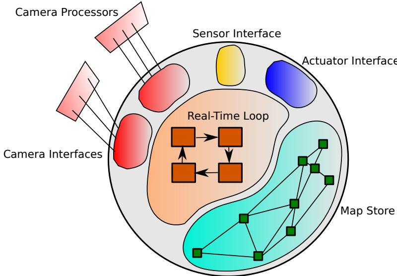
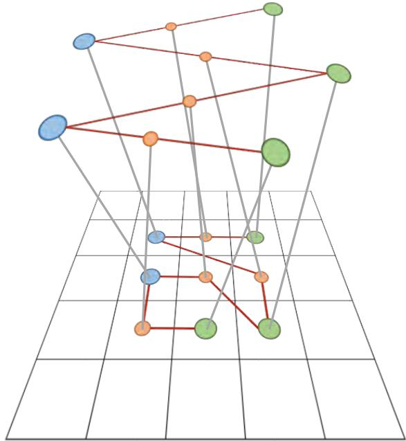
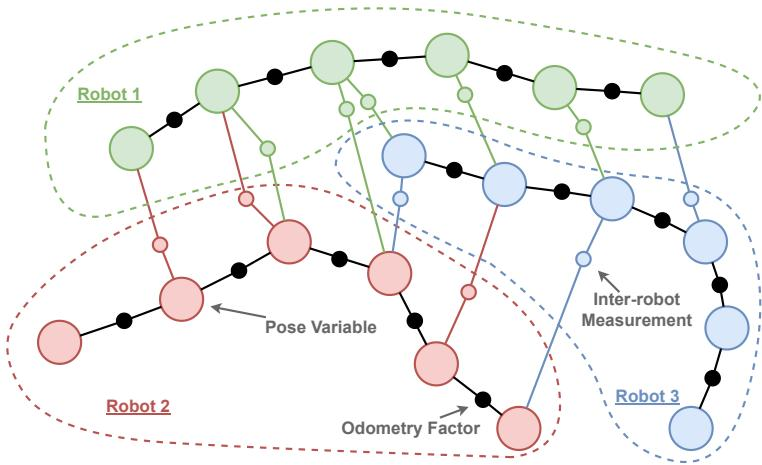
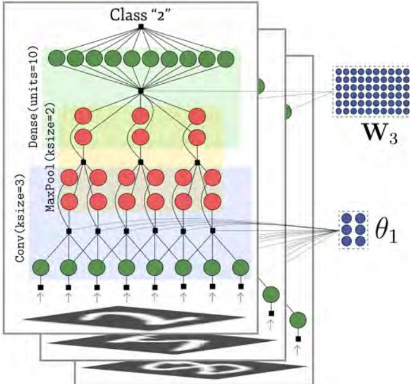

# 《SLAM Handbook：从定位与建图到空间智能》

## 第 18 章  空间智能系统的计算结构

**作者：** Andrew J. Davison

SLAM 算法能够绘制环境地图并估计设备在其中的位置，已经促成了许多重要的新产品和能力，并正在工业自动化、家庭机器人、无人机以及虚拟/增强现实（VR/AR）等领域产生影响。然而，我们认为这只是更大事情的起点：人工设备有能力构建真正丰富而高效的周围环境表示，使其能够以通常意义上的智能方式与环境交互。我们将这种能力定义为**空间智能**（Spatial AI）；这一术语最早在《FutureMapping》[245] 中提出。

本章认为，空间智能能力是本手册前文所述 SLAM 研究的持续演化。我们将预测并分析未来几年空间智能系统的能力和计算结构，尤其关注机器学习以及新型感知与计算硬件将产生的影响。

## 18.1 从 SLAM 走向空间智能

### 18.1.1 具身智能设备需要空间智能

空间智能系统的目标不是抽象地理解场景，而是持续构建恰当的表示，以支持实时解释和一般性的智能行动。此类系统的设计，一端由任务对性能的要求界定，另一端则受到设备使用环境和形态所施加的约束。

设想未来面向大众市场的家用机器人产品，任务是监视、清洁和整理若干房间。机器人可以是人形机器人，也可以是具备通用移动和操纵能力的其他平台。任务要求包括清洁或扫除表面并判断何时已清洁；识别、整理、搬运和操纵物体；以及及时而有礼貌地应对人类，例如主动让路或提供帮助。与此同时，由传感器、处理器和算法组成的空间智能系统还要受到价格、外观、尺寸、安全性和功耗等因素的约束，所有这些都必须符合消费产品的范围。

再考虑一个不同领域的例子：不是自主机器人，而是面向人的可穿戴辅助设备（为了对称起见，可以称为“IA”，即 Intelligence Augmentation，智能增强）。我们设想一种未来的增强现实系统，为佩戴者提供关于所遇到的所有地点、物体和人的可靠空间记忆，从而能够轻松找回遗失物体，并在世界中的任意实体上放置虚拟便签或其他注释。这种能力可以让一个人的完整生活上下文自动提供给始终在线的大型语言模型（Large Language Model，LLM）助手，并可能全面增强其智能能力。为了得到广泛采用，该设备应当具有标准眼镜的尺寸、重量和外形（约 65 g），并且全天运行而无需充电（功耗小于 1 W）。

目前，这类强大空间智能系统在有用应用中需要完成的事情，与现实约束下现有技术能够达到的水平之间存在巨大差距。关于所需算法和技术已经有许多很有前景的研究，但即使可以使用昂贵而笨重的传感器和无限的计算资源，要获得稳健性能仍然困难。一旦把真实产品的约束考虑进来，现实与期望性能之间的差距会更加显著。尤其是，目前支持先进机器人视觉的计算处理器，其尺寸、成本和功耗要求还远远无法满足我们设想的这些应用。

### 18.1.2 场景表示与世界模型

我们认为，空间智能的关键在于表示。表示是保存在计算机内存中的一组数值，它以持久、可适应并且会持续变化的方式描述具身设备及其周围世界的状态：设备获得关于世界的新信息时，或世界自身状态发生变化时，表示都会更新。出于效率原因，设备也可以选择对表示的某些部分进行抽象，甚至将其“遗忘”。

“世界模型”（world model）一词最近在机器学习研究中流行起来[423]，其含义与场景表示非常接近。许多机器学习研究者将世界模型视为相对较新的研究领域，因为当前训练得到的神经网络架构大多是无状态的：它们只是处理输入，并将输入确定性地变成输出。机器人学习领域目前正在大量研究如何以“端到端”方式训练此类网络执行任务，即在自动驾驶到物体操纵等各种领域，将传感器输入直接转换为动作。这些方法往往极其有效，但难以完成长时域任务。

神经网络中的世界模型研究，旨在为网络配备能够表示系统及其环境变化状态的持久记忆模块，从而支持仿真和更长期的规划。

尽管这是近来的新兴趣，世界模型和场景表示的思想在更广义的人工智能领域当然有悠久历史，而机器人领域的 SLAM 研究正是最清晰的例子：构建持久场景表示，可以实现一致的长时域行为。最直接地说，在自主无人机或扫地机器人等应用中，SLAM 地图可以支持可靠地长期导航至多个航点，或保证覆盖指定区域。

当 SLAM 从为定位构建最小场景表示，扩展到稠密、语义化、对象级甚至能够预测物理状态的场景模型时，设备将可以用一般方式进行仿真和规划。模型预测控制（model-predictive control，MPC）可以在增量构建且准确、最新的机器人环境仿真中运行，即使在物体操纵任务中也能产生最优而富有创造性的行为。

许多机器学习研究者可能会认为，“世界模型”应当比 SLAM 系统通常输出的显式三维场景地图抽象得多。我们同意，仍需要大量研究来确定哪些世界表示能够在保持高效和实用的同时实现真正的空间智能。然而，显式描述场景几何和物体的表示，在效率、可组合性、可解释性和通用性方面具有许多优势。

因此我们提出如下假设：当设备必须长时间运行，执行多种任务（其中并非所有任务都在设计时已知），并与包括人类在内的其他实体通信时，其空间智能系统应构建一种通用且持久的场景表示；该表示至少在局部应接近度量三维几何，并且能够被人类理解。需要明确的是，这一定义为场景表示留下了大量选择空间，表示中可以同时包含学习得到的元素和人工设计的元素；但它排除了使用非常具体的任务专用表示的算法，也排除了完全抽象的“黑箱”世界模型。

我们的第二个假设是：空间智能系统对于广泛任务的有用程度，可以用数量相对较少且具有一般重要性的性能度量来描述。无论系统用于引导配送无人机在狭窄空间中自主飞行、指导家用机器人整理房间，还是让增强现实显示器向场景加入合成物体，虽然这些应用确实具有不同的需求和约束，其空间智能系统总体上应当相似，差别可以由少量性能参数规定。显然的参数包括全局设备定位精度和更新延迟，但我们认为还有一些对应用更有意义的指标，例如表面接触距离预测精度、物体识别精度或跟踪稳健性。第 18.8 节将进一步讨论性能度量。

在本章其余部分，我们将这种模块称为空间智能系统：它从主要由视觉输入构成的数据中，以实时方式增量构建并维护一种接近度量的、具有一般用途的场景表示，并且具有可量化的性能指标。

Judea Pearl 最近在讨论高效的情境学习以及推理因果关系的必要性时指出[856]：“人类拥有而其他物种缺乏的，是一种心理表示，即他们可以随意操纵的环境蓝图，用来想象替代性的假设环境，从而进行规划和学习。”我们认为，空间智能同样将使先进机器人和设备脱颖而出，把具身智能提升到新的层次。

此外，有证据表明，人类的空间推理能力还被更广泛地用作智能的基本工具：即使面对抽象概念，人类也会通过空间化的方式组织思维[71]；人工系统可能也能从中受益。

### 18.1.3 SLAM 正在演化为空间智能

SLAM，尤其是视觉 SLAM 的研究长期以来由实时演示、实时可视化和开源代码发布所推动。MonoSLAM、PTAM、KinectFusion、LSD-SLAM、SVO、ORB-SLAM、iMAP 和 Gaussian Splatting SLAM 等系统的实时演示，与其说是数据集结果，不如说更能代表进展。这是因为数据集通常只能捕获系统性能的有限方面（尤其是精度），却无法突出同样重要、并且可以通过短时实时演示直接评估的稳健性、效率和灵活性。

实时视觉 SLAM 能够实现的场景表示水平逐步提高：从稀疏特征到稠密地图，再到日益丰富的语义标签。商业 SLAM 提供商 Slamcore 分别将稀疏定位、稠密建图和语义标注称为第 1、2、3 级能力。再往上，场景表示发展的最终目的也许是场景图：由准确分割、可进行物理仿真的对象实例组成的几何结构，并以层次方式组织（进一步讨论见第 16 章）。这些都是 SLAM 走向空间智能的连续步骤。观察 SLAM 三十多年稳定而持续的进步后，我们已经确信，当前以及可预见的 SLAM 系统的运行方式，是推断未来空间智能算法结构的最佳依据。

需要强调的是，尽管可以用分级方式理解这一过程，SLAM 系统的进步通常并不是在一个已经工作的系统上简单增加层次。相反，每一次表示方式的改变都会导致整个系统重新设计。例如，一旦拥有稠密场景地图，就可以用它实现准确而稳健的直接跟踪来完成相机定位；语义场景标注也可以提高稠密重建的质量。这种思维方式是实时系统研究固有的一部分，因为系统的每个部分都会在闭环中影响其他部分。

因此，我们坚信，持续进行的 SLAM 研究是目前发展空间智能最好的模型。

## 18.2 总体计算结构

当一个至少带有相机和其他传感器的传感器平台在世界中移动时，其运动可能由主动控制产生，也可能由另一名操作者提供。无论空间智能系统属于何种形式，其基本工作方式都可以概括如下：

1. 系统由面向外部的传感器（例如相机）和辅助传感器（例如 IMU）组成；这些传感器与低功耗封装中的处理架构紧密集成，并嵌入机器人或增强现实系统等移动实体。
2. 系统必须实时维护并更新包含几何和语义信息的世界模型，并仅根据或主要根据机载传感器的测量，估计自身在该模型中的位置。
3. 系统应提供大量与任务相关的信息，回答场景中“什么”位于“哪里”。理想情况下，它应提供周围所有物体及其他实体的完整语义级模型，包括身份、位置、形状和运动。
4. 世界模型的表示至少在局部应接近度量表示，从而使人工智能或智能增强系统能够快速推理任意感兴趣的预测和测量。
5. 系统可能只在重点区域保留几何和语义的最高质量表示，最明显的是当前正在观测且与近期交互相关的场景部分。模型的其余部分将以多个残余质量层级存储，重新访问时可以迅速升级。
6. 系统应当总体上保持警觉，即将每一份输入视觉数据都与前向预测的场景模型进行比较，用于跟踪、检测环境变化以及检测独立运动，并能够响应环境变化。

这种方法的关键计算特性是闭环性质：世界模型持久存在并以增量方式更新，以抽象形式表示截至目前获得的所有有用数据，并在实时循环中用于数据关联和跟踪。这与纯视觉里程计等增量估计视觉系统不同；后者只逐帧估计相机运动，不保留长期数据结构。它也不同于只能通过离线、事后批处理来实现全局一致性的系统。闭环空间智能系统并不意味着每项计算都要以固定频率发生；更重要的是，需要时计算必须可用，使整个系统能够无停顿地继续实时运行。

高层思考的下一个要素，是确定如何在低功耗要求下实现上述全部能力并保持高性能。我们认为，空间智能高效处理的关键，是识别算法中计算和数据移动所形成的图，并尽可能使用具有相同性质的处理硬件，或者专门设计这类硬件，尤其要尽量减少数据在架构内部的移动。我们需要回答：什么存储在哪里？什么在哪里处理？什么在何时传送到哪里？

这里不打算在神经科学方面作出强类比，但显然可以把人工空间智能系统的思想和设计，与生物大脑的视觉及空间推理能力和结构联系起来。人脑似乎只用不到 10 W 的功耗，就能实现高性能、完全“嵌入式”的语义和几何视觉；它的结构也确实体现了我们讨论的某些概念。我们把进一步分析这些关系的任务留给其他作者，部分原因是我们缺乏神经科学方面的专业知识，部分原因则是我们认为，虽然人工视觉系统显然仍有很多地方可以向生物学学习，但它们不必被设计成复制大脑的性能或结构。我们从纯工程角度考虑空间智能计算问题，目标是在最小资源下获得应用所需的性能。我们的解决方案有些方面模仿生物进化发现的机制并不奇怪，但在另一些方面，由于两个对比，我们也可能找到非常不同的方法：第一，进化采用的是增量式、必须始终工作的设计路线，而人工智能设计拥有更大的自由度；第二，生物湿件与可用作计算基底的硬件存在差异。

在将这种计算分析具体化、提出空间智能实现的通用设计之前，还需要考虑两个重要主题：（i）状态估计与机器学习；（ii）未来处理器和传感器硬件的整体格局。下面两节将讨论这两个主题。

## 18.3 空间智能中的状态估计与机器学习

本手册的大部分内容介绍了由人类设计的算法和表示，主要是基于概率论的“状态估计”方法。在后面的章节中，我们看到多种机器学习技术逐渐出现。机器学习在 SLAM 中的关键工具是人工神经网络。相对于更广泛的人工智能领域，SLAM 的特点是尚未完全被机器学习统治。定位和稀疏建图的最佳系统仍主要由人工设计；稠密和语义 SLAM 系统则采取折中方式，用机器学习替代状态估计的一部分功能，或在其上增加功能。不过，机器学习技术逐步覆盖空间智能更多功能的趋势是不可否认的。

在机器学习首次用于 SLAM 的一些工作中，学习模块只增加了一层功能，并未直接与状态估计组件交互。例如，SemanticFusion [747] 使用基于 CNN 的语义图像分割，为 ElasticFusion [1184] 生成的稠密几何地图增加标签。随后人们逐渐认识到，学习组件可以在 SLAM 的核心几何估计循环中发挥重要作用，主要形式包括：

1. 训练网络从单幅图像预测几何属性，例如深度图、法向图或物体分割。
2. 用组件更新标准几何估计（如位姿和点云），DROID-SLAM 就采用了这种方式；这类网络通常执行匹配或几何优化等运算。
3. 最新的网络从多幅图像输入产生质量更高的几何预测，例如 DUSt3R 和 VGGT。

尽管神经网络可以直接预测几何（例如从单幅图像预测深度图），但在 SLAM 中使用这些输出一直很困难，因为单视图预测通常包含很大的系统误差，而且其不确定性并不容易理解。一条有希望的路线，是训练网络预测比原始深度稍弱的属性，例如编码深度 CodeSLAM [91] 或深度协方差 [269]，再通过低维的多视图优化实现一致的稠密几何融合。

单视图研究最终可能希望得到这样一种网络：它把输入图像转换为一组可靠的、具有语义且类似物体的实体，随后用这些实体填充高效、抽象的三维物体地图或场景图，并通过持续的动态多视图优化和更新来维护。SLAM++ [964] 首次探索了这一思路，它直接在已识别的三维物体层级构建高效场景图地图，但要求预先拥有每个物体的三维模型。该思路的现代推广是 SuperPrimitives [744]，它使用通用的单图像物体分割和局部重建，从而支持任意三维物体片段的长期建图。

机器学习在空间智能中的吸引力可能有两个关键方面。第一，神经网络能够学习执行一些很难手工设计的任务，例如场景标注或深度预测。第二，神经网络将迭代计算压缩为高效而计算简单的形式，可以在现代处理器上以前馈方式快速运行。

我们自然会问，未来 SLAM 和空间智能是否最终会完全由神经网络端到端完成，而不再需要人工设计的表示或状态估计。许多研究者确实相信这一点；从端到端视觉里程计早期的 DeepVO [1163, 1299]，到能够直接从一组无位姿图像输出三维点云的 VGGT，已经出现越来越令人印象深刻的工作。

这些工作必然会继续改进，但我们认为，在可预见的未来，结合学习和状态估计的混合方法仍然更可取，理由有若干。首先，网络预测的不确定性仍然难以理解，而系统需要持续更新并融合数据到模型中。假设一个网络能够根据 100 张图像生成三维场景模型，当再获得一张图像时，应当如何更新它？显然不应该把包含 101 张图像的整个网络重新运行一遍。一旦承认需要长期表示和数据融合，就需要概率状态估计工具，也就有充分理由采用模块化场景表示。

从中期来看，空间智能系统必然会把学习组件和人工设计组件紧密集成到难以区分的程度。这个状态既可以通过向人工设计系统不断加入学习模块达到，也可以通过向纯学习系统加入结构达到。无论采用哪条路线，仍然重要、并且正是本章关注中心的，是整个系统的存储和计算结构。

## 18.4 处理器和传感器硬件的未来格局

### 18.4.1 处理器

多年来，SLAM 研究处在这样一个时代：单核 CPU 处理器的时钟频率（因而串行处理能力）可以可靠地每 1～2 年翻一番。近年来这一点已经不再成立。描述集成电路中晶体管密度翻倍速度的摩尔定律的严格定义，直到当前仍大体成立；改变的是，晶体管密度不再能按比例转换为串行 CPU 性能。这是因为另一条不太知名的经验规律“Dennard 缩放”已经失效：该规律认为，晶体管缩小时其功率密度保持不变。当晶体管缩小到今天的纳米尺度，尺寸已经不再远大于组成它们的原子时，漏电流和发热会变得严重。这堵“功耗墙”把能够在不过热的情况下合理运行的时钟频率限制在约 4 GHz。

因此，处理器设计者越来越需要通过提高时钟以外的方式提升计算性能。正如 Sutter 的在线文章《Welcome to the Jungle》[1062] 所描述的，处理器格局正变得更加复杂、并行且专用；即使是“云”数据中心中的处理器设计，也在变得更加多样和复杂。对于空间智能这类嵌入式应用，摆脱 CPU 的压力更大，因为功耗是关键问题；在满足真实产品功耗限制的前提下，并行、异构、专用处理器似乎是达到空间智能所需计算性能的唯一途径。因此，当前无人机等嵌入式视觉系统经常只用 CPU 实现 SLAM 算法（而不是要求 GPU），但我们认为长期来看这并不是正确方向。虽然当前桌面 GPU 确实耗能较高，空间智能必须充分拥抱并行性。不过，GPU 只是未来几年将出现的广阔处理器设计空间的起点。对于这一领域的大胆思考，我们强烈推荐 Julien Martel 的近期博士论文[734]。

大约 20 年前，主流几何计算机视觉开始利用 GPU 形式的并行处理（例如[880]）；在空间智能中，这促成了稠密 SLAM 的突破[800, 801]。GPU 提供的 SIMT（Single Instruction, Multiple Threads，单指令多线程）并行性非常适合实时视觉中的一类操作：在图像空间或地图空间的规则数组的每个元素上同时执行相同运算。同时，GPU 也是计算机视觉深度学习兴起的核心，因为它提供了训练足够大规模神经网络所需的计算资源，使其最终能够在图像分类等重要任务中证明价值。

从 CPU 转向 GPU 作为计算机视觉的主要算力来源，只是处理技术演化的开始。我们预见未来的嵌入式空间智能系统将采用异构、多单元、专用的架构，在高性能的同时实现低功耗。十年后的嵌入式视觉标准 SoC（system-on-chip，片上系统）可能用于个人移动设备、消费机器人或 AR 头戴设备，其中仍会有与今天 CPU 和 GPU 设计相似的单元，因为它们灵活且可以运行数量巨大的实用软件；但它很可能还会包含多个针对低功耗实时视觉优化的专用处理器。

兼顾速度和低功耗的高效处理，关键是把计算分配给大量时钟频率相对较低或结构更简单的核心，并尽量减少核心之间的数据移动。CPU 在计算过程中逐个从独立的主存储器中取出和写回小块数据；除了对经常使用的数据进行本地缓存外，它没有太多减少数据流的方法。单 CPU 编程较为直接，因为任何算法都可以分解为访问单一中心内存的顺序步骤，但数据在中心内存与处理器之间逐块流动会带来巨大的功耗。

更高效的处理器设计会让处理单元与所操作的数据彼此靠近，并限制中间结果的传输。理想方式是让处理器/存储器架构的设计与其运行的算法高度匹配。对于许多计算机视觉处理任务，GPU 相比 CPU 具有明显优势，但归根结底，GPU 最初是为计算机图形学而非视觉和人工智能设计的处理器。它的 SIMT 架构能够高效运行对大量不同数据元素同时执行相同操作的算法；而在完整的空间智能系统中，仍有许多方面不适合这种方式，因此目前需要 CPU/GPU 联合架构，并在二者之间进行大量数据传输。

虽然设计定制的“加速器”处理器来高效实现某些特定低层算法相对容易，但直到最近，人们很少从整体计算结构出发思考空间智能这类闭环嵌入式系统。如今，低功耗视觉已成为工业界日益重要的目标，因而出现了 Movidius Myriad 系列等定制处理器。这些处理器将低功耗、类似 CPU 的单元、类似 DSP 的单元和定制单元组合在一个完整封装中。Microsoft 为第一代 HoloLens AR 头戴设备定制的 HPU 也采用了相似设计。更近期的 Apple Vision Pro 使用定制的 Apple R1 协处理器处理实时传感器输入；Meta 的 ARIA Gen 2 智能眼镜研究设备则采用了用于“超低功耗、设备端机器感知”的定制硅片，使 SLAM、眼动跟踪、手部跟踪和语音识别无需外部电池即可在设备上运行。这些商用芯片及其运行算法的细节属于机密，但可以设想，它们是为高效运行小型神经网络、其他图像处理以及一定程度的通用概率优化而定制的。

如果把视线放得更远，我们可以设想处理器架构，使其与算法之间更加紧密匹配。与我们的目标特别相关的是，目前正在开展的重大工作：用大量相互独立、规格相对较低的核心进行大规模处理，重点关注通信。曼彻斯特大学的 SpiNNaker [348] 是一个旨在模拟生物大脑的研究项目；它已制造出原型机，每块板上有数百个 ARM 核心，总数最多可达一百万个。以不同的商业目标提供一种重要的新型 AI 处理器的 Graphcore，是一家英国公司，正在开发“智能处理单元”（Intelligence Processing Unit，IPU）处理器。IPU 在单芯片上包含数千个核心，每个核心都可以在自己的本地内存上运行独立程序，并通过高效可编程的互连结构通信。Tenstorrent 和 Cerebras 等其他公司也在设计有趣的新型芯片。

这些项目主要关注神经网络的高效实现。SpiNNaker 和 Graphcore 都认为，关键在于大量核心的整体拓扑：每个核心执行不同的操作，但通过适配使用场景的图结构实现高效互连。这些设计并未对每个核心执行的处理类型或交换的消息类型作出强约束，希望把这些选择留给未来程序员。这与更明确的神经形态架构相反，后者试图实现对生物大脑运行方式的特定模型，例如 IBM 的 Truenorth 项目。

这类架构目前还没有接近嵌入式视觉的实用阶段，但对于设计空间智能系统具有巨大的长期潜力：算法和数据存储的图结构可以与处理器上的实现相匹配，从而获得定制且可能极其高效的系统。后文将进一步讨论这一点。

我们还认为，不应只考虑把空间智能映射到单个处理器，即使该处理器内部具有图结构。更一般的图还可以描述与相机及其他传感器、执行器和其他输出的通信；描述共享同一环境的其他独立机器人和设备；并且可以扩展到云中的、完全位于设备之外的计算资源。

### 18.4.2 传感器

相机是空间智能中最重要的传感器。随着传感器设计者不断创新，“相机”的概念如今正变得越来越宽泛；在本章中，我们把本质上能够捕获光测量阵列的任何设备都视为视觉传感器。大多数相机是被动的，即记录和测量从周围环境到达的环境光；另一大类相机则以某种受控方式发出自己的光。在空间智能中已经使用了许多相机类型，最常见的是被动单目和双目相机组，以及基于结构光或飞行时间概念的深度相机。每种相机设计都代表一种权衡：它提供的信息质量（例如空间和时间分辨率、动态范围）与对所用系统施加的约束（例如尺寸和功耗）之间需要取舍。我们在先前工作[428]中研究了实时跟踪这一空间智能子问题中性能与计算成本之间的部分权衡。

正如本手册已经讨论的，事件相机是空间智能中一种特别有前景的传感器。它只感知并传输强度变化，从而去除冗余。事件流以低得多的比特率编码视频的信息内容，同时在时间灵敏度和强度灵敏度方面具有优势。这很可能只是图像传感器技术即将快速变化的起点；低功耗计算机视觉将成为越来越重要的驱动力。

该领域一个重要的学术项目，是曼彻斯特大学开发的带有平面内处理能力的 SCAMP 系列视觉芯片（介绍见[735]）。SCAMP5 以 1.2 W 运行，图像分辨率为 256×256，每个像素都可以由逐像素处理单元控制和处理。利用模拟电流模式电路，可以极其快速、高效地完成求和、减法、除法、平方以及与相邻像素通信等操作，从而完全在芯片上实现相当程度的实时视觉处理。在只需要低更新率的应用中，也已经可以实现超低功耗运行。

正如后文将讨论的，这种图像平面处理器最终能够执行的视觉处理范围还有待充分探索。最直接的用途是前端预处理，例如特征检测、局部运动跟踪或分割。我们认为其长期潜力在于：完整的、基于模型的空间智能仍需要中心处理器，但靠近传感器的处理可以通过低通信量的双向交互与中心处理器完全协同，主要目标是减少传感器与主处理器之间所需的比特率，进而降低通信功耗。

最后，在考虑空间智能计算资源的演化时，绝不能忘记云计算资源将继续扩大容量并降低成本。未来所有空间智能系统很可能大多数时间都连接到云端；从系统角度看，可以假设云端的处理和存储资源近乎无限且免费。真正不免费的，是嵌入式设备与云之间的通信，尤其当传输视频等高带宽数据时，通信可能消耗大量功率。另一个重要因素是时间延迟：将数据发送到云端处理通常会产生显著的几分之一秒延迟。在某些应用中，始终在线的高带宽云连接也不可行，例如太空、水下或地下环境。

## 18.5 将空间智能图映射到硬件

现在更具体地讨论空间智能设备的架构设计。尽管通过云连接进行共享建图具有明显潜力，本节选择只关注这样一种单设备：它只依靠机载资源在环境中运行。这是能力最通用的配置，可以用于任何应用而不需要额外基础设施。

我们认为，在空间智能计算系统的总体架构中，实现高效性能的长期关键，是让算法的自然图结构与物理硬件的配置相匹配。正如前文所见，这种思路会引出靠近传感器的处理（例如平面内图像处理），并通过事件等原则，尽量减少从传感器以及向执行器或其他输出传输的数据。

不过，我们仍然认为，嵌入式空间智能系统的大部分计算最好由相对集中的处理资源完成。关键原因是，增量构建并使用的世界模型始终发挥着核心作用，它表示系统对自身状态和环境状态的认识。来自可能多个相机和传感器的每一份新数据，最终都要与该模型比较：如果与设备的短期或长期目标相关，就用于更新模型；否则就被丢弃。

图 18.1 空间智能大脑：一般空间智能系统的表示图和处理图结构如何映射到图处理器。关键元素包括实时处理循环、基于图的地图存储，以及与传感器和输出执行器连接的模块。我们还设想在视觉传感器中集成额外的“靠近传感器”处理，以降低主处理器与相机之间的数据带宽；这些相机通常位于距离主处理器一定距离的位置，未来通信可能是双向的。

### 18.5.1 世界模型处理

我们为这种中心处理资源设想的形式，远不是 CPU 加上类似 RAM 的存储器。CPU 访问 RAM 的任意内容时成本大致相同，但在空间智能中，世界知识数据的局部性以及把新数据纳入其中的计算负载组织，都包含更多结构。

处理和存储的图结构应当内置于中心世界模型计算单元的设计中，并以完全集成的方式将存储与处理结合起来。当前已经有许多重大工作，正在探索如何设计显式且灵活的图状架构。

以一种处理器概念为例，Graphcore 的 IPU（或图处理器）设计用于高效执行能够很好地建模为稀疏图操作的 AI 负载，尤其适合所有所需存储都保存在同一图中、而不是外部存储器中的情况。IPU 芯片包含大量独立核心（数以千计），每个核心都可以运行任意程序并拥有自己的本地存储；同时还具有强大的通信基底，使核心之间能够高效发送消息。要在 IPU 上运行程序，首先需要分析它所需的计算和通信模式，并将程序编译成适当形式，然后生成经过优化的操作、数据和通信通道位置的图拓扑。

图 18.1 首次尝试绘制了一个“空间智能大脑”模型，类比 Graphcore 将计算图编译到 IPU 上的方式。圆盘表示我们预计会在主处理器内部运行的模块。两个主要区域之一是地图存储，其中保存当前世界模型。地图存储具有与世界几何相关的内部图结构，也包含相当强的内部处理能力，可以在模型数据的局部运行计算，后文将讨论其作用。第二个主要区域是实时循环，主实时计算在此完成，将输入图像流连接到世界模型。实时循环具有处理图结构，必须支持大规模实时数据流以及对图像/地图结构的并行计算，因此需要针对这些需求进行优化。

主处理器还包含其他模块。每个相机接口都负责对其所连接传感器到达的数据进行建模和预测。接口再与相机本身连接；机器人或其他设备的物理设计可能迫使相机距离主处理器较远。连接可以是串行的，也可以沿多条并行线路进行。

我们进一步设想，每个相机都内置自己的“靠近传感器”处理能力，并通过数据链路与主处理器分开。主处理器对输入建模的目标，是尽量减少实际传输到靠近传感器处理器的数据。靠近传感器处理器可以完全采用图像驱动的计算，类似 SCAMP 项目，并向主处理器提供抽象后的表示；也可以在相机和主处理器之间进行双向数据传输。主处理器把模型预测发送给靠近传感器的处理器后，后者就知道主处理器已经拥有哪些内容，只需报告差异。这是事件相机概念的推广：事件相机只报告强度变化，而未来最优的高效相机应报告接收到的数据与预测不一致的位置。第 18.5.3 节将进一步讨论靠近传感器的处理。

#### 18.5.1.1 世界模型

许多重要的 SLAM 方法已经认识并利用了世界模型的图结构（例如[534, 595, 964, 307, 754]）。

当机器人在世界中移动并进行观测时，SLAM 算法会检测、跟踪从图像数据中提取的特征，并将它们插入地图。这里“特征”一词采用广义含义，表示场景实体的某种抽象，并不局限于稀疏的点状路标。随着空间智能的抽象程度提高，这些特征很可能变成物体或其他语义实体。场景中的每个特征都有一个可以从中测量它的相机位置区域。当特征位于传感器视场之外、被遮挡，或者由于与首次观测时相比距离相机太远或观测角度差异太大等原因时，该特征就不可测量。

因此，机器人穿过场景时，特征会以具有不同重叠程度的模式变得可观测。对当前可见特征进行测量时，可以改进其位置估计；这些测量也用于估计相机运动。通过不确定的相机状态，同时观测到的特征位置估计彼此之间会产生强相关。就观测它们之间发生的相机运动量而言，“邻近”特征仍然相关，但相关性较弱；而“遥远”特征之间发生了大量运动（并且 SLAM 依赖中间特征），因此只有弱相关。

SLAM 算法输出的特征位置概率联合密度，可以用图高效表示：以强边连接“邻近”特征，以弱边连接“遥远”特征。对概率表示精度设置阈值，就可以切断较弱的边，从而得到只连接“邻近”特征的稀疏图。

SLAM 的一种做法不是显式估计场景特征的状态，而是构建移动相机历史上部分位姿的地图，并使场景地图保持隐式。这通常称为位姿图 SLAM（pose-graph SLAM，参见第 1 章）；在这种地图中，图结构显而易见，因为我们将能够获得传感器对应关系的位姿连接起来。时间上连续的位姿相连；如果能够检测到经过较长时间后的重新访问，也会把相应位姿连接起来，即形成回环。无论图表示历史位姿还是场景特征，其结构都非常相似：它连接“邻近”的位姿，或连接从这些位姿测得的特征；两种方法在本质上没有区别。

由此我们得出结论：空间智能最可能采用的表示，是用特征图表示三维空间。特征按照与相机运动有关的多尺度模式连接在一起，并共同生成稠密场景预测。在主处理器内部，应当用一个主要区域存储这张地图；地图可以分布在大量独立核心上，而核心之间的连接拓扑仿照地图图拓扑。SLAM 地图是动态定义和增长的，因此处理器中的图也必须能够动态变化，或者一开始就定义足够大的未使用容量，并随着 SLAM 运行逐步填充。

重要的是，大规模 SLAM 的很大一部分相关处理都可以直接构建进这张图。这些处理主要是地图进行自我优化、细化和抽象的“维护”计算，包括：

1. 特征聚类；物体分割与识别。
2. 回环检测。
3. 回环优化。
4. 地图正则化（平滑）。
5. 通过无监督聚类发现新的语义类别。

随着时间、数据和计算量的增加，一张起初包含稠密几何和低层特征的地图，可以逐渐细化为高效的对象级地图。这些操作将以高度并行且具有数据局部性的方式运行。例如，平滑和分割可以分别在图的各个局部进行；全局地图优化则可以通过消息传递实现，具体见第 18.6 节。最重要的是，所有这些过程都可以在地图存储内部完成。

当前 Graphcore IPU 等图处理器的片上内存完全分布在各处理 tile 之间，总容量较大（约每个 tile 1 MB，1000 个 tile 总计约 1 GB），但并不算巨大，尤其与处理器外部的标准 RAM 相比。因此，应当强调快速将地图存储抽象为高效的长期形式。不过，未来处理器可能拥有容量大得多的分布式存储。

### 18.5.2 实时循环

我们提出一个假设：未来 SLAM 系统最紧密的实时循环，其核心计算图将包含许多与今天系统相似的元素。这里的中心是 Newcombe 等人[799, 801, 800] 提出的稠密 SLAM 范式，因为这种方法试图以稠密、生成式的细节建模世界，使相机输入的每个新像素都可以与基于模型的预测进行比较。系统因此能够保持总体“感知”：它持续建模相机前方世界的状态，可以检测偏离模型的内容。基于稠密 SLAM 的系统也正在从静态场景走向动态场景的重建和跟踪[802, 957]。

稠密 SLAM 系统还可以最好地利用场景先验；这些先验今后将越来越多地来自学习，而不是人工设计。实时循环中的主要计算元素包括：

1. 图像到特征的经验标注，通常由神经网络完成。
2. 渲染：将世界地图中的内容生成稠密预测并投影到图像空间。
3. 跟踪：将预测与新图像数据对齐，包括找出异常值和检测独立运动。
4. 融合：把更新后的几何和标签融合回地图。
5. 从运行中的系统进行自监督学习。

这种处理既依赖相机和其他传感器的实时输入，也依赖世界模型，因此从某种意义上说必须位于二者之间。当需要预测场景视图、以便与新图像数据进行跟踪时，需要从地图存储读取数据；当使用新数据获得的几何和标签更新地图内容时，也需要从地图存储读取数据。这通常是 GPU 加速稠密 SLAM 中所熟悉的大规模并行处理。可以把这些函数定义为计算图中的固定元素，使用若干节点并访问主要计算资源的很大一部分。输入图像的分割和标注也可以在这里实现，但正如后文将讨论的，更合理的做法是通过靠近传感器的处理将它们放在主处理器之外。

对实时循环应用图处理最困难的问题，是这些操作与基于图的地图存储中相关部分的对应关系会因运动而持续变化。这样似乎无法为分布式存储器定义高效的固定数据路径。虽然地图存储内部会执行处理，但这些处理重点是维护地图；让数据在地图存储中快速移动，例如始终把当前观测区域放在图中的某个固定位置，似乎并不恰当。

一种可能的解决方案，是定义位于实时循环模块和地图存储之间的专用接口节点。这些节点专注于通信：一方面与实时循环处理的相关组件连接，另一方面与地图图中的多个位置连接；它们在某些方面可能类似哺乳动物大脑中的海马体。如果地图存储具有“小世界”拓扑，即任意部分之间都可以通过少量边跳数连接，那么接口节点就应能够用少量操作访问（复制）任意相关地图数据，并将其提供给实时循环。地图存储中的每个节点也必须参与这种通信过程，有时作为地图数据来回复制的路径。

### 18.5.3 靠近图像平面的处理

机器人或其他设备会有一个或多个与主处理器连接的相机。我们认为，未来技术将允许大量处理发生在传感器内部或其附近，核心目标是减少从相机流出的冗余数据。组成相机图像传感器的像素具有规则的、通常为矩形的几何结构。虽然每个像素通常独立感知光强，但许多视觉算法利用了邻近像素输出高度相关这一事实：邻近像素往往观测同一场景物体和结构的不同部分。

最常见的做法是使用规则图，将每个像素与它的四个邻居（上、下、左、右）连接起来，以此作为稠密匹配或光流估计等早期视觉问题中平滑操作的基础（例如[879]）。图像的规则图结构也被 CNN 的早期卷积层用于各种计算机视觉任务。卷积的多个层次同时体现了图像数据中局部规则性通常具有层次结构这一事实。

最直接地，可以使用类似 SCAMP5 [735] 的具有平面内处理能力的传感器，对输入图像流执行完全自底向上的处理：抽象、简化和检测特征，将图像压缩为更紧凑且信息更丰富的形式。也可以执行局部跟踪（例如光流估计）、分割和简单标注。这与视网膜和视神经执行的“早期视觉”处理存在生物学上的类比。

利用平面内处理进行跟踪是一个有趣的问题。平面内处理适合数据访问保持高度局部的任务，因此估计局部图像运动（光流）很合适，因为输出是每个像素处的运动向量。在每次更新时，可以利用基于相邻像素差异施加的局部平滑正则化来增强局部图像变化。如果考察 Pock 的 TV-L1 光流算法[879]的并行实现，会发现它包含逐像素并行操作：与数据项有关的纯并行步骤，与通过相邻像素之间消息传递实现梯度计算的正则化步骤交替进行。因此，这类算法非常适合在平面内处理器上实现。

SLAM 通常需要更具挑战性的跟踪：我们希望根据局部图像变化估计与模型相关的一致全局运动参数。例如，可以通过整幅图像对齐[707]估计两帧之间的全局旋转；也可以像稠密 SLAM [698, 799] 那样针对持久场景模型跟踪相机。在标准处理器上实现稠密跟踪时，需要在两种步骤之间交替：对所有像素并行计算误差项；通过归约步骤将所有误差相加并更新全局运动参数。归约步骤施加全局模型，扮演正则化角色；但这里的正则化是全局的而非局部的。

在现代系统中，这种全局跟踪通常最好由 GPU 和 CPU 协同完成，因此需要在二者之间定期（且代价高昂地）传输数据。但如果希望采用平面内处理并保持所有计算和存储的局部性，就不能使用这种方案。保持数据局部性的主要选择，是放弃跟踪解必然具有全局一致性的要求，而是通过局部消息传递逐渐趋近于一致。每个像素都可以保留所关注全局运动参数的自身估计，并在每次迭代后将估计与局部邻居共享。我们预计最终会达到全局收敛；经过一定次数的迭代后，每个像素保存的数值应当足够接近，以至于查询任意单个像素都能得到可用估计。如果平面内处理器还具有像素之间的较长数据传输链路，或者更一般地具有“小世界”互连模式，收敛速度会更快。

至于利用局部处理进行标注，这当然可行；但复杂标注面临的问题是，当前平面内处理器的内存非常小，很难存储学习得到的卷积掩模或类似数据。未来用于自底向上处理的处理器可能不再局限于图像平面，而是采用适合实现 CNN 各层的三维堆叠方式。目前三维硅堆叠仍然难以制造，并面临散热和成本方面的特殊挑战，但最终提取特征层次必将成为计算机视觉相机的内置能力。Featuremetric tracking [235] 等工作展示了这种能力的广泛用途；我们应当研究一个完全前馈的 CNN 在多任务学习训练下可以输出的全部内容。

一个有趣的问题是，靠近图像平面的处理是否会始终保持纯粹自底向上，或者相机与主处理器之间的双向通信是否值得采用。双向通信可以把世界地图中的模型预测以某种频率发送到相机，从而在相机侧执行更高层次的处理，例如基于模型跟踪相机自身运动或已知物体。

在极限情况下，如果能够把完整的基于模型的预测传送给相机，那么相机只需返回与预测不同的信息。这在某种意义上是事件相机工作方式的极限。事件相机在像素亮度发生变化时输出数据，相当于假设默认情况下相机看到的场景保持不变；一般的“基于模型的事件相机”则会在发生偏离预测的事情时输出数据。这些问题归结为“自底向上与自顶向下”处理之间的关键问题，下一节将进一步讨论。

最后，任何空间智能系统最终都必须提供由任务决定的输出：可以是发送给机器人执行器的命令，也可以是发送给另一台机器人的通信消息，或是在智能增强场景中发送给人类操作员的注释和显示内容。正如“靠近传感器”的处理有助于提高效率，“靠近执行器”的处理也应发挥作用，尤其是因为执行器或通信通道本身具有需要在紧密循环中纳入并融合的感知信号，例如执行器的扭矩反馈、AR 显示器的眼动跟踪或其他测量。

## 18.6 使用高斯信念传播的收敛式分布式计算

我们已经论证，效率和低功耗要求空间智能系统采用图结构：处理和本地存储被划分为模块，并可能分布在多个硬件处理器和传感器之间。但到目前为止，对于如何使这些存储的表示保持最新，还没有作太多说明。正如本手册各处所述，概率和估计理论为 SLAM 中的状态估计提供了基础背景；尤其是因子图[250]，一直是灵活表示复杂 SLAM 系统结构的通用工具。

Sutton 著名的 AI“苦涩教训”[1063]指出：“能够利用计算的通用方法最终最有效，而且优势非常大。”在空间智能中，如果我们确实相信低功耗计算和存储资源会在处理器内部以及处理器之间越来越分布式，那么值得选择的算法就应当能够随这些条件扩展。空间智能问题中最纯粹的知识表示是因子图本身，而不是由因子图推导出的概率分布，因为后者始终需要以某种近似形式存储。我们真正要寻找的是一种算法：将因子图作为主表示，在其上原地运行局部计算和消息传递，按需估计变量，同时考虑全局影响。消息应当持续在大型因子图中“冒泡”传播；因子图也会随着新测量因子和变量节点的加入而不断变化，可能永远无法完全收敛，但始终以可控方式保持接近收敛。估计过程还可能由注意力驱动：对当前重要的区域或方面投入大量计算，使其达到高质量；当注意力转移后，再以“及时”（just-in-time）方式允许这些区域逐渐退化到不那么最新的状态。

如果希望因子图估计具有完全局部的计算和数据存储性质，就必须放弃一种想法：即任何时候都能获得整个图结构的“上帝视角”。我们应当转向这样的方法：处理和存储图中的每个节点只需了解整个图结构的极少信息，最低限度是只知道自身和邻居的纯局部信息。

这正是概率因子图推断中信念传播（Belief Propagation，BP）算法族的特性。在 BP 中，每个变量节点和因子节点处理消息时，除了直接邻居之外不需要了解图的其余部分；BP 可以在任意异步消息传递调度下收敛，不需要全局协调。

当前几何空间智能估计中最重要的技术，尤其是扩展卡尔曼滤波和束调整（bundle adjustment，BA），都是基于高斯的技术。基于高斯的方法与线性代数有非常紧密的联系，因为优化高斯似然等价于最小二乘最小化，而后者需要求解线性系统。当图中的所有因子和变量都呈高斯形式时，BP 的具体形式称为高斯信念传播（Gaussian Belief Propagation，GBP）；在含有环的图中，GBP 对最优解具有特别强的收敛性质。

Davison 和 Ortiz 在《FutureMapping 2》[242] 中给出了 GBP 的一般介绍；在线文章《A Visual Introduction to Gaussian Belief Propagation》[833] 提供了交互式教程。这些文章表明，GBP 完全兼容空间智能问题中无处不在的非线性和稳健因子，并且可用于位姿图优化（PGO）、稀疏 SLAM、曲面拟合和图像平滑等问题。

此前已有工作在单个 CPU 上实现 GBP-SLAM [906]，展示了它即使在单 CPU 实现中也具有一些有用性质。Ortiz 等人[832] 则通过在 Graphcore IPU 芯片上使用 GBP 实现高性能 BA，展示了它的长期潜力：完全分布式实现求解小型真实视觉优化问题的速度比 CPU 快 30 倍。图 18.2 展示了如何把 BA 因子图简单地铺设到图处理器的 tile 上，以充分利用其并行性。

图 18.2 将束调整因子图映射到图处理器的 tile（核心）上，从而通过高斯信念传播实现快速、分布式、原地推断，改编自[832]（©IEEE）。这里展示最简单的映射方式：因子图中的每个节点映射到一个任意 tile。关键帧节点为蓝色，路标节点为绿色，测量因子节点为橙色。tile 以同步方式处理，在计算步骤和交换步骤之间交替进行。

Murai 等人在 Robot Web [788] 中进一步展示了 GBP 图上分布式计算的通用性，说明它也可以用于多机器人空间智能问题。具体而言，多机器人定位被表述为图 18.3 所示的单一因子图，并被划分、存储在由 Wi-Fi 等临时通信连接的机器人网络中。Robot Web 表明，即使消息传递异步、传感器发生故障并且通信丢包，GBP 仍能得到收敛且准确的估计。当展望机器人处理器的长期发展时，这些性质对单机器人空间智能同样很有希望：未来机器人处理器可能采用低精度数值表示以及异步或事件驱动并行等更接近大脑的机制，从而获得更高的单位能耗性能。

图 18.3 多机器人定位的因子图，取自 Robot Web [788]（©IEEE）。如彩色区域之间的点线所示，存储和更新因子的责任分配给参与其中的多个机器人。每个机器人维护自己的位姿变量节点、里程计因子，以及由自身传感器测得的机器人间测量因子，并在该图片段上持续运行 GBP。跨越点线边界的消息传递通过各机器人发布和更新的 Robot Web 页面完成，过程是异步且临时的。

## 18.7 因子图中的持续学习

第 18.3 节讨论了学习组件在空间智能中日益增加的重要性，但将这些组件与模块化状态估计连接起来仍然笨拙且存在许多局限。展望更远的未来，我们认为空间智能中的学习应当具备以下几项雄心勃勃的性质：

1. 学习将成为空间智能系统的关键部分，但应当与经过验证的人工设计概率推断算法无缝并行；后者能够正确地对多个不确定信息源进行加权和融合。
2. 学习的主要方式应当是自监督的，即正在运行的系统可以在没有外部帮助的情况下学习有用抽象，而不需要人类提供带标签的数据集。
3. 空间智能中的学习应当是持续的，作为运行系统的一部分进行，并使系统性能逐步提高。我们应当摆脱当前人为划分的“训练时间”和“测试时间”。
4. 学习组件最好能够解释，或者至少在模块以及模块之间连接的某个层级上能够被人类理解。

大多数学习算法，尤其是标准神经网络，都是分开训练和使用的。训练阶段通过梯度下降寻找模型参数（权重）的数值，并使用经验数值确定学习率和停止准则；同时还引入了将数据划分为训练集和验证集等临时概念。很难想象这类方法如何能够与概率估计一起，用于真正的持续、自监督学习。

我们首先认为，上述要求促使空间智能采用概率式机器学习方法。在概率机器学习或贝叶斯机器学习中，表示学习模型的参数使用与标准概率推断相同的概率推断规律进行估计。概率推断中的状态估计与贝叶斯机器学习中的模型学习之间不存在根本差别，区别只在于结构和规模。二者使用同一套机制，就可以在标准贝叶斯推断的同时正确处理自监督、持续学习。

高效且可扩展的贝叶斯机器学习是一个具有挑战性的主题，但 Nabarro 等人[793] 最近提出并初步演示了一种 GBP Learning 方法，它与本章提出的因子图空间智能构想完全兼容。核心思想是把过参数化的学习结构直接构建到因子图中，并使用标准的高斯信念传播机制进行贝叶斯推断，从而完成学习。我们不再使用神经网络的神经元和权重，而是构建具有相似结构的变量图和因子图。变量以等价于权重学习的方式推断数值，但这个过程可以持续进行，不需要明确区分训练时间和推理时间。非线性因子扮演神经元的角色，可以软切换，并以不同模式组合来表示复杂函数。图 18.4（取自[793]）展示了一个具有卷积结构的因子图模块；该模块已用于持续学习图像去噪和分类。

图 18.4 在 GBP Learning [793] 中，因子图的结构仿照常见神经网络架构，从而可以用 GBP 进行分布式训练和预测。可学习参数（圆圈）以及输入、输出和激活都作为随机变量加入。参数在所有观测之间共享，而其他变量则为每次观测复制一次。层与层之间的因子（黑色方块）约束表示在局部保持一致；连接输入和输出的因子则鼓励表示与观测相容。层间因子是非线性的，以实现软切换行为。该图像分类示例架构包含卷积层、最大池化层和稠密投影层；如果移除输出观测因子，同一架构也可以在无监督条件下训练。

这种方法或类似方法可能会为一般性的空间智能持续学习打开道路。例如，机器人可以在重建场景的同时学习该场景的平滑模型或分割模型。系统中学习组件和估计组件采用统一的因子图结构后，就可以灵活选择高效或分布式估计方式，也可以轻松地在多个设备之间同步已学习的元素。

## 18.8 性能度量

本章开头提出的一个假设是：空间智能系统对于广泛任务的有用程度，可以由数量相对较少、且具有普遍重要性的性能度量较好地描述。

SLAM 性能测量最常见的重点是定位精度；已经有多项工作为此创建基准数据集（例如[1045]）。通常将运动捕获系统提供的外部位姿测量视为真值，并以此比较 SLAM 算法。

我们已经论证，空间智能远不止位姿估计；较新的数据集也在尝试扩展可评估内容的范围。稠密场景建模很难评估，因为需要昂贵且耗时的过程（例如详细激光扫描），才能捕获一个真实场景的完整模型，而且模型必须足够准确和完整，才能被视为真值。对于这一维度以及其他评价维度，另一种选择是使用计算机图形学生成合成测试数据，例如 ICL-NUIM 数据集[429]。近来，这种方法还扩展到为语义标注提供真值（例如 SceneNet RGB-D [746]）；对于真实数据而言，语义标注也是难以获得高质量真值的输出。人们自然会怀疑在合成测试数据上评估的价值，同时也出现了通过众包收集大规模真实建图数据的新方法，例如 ScanNet [238]。不过，合成数据一直在改进，我们相信其重要性只会不断增长。

退一步说，我们甚至可以质疑空间智能系统使用基准的价值。人们经常评论计算机视觉研究者过度依赖数据集评估：大量精力被用于优化和组合算法，只为在基准上多取得几个百分点，而不是研究新的思想和技术。由于 SLAM 的实时性质，以及不同应用所需的各种有用输出和性能水平，很难用有意义的基准捕获 SLAM。我们一直认为，与任何现有基准上的测量性能相比，亲自运行一个视觉 SLAM 系统约一分钟，通过实时可视化自适应、定性地检查其行为，往往能更多地了解系统的有用性。因此，进展更有意义地体现在高质量实时开源 SLAM 研究系统的发展上，例如 MonoSLAM [244, 243]、PTAM [583]、KinectFusion [801]、LSD-SLAM [307]、ORB-SLAM [787]、OKVIS [645]、SVO [333]、ElasticFusion [1184]、DROID-SLAM [1082]、Gaussian Splatting SLAM [740] 和 MASt3R-SLAM [789]，而不是基准分数；人们可以直接对这些系统进行实验。

SLAM 基准之所以令人不满意，是因为它们会对场景类型和形状、相机及其他传感器的选择与安装、帧率和分辨率等作出假设，并且只关注某些评价方面（例如精度），却淡化了效率或稳健性等可能更重要的方面。例如，许多在精度基准上评估算法的论文，会从诸如[1045]的数据集可用测试序列中进行选择，只报告那些基本能够“工作”的序列上的结果。

这引出一个问题：我们是否仍应建立基准，并努力评估和比较 SLAM 系统？我们的回答仍然是肯定的，但应该扩大空间智能系统中“基准”的含义，并承认不能对基准告诉我们的内容过度信任。

由 PAMELA 研究项目[795]发布的 SLAMBench 框架，代表了评估完整空间智能系统的早期工作。在 SLAMBench 中，SLAM 算法（具体为 KinectFusion [801]）在一系列处理器平台上、使用不同语言实现，从精度和计算成本两方面进行测量。从长期来看，我们认为基准测试应当转向能够普遍预测空间智能系统完成任务时表现的度量。这显然是一个多目标指标集合，对 Pareto 前沿[796]的分析将允许针对特定应用作出选择。

一个可能的指标集合包括：

1. 新探索区域中的局部位姿精度（视觉里程计漂移率）。
2. 已充分建图区域中的长期度量位姿可重复性。
3. 跟踪稳健性百分比。
4. 重定位稳健性百分比。
5. SLAM 系统延迟。
6. 每个像素的稠密距离预测精度。
7. 物体分割精度。
8. 物体分类精度。
9. 用于增强现实的像素配准精度。
10. 场景变化检测精度。
11. 功耗。
12. 设备端数据移动量，以 bit×millimetre（比特×毫米）度量。

## 18.9 延伸阅读与近期趋势

最后，空间智能和 SLAM 研究领域将继续变得更加重要，并向许多不同应用所需的一般三维感知能力演化，最终充分结合人工设计的估计技术和机器学习技术。不过，实际应用的广泛使用需要能力提升同时伴随资源需求下降；这要求对算法、处理器和传感器进行协同思考。高效系统的关键，是识别算法和数据存储中的计算结构，并针对稀疏图模式进行设计，再尽可能使其与即将变得重要的新型硬件相匹配。

人工设计的状态估计和机器学习都将继续重要，并且必须充分集成，以支持灵活而持续的学习。我们相信，二者将出现有趣的趋同：状态估计系统不断加入更多学习元素，而学习网络则引入更多领域知识和结构。无论从哪条路线出发，都应当走向同一个目的地；关于计算结构的同一组研究问题仍然需要解决。
