# 《SLAM Handbook：从定位与建图到空间智能》

## 第 7 章  视觉 SLAM

**作者：** Jakob Engel、Juan D. Tardós、Javier Civera、Margarita Chli、Stefan Leutenegger、Frank Dellaert 和 Daniel Cremers

从相机观测中重建世界及传感器运动，是一项称为视觉同步定位与建图（Visual Simultaneous Localization and Mapping，Visual SLAM 或 VSLAM）的挑战。相机无处不在、价格低廉且功耗高效，因此视觉 SLAM 在自主机器人、自动驾驶汽车、混合现实和增强现实中具有无穷潜力。本章先介绍一些历史背景和术语（第 7.1 节），并概述典型的视觉 SLAM 流水线（第 7.2 节）。随后回顾视觉 SLAM 表述的关键要素（第 7.3 节），并介绍图像对齐和束调整（bundle adjustment，BA）的进阶主题（第 7.4 节）。之后描述完整视觉 SLAM 系统的实例（第 7.5 节）、实时三维重建（第 7.6 节）和基于深度相机的 SLAM（第 7.7 节），讨论将视觉与包括 IMU、GPS 和 WiFi 在内的其他感知模态结合的优势（第 7.8 节）。最后在第 7.9 节简要讨论新近趋势。

## 7.1 历史背景与术语

### 7.1.1 从摄影测量到束调整和视觉 SLAM

视觉 SLAM 的历史建立在通用 SLAM 方法之上，同时也根植于摄影测量和计算机视觉领域的进展。这里重点介绍它与后两个领域的历史联系；与 SLAM 的联系已在本书各处阐述。

1822 年，Nicéphore Niépce 发明了现代摄影；现存最早的照片是他于 1827 年拍摄的《Le Gras 窗外的景色》（A View from a Window at Le Gras）。利用相机重建世界的历史，在摄影发明数十年后开始。法国陆军军官 Aimé Laussedat 于 1851 年前后开创了将地面照片用于地形测绘的方法，因而常被视为摄影测量学的创始人。1867 年，德国工程师 Albrecht Meydenbauer 进一步将摄影测量发展用于建筑测量。自 1890 年起，德国数学家兼登山家 Sebastian Finsterwalder（自 1915 年起任德国数学会会长）开创了利用航空影像对阿尔卑斯冰川进行摄影测量重建，并倡导使用射影几何技术 [357]。其博士生 Otto von Gruber 则将束调整（BA）的数学框架形式化，用以从多幅图像中观测到的一组对应点重建结构和运动。这些概念形成于 20 世纪初，远早于计算机出现。之后，德国火箭科学家 Hellmut H. Schmid 开创了在计算机上部署这些方法：他发展了用于 BA 的矩阵计算技术，并于 20 世纪 50 年代与美国人 Duane C. Brown 合作，在当时规模最大的计算机上实现了这些方法。

重建方法和运动恢复结构（structure from motion，SfM）研究领域建立在多种相机模型之上，起点是针孔相机模型，以及用于刻画二维点观测与其相应三维世界坐标关系的射影几何。20 世纪 90 年代初，Tomasi 和 Kanade [1102] 在正交投影的简化假设下，提出了用于静态场景重建的矩阵分解技术。早期方法通常聚焦于两视图重建；到 21 世纪初，研究群体转向多视图运动恢复结构问题。传统重建流水线包含特征提取、对应关系估计、利用最小解获得初始相机配置，以及随后进行 BA 以获得全局一致的重建。因此，大量工作致力于开发特征提取与匹配算法，使用 SIFT [699]、SURF [62] 等特征描述子，近年又出现了大量基于学习的描述子。为应对错误的点对应关系，研究者提出 RANSAC [328] 等采样策略，使方法能够在模型拟合之间交替重新估计对应关系（参见第 3 章）。

运动恢复结构通常侧重于从无序图像集合中准确地（一般为离线地）重建大规模三维世界；而视觉 SLAM 通常侧重于从移动相机进行在线、实时重建。因此，此类在线实时方法的前提是发展因果方法，例如 [209]：它只使用过去图像（而非完整图像集或视频）解决最优运动恢复结构问题。具备实时能力的首批运动恢复结构/视觉 SLAM 方法大约在 2000 年出现 [524, 244]。

### 7.1.2 术语

下列术语常可互换地描述相近过程；但在不同应用和社群中，它们的侧重点不同。

**摄影测量（photogrammetry）** 是从二维照片中提取精确测量、空间信息和三维重建的科学。通过分析从不同视点拍摄的重叠图像，摄影测量能够创建物体或环境的几何表示。这一技术广泛用于制图、测量和三维建模，是许多视觉里程计与 SLAM 算法的基础。

**束调整（bundle adjustment，BA）** 是用于细化三维重建的数学优化方法。它调整相机的位置、姿态及可选的内参，以及所观测点的三维位置，以最小化重投影误差，即所观测图像点与从三维模型投影所得点之间的差异。优化通常使用 Gauss--Newton 或 Levenberg--Marquardt 等二阶方法，需要谨慎初始化和鲁棒离群值剔除才能有效收敛。近期研究还探索了无初始化 BA，旨在简化优化过程。

**运动恢复结构（structure from motion，SfM）** 是从不同视角拍摄的一组二维图像中重建三维结构的过程。不同于常假定相机位置已知的摄影测量，SfM 同时估计场景的三维结构和相机运动。SfM 通常用于非因果、非实时场景，图像可以来自不同来源（例如互联网照片集合），而非连续视频流。通常，SfM 最终会借助 BA 进行优化。诸如 Building Rome in a Day [14] 的标志性项目展示了它的可扩展性和大规模应用潜力。

**视觉里程计（visual odometry，VO）** 聚焦于通过分析视频中的连续视觉帧估计相机运动。它识别相邻图像之间的视觉对应关系，以测量传感器随时间产生的相对运动。VO 主要处理局部运动估计，在近期观测构成的滑动窗口内运行，并不构建全局地图。不过，VO 常与回环检测和建图组件结合，形成完整的视觉 SLAM 系统。

**视觉 SLAM（visual SLAM）** 是一种计算技术，使系统能在未知环境中同时进行实时自身定位和环境建图。它融合摄影测量、视觉里程计和运动恢复结构的要素，处理图像数据、跟踪相机运动并构建细致的三维地图。与 VO 相比，它通常显式识别先前访问过的地点、相对于这些地点重新定位，并可选地调整该“环”附近的位姿估计，这一过程称为**回环（loop closure）**。视觉 SLAM 是机器人、自动驾驶车辆和增强现实的核心技术；在这些领域，精确导航和环境理解至关重要。

## 7.2 视觉 SLAM 系统的处理流水线

构建完整的视觉 SLAM 系统，需要将多种组件组合为一个能够满足实时运行、可扩展性和鲁棒性要求的统一框架。关键考虑包括决定每个组件何时及如何运行、高效组织计算和数据流，以及确保其对多样环境的适应性。与 LiDAR SLAM 一样（参见第 1 章和第 8 章的引言讨论），视觉 SLAM 问题可以分为多个阶段，即将计算划分为 SLAM 前端和 SLAM 后端。然而，不同于基于 LiDAR 的系统，视觉系统并不直接测得三维几何，而是观测场景辐照度在成像平面上的投影，因此视觉 SLAM 的整体估计更具挑战性。现代完整视觉 SLAM 系统通常包含三个相互补充的核心子功能：里程计前端、建图后端，以及回环与重定位组件。本节主要概述该流水线，更详细的说明留待第 7.3 节。

### 7.2.1 视觉里程计前端

视觉 SLAM 系统的核心要素是视觉里程计，其目标是估计相邻相机帧之间的相对运动。这一阶段为相机位姿提供初始估计。如前所述，计算视觉里程计有两类方法：(i) 基于特征的方法将问题分为三个阶段：检测和提取特征点、计算图像间的两两对应关系，随后通过相对于相机运动和三维点坐标最小化重投影误差，确定相对相机运动。最后一个阶段与经典 BA 十分相似。(ii) 直接法一步处理该问题，直接相对于相机运动和三维结构优化光度损失函数。因此，它们与光流方法及有时称为光度 BA 的方法密切相关。

至少在朴素的早期表述中，由于具有显式数据关联，基于特征的方法表现出更大的收敛域。为缓解这一问题，直接法通常采用由粗到细的策略，即从对齐降采样图像开始，或者甚至尝试对齐稠密的（学习得到的）特征，而非亮度或颜色。

### 7.2.2 建图后端

后端使用 BA 或位姿图优化等全局优化技术，对轨迹和地图进行优化。该步骤细化前端给出的估计，并将观测（包括由地点识别得到的观测）整合为一致地图。因此，系统获得更长期的一致性，并减小长距离畸变。

### 7.2.3 视觉地点识别与重定位

视觉里程计易于漂移，因为相机跟踪误差会随时间累积。在没有 GPS 等绝对定位传感器时，可以通过将当前图像与先前观测图像对齐来消除漂移并强制全局一致性。为此，需要在可能很大的图像集合中计算对应关系。这可以通过高效匹配 SIFT、SURF 或 BRIEF 等经典特征描述子实现，也可以通过合适的已训练神经网络实现，后一方法近年来日益流行。所得组件检测相机何时重新访问先前已建图的区域（回环检测），校正累积漂移，并在跟踪失败时恢复定位。

### 7.2.4 计算与数据流

高效的数据流是高性能 SLAM 系统的必要条件：

**流水线并行。** 跟踪、建图和优化等不同组件通常并行运行，以最大化效率。

**数据共享。** 关键点或位姿等中间输出在组件间共享，以减少冗余计算。

**自适应调度。** 全局优化等计算密集型任务根据系统需求进行调度，并优先保证实时响应性。

## 7.3 视觉 SLAM 基础

下面回顾实现视觉 SLAM 前端、后端和视觉地点识别所涉及的要素。

### 7.3.1 相机模型

对于观测场景成像过程的参数化传感器描述，应包含几何组成部分（也称投影函数），它描述三维点如何映射到二维像素；还应包含光度组成部分，它描述物理光强（辐亮度）如何映射为像素值。

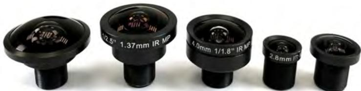
图 7.1 视觉 SLAM 系统的一项核心要求是选择合适的镜头。图中依次为 BF2M2020S23（195°）、BF5M13720（183°）、BM4018S118（126°）、BM2820（122°）和 GoPro 替换镜头（150°）。鱼眼和广角镜头提供更宽的视场，但需要合适的投影模型。常用选择包括 Brown--Conrady（BC）模型 [283]、Kannala--Brandt（KB）模型 [537] 和 Double Sphere（DS）模型 [1117]。六参数 DS 模型与八参数 KB 模型具有相当的重投影精度，而投影函数计算时间约快五倍。（©2018 IEEE）

#### 7.3.1.1 几何相机模型

**透视相机。** 投影函数一般记为：

$$
\boldsymbol {z} = \pi (\boldsymbol {x} ^ {c}, \boldsymbol {\xi}),
$$

其中，$\pmb { x } ^ { c } = \left[ x \quad y \quad z \right] ^ { \top } \in \mathbb { R } ^ { 3 }$ 是相机坐标系中的三维点，$\boldsymbol {z} = \left[ u \quad v \right] ^ { \top } \in \Omega \subset \mathbb { R } ^ { 2 }$ 是图像域 $\Omega$ 中对应投影二维点的坐标，$\pmb { \xi } \in \mathbb { R } ^ { n }$ 表示相机内参，通常已在视觉 SLAM 中预先标定。$\boldsymbol {\xi}$ 的维数取决于所用相机模型。

反投影操作记为：

$$
\boldsymbol {x} ^ {c} = \pi^ {- 1} (\boldsymbol {z}, \boldsymbol {\xi}),
$$

它从二维图像点 $\boldsymbol {z}$ 在三维中重建一条射线。由于点的深度未知，所得 $\pmb { x } ^ { c }$ 仅确定到尺度。

实践中，存在适用于不同镜头几何和相机类型的众多投影函数（例如参见 [687]）。直线模型（也称针孔或透视相机模型）最为简单，可用于无畸变的窄视场镜头：

$$
\boldsymbol {\xi} _ {p} = \left[ \begin{array}{c c c c} f _ {u} & f _ {v} & u _ {0} & v _ {0} \end{array} \right] ^ {\top}, \quad \pi_ {p} (\boldsymbol {x} ^ {c}, \boldsymbol {\xi}) = \left[ \begin{array}{c} f _ {u} \frac {x}{z} + u _ {0} \\ f _ {v} \frac {y}{z} + v _ {0} \end{array} \right], \quad \pi_ {p} ^ {- 1} (\boldsymbol {z}, \boldsymbol {\xi}) \sim \left[ \begin{array}{c} \frac {u - u _ {0}}{f _ {u}} \\ \frac {v - v _ {0}}{f _ {v}} \\ 1 \end{array} \right],
$$

其中 $f _ { u }$ 和 $f _ { v }$ 分别表示水平方向和垂直方向的焦距，单位为像素。$u _ { 0 }$ 和 $v _ { 0 }$ 表示主点的二维坐标，且这里假定像素为矩形。对于常见的方形像素，可预期 $f _ { u } \approx f _ { v }$。

为考虑一定程度的镜头畸变，最常用的是径向--切向模型：

$$
\begin{array}{c}
\boldsymbol {\xi} _ {R T} = \left[ \begin{array}{c c c c c} \boldsymbol {\xi} _ {p} ^ {\top} & k _ {1} & k _ {2} & p _ {1} & p _ {2} \end{array} \right] ^ {\top}, \quad
\left[ \begin{array}{c} x ^ {\prime} \\ y ^ {\prime} \end{array} \right] = \left[ \begin{array}{c} \frac {x}{z} \\ \frac {y}{z} \end{array} \right], \quad r = \sqrt {x ^ {\prime 2} + y ^ {\prime 2}}, \\
\left[ \begin{array}{c} x ^ {\prime \prime} \\ y ^ {\prime \prime} \end{array} \right] = \left[ \begin{array}{c}
x ^ {\prime} (1 + k _ {1} r ^ {2} + k _ {2} r ^ {4}) + 2 p _ {1} x ^ {\prime} y ^ {\prime} + p _ {2} (r ^ {2} + 2 x ^ {\prime 2}) \\
y ^ {\prime} (1 + k _ {1} r ^ {2} + k _ {2} r ^ {4}) + p _ {1} (r ^ {2} + 2 y ^ {\prime 2}) + 2 p _ {2} x ^ {\prime} y ^ {\prime}
\end{array} \right], \quad
\pi_ {p} (\boldsymbol {x} ^ {c}, \boldsymbol {\xi}) = \left[ \begin{array}{c} f _ {u} x ^ {\prime \prime} + u _ {0} \\ f _ {v} y ^ {\prime \prime} + v _ {0} \end{array} \right].
\end{array}
$$

注意，反投影模型 $\pi _ { R T } ^ { - 1 } ( \boldsymbol {z} , \pmb { \xi } )$ 无法写出解析表达式，因为无法从 $x ^ { \prime \prime }, y ^ { \prime \prime }$ 得到 $x ^ { \prime }, y ^ { \prime }$ 的解析解（即去畸变）。不过，可以采用迭代方法，例如 Newton--Raphson 方法。

**广角与鱼眼相机。** 对于视场（field of view，FOV）最高约为 $180 ^ { \circ }$ 的广角镜头（见图 7.1），具有少量径向畸变系数的针孔模型通常足够。Brown--Conrady 模型 [283] 等同于上述省略切向系数的径向--切向模型，即 $\boldsymbol {\xi} _ { B C } = [ \pmb { \xi } _ { p } ^ { \top } \quad k _ { 1 } \quad k _ { 2 } ] ^ {\top}$。注意，即使相对于径向--切向模型有所简化，仍不存在解析去畸变。

对于视场超过 $180 ^ { \circ }$ 的鱼眼镜头，例如 [142] 使用 Kannala--Brandt（KB）模型 [537]：

$$
\pmb {\xi} _ {K B} = \left[ \begin{array}{c c} \pmb {\xi} _ {p} ^ {\top} & \pmb {k} _ {K B} ^ {\top} \end{array} \right] ^ {\top}, \quad \pi_ {K B} (\pmb {x} ^ {c}, \pmb {\xi}) = \left[ \begin{array}{c} f _ {u} r (\theta) \cos \psi + u _ {0} \\ f _ {v} r (\theta) \sin \psi + v _ {0} \end{array} \right] ^ {\top}.
$$

这里，入射光线由角度 $\theta = \arctan \frac { \sqrt { x ^ { 2 } + y ^ { 2 } } } { z }$ 和 $\psi = \arctan \frac { y } { x }$ 参数化；畸变由四个系数 $\pmb { k } _ { K B } = \left[ k _ { 1 } \quad \ldots \quad k _ { 4 } \right] ^ { \top }$ 参数化，其畸变表达式为 $r ( \theta ) = \theta + \sum _ { n = 1 } ^ { 4 } k _ { n } \theta ^ { 2 n + 1 }$。

对于鱼眼和广角镜头，Double Sphere（DS）模型 [1117] 是一种常用替代方案，它在精度和速度之间提供良好折中。在 DS 模型中，一个点依次投影到球心沿 $\gamma$ 偏移的两个单位球上，再使用沿 $\frac { \alpha } { 1 - \alpha }$ 偏移的针孔模型投影到图像平面。这得到：

$$
\pi_ {D S} (\pmb {x} ^ {c}, \pmb {\xi}) = \left[ \begin{array}{c} f _ {u} \frac {x}{\alpha d _ {2} + (1 - \alpha) (\gamma d _ {1} + z)} + c _ {u} \\ f _ {v} \frac {y}{\alpha d _ {2} + (1 - \alpha) (\gamma d _ {1} + z)} + c _ {v} \end{array} \right], \quad \mathrm{with}\quad \pmb {\xi} = \left[ \begin{array}{c c c c c} \pmb {\xi} _ {p} ^ {\top} & c _ {u} & c _ {v} & \gamma & \alpha \end{array} \right] ^ {\top}.
$$

如 [1117] 所示，该模型具有闭式反投影解。因此，六参数 DS 模型的计算速度约为八参数 KB 模型的五倍，同时提供可比的重投影误差。

#### 7.3.1.2 光度模型

光度标定将辐照度映射为像素值：

$$
I = f (E, T),
$$

其中 $I$ 是像素强度，$E$ 是辐照度，$T$ 包含影响此映射的其他相机属性，例如曝光时间、模拟和数字增益、伽马校正、去拜耳（de-bayering）处理和镜头暗角。光度标定通常只在尺度意义上重要，且主要服务于希望获得稠密、带纹理场景表示，或依赖图像间光度一致性的方法。

#### 7.3.1.3 时间相关效应

若相机在图像采集期间运动（这几乎总是 SLAM 或视觉里程计系统的情形），还必须考虑该运动对成像过程的影响。多数现代消费级相机采用卷帘快门（rolling shutter），按时间顺序逐行采集图像。相比之下，常用于机器感知的全局快门（global shutter）相机会同时采集所有图像行。

在实践中，建议使用全局快门相机，或者通过针对各图像行改变相机位姿，将卷帘快门效应纳入相机模型。需要注意的是，在视觉惯性系统中，这一处理会显著更实用：IMU 能在相机曝光时间窗内有效测量局部运动，因此极大简化卷帘快门相机的使用和建模。

#### 7.3.1.4 实际考虑

选择相机模型时，首要目标是确保参数化模型能有效、准确地逼近传感器和镜头系统的行为。使用鱼眼镜头时，推荐采用球面模型；而对直线镜头，应使用线性基础模型。更一般地说，选择相机模型需要在计算效率和精度之间权衡：不适配的相机模型会引入不准确性和系统偏差，显著降低视觉 SLAM 系统的准确性和鲁棒性。

### 7.3.2 关键点

SLAM 系统能否完成环境建图并提供准确定位，取决于其检测、描述和匹配场景关键特征的能力，这些特征通常称为“关键点”（keypoints）或“特征”（features）。在视觉 SLAM 中，关键点检测是识别显著、可区分且可重复的图像区域，以确保可以从不同视点、多次运行和不同条件下可靠地再次检测到它们。理想的关键点检测器应在光照、视点或遮挡变化下仍保持这些性质。检测到关键点后，关键点描述子将相应关键点检测的局部外观编码为紧凑且具有区分性的表示。理想情况下，描述子应唯一地刻画关键点周围区域，同时对光照变化、旋转或尺度变化等变换保持不变性。这既确保较高召回率，即在不同条件下匹配相同关键点，也确保较高精度，即避免与外观相似但无关的特征产生错误对应。

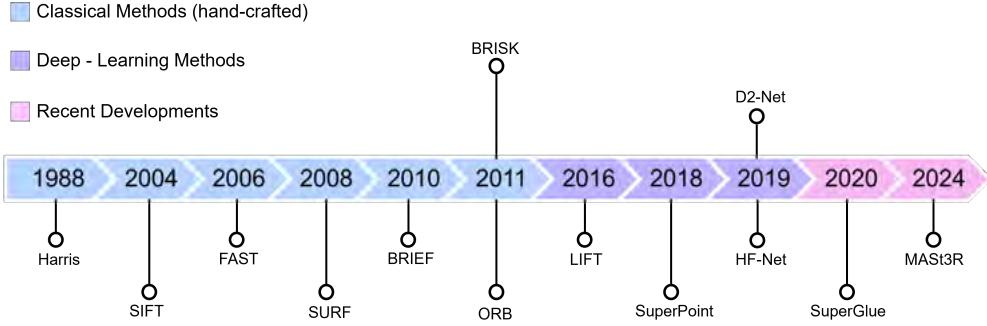
图 7.2 一些塑造基于视觉的 SLAM 与图像匹配中视觉关键点研究文献的代表性算法时间线。

在实践中，剧烈光照变化、无纹理表面和动态场景等现实挑战会在检测与匹配中引入误差，直接影响 SLAM 性能。因此，研究工作致力于设计具有特定特性的关键点以增强鲁棒性。最理想的特性包括尺度与旋转不变性（保证视点变化时检测一致）、可重复性与可区分性（支持可靠重检和唯一识别），以及效率（在计算约束下支持实时运行）。为满足这些需求，关键点检测与描述近年已从经典手工设计技术演变为基于深度学习的方法。下文各小节将结合图 7.2 概述文献中最具代表性的关键点方法及该领域的新兴趋势。

#### 7.3.2.1 经典关键点检测器与描述子

经典的手工设计技术在特征检测和描述的发展中发挥了关键作用。其中，Harris--Stephens 关键点检测器 [432]（广为人知的 “Harris 角点检测器”）是最具影响力的方法之一。它通过分析图像块内二阶矩矩阵的特征值识别角点：当两个特征值均较大、表明两个正交方向上都有强烈强度变化时，将该图像块判为关键点。Shi--Tomasi 角点检测器 [1004] 建立在同一原理上，但直接使用较小特征值进行角点选择；相较之下，Harris 定义“角点性”（cornerness）响应函数以高效近似这一过程。Harris 检测器鲁棒且计算高效，但缺乏尺度不变性，后续的 SIFT、SURF 等方法致力于解决这一局限。

关键点检测的一个里程碑是尺度不变特征变换（Scale Invariant Feature Transform，SIFT）[699] 的提出，它在具有挑战性的环境中为精度和召回率设立了新标准。SIFT 对尺度和旋转具有高度不变性，并对光照变化具有部分不变性。它遵循结构化的三阶段过程：(1) 在尺度空间高斯差分（Difference of Gaussians，DoG）金字塔中将极值检测为关键点，并通过三维二次拟合细化其位置；(2) 根据局部图像梯度主方向分配方向；(3) 从离散化梯度方向的直方图中计算 128 维描述子。不过，SIFT 出色的鲁棒性伴随较高计算代价，使其在实时应用中开销更大。

为提高效率，研究者提出了加速分割测试特征（Features from Accelerated Segment Test，FAST）[946] 这一高速角点检测器。它评估候选关键点位置周围圆形邻域中的像素强度，并采用提前拒绝策略以减少计算。FAST 还借助决策树和非极大值抑制进一步提升速度。但它不像 SIFT 那样具有尺度不变性，因而对较大变换敏感。随后，快速鲁棒特征（Speeded-Up Robust Features，SURF）[63] 使用积分图像和盒式滤波器替代高斯导数来近似 SIFT，在速度与鲁棒性之间取得更好平衡。

对快速而鲁棒描述子的需求推动了二进制方法的发展。二进制鲁棒独立基本特征（Binary Robust Independent Elementary Features，BRIEF）[141] 采用二进制强度比较构建紧凑描述子，使得可用 Hamming 距离快速匹配描述子。BRIEF 虽缺少尺度和旋转不变性，但证明了可通过简化的二进制测试有效捕获局部梯度，而局部梯度正是 SIFT 鲁棒性的基础。受此启发，ORB [953] 在 FAST 关键点检测和 BRIEF 描述的基础上，使用图像金字塔和强度质心法增加尺度和旋转不变性。与此同时，BRISK [643] 采用尺度空间金字塔上的 FAST 或 Harris 角点，并通过识别类似 SIFT 的主关键点方向，在二进制描述子中纳入旋转变化不变性。ORB、BRISK 等方法增加旋转和尺度不变性会轻微影响输出关键点的可区分性，但已证明在视觉 SLAM 和实时机器人应用中有效。不过，当计算代价不是约束（例如计算机视觉应用）时，SIFT 和 SURF 仍可能更可取，因为它们在具有挑战性的光照或视角变化下仍提供更强鲁棒性。

随着诸多变体见于文献，经典手工设计的关键点检测和描述方法始终是计算机视觉与机器人学的基础，它们在鲁棒性、效率和不变性之间经过精心权衡。然而，能够适应日益复杂、动态环境的关键点需求仍是一项持续挑战。这推动研究转向基于学习的方法，后者旨在为真实应用自动优化关键点，为下一代特征检测技术奠定基础。

#### 7.3.2.2 基于深度学习的关键点检测与描述

到 2010 年代末，基于深度学习的图像关键点方法开始获得关注；它们利用大规模数据集和卷积神经网络（convolutional neural networks，CNN）直接从数据学习鲁棒特征。不同于人工设计的关键点，这类方法能自动发现并优化特征表示，在此前难以处理的场景中显示出无与伦比的适应性和准确性。例如，它们在极端光照变化下检测稳定关键点已取得显著成功，而这正是经典手工方法的难点。因此，视觉 SLAM 社群日益摆脱传统特征工程，转而采用数据驱动的表示学习进行关键点检测与描述。

学习不变特征变换（Learned Invariant Feature Transform，LIFT）[1245] 是最早将关键点检测、方向估计和描述子计算集成于端到端可训练流水线的深度学习方法之一。LIFT 使用 CNN 从小图像块提取特征，相对于经典方法，对尺度、光照和旋转变化有更强鲁棒性。它采用顺序学习策略：先训练描述子，随后训练方向估计，最后训练关键点检测，以确保稳定有效的特征提取。类似地，SuperPoint [267] 提出自监督框架，在一次前向传播中检测关键点并计算描述子，因而适合实时应用。与基于图像块的网络不同，SuperPoint 处理整幅图像，并利用单应适配（homographic adaptation）这一自监督学习技术生成伪真值关键点。相较 SIFT、ORB 和 FAST 等经典方法，该方法显著改善关键点重复性和描述子质量，尤其是在光照变化下。

在这些进展基础上，HF-Net [970] 提出结合全局图像检索和精确局部特征匹配的层次化定位方法。HF-Net 将关键点检测、局部描述子和全局描述子整合到单一 CNN 中，在维持高鲁棒性的同时提高计算效率。该架构通过限制用于匹配的图像数量来降低运行时间，因而即使在夜景等极端外观变化下，也特别适合大规模 SLAM 和实时应用。HF-Net 学得的特征比 SuperPoint 更稀疏却更具区分性，使其成为 DX-SLAM [649] 等基于深度学习 SLAM 系统的优选。

值得注意的是，D2-Net [295] 提出“先描述、后检测”（describe-and-detect）方法，颠倒了传统关键点检测与描述子提取的顺序。它并非先检测关键点，而是使用 CNN 计算稠密特征图，再将这些图中的局部极大值识别为关键点。该方法捕获高层语义信息，因此对极端光照变化和弱纹理环境具有鲁棒性。不同于将检测与描述分离的 SuperPoint，D2-Net 联合优化这两项任务，从而提高描述子一致性。不过，这种稠密方法虽提高鲁棒性，却比经典稀疏方法更耗计算。尽管存在该折中，D2-Net 对视觉定位和 SfM 任务仍十分有效，推动了基于深度学习特征提取的边界。

### 7.3.3 重投影误差

视觉重投影误差度量观测图像点 $\boldsymbol {z} _ { j } \in \mathbb { R } ^ { 2 }$ 与重投影点 $\pi ( \pmb { x } _ { j } ^ { c } , \pmb { \xi } ) \in \mathbb { R } ^ { 2 }$ 之间的差异：

$$
\boldsymbol {e} _ {\mathrm{reproj}} = \boldsymbol {z} _ {j} - \pi (\boldsymbol {x} _ {j} ^ {c}, \boldsymbol {\xi}),
$$

其中 $\boldsymbol {z} _ { j }$ 是观测到的二维图像点，$\pmb { x } _ { j } ^ { c } \in \mathbb { R } ^ { 3 }$ 是相机坐标系中的三维点，$\boldsymbol { \xi }$ 是相机内参标定参数，$\pi$ 为投影函数。

假设观测图像点 $\boldsymbol {z} _ { j }$ 受到高斯噪声扰动，则似然函数可写为：

$$
p (\boldsymbol {z} _ {j} | \boldsymbol {x} _ {j} ^ {c}, \boldsymbol {\xi}) \sim \mathcal {N} \left(\pi (\boldsymbol {x} _ {j} ^ {c}, \boldsymbol {\xi}), \boldsymbol {\Sigma} _ {j}\right),
$$

其中 $\boldsymbol {\Sigma} _ { j }$ 是图像中特征位置高斯噪声的协方差。在最简单情形，假设噪声在图像上各向同性且恒定，即 $\boldsymbol {\Sigma} _ { j } = \sigma I _ { 2 }$。

最大化一组观测的似然，等价于最小化其负对数似然：

$$
\mathcal {L} = - \sum_ {j} \log p (\pmb {z} _ {j} | \pmb {x} _ {j} ^ {c}, \pmb {\xi}) = \frac {1}{2} \sum_ {j} \left\| \pmb {z} _ {j} - \pi (\pmb {x} _ {j} ^ {c}, \pmb {\xi}) \right\| _ {\pmb {\Sigma} _ {j}} ^ {2} + \mathrm{const.}
$$

去掉常数后，可得到图像中所观测点集的加权平方重投影误差：

$$
E _ {\text { reproj }} = \frac {1}{2} \sum_ {j} \left\| \boldsymbol {z} _ {j} - \pi (\boldsymbol {x} _ {j} ^ {c}, \boldsymbol {\xi}) \right\| _ {\boldsymbol {\Sigma} _ {j}} ^ {2}.\tag{7.1}
$$

为处理离群值，可使用 Huber 或 Tukey 等鲁棒核（参见第 3 章）。例如，鲁棒重投影误差可写为：

$$
E _ {\mathrm{robust}} = \frac {1}{2} \sum_ {j} \rho \left(\left\| \pmb {z} _ {j} - \pi (\pmb {x} _ {j} ^ {c}, \pmb {\xi}) \right\| _ {\pmb {\Sigma} _ {j}}\right).\tag{7.2}
$$

其中 $\rho ( \cdot )$ 是降低大残差影响的鲁棒核函数。为简洁起见，下文省略对相机内参 $\boldsymbol {\xi}$ 的依赖。

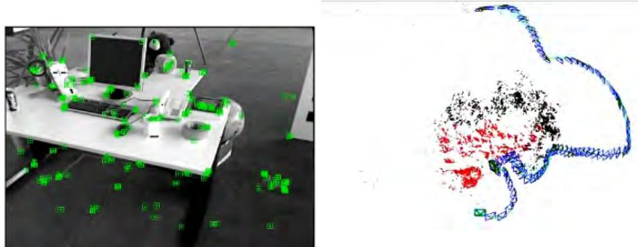
图 7.3 基于特征的视觉 SLAM 问题：给定每幅图像中已匹配的一组特征（左），估计其对应三维点的位置，以及每幅图像采集位置处的位姿（右）。图像由 ORB-SLAM [787] 生成。

### 7.3.4 基于关键点的视觉 SLAM

基于特征的视觉 SLAM 的核心是最小化重投影误差。假设我们有一组环境点 $P _ { j } \in \mathsf { P }$，它们在移动相机采集的一组图像 $C _ { i } \in \mathsf { C }$ 中被观测到。为简化记号，以下仅使用点和相机的标识符，写作 $j \in \mathsf { P }$ 和 $i \in \mathsf { C }$。视觉 SLAM 的目标是估计世界参考系 $\mathcal { F } ^ { w }$ 中的点坐标 $\pmb { x } _ { j } ^ { w } \in \mathbb { R } ^ { 3 }$，以及相机位姿 $\pmb { T } _ { w } ^ { i } \in \mathrm { S E } ( 3 )$。在单目情形，每个图像中每个点的观测仅为图像坐标 $\boldsymbol {z} _ { i j } \in \Omega _ { i } \subset \mathbb { R } ^ { 2 }$（图 7.3）。

将重投影误差应用于全部点和相机位姿时的最小化，称为完整 BA：

$$
\{\boldsymbol {T} _ {w} ^ {i *} , \boldsymbol {x} _ {j} ^ {w *} \mid i \in \mathsf {C}, j \in \mathsf {P} \} = \underset {\boldsymbol {T} _ {w} ^ {i}, \boldsymbol {x} _ {j} ^ {w}} {\arg \min} \frac {1}{2} \sum_ {i, j} \rho \left(\left\| \boldsymbol {z} _ {i j} - \pi \left(\boldsymbol {R} _ {w} ^ {i} \boldsymbol {x} _ {j} ^ {w} + \boldsymbol {t} _ {w} ^ {i}\right) \right\| _ {\boldsymbol {\Sigma} _ {i j}}\right).\tag{7.3}
$$

通常，研究者通过若干先进方法处理重投影误差优化，每种方法在计算复杂度和鲁棒性上具有不同取舍：

**批量优化。** 相对于全部位姿和路标，对全部观测迭代最小化总重投影误差，即求解式（7.3）。常用的最小化算法为 Gauss--Newton（GN）和 Levenberg--Marquardt（LM）。这是 SfM 的黄金标准，但在实时 SLAM 中对每幅图像运行的代价过高。

**基于滤波的方法。** 使用扩展卡尔曼滤波（extended Kalman filter，EKF）或信息滤波器等顺序、因果方法进行实时状态估计。这类方法只保留最新相机位姿以简化问题，但不幸会破坏稀疏性（图 7.4），因而只能处理数百个特征。此外，滤波方法不重新线性化过去观测，导致精度损失。

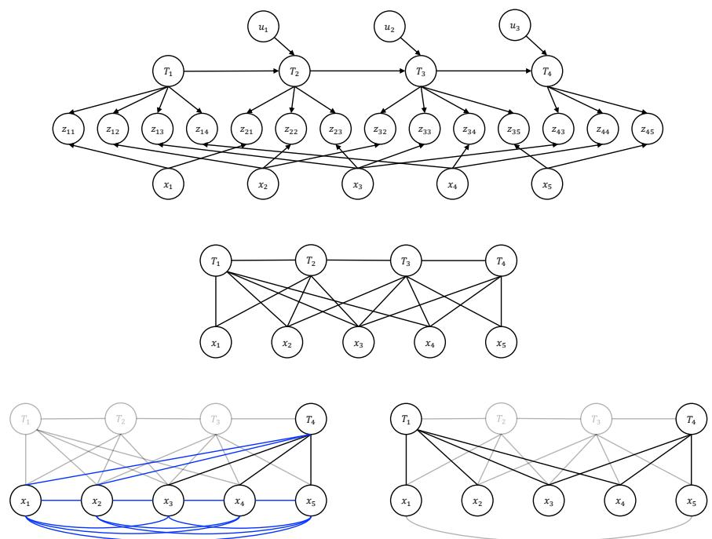
图 7.4 含四个相机位姿和五个特征的视觉 SLAM 示例：贝叶斯网络（上）及其对应的马尔可夫随机场（中）。EKF SLAM 将过去相机位姿边缘化，得到稠密图（左下）。关键帧 SLAM 仅保留少数相机位姿，并舍弃中间图像的观测，从而保持 SLAM 的稀疏性（右下）[1039]。

**基于关键帧的方法。** 这类方法只保留少数图像，即关键帧 [583]，以简化问题；中间图像及其观测被舍弃，不参与地图估计。在相同计算量下，它们能构建比滤波方法更长、更准确的地图 [1039]。

**因子图。** 上述全部方法均可用因子图形式化。具体而言，SLAM 问题被表示为图：节点对应变量（如位姿和路标），因子表示重投影误差以及标定和/或相机位姿的先验；本书第一部分已对此作详细讨论。

### 7.3.5 光度误差与直接法

光度误差提供了重投影误差的替代方案：它直接最小化观测图像区域和投影图像区域之间的像素强度差。该方法根植于光度一致性原则，即假定连续帧中的对应像素在一致光照条件下表示同一场景点。

### 7.3.6 视觉地点识别与全局定位

视觉地点识别是指：给定一幅查询图像，在已登记图像数据库中找到来自同一地点的图像。通常的做法是为每幅图像计算概括其内容的描述子 $\pmb { d } = f ( I ) \in \mathbb { R } ^ { d }$，再通过 k-NN 搜索检索该描述子空间中最接近的图像。Galvez-Lopez 和 Tardos [362] 提出了词袋方法，其基本思想是将 ORB 或其他描述子量化到视觉聚类或“词”中并聚合。它们在较小时间和空间范围内表现优异，却受限于手工特征对视觉纹理变化的不变性较低。对于这些情形，研究者提出并训练深度架构，以高不变性进行特征提取和聚合，从而适应视觉外观变化 [35, 508]。

### 7.3.7 初始化

式（7.3）的重投影误差最小化通常由非线性迭代优化完成，该过程需要足够准确的初始猜测才能收敛。因此，视频序列最初几帧中视觉 SLAM 状态的初始化对正确跟踪十分重要，尤其对单目配置而言，因为无法由单帧观测到完整状态。

### 7.3.8 地图表示

地图表示是视觉 SLAM 系统的关键方面，因为它定义环境如何建模和存储，以服务导航、建图和定位。一种设计良好的地图表示应在准确性、内存效率和计算代价之间取得平衡。关于稠密地图表示的更广泛讨论，参见第 5 章。

## 7.4 关于图像对齐和 BA 的进一步考虑

本节进一步介绍图像对齐，即如何由图像估计当前相机位姿（这是里程计和回环检测的关键），并简要说明 BA 的求解技术。

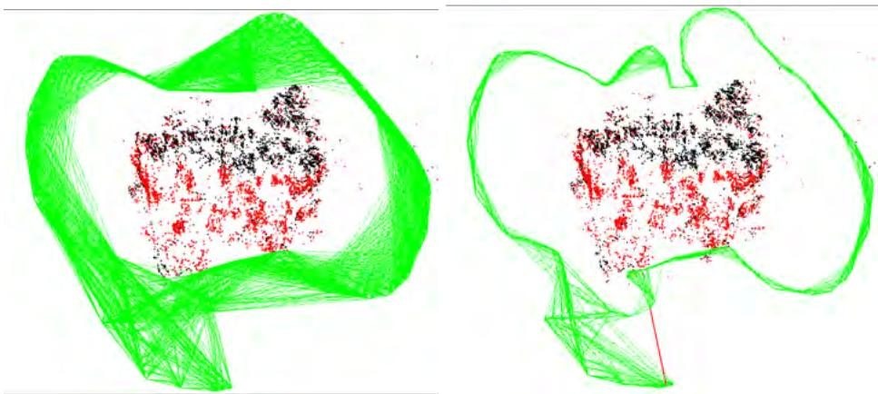
图 7.5 ORB-SLAM 中的局部性表示 [787]。共视图（左）连接至少共同观测到 $\theta$ 个点的关键帧（本例中 $\theta = 15$），用于局部 BA。本质图（右）是更稀疏的版本，在本例中连接至少共同观测到 $\theta := 100$ 个点的关键帧，用于回环校正期间的位姿图优化。（©2015 IEEE）

### 7.4.1 基于关键点的图像对齐

尽管完整 BA（式（7.3））是 SfM 的黄金标准，但其代价过高，无法以通常为 10--50 Hz 的帧率运行。为实现实时运行，多数基于关键点的视觉 SLAM 流水线采用两个关键思想：

**跟踪与建图并行。** 将 SLAM 过程划分为两个并行运行的线程 [583]：

跟踪线程为当前图像 $i \in \mathsf { C }$ 寻找特征匹配，并在不更新估计地图点的情况下，利用仅位姿 BA 计算其相机位姿：

$$
\boldsymbol {T} _ {w} ^ {i *} = \underset {\boldsymbol {T} _ {w} ^ {i}} {\arg \min} \sum_ {j \in \mathsf {P}} \rho \left(\left\| \boldsymbol {z} _ {i j} - \pi \left(\boldsymbol {R} _ {w} ^ {i} \boldsymbol {x} _ {j} ^ {w} + \boldsymbol {t} _ {w} ^ {i}\right) \right\| _ {\boldsymbol {\Sigma} _ {i j}}\right).\tag{7.4}
$$

建图线程仅对一组称为关键帧的图像子集 $\mathsf { K } \subset \mathsf { C }$ 求解 BA，只有这些图像的位姿会被纳入地图。这样，BA 只需以关键帧频率运行，通常为 0.5--5 Hz。关键帧可按固定频率插入；更合理的做法是将含有显著新信息的帧升级为关键帧。

**局部性。** 当相机在大环境中运行时，除回环事件外，其观测对远处地图部分的影响可忽略。通常将回环校正交给一个运行频率很低的第三线程，而在建图线程中，对一个关键帧窗口运行局部 BA。局部窗口可根据时间准则定义为最近 $k$ 帧或关键帧，这是视觉里程计或视觉惯性 SLAM 系统的常见选择。对于视觉 SLAM 系统，更好的选择是基于共视性定义局部窗口，例如将与当前关键帧至少共同观测到 $\theta$ 个点的关键帧纳入窗口 [1038, 787]（见图 7.5）。这样，局部 BA 只更新一组相互共视的关键帧及其观测到的点（图 7.6）：

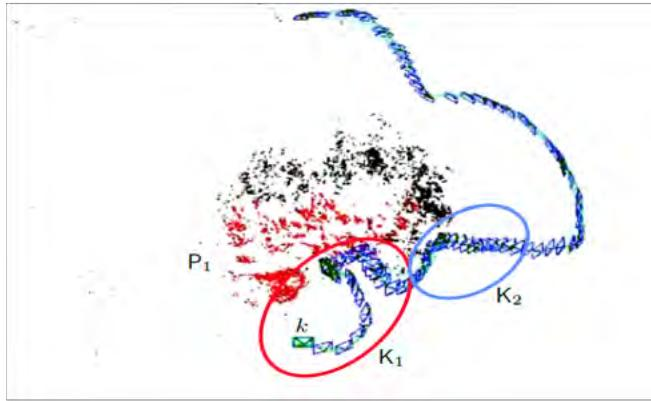
图 7.6 ORB-SLAM 中局部 BA 的实现 [787]。局部地图由关键帧集合 $\mathsf { K } _ { 1 }$ 定义，该集合包含当前关键帧 $k$ 及其在共视图中的邻居；还包括这些关键帧观测到的点集 $\mathsf { P } _ { 1 }$（红色）。$\mathsf { K } _ { 2 }$ 是地图中能观测到 $\mathsf { P } _ { 1 }$ 某个点的其余关键帧集合。

$$
\{\boldsymbol {T}_{w}^{k^{*}},\boldsymbol {x}_{j}^{w^{*}} \mid k\in \mathsf {K}_{1}, j\in \mathsf {P}_{1}\} = \underset {\boldsymbol {T}_{w}^{k},\boldsymbol {x}_{j}^{w}}{\arg \min}\frac{1}{2}\sum_{\substack{i\in \mathsf {K}_{1}\cup \mathsf {K}_{2},\\ j\in \mathsf {P}_{1}}}\rho \left(\left\| \boldsymbol {z}_{ij} - \pi \left(\boldsymbol {R}_{w}^{i}\boldsymbol {x}_{j}^{w} + \boldsymbol {t}_{w}^{i}\right)\right\|_{\boldsymbol {\Sigma}_{ij}}\right).\tag{7.5}
$$

图 7.7 给出了完整视觉 SLAM 流水线的示例，其中包含四个线程：按帧率运行的跟踪线程、按关键帧频率运行的局部建图线程、尝试为每个关键帧检测回环并在检测到时校正的回环线程，以及可选运行、用于在回环后改进地图的完整 BA 线程。

### 7.4.2 直接图像对齐

LSD-SLAM [307] 或 DSO [308] 等直接法通常遵循相似流水线：先估计帧间跟踪和建图，再保证某种形式的全局一致性。但它们并非先提取、匹配和跟踪点，然后最小化几何重投影误差，而是直接使用传感器亮度信息，目标是在给定原始传感数据的条件下，计算三维结构和相机运动的最大后验估计。这等价于通过最小化下列形式的光度损失，联合求解对应关系估计和 SLAM 问题：

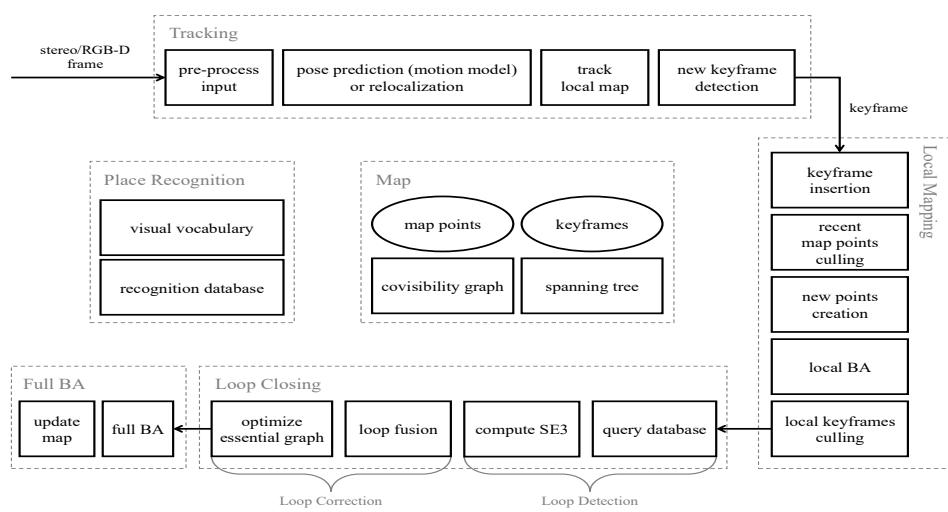
图 7.7 ORB-SLAM2 系统结构 [785]，展示地图、地点识别数据库以及由四个线程组成的完整处理流水线：跟踪、局部建图、回环和完整 BA。（©2017 IEEE）

$$
E _ {\mathrm{photo}} = \sum_ {i \in \mathcal {F}} \sum_ {\boldsymbol {z} \in \mathcal {P} _ {i}} \sum_ {j \in \mathrm{obs} (\boldsymbol {z})} \rho \Bigl (I _ {i} (\boldsymbol {z}) - I _ {j} (\omega (\boldsymbol {z}, d _ {\boldsymbol {z}}, \boldsymbol {T} _ {j} ^ {i})) \Bigr),\tag{7.6}
$$

其中优化变量为全部相机参数 $\boldsymbol {T} _ { j } ^ { i } \in \mathrm { S E } ( 3 )$ 和所有深度值 $d _ { \boldsymbol {z} } \in \mathbb { R }$。该损失确保所有帧对 $i,j$ 中对应点的颜色 $I _ { i }$ 与 $I _ { j }$ 一致。更具体地，先对全部关键帧集合 $\mathcal { F }$ 求和；再对关键帧 $i$ 中每个点 $\boldsymbol {z} \in \mathcal { P } _ { i }$，保证在该点可见的所有帧 $\mathrm{obs}(\boldsymbol {z})$ 中颜色一致。变形函数 $\omega$ 将具有深度值 $d _ { \boldsymbol {z} }$ 的点 $\boldsymbol {z}$ 以刚体运动 $\pmb { T } _ { j } ^ { i }$ 从帧 $i$ 变换到帧 $j$，再进行透视投影回图像 $I _ { j }$。

如图 7.8 所示，LSD-SLAM 交替优化深度图和相机运动（跟踪），并执行位姿图优化（pose-graph optimization，PGO），以保证所估计相机运动与计算得到的两两图像对齐之间的全局一致性。

相较之下，DSO [308] 以光度 BA 的形式联合优化结构和运动。鲁棒损失 $\rho$ 通过小图像块上的加权平方差实现，其中还包含自动曝光时间适配（曝光时间未知时）。相应残差之间的依赖关系采用因子图表示。DSO 通过将优化限制在部分关键帧的滑动窗口中，并边缘化较旧帧的影响，在 CPU 上实现实时性能。由于它利用全部传感器亮度数据给出结构和运动的统计最优估计，精度得到显著提升。

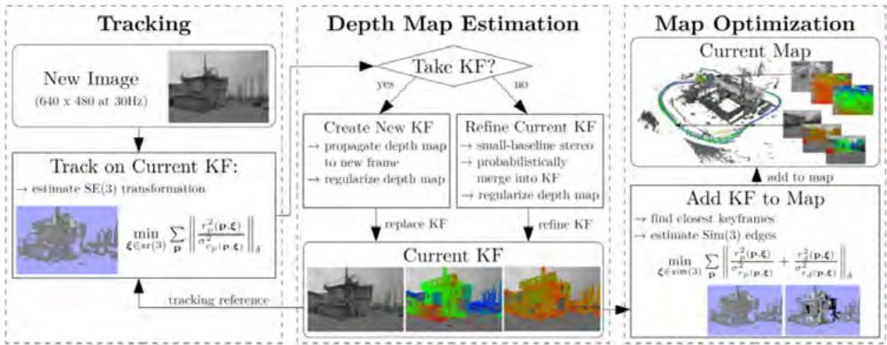
图 7.8 Large-Scale Direct（LSD）SLAM [307] 示意总览。三个组件交替执行直接相机跟踪、直接建图和用于全局一致性的 PGO。相比之下，Direct Sparse Odometry [308] 在一次 Gauss--Newton 优化中完成结构和运动优化，以获得更高精度。已证明 DSO 等直接方法比基于关键点的方法精度更高，因为它们不执行中间抽象，并可从极其细微的亮度变化中确定相机运动 [308]。（©2017 Springer）

在具有实时能力的 SLAM 方法中，可分几步实现全局一致性。第一，可如 DSO 一样联合优化最近 $k$ 个关键帧，以保证滑动时间窗口上的一致性（滑动窗口光度 BA）。第二，可额外运行 PGO [553, 365]（见图 7.9），重新计算与所有先前估计的两两图像对齐最大程度一致的相机轨迹。第三，可采用称为位姿图束调整（Pose Graph Bundle Adjustment，PGBA）[1135] 的自适应 PGO 版本；它还纳入 BA 的完整光度不确定性，同时保持相同计算效率，因为只更新相机位姿。

### 7.4.3 求解 BA

虽然可以使用第 2 章讨论的通用变量消去技术求解 BA，但也有能利用问题稀疏结构的专用求解器。图 7.10 给出一个玩具示例，含有四台相机和从中观测到的九个点。观测雅可比矩阵非常稀疏，因为每个观测 $\boldsymbol {z} _ { i j }$ 只依赖相机 $i$ 和点 $j$。因此，每个观测在 Hessian 矩阵中引入一个相机对角块、一个点对角块和一个非对角的相机--点块。点的数量通常比相机数量大几个数量级，故合理做法是先消去点，再求解相机。

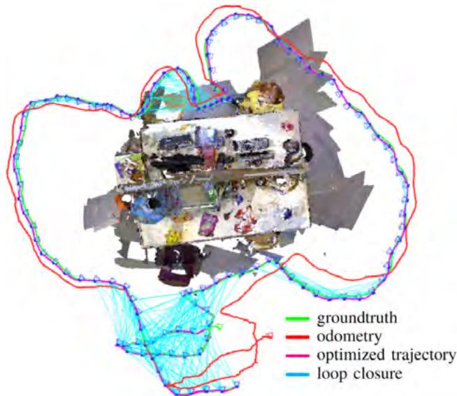
图 7.9 在直接视觉 SLAM 方法中，可进行位姿图优化，以计算与此前估计的所有两两图像对齐全局一致的轨迹 [553]。（©2013 IEEE）

这可通过 Schur 补完成。若有一个 $D$ 可逆的线性系统，可在其左右两侧分别乘以矩阵，将其变换为：

$$
\begin{array}{c}
\left( \begin{array}{c c} A & B \\ C & D \end{array} \right) \binom{x _ {1}}{x _ {2}} = \binom{b _ {1}}{b _ {2}}, \\
\left( \begin{array}{c c} I & - B D ^ {- 1} \\ 0 & I \end{array} \right) \left( \begin{array}{c c} A & B \\ C & D \end{array} \right) \binom{x _ {1}}{x _ {2}} = \left( \begin{array}{c c} I & - B D ^ {- 1} \\ 0 & I \end{array} \right) \binom{b _ {1}}{b _ {2}}, \\
\left( \begin{array}{c c} A - B D ^ {- 1} C & 0 \\ C & D \end{array} \right) \binom{x _ {1}}{x _ {2}} = \binom{b _ {1} - B D ^ {- 1} b _ {2}}{b _ {2}}.
\end{array}
$$

由此得到可以先求解 $\boldsymbol {x} _ { 1 }$、再求解 $\boldsymbol {x} _ { 2 }$ 的系统：

$$
\begin{array}{c}
\left(\boldsymbol {A} - \boldsymbol {B} \boldsymbol {D} ^ {- 1} \boldsymbol {C}\right) \boldsymbol {x} _ {1} = \boldsymbol {b} _ {1} - \boldsymbol {B} \boldsymbol {D} ^ {- 1} \boldsymbol {b} _ {2}, \\
\boldsymbol {D} \boldsymbol {x} _ {2} = \boldsymbol {b} _ {2} - \boldsymbol {C} \boldsymbol {x} _ {1}.
\end{array}
$$

BA 问题在每次迭代中都需要求解下列形式的方程：

$$
\left( \begin{array}{c c} \mathbf {H} _ {c c} & \mathbf {H} _ {c p} \\ \mathbf {H} _ {c p} ^ {\top} & \mathbf {H} _ {p p} \end{array} \right) \binom{\boldsymbol {d} _ {c}}{\boldsymbol {d} _ {p}} = \binom{\boldsymbol {b} _ {c}}{\boldsymbol {b} _ {p}}.
$$

这可分三步完成：计算点的 Schur 补以得到降维相机系统，求解该系统以获得相机更新量，最后求解点更新量：

$$
\begin{array}{r}
\mathbf {H} _ {c c} ^ {\mathrm{red}} = \mathbf {H} _ {c c} - \mathbf {H} _ {c p} \mathbf {H} _ {p p} ^ {- 1} \mathbf {H} _ {c p} ^ {\top}, \\
\mathbf {H} _ {c c} ^ {\mathrm{red}} \mathbf {\Delta} \boldsymbol {d} _ {c} = \boldsymbol {b} _ {c} - \mathbf {H} _ {c p} \mathbf {H} _ {p p} ^ {- 1} \boldsymbol {b} _ {p}, \\
\mathbf {H} _ {p p} \mathbf {\Delta} \boldsymbol {d} _ {p} = \boldsymbol {b} _ {p} - \mathbf {H} _ {c p} ^ {\top} \mathbf {\Delta} \boldsymbol {d} _ {c}.
\end{array}\tag{7.7}
$$

由于 $\mathbf { H } _ { p p }$ 为块对角矩阵，可逐点极高效地计算 Schur 补和最终点解。如图 7.10 所示，降维相机系统较不稀疏，因为其中含有关联共同观测到某点的相机对的块。该示例中，相机 1 和相机 2 之间存在块，而相机 1 和相机 3 之间不存在。在局部 BA 中，降维相机系统几乎是满的，因而可使用稠密矩阵求解器；相比之下，完整 BA 的关键帧数量大得多，但它们之间共视性较少，因此降维相机系统可从稀疏求解器中获益。

### 7.4.4 再议束调整

BA 已研究逾一个世纪，第 7.4.3 节所详述的经典方法已确立，并在许多奠基性论文中证明有效 [1107, 14, 978]。但该流水线有两项重要缺陷：其一，解需要对路标和相机位姿进行合适初始化；其二，对大规模问题，计算和内存要求可能增长到难以承受的程度。近年来，一系列论文解决这些缺陷，并挑战传统计算流水线 [469, 470, 258, 259, 1170, 1171, 1172]。

关键计算瓶颈是求解降维相机系统（7.7）。Power Bundle Adjustment [1171] 不使用迭代共轭梯度算法直接求解，而是近似 Schur 矩阵的逆：

$$
\mathbf {H} _ {c c} ^ {\mathrm{red}} = \mathbf {H} _ {c c} - \mathbf {H} _ {c p} \mathbf {H} _ {p p} ^ {- 1} \mathbf {H} _ {c p} ^ {\top},\tag{7.8}
$$

并通过矩阵幂级数 [1171] 得到：

$$
(\mathbf {H} _ {c c} ^ {\mathrm{red}}) ^ {- 1} \approx \sum_ {i = 0} ^ {m} (\mathbf {H} _ {c c} ^ {- 1} \mathbf {H} _ {c p} \mathbf {H} _ {p p} ^ {- 1} \mathbf {H} _ {c p} ^ {\top}) ^ {i} \mathbf {H} _ {c c} ^ {- 1}.\tag{7.9}
$$

随着截断参数 $m$ 增大，该幂级数可证明收敛到真实逆矩阵 [1171]。其主要优点是以简单矩阵乘法替代繁重的矩阵求逆，因而计算更快、内存效率更高。

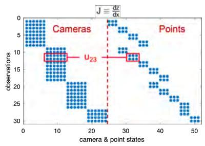

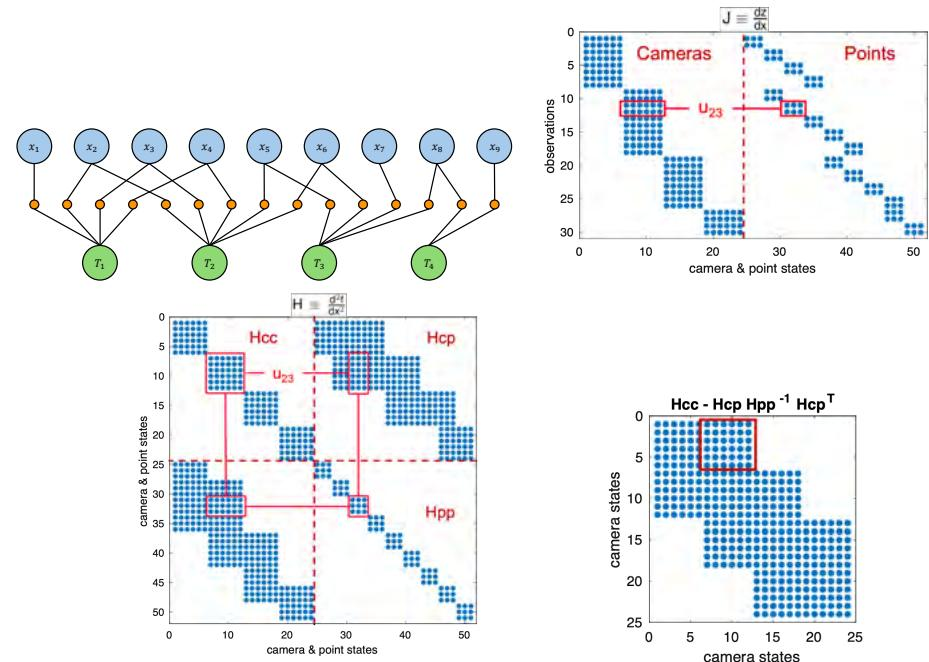

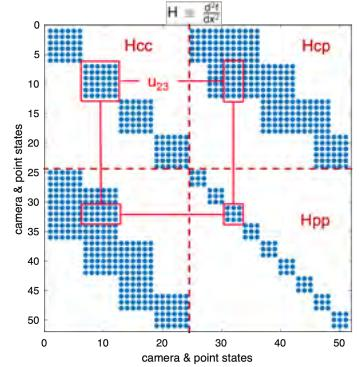

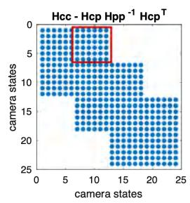
图 7.10 含四台相机和九个点的玩具示例。第一行给出因子图和点观测的雅可比矩阵；第二行给出完整 Hessian 矩阵和降维相机系统的 Hessian 矩阵。

[469, 470] 通过重新采用变量投影概念来缓解对初始化的依赖（见图 7.11）。为此，将 BA 问题分为两个阶段。第一阶段以通用投影矩阵替换复杂的透视投影，使所得优化可将路标解析地表示为相机参数的函数。这消除了路标与相机位姿之间“先有鸡还是先有蛋”的依赖关系，使优化相机位姿时具有更大的吸引域。第二阶段为投影细化，使用所得解作为原始（透视）重建的初始化。尽管该策略对于超过 100 台相机时计算代价过高，但与 [1172] 所提幂级数方法结合后，可为无需初始化的大规模 BA 问题提供可扩展解法。

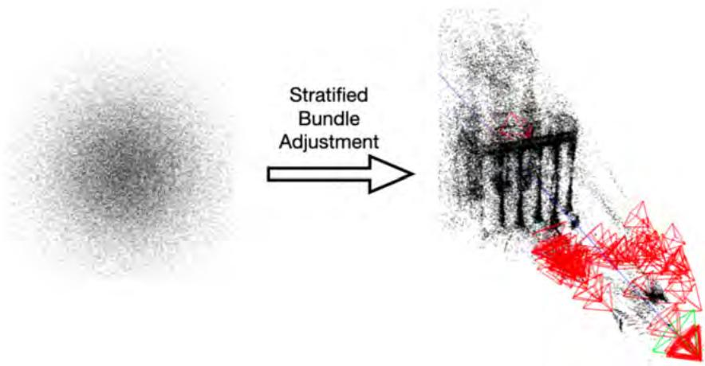
图 7.11 在一系列论文 [469, 470, 1171, 1172] 中，研究者倡导使用变量投影方法和矩阵幂级数，以时间和内存高效的方式求解无初始化的大规模束调整问题。如图所示，可以从随机初始化出发计算相机位姿和路标。（©2024 Springer）

## 7.5 完整视觉 SLAM 系统示例

LSD-SLAM（Large-Scale Direct SLAM）[307] 是一种直接 SLAM 系统，聚焦于稠密跟踪和半稠密建图。它依赖光度误差最小化而非基于关键点的方法，因此在低纹理环境中特别有效。该系统可实时运行，提供场景的半稠密重建，适合室内和小尺度室外环境中的单目相机。

ORB-SLAM [787, 785] 因其鲁棒性和灵活性而成为采用最广泛的 SLAM 系统之一。它集成基于 ORB（Oriented FAST and Rotated BRIEF）描述子的关键点跟踪、有效回环检测和稀疏地图表示。ORB-SLAM 支持单目、双目和 RGB-D 相机，因此可高度灵活地适配不同设置，在要求高精度和鲁棒重定位能力的场景中表现出色。ORB-SLAM3 [142] 将其扩展到鱼眼相机、多地图和视觉惯性 SLAM。OKVIS [645] 最初构想为视觉惯性里程计系统；其最新版本 OKVIS2 [644] 是视觉惯性 SLAM 系统，也可在仅视觉（多相机）模式下运行。它和各种 ORB-SLAM 版本一样，使用关键点和描述子（BRISK）。

Direct Sparse Odometry（DSO）[308] 是一种用于估计三维点云和相机轨迹的直接方法。不同于 LSD-SLAM，它在一次 Gauss--Newton 优化中联合估计相机运动和路标点。为获得实时性能，仅更新最近 $k$ 个关键帧，因而形成滑动窗口光度 BA。所考虑关键帧数 $k$ 在速度和精度之间提供折中。此外，DSO 使用带相机响应函数和暗角的完整光度标定。因此，传统亮度恒常假设被辐照度恒常假设取代，即假定三维世界中的相应点随时间发出相同辐照度。该方法已扩展到双目系统 [1160] 和全向相机 [739]，并已加入回环检测以减少长序列中的漂移 [365]。

在具有实时能力的方法中，已证明 DSO 等直接法比基于关键点的方法更准确、更鲁棒 [308]；但为达到最佳性能，它们通常需要良好光度标定和全局快门相机。卷帘快门效应会引入几何畸变。尽管可在直接 SLAM 方法中建模这类畸变 [980, 981]，所得方法往往不再具备实时能力。因此，通常更适合由基于关键点的方法处理，因为后者在设计上最小化几何畸变。尽管如此，在低分辨率视频中，模糊和降采样会使可靠特征点更难识别，直接法常表现更好 [1227]。此外，特征点对高效重定位与回环很有价值。因此，实用视觉 SLAM 系统常转向结合两类方法优势的混合方法。例如，[385] 将基于特征的重定位信息紧密整合到直接视觉 SLAM 方法中，进一步提高其鲁棒性和精度。

## 7.6 实时稠密重建

传统 BA 和 SLAM 解决的是重建相机运动和稀疏路标点集的问题；但从增强现实到自主机器人等众多应用，更希望获得所观测世界的稠密重建。为此，多年来出现了从单目相机进行实时稠密重建的多种算法 [1046, 800, 1180, 875]。传统上，它们通过最小化损失函数，借助变分方法估计连续三维结构 [1046]：

$$
\min _ {h: \Omega \to \mathbb {R}} \frac {1}{2} \sum_ {i \in \mathcal {I} (\boldsymbol {z})} \int_ {\Omega} \rho_ {i} (\boldsymbol {z}, h) \, \mathrm{d} \boldsymbol {z} + \lambda \int _ {\Omega} | \nabla h | \, \mathrm{d} ^ {2} \boldsymbol {z},\tag{7.10}
$$

其中优化对象是稠密地图 $h$，它为图像平面 $\Omega \subset \mathbb { R } ^ { 2 }$ 中的每个像素 $\boldsymbol {z}$ 赋予深度值。残差

$$
\rho_ {i} (\boldsymbol {z}, h) = \left| I _ {i} \left(\pi \left(\boldsymbol {R} _ {w} ^ {i} \boldsymbol {x} ^ {w} (\boldsymbol {z}, h) + \boldsymbol {t} _ {w} ^ {i}\right)\right) - I _ {0} (\boldsymbol {z}) \right|,\tag{7.11}
$$

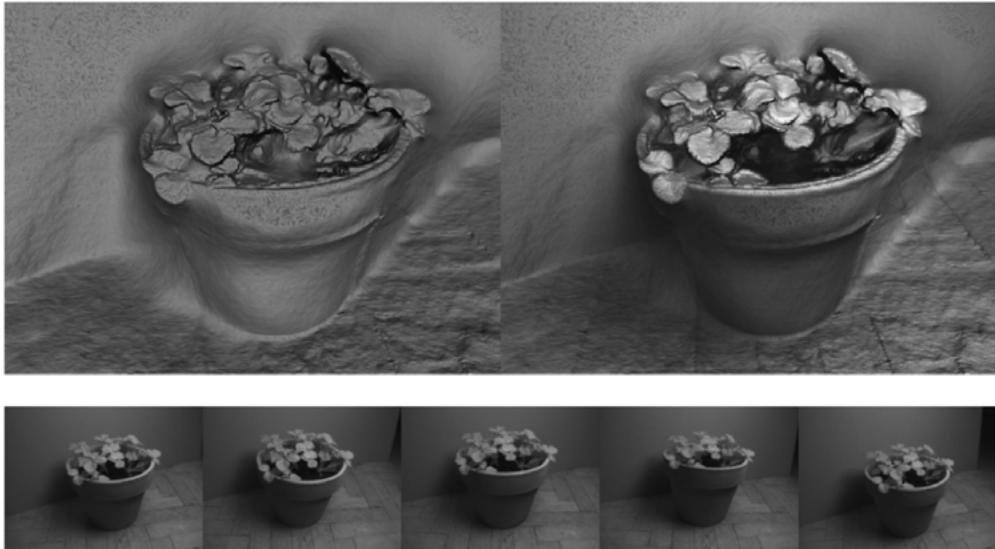
图 7.12 可使用在 GPU 上高效并行的变分方法 [1046]，由手持单目相机（下）实时计算三维世界的稠密重建（上）。相关方法见 [800, 1180, 875]。（©2010 Springer）

强制参考图像 $I _ { 0 }$ 中像素 $\boldsymbol {z}$ 的亮度与一组相邻图像 $I _ { i }$ 中相应像素保持一致。相应像素的获得方式是：取三维点 $\pmb {x} ^ { w } (\boldsymbol {z},h)$，利用相应的旋转矩阵 $\boldsymbol {R} _ {w} ^ {i} \in \mathrm { S O } (3)$ 和平移向量 $\pmb {t} _ {w} ^ {i} \in \mathbb { R } ^ { 3 }$ 将其从世界坐标系变换到相机 $i$，最后通过模型 $\pi(\cdot)$ 将其投影到图像 $I _ { i }$ 中。

总变分正则项（权重为 $\lambda$）强制所计算深度图具有空间平滑性，并如图 7.12 所示，对未观测区域产生类似肥皂膜的填充效果。

## 7.7 基于深度感知相机的 SLAM

随着 Microsoft Kinect 的推出，深度感知相机成为普及设备。这类所谓 RGB-D 相机通常基于结构光或飞行时间（time-of-flight），提供深度图像流，往往还伴有彩色图像流。因此，从概念上说，它们介于标准相机和 LiDAR 传感器之间。但与 LiDAR 传感器不同，它们立即提供深度值的二维阵列。配合合适算法，RGB-D 相机是强大的三维感知设备；但受限于室内应用（基于红外的感知会受到阳光干扰）和一定测程（通常约 5 米以内）。

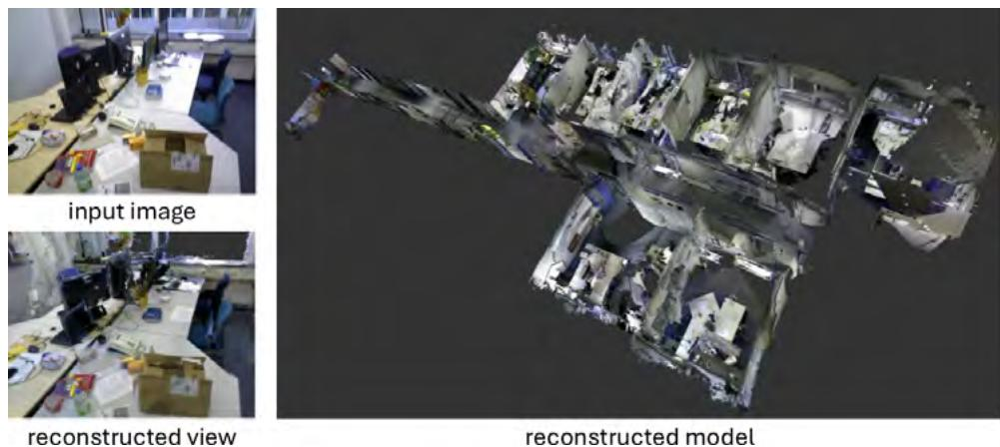
图 7.13 由移动 RGB-D 相机得到的含多个办公室的大尺度走廊场景稠密重建 [1030]。使用八叉树 [1030] 或体素哈希 [808] 以及直接相机跟踪 [554]，此类重建已证明可在 GPU [1030] 乃至平板电脑 CPU [1031] 上实时运行。（©IEEE）

KinectFusion [801] 建立在早期范围图像融合工作 [234] 的基础上，提出了从移动 RGB-D 相机重建相机运动和三维结构的方法。将各种深度图像融合为一致三维重建的基本思路是：将每幅深度图像编码为（投影）有符号距离函数 $d _ { i } ( \pmb {x} )$；该函数为每个体素 $\pmb {x} \in V$ 编码到最近表面点（沿视线）的有符号距离。随后可将各个距离函数加权平均，计算所有体素的聚合距离函数 $D(\pmb{x})$：

$$
D (\pmb {x}) = \frac {\sum_ {i} \omega_ {i} (\pmb {x}) d _ {i} (\pmb {x})}{\sum_ {i} \omega_ {i} (\pmb {x})}.\tag{7.12}
$$

在深度方向噪声服从高斯分布的假设下，这个加权平均正是距离函数的最大似然估计。为提高鲁棒性，通常对截断有符号距离函数取平均，使每个感知到的表面点只对重建产生局部影响。权重 $\omega _ { i } ( \pmb { x } )$ 编码相应表面测量的置信度（它依赖传感器，且通常随到物体距离增加而衰减）。为填补重建中的孔洞，可以使用后处理技术 [801]，或修改上述加权方案以确保重建的水密性 [1044]。

早期 RGB-D SLAM 方法通过使用 ICP 算法 [78] 对齐相应深度点云来跟踪相机；随后工作提出直接最小化度量两个连续 RGB-D 帧 $( I _ { 1 } , d _ { 1 } )$ 与 $( I _ { 2 } , d _ { 2 } )$ 色彩和深度一致性的残差 [554]：

$$
r _ {I} (\boldsymbol {\xi}) = I _ {2} \left(\tau_ {g} (\boldsymbol {z})\right) - I _ {1} (\boldsymbol {z}), \quad r _ {d} (\boldsymbol {\xi}) = d _ {2} \left(\tau_ {g} (\boldsymbol {z})\right) - \left[ g \pi^ {- 1} \left(\boldsymbol {z}, d _ {1} (\boldsymbol {z})\right) \right] _ {z},\tag{7.13}
$$

其中 $g \in \mathrm { S E } ( 3 )$ 表示待估刚体运动，$\tau _ { g } (\boldsymbol {z}) = \pi g \pi ^ { - 1 } (\boldsymbol {z}, d _ { 1 } (\boldsymbol {z}))$ 表示对应像素间诱导的变形，$[ \cdot ] _ { z }$ 返回一点的 $z$ 分量。随后可用合适分布拟合所有残差 $r = ( r _ { I } , r _ { d } )$ 的分布，并通过在 $\boldsymbol {\xi} \in \mathfrak {se}(3)$ 上进行由粗到细的 Gauss--Newton 优化，确定相机变换 $g = \exp (\boldsymbol {\xi})$ 的最大后验估计 [1029, 553]。与经典 ICP 方法相比，该直接跟踪方法在既定基准上将均方根跟踪误差降低近一个数量级，同时显著更快；详见 [554]。

在更大尺度上建图时，均匀体素表示占用内存过多。因此，通常采用体素哈希 [808] 或八叉树 [1030] 等自适应表示，见图 7.13 和第 5 章。

后续方法还通过采用如 Kintinuous [1183] 的移动融合窗口，或如 ElasticFusion [1184] 那样纳入回环并通过形变图变形整个稠密地图表示，展示了对更大场景的可扩展性。

## 7.8 将视觉与其他模态相结合

出于多种原因，建议将视觉与其他模态结合。这既可提供额外鲁棒性和精度，也可提供绝对尺度信息。具体而言，惯性传感器提供度量尺度以及高度可靠、鲁棒的局部相对运动测量；GPS/WiFi 则可用于全局（重）定位和地理定位。这些互补输入解决仅视觉系统固有的局限，在实际应用中不可或缺。

### 7.8.1 惯性测量单元（IMU）

IMU 提供角速度和线加速度的高频测量，从而支持对局部运动的精确估计。融合传感信息的一种简单方式是松耦合：先独立地将每个传感器的信息汇总为位姿估计，再使用卡尔曼滤波融合这些估计。该方法在实践中常有良好表现，例如用于四旋翼 [306] 或纳米飞行器 [291] 的自主导航，但不如紧耦合传感信息集成精确。

早期紧耦合方法采用 EKF 方案，在预测步骤积分 IMU 运动学量，并以视觉关键点测量作为更新，例如奠基性的 MSCKF [777]。另一种方式是采用第 11 章详述的因子图方法，构建滑动窗口或批量优化器。图 7.14 给出了一个用于双目惯性里程计的因子图 [1116]，它将双目 LSD-SLAM 与 IMU 信息结合。图 7.15 展示紧耦合 IMU 信息如何减小漂移，从而获得更清晰、更精确的重建。ORB-SLAM3 [142]、OKVIS2 [644] 等最先进的基于关键点方法同样采用这种因子图紧耦合。

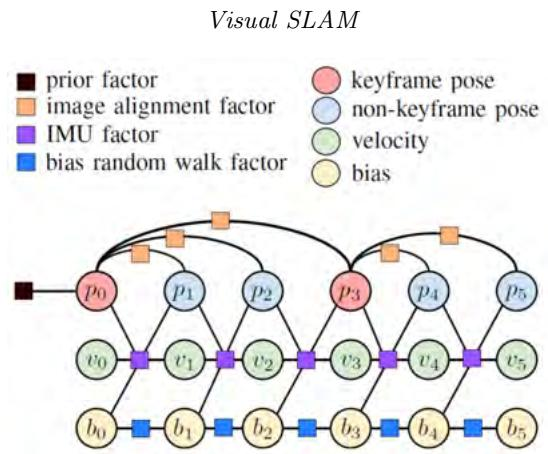
图 7.14 可使用因子图以紧耦合方式优雅地集成多种传感器。这是视觉与 IMU 紧耦合融合的因子图示例 [1116]；它显著提高相机运动与三维结构的精度和鲁棒性，见图 7.15。（©2016 IEEE）

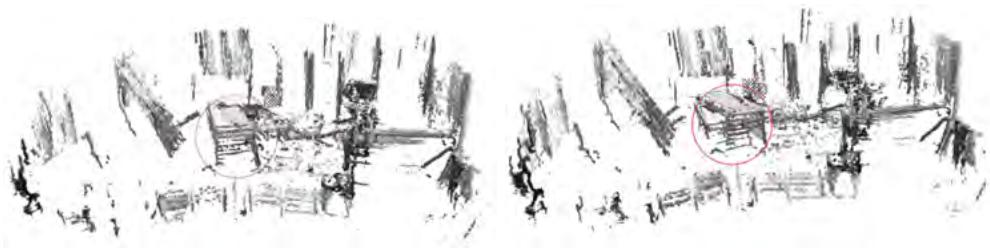
图 7.15 将 IMU 测量与直接图像对齐紧密融合，相比仅依赖图像对齐的纯视觉里程计系统（右），可得到更准确的位置跟踪（左）。融合通过图 7.14 所示因子图实现。重建点云来自纯里程计，未强制实施回环 [1116]。（©2016 IEEE）

实践中，一些最准确的视觉惯性里程计系统以惯性积分为基础，主要使用视觉来校正由随时间（两次）积分的噪声和偏置引起的快速增长漂移。此外，IMU 使运动的度量尺度和传感器相对于重力的姿态可观测，从而将系统的规范自由度缩减为仅四个未知量（全局 $x,y,z$ 位置和偏航角）；而仅视觉系统有七个未知量（全局 $x,y,z$、滚转角、俯仰角、偏航角和尺度）。从多方面看，IMU 与视觉作为感知模态相互互补，因此非常适合在视觉惯性 SLAM 或里程计系统中结合。

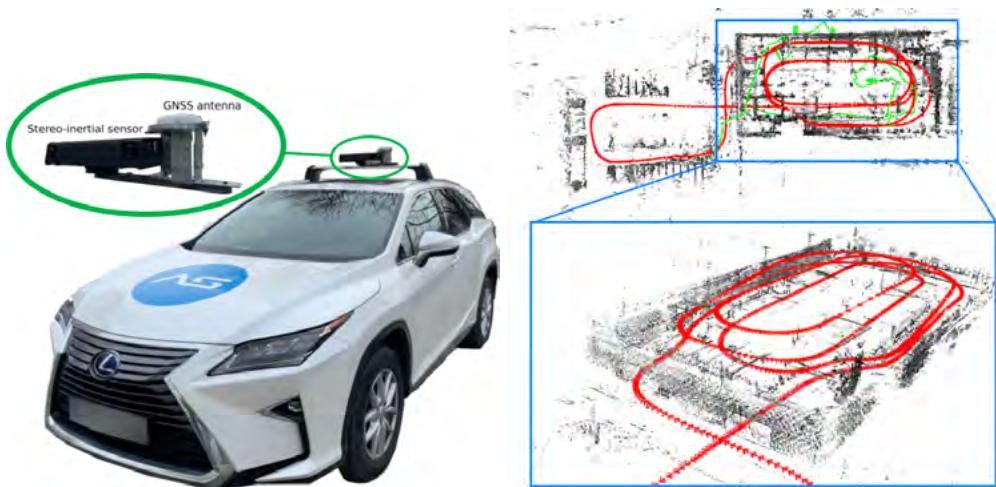
图 7.16 将包括双目相机、IMU 和 RTK-GPS 信息在内的多种传感器（左）通过因子图紧耦合融合，可得到高度准确、鲁棒的轨迹和点云；如右图所示，它适用于室内外环境，并展示了汽车行驶于多层停车场中的重建 [1181]。（©2020 Springer）

多年来已提出大量视觉惯性里程计/SLAM 方法，通常是现有视觉 SLAM 系统的扩展。常用方法包括 ORB-SLAM 的视觉惯性版本 [786]、Direct Sparse Visual-Inertial Odometry [1136]、VINS-Mono [896]、BASALT [1118] 和 DM-VIO [1135]。最后一种是单目惯性表述，使用延迟边缘化（delayed marginalization）概念，以更好地刻画相应传感器中运动的可观测性。

### 7.8.2 用于全局定位的 GPS 和 WiFi

IMU 改善局部运动估计，而 GPS 和 WiFi 对全局定位至关重要，尤其在大尺度环境中。室外环境中，GPS 提供绝对位置数据，使系统可将 SLAM 地图锚定到全局坐标。这对自动驾驶车辆等室外应用至关重要 [1181, 193]，见图 7.16。室内场景中，在 GPS 信号不可用时，WiFi 信号可实现粗定位，补充基于视觉地图的定位。

## 7.9 延伸阅读与近期趋势

视觉 SLAM 是一个极其活跃且不断变化的研究领域。尽管我们尝试全面概述经典视觉 SLAM 方法，本章不可避免地仅覆盖了相关工作的一个部分；希望读者查阅众多被引文献，以获得更深入的了解。

**关键点检测与匹配。** 在特定设置中，基于学习的关键点相比传统手工关键点展现出前所未有的不变性和适应性，基于深度学习的关键点提取技术正在改变这一领域。这一转变不仅增强了关键点检测与描述，还显著推动了关键点匹配技术。不同于经典方法中依赖人工设计启发式规则进行描述子匹配，基于学习的方法如今融入全局空间感知以更鲁棒地建立对应关系。特别是，SuperGlue [971] 和 MASt3R [642] 等技术利用图神经网络（graph neural networks，GNN）和 Transformer，通过考虑更广泛的图像结构来细化匹配。这些方法可适应极端视点变化、光照变化和遮挡，解决传统匹配器的根本局限；在这些情形中，传统局部描述子比较通常表现不佳。

SuperGlue 通过整合自注意力和交叉注意力机制来增强特征匹配，从而消解重复纹理和遮挡导致的歧义。不同于仅基于局部描述子运行的传统关键点匹配器，SuperGlue 纳入上下文信息，显著提升室内外环境中的准确性。其最优匹配层进一步确保稳健建立关键点对应，并在需要时允许关键点不匹配，因此对真实场景十分有效。类似地，MASt3R 将这一思路扩展为三维感知特征匹配：它从两幅图像重建三维场景表示，以改善无纹理区域和极端视点变化下的性能。在此基础上，MASt3R-SLAM [789] 将这些进展整合到 SLAM 流水线中，改进相机位姿估计、全局地图一致性和回环策略。从手工二维特征匹配转向基于学习、具备上下文感知且融入三维信息的方法，标志着视觉 SLAM 范式转变，增强复杂环境中的场景理解、跟踪鲁棒性和长期稳定性。

总体而言，用于图像匹配和视觉 SLAM 的关键点提取，已从传统手工方法显著演进到有望在挑战条件下提供更强鲁棒性的深度学习方法。经典方法至今仍因高效率和可解释性而十分重要，但在无纹理表面、极端视点变化和光照变化情形中表现受限。深度学习已解决这些局限，推动研究转向更具适应性和上下文感知的关键点检测与匹配技术。不过，在资源受限平台上平衡计算效率和实时性能，以及确保获得多样、无偏的训练数据集，仍是挑战。未来研究很可能聚焦于优化这些技术，同时最大化准确性和效率，使其更适用于大规模真实世界应用。

**其他前沿。** 需要强调的是，近年视觉 SLAM 还有许多令人振奋的进展。其中包括将视觉 SLAM 推广到包含移动且可能可变形物体的动态环境。此外，基于学习的视觉 SLAM 方法日益流行：在大量发表工作中，经典视觉 SLAM 流水线越来越多的组件（特征提取、对应关系估计、图像对齐、相机跟踪、BA、稠密重建等）正被基于学习的表述增强或替代。本手册第三部分将更详细讨论这些思想。
