# 《SLAM Handbook：从定位与建图到空间智能》

## 第 8 章  LiDAR SLAM

**作者：** Jens Behley、Maurice Fallon、Shibo Zhao、Giseop Kim、Ji Zhang、Fu Zhang 和 Ayoung Kim

除相机外，LiDAR 传感器是机器人学中最常用的感知模态之一。LiDAR 是一种主动发射激光脉冲、测量脉冲经表面反射并返回探测器所需时间的技术，由此直接测量到表面的距离。LiDAR 传感器可用于感知周围环境结构，也可用于估计传感器的运动或自身位置。

LiDAR 技术的发展始于 20 世纪 60 年代和 70 年代，当时的固定式系统主要用于大气研究、地形测绘和军事应用。这些早期 LiDAR 系统笨重且昂贵，不适合移动应用。20 世纪 80 年代，激光技术和计算能力进步，使 LiDAR 系统更紧凑且价格更低。这些系统仍主要固定使用，用于地形测绘和环境监测等应用 [248, 683]。20 世纪 90 年代，LiDAR 传感器与全球定位系统（GPS）及 IMU 集成，开始支持最早的移动 LiDAR 建图系统。这些系统通常安装在车辆或飞机上，以创建大范围的详细三维地图 [499]。20 世纪 90 年代末，研究者开始探索在机器人中使用 LiDAR 进行实时 SLAM。二维 LiDAR 推动并催化了 21 世纪初概率建图和 SLAM 的发展；随着 2004 年 DARPA Grand Challenge 和 2007 年 DARPA Urban Challenge 的举行，三维 LiDAR 在机器人和自动驾驶车辆中的地位更加突出。

本章首先简要回顾不同类型 LiDAR 传感器的基础技术（第 8.1 节），随后讨论 LiDAR 里程计（第 8.2 节）和基于 LiDAR 的地点识别（第 8.3 节）。此外，还将讨论将里程计和地点识别整合到完整 LiDAR SLAM 系统中的方法（第 8.4 节）。最后给出延伸阅读并讨论新趋势（第 8.5 节）。

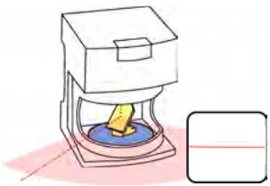
(a) 二维 LiDAR

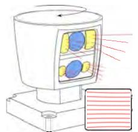
(b) 三维旋转 LiDAR

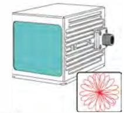
(c) 螺旋扫描
图 8.1 常见 LiDAR 传感器类型及其光束模式。(a) 采用旋转发射镜（黄色）的标准二维 LiDAR 传感器。编码器盘（蓝色）用于测量反射镜的旋转角度。(b) 机械式多光束 LiDAR 示例：多个发射器（黄色）发射激光束，再由探测器（蓝色）检测。整个传感器头旋转以产生 360° 水平视场。(c) 宏观扫描 Risley 棱镜 LiDAR，具有螺旋扫描模式，只在镜头窗口方向（青色）进行测量。由于螺旋模式，它能够随时间产生更稠密的点云。

## 8.1 LiDAR 感知基础与分类

在 LiDAR 传感器内部沿一个或两个轴旋转激光发射器和探测器，就可以逐步构建传感器周围环境的详细点云。最基本的原理是飞行时间（time-of-flight，TOF）：发射激光脉冲，并根据测得的光脉冲返回探测器所需时间推断距离。TOF LiDAR 传感器能够采集高分辨率测量，但对外部光照敏感；外部光会降低信噪比（signal-to-noise ratio，SNR）[598]，进而降低测量精度和频率。除 TOF 外，原本为雷达传感器开发的调幅连续波（Amplitude Modulated Continuous Wave，AMCW）和调频连续波（Frequency Modulated Continuous Wave，FMCW）技术也已用于 LiDAR。

LiDAR 传感器可按其感知机制分类 [935]，包括机械式 LiDAR、扫描式固态 LiDAR、闪光 LiDAR，以及使用宏观扫描 Risley 棱镜的传感器。其中，本节考察两类常用类型：二维/三维机械式 LiDAR 和宏观扫描 LiDAR。

机械式 LiDAR 是最常见的 LiDAR 类别。它们使用旋转组件引导激光束，但受到机械磨损和数据采集速率较低的限制。最简单的二维机械式 LiDAR 使用旋转反射镜引导单束激光并测量距离，如图 8.1(a) 所示。借助编码器盘，可以测量 LiDAR 光束的角度方向，并将其与距离测量配对，从而生成二维剖面测量。由于其工作原理，这类 LiDAR 只能在单个二维平面内扫描。

单个传感器进行完整三维扫描的需求，源于 21 世纪初的 DARPA Grand Challenges（早期自动驾驶汽车竞赛），并促成了 Velodyne HDL-64E 这一先驱传感器的开发。挑战赛中大多数队伍都使用了该传感器 [1115, 772, 536]。在三维机械式 LiDAR 中，多个激光发射器安装在同一旋转机构上，以不同俯仰角指向并采集独立的范围测量；整个机构绕方位轴旋转 360°，如图 8.1(b) 所示。所得点云能够详细描绘物体和传感器周围环境的三维形状，如图 8.2 所示，并已在多项研究中讨论 [1178, 557, 935]。随后，随着 LiDAR 传感器尺寸和价格显著下降，该技术不断发展。

近年来出现了更多原型传感器，利用固态 LiDAR、Risley 棱镜和多边形反射镜等多种物理属性。不同于传统扫描激光器，其中许多传感器使用微机电系统（micro-electromechanical systems，MEMS）[467] 反射镜或光学相控阵（optical phased arrays，OPA）[446]，以避免或至少减少机械旋转。这一点十分重要，因为主动驱动的机械部件减少后，机械磨损降低，可提高 LiDAR 在环境建图中的使用寿命和可靠性。

Risley 棱镜 [668] 是一项值得注意的进展，它能够以很小的实体运动快速、可控地偏转光束。这一创新得到更紧凑的传感器，但目前视场较为有限。

上述所有传感器都产生一组独立范围测量，每次测量还带有强度（也常称反射率）值，即 LiDAR 光束被反射的程度。将单个光束的范围测量及其关联角度结合后，可以转换为二维或三维点云。然而，近期进展已在默认范围测量之外引入其他测量能力。例如，FMCW LiDAR 以变化频率连续投射光，并通过检测到的频移测量光束命中物体的相对速度。这类似于 FMCW 在雷达中的使用。该方法对动态环境或具有挑战性的场景很有用 [1201]，但相较其他变体通常更复杂、成本更高。另一种创新感知机制是闪光 LiDAR，它可以提供类似光度测量的环境通道，与相机获得的通道相似。这些技术在功耗、重量和成本上各有不同，为不同应用中的 LiDAR 里程计和 SLAM 提供了多种选择。

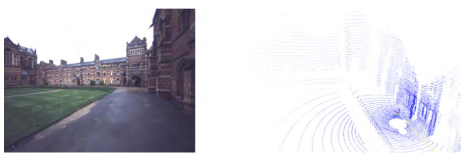
图 8.2 单次多光束 LiDAR 扫描及对应图像示例。扫描由具有 104° 垂直视场的 64 光束 Hesai QT64 扫描器完成。注意其中独立的扫描线，以及设备附近（右侧三维视图中的彩色坐标轴附近）点云较稠密、远处点云明显更稀疏的现象。

## 8.2 LiDAR 里程计

LiDAR SLAM 的第一个构件是 LiDAR 里程计。给定一次 LiDAR 扫描和过去的观测（可以是单次扫描，也可以是聚合到局部地图中的多次扫描），LiDAR 里程计的目标是在实时条件下估计机器人或车辆的增量自身运动。这里，扫描（scan）指 LiDAR 传感器采集的一次数据扫掠或周期。更具体地说，一次扫描通常表示传感器的一次完整旋转或完整扫掠，为特定时刻的周围环境提供上下文快照。因此，扫描通常带有时间戳，以便按顺序排列并作为连续观测处理。

LiDAR 里程计的核心技术是扫描配准，也称扫描匹配。扫描配准将两次扫描精确对齐，以估计它们之间准确的相对变换。一次扫描实际上是一组点或点云。文献中已经提出多种重要点云配准算法，包括 Horn 方法 [477] 和 ICP。Horn 方法可以给出闭式解，但需要预先确定对应关系，限制了其在真实场景中的适用性。相比之下，ICP 算法 [79, 959] 不需要预先知道对应关系，因此成为确定点云相对变换的更常用基础技术。下一节将进一步讨论 ICP。

LiDAR SLAM 的早期发展可追溯到 Lu 和 Milios 的奠基工作 [701]。他们引入位姿网络的思想，首次提出全局一致的二维范围扫描配准，这一概念与现代位姿图方法十分接近。该工作还通过定义二维扫描配准基础，为 LiDAR 里程计奠定了基础。[826, 596] 等工作对扫描到扫描匹配的概率建模作出了重要贡献。在二维扫描匹配中，点和线是常用选择；Olson [825] 则引入了利用相关技术进行实时配准的有影响力方法。

三维 LiDAR 的早期扩展建立在这些二维扫描技术之上：通过主动使传感器点头运动 [433] 或旋转运动 [100]，或者被动利用人类携带者 [102] 或车辆 [100] 的运动，积累更稠密的三维点云。这些三维点云支持 LiDAR SLAM 的三维扫描匹配，但由于数据量增加，也带来显著计算挑战。LOAM [1269] 解决了这些挑战，展示了实时扫描匹配能力，并成为后续 LiDAR 里程计和 SLAM 方法的基础。

## 8.2.1 扫描配准基础

扫描配准是 LiDAR 里程计和建图系统的基本组件，它通过对齐两次扫描实现准确配准和建图。目标是找到一个变换，即旋转 $\boldsymbol {R} \in \mathrm {SO}(3)$ 和平移 $\boldsymbol {t} \in \mathbb {R}^{3}$，将其中一次扫描（例如传感器最近采集的扫描）尽可能对齐到另一次扫描（例如先前扫描或局部地图），同时得到采集两次扫描时的相对位置。研究者已经开发了大量具有高精度、鲁棒性和低计算代价的扫描配准技术与算法。

**迭代最近点及其变体。** 如第 5 章所述，点云是三维坐标系中的点集，可数学表示为 $\mathsf { P } = \{ \pmb { p } _ { i } \in \mathbb { R } ^ { 3 } \mid i = 1, 2, \ldots, N \}$，其中 $\pmb { p } _ { i } = ( x _ { i } , y _ { i } , z _ { i } )$ 表示点的三维坐标。对于扫描配准，ICP 算法 [79] 最小化两个点云 $\mathsf {P}$ 和 $\mathsf {Q}$ 之间的总配准误差。下面将 $\mathsf {P}$ 记为源点云，$\mathsf {Q}$ 记为目标点云。

ICP 通过迭代确定每次优化迭代 $k$ 的变换 $\boldsymbol {R}^{k}, \boldsymbol {t}^{k}$，以最小化总配准误差。该误差由不同距离度量 $d$ 测量，定义为

$$
\boldsymbol {R} ^ {k}, \boldsymbol {t} ^ {k} = \underset {\boldsymbol {R}, \boldsymbol {t}} {\arg \min} \sum_ { (\boldsymbol {p}, \boldsymbol {q}) \in \mathbb {C} } d \left(\boldsymbol {p} _ {i}, \boldsymbol {R} \boldsymbol {q} _ {i} + \boldsymbol {t}\right),\tag{8.1}
$$

其中，源点云 $\mathsf {P}$ 与目标点云 $\mathsf {Q}$ 之间的对应关系集合 $\mathbb {C}$ 为

$$
\mathbb {C} = \left\{\left(\boldsymbol {p}, \boldsymbol {q}\right) \mid \boldsymbol {p} \in \mathsf {P}, \boldsymbol {q} \in \mathsf {Q} \right\}.\tag{8.2}
$$

在 ICP 算法中，通过在每次迭代中根据上一次迭代 $k-1$ 的变换重新计算对应关系集合 $\mathbb {C}$，来迭代确定源点云与目标点云之间的变换；上一次变换由旋转 $\boldsymbol {R}^{k-1}$ 和平移 $\boldsymbol {t}^{k-1}$ 给出。

为最小化式（8.1）中的总配准误差，需要明确两个方面：

1. **使用何种几何关系定义距离度量 $d(\cdot)$？** 目标是尽可能紧密地对齐两个点云，而不定义距离度量就无法确定这种紧密程度。

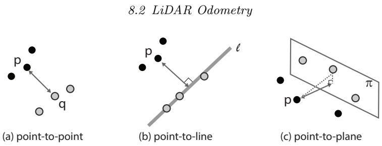
图 8.3 ICP 中常用的距离度量。(a) 点到点距离很直接，即两个点之间的欧氏距离。(b)、(c) 点到高层特征（例如线或平面）的距离，是到利用目标点重建的线或平面的最短距离。

2. **如何确定用于最小化的对应关系集合 $\mathbb {C}$？** 这涉及为源点 $\boldsymbol {p} \in \mathsf {P}$ 找到对应的目标点 $\boldsymbol {q} \in \mathsf {Q}$。

下面讨论解决这两个方面的常见方法。

### 8.2.1.1 配准残差中的距离度量

上面的第一个问题是决定使用哪些几何元素定义残差，必要时可超越简单的点到点距离。通常，点、线和平面是式（8.1）中用于定义距离的最常见几何元素，如图 8.3 总结所示。

点到点 ICP 是最基本的方法，它最小化两个点云中对应点之间的欧氏距离。Zhang [1281] 以及 Besl 和 McKay [79] 关于 ICP 的奠基工作，将形状（例如曲线和表面）表示为点集，从而把形状匹配表述为点匹配问题。这种点到点代价直接而简单，但可能对噪声、离群值和测量点稀疏性敏感。点到线距离也常作为误差度量。点到线距离度量一个点云中的点与另一个点云中的线（由点连接形成）之间的距离。在具有线性特征的结构化环境中，它可以取得更好的结果。利用更高层的几何特征还可以进一步改进：可以度量一个点云中的点与另一个点云中的平面（局部表面）之间的距离。这种方法对噪声更鲁棒，并能在具有平面表面的环境中达到更高精度。

在这些基本几何元素之上，其他 ICP 变体引入了不同距离度量。采用多距离度量 [839]、连续时间表述 [256] 和自适应阈值 [1133] 的技术，是近年来 ICP 的重要进展。另一些方法 [985, 591] 不使用欧氏距离，而是评估局部邻域概率分布之间的差异。

另一种知名的基于分布的匹配方法是正态分布变换（normal distributions transform，NDT）[82]。NDT 将输入点云划分为一组体素，并为每个体素中的点拟合一个正态分布（详见第 5.3.2.2 节）。它不需要承担确定最近邻关联的代价，而是利用体素化执行分布到分布的匹配。这一过程可以利用更平滑、更鲁棒的配准代价曲面，尤其适用于复杂环境。

### 8.2.1.2 确定对应关系

常见 ICP 算法的第二个核心设计决策，是在源点云 $\mathsf {P}$ 和目标点云 $\mathsf {Q}$ 之间进行数据关联或对应关系搜索。

最基本的形式是：对每个点 $\boldsymbol {p} \in \mathsf {P}$，在目标点云 $\mathsf {Q}$ 中几何寻找其最近邻；使用迭代更新的变换 $(\boldsymbol {R}^{k-1}, \boldsymbol {t}^{k-1})$，对应关系集合为：

$$
\mathbb {C} = \left\{\left(\boldsymbol {p}, \boldsymbol {q}\right) \mid \boldsymbol {p} \in \mathsf {P},\; \boldsymbol {q} = \underset {\boldsymbol {q}^{\prime} \in \mathsf {Q}} {\arg \min} \left\| \boldsymbol {p} - \left(\boldsymbol {R}^{k-1} \boldsymbol {q}^{\prime} + \boldsymbol {t}^{k-1}\right) \right\| _ {2} \right\}.\tag{8.3}
$$

但在包含数千个点的大点云上计算时，这通常是一项开销很大的操作。

为使 LiDAR 里程计能够实时运行，通常使用两种策略减少对应关系搜索时间：(1) 减少对应关系的潜在候选集合；或 (2) 使用不同于精确距离邻域搜索的搜索策略，以更快地找到候选点。

流行 LiDAR 里程计系统中的若干 ICP 变体 [1269, 839, 999] 采用第一种策略：通过构建候选集合较小的地图，确定满足特定几何准则的点，从而得到 $\mathsf {P}^{\prime} \subset \mathsf {Q}$ 和 $\mathsf {Q}^{\prime} \subset \mathsf {Q}$。所用准则包括确定位于边缘或表面的点 [1269, 839]、移除对应地面的描述性较弱的点 [998]，以及对目标扫描进行下采样 [1133, 256]。这些策略确实加快了对应关系搜索，但可能会从目标点云 $\mathsf {Q}$ 中移除真实对应关系。

相比之下，第二种策略使用带有高效近似的搜索结构，即使不总能得到精确最近邻，也能加快对应关系搜索。常见做法是在范围图像中进行投影邻域搜索 [66]，或利用体素栅格进行近似邻域搜索 [1269, 256, 1133]。此外，除了欧氏空间中的纯几何对应关系搜索，还可以使用替代距离度量，或将点投影到特征空间 [839] 中识别对应关系。

下文将讨论围绕核心 ICP 组件集成的 LiDAR 里程计其他组件，从而构建完整扫描配准系统，对一系列扫描观测进行对齐并估计机器人相对运动。

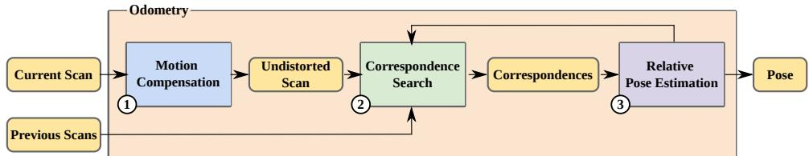
图 8.4 LiDAR 里程计流水线的组件：给定当前扫描，(1) 运动补偿考虑扫描过程中的传感器运动，得到去畸变扫描；随后 (2) 确定去畸变扫描与先前扫描之间的对应关系，先前扫描可以是单次扫描，也可以是局部地图中的聚合扫描；最后 (3) 通过扫描配准确定当前扫描的相对位姿估计。这些步骤迭代执行，并根据中间相对位姿估计细化对应关系集合。收敛后，最终位姿估计作为 LiDAR 里程计系统的输出。

## 8.2.2 LiDAR 里程计的常见组件

本节概述 LiDAR 里程计系统涉及的关键模块：点云运动补偿、对应关系识别，以及通过扫描配准进行位姿估计。点云运动补偿处理 LiDAR 在扫描采集期间运动造成的畸变；对应关系搜索识别连续扫描之间可用于匹配和扫描配准的匹配点；最后，位姿估计模块估计自上次配准以来传感器的运动。配准既可以在连续扫描之间进行扫描到扫描配准，也可以相对于局部地图进行扫描到地图配准。这些模块协同工作，保证 LiDAR 里程计的准确性和可靠性。图 8.4 展示了常见 LiDAR 里程计流水线中各组件的协同关系。

### 8.2.2.1 点云运动畸变补偿

LiDAR 里程计中的运动畸变源于 LiDAR 传感器在连续运动期间采集扫描。1（现代 LiDAR SLAM 中，LiDAR 传感器通常安装在移动车辆、机器人或可穿戴设备上。若扫描频率为 10 Hz，则扫描周期为 0.1 秒。）在扫描时间段内，传感器会在略有不同的时刻和位置发射激光脉冲并接收范围回波。因此，一次扫描并非表示传感器处于单一位置时周围环境的静态快照，而是由一组点构成，每个点都从略有不同的扫描位置采集。若不校正，扫描过程中的连续运动会导致不准确，并进而造成点云畸变。2（相机图像采集期间也会出现类似的畸变效应，称为滚动快门效应。）例如，图 8.5 清楚展示了畸变点云样本，说明适当运动补偿的必要性。对点云去畸变以考虑 LiDAR 传感器运动，是 LiDAR 里程计中重要的预处理步骤，可提高精度和鲁棒性。已有恒速度模型、连续时间轨迹优化和利用 IMU 测量等补偿方法来校正这一效应。

**恒速度模型。** 恒速度模型假定机器人保持上一时间步估计的平移和旋转速度。由于不需要额外传感器，该模型可广泛用于较简单的 LiDAR 里程计系统 [256, 1133]；但当运动包含高频变化时，恒速度假设本身精度较低。

**连续时间轨迹优化。** 另一种广泛使用的运动补偿方法是基于样条 [282, 715] 和高斯过程（GP）[50] 的连续时间轨迹优化技术（参见第 2 章）。连续时间轨迹允许在任意时刻得到位姿估计，而不依赖线性插值。它们可以去除每个独立点的畸变，但传统连续时间轨迹优化耗时，且通常以离线方式实现 [715]。

**基于 IMU 的运动补偿。** IMU 测量通过陀螺仪和加速度计直接测量高频运动，可以在扫描期间积分，作为有效的运动补偿方法 [1269, 999]。基于 IMU 的运动补偿使用最新 IMU 数据对 LiDAR 位姿进行预积分，再利用预测轨迹校正点畸变。得益于 IMU 测量的高频率（例如 200 Hz），基于 IMU 的运动补偿对机器人急促运动非常有效，如今已成为大多数机器人平台的事实标准。不过，需要谨慎使用该方法，因为 IMU 测量噪声、偏置、估计误差和较差的时钟同步，可能使其表现不如其他更简单的方法。

**逐点配准。** Point-LIO [442] 首次提出的逐点方法与现有基于扫描的 LiDAR 里程计框架有根本不同。在该框架中，系统接收到每个 LiDAR 点时就进行处理并更新状态，而不是积累完整扫描。因此，该设计不会受到扫描内部运动畸变的影响。

### 8.2.2.2 基于特征的 LiDAR 里程计

运动畸变校正后，即可建立点对应关系。与视觉 SLAM（见第 7 章）类似，利用特征进行扫描关联已得到充分研究。基于特征的方法只处理从点云中提取的少量特征，因此能够高效表示扫描。对应关系匹配和残差计算也可在特征层面完成，从而显著降低总体计算代价。

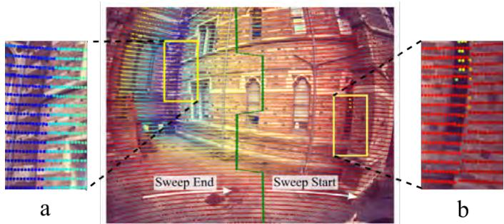
(a) 不进行运动去畸变的 LiDAR--相机叠加

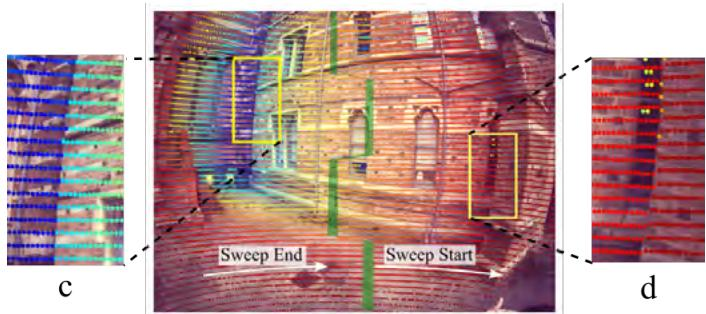
(b) 进行运动去畸变的 LiDAR--相机叠加
图 8.5 叠加在相机图像上的 LiDAR 点云。扫描开始处（“b”）的轻微错位，到 LiDAR 扫描结束时（“a”）显著加重。底部显示运动补偿后扫描开始处（“d”）和结束处（“c”）的叠加结果更加一致。引自 [1072]。

**低层特征。** 实践中最常用的特征是线和平面。在这一研究方向中，知名 LOAM 算法 [1269] 是 LiDAR SLAM 的重要突破。LOAM 使用低层检测器高效识别可用于扫描配准的中层特征。通过识别高曲率或低曲率点检测边缘和平面。每个点的曲率由分析该点与邻域点之间的差异计算得到。高曲率点标记为边缘特征，低曲率点标记为平面特征。算法并不将所有点作为特征，而是选择最重要的一部分边缘点和平面点，在保持精度的同时降低计算复杂度。

主成分分析还可用于识别点的局部邻域主方向，以有效检测特征 [67, 753]。通过计算点及其邻域点协方差矩阵的特征值和相应特征向量，可以确定变化的主轴，从而辨别点的几何属性。具有一个主导特征值的点可分类为边缘点，表示尖锐过渡或边界；具有两个相近特征值的点可识别为来自平面区域，表示点云中的平坦表面。这样，通过考虑几何属性区分边缘和平面特征，提高 LiDAR 里程计精度。

**高层特征。** 在 LiDAR 里程计中，语义、surfel 和强度等高层特征也可在提高系统精度和鲁棒性方面发挥重要作用。与低层特征相比，这些特征提供更丰富的环境信息，有利于更好的场景理解和更准确的建图。

**语义特征。** 语义特征使用机器学习和深度学习技术，将 LiDAR 点云分类并标记为车辆、行人、建筑物和植被等物体类别，通常用于区分动态物体和静态物体。它可通过聚焦稳定路标提高里程计可靠性 [187]。

**Surfel 特征。** Surfel 是点云表面几何的小型盘状表示（见第 5.3.2.2 节）。可以为一组点拟合椭球盘，其主半轴长度由邻近点协方差矩阵的特征值决定。扫描配准期间，这种表面表示可用于计算点到平面的距离 [846, 66, 903]。

**强度特征。** 强度特征 [277, 415] 指 LiDAR 回波的反射率或强度值。这些值提供环境中物体材料属性和表面特征的额外信息，为特征匹配提供额外维度，在无结构环境等具有挑战性的场景中尤其重要。

### 8.2.2.3 直接逐点 LiDAR 里程计

上文所述基于特征的方法存在一个问题：它往往舍弃孤立点的细微贡献，因为这些点无法明确对应到平面或边缘。在自然环境中对包含灌木或树枝的非结构化环境建图时，这一点尤其突出。此外，当从一种传感器换到另一种传感器时，还需要调节人工设计的特征检测器。后端要处理的点数通常随 LiDAR 扫描规模线性增长；使用现代 64 光束或 128 光束传感器时，该方法的计算代价可能变得无法承受。

另一种选择是直接使用点，而不提取中层特征。与视觉 SLAM 中的直接法类似，可以用类似 ICP 的方式直接对齐点。不过，由于逐点对应关系匹配的计算代价很高，这类直接法在 LiDAR SLAM 发展的早期并未受到青睐。

Zhou 等人 [1295] 通过使用 GPU 加速的 KD 树实现加速最近邻搜索，为直接法的实用化铺平了道路。随后，Xu 等人的直接法 Fast-LIO2 [1211] 使用一种称为增量 KD 树（incremental KD-tree，iKD-tree）的扩展，在地图规模增大时避免对应关系搜索瓶颈，展示了高度准确的帧率里程计。iKD-tree 能够适应点的分布，并通过偶尔重新平衡自身来高效执行添加、删除和查询操作，从而避免每加入一次扫描就重建整棵树。

### 8.2.2.4 局部建图与位姿估计

获得可靠对应关系后，下一步是对连续扫描进行一致配准。如前所述，LiDAR 里程计中的增量位姿估计通常通过 ICP 的某种变体进行扫描配准（见第 8.2.1 节）。

早期方法聚焦于扫描到扫描里程计，力求以完整频率（10 Hz）输出，同时将每次连续扫描配准视为独立操作。然而，单次 LiDAR 扫描可能相对稀疏；若参考扫描仅为前一次扫描，许多点会找不到合适对应关系，导致配准误差累积以及整体地图不一致。

更现代的方法是在传感器周围构建详细、准确的局部地图，这称为扫描到地图里程计。该范式已成功用于二维 LiDAR SLAM [458]、三维 LiDAR 里程计 [1211, 256, 1133] 和三维 LiDAR SLAM 系统 [839, 66, 846]，并被证明能够降低总体漂移率。

可以使用扫描到扫描里程计或 IMU 预积分得到的运动预测，对输入扫描预对齐，然后再与持久局部地图进行精细配准。局部地图比单次扫描稠密得多，因此能产生更合适的内点关联。配准后，将输入扫描加入局部地图。

受计算限制，早期 LiDAR 里程计方法 [1269] 需要交替进行高频扫描到扫描里程计和低频扫描到局部地图里程计。较新的 LiDAR 里程计方法 [256, 1133] 则利用体素化局部地图表示提供的直接逐点对应关系，采用单阶段扫描到地图对齐。

最后，使用深度学习是 LiDAR 里程计的一种完全不同方法。直接从 LiDAR 测量中学习自身运动的工作已取得一些有希望的成果。早期研究使用带真值标签的有监督学习 [655]，之后扩展到无监督学习方法 [210]。尽管深度 LiDAR 方法的性能总体上很有前景，但其泛化能力仍受到质疑。

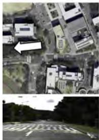

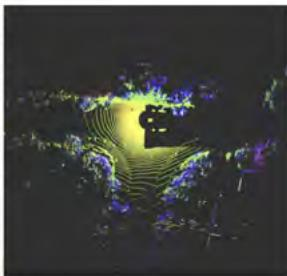
(a) 地点 A

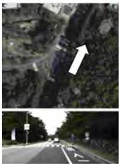

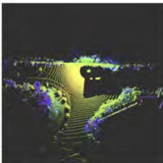
(b) 地点 B
图 8.6 尽管地点 A 和地点 B 的 RGB 图像在视觉上差异很大（分别为航拍视图和机器人前视图），但其对应 LiDAR 扫描呈现结构相似的模式。这会造成结构感知混叠：由于共享道路拓扑和周围结构，不同地点在基于 LiDAR 的地点识别算法中显得相似。本例取自 STheReO 数据集的 SNU Afternoon 序列 [1262]。

### 8.2.3 LiDAR 里程计小结

总之，常见三维 LiDAR 里程计算法通过将输入扫描迭代对齐到连续更新的局部地图，可以产生高度准确、鲁棒的运动估计；过程中通常还借助 IMU 测量或运动模型校正扫描运动畸变。所得系统的漂移率可达到每行驶 1000 m 约 1 m，但性能高度依赖机器人周围环境、场景中的动态程度以及传感器自身的运动。地点识别是 LiDAR SLAM 的关键组件，而处理剩余的小量漂移是 LiDAR SLAM 的重要方面。

## 8.3 LiDAR 地点识别

地点识别系统旨在识别机器人或传感器先前访问过的地点。这是 LiDAR SLAM 的关键能力，也支持多会话 SLAM 和在先验地图中的全局定位等相关问题。不同于视觉数据，LiDAR 数据能够使机器人获得周围环境一致的度量三维信息，因此相较传统相机，受光照变化影响更小。然而，尽管具有这一相对于视觉定位的优势，LiDAR 感知的性质也给 LiDAR 地点识别带来了独特挑战。例如：

**数据稀疏。** 视觉测量中的像素通常既稠密（例如百万像素相机）又有组织（即组织成规则二维网格），而传统 LiDAR 传感器捕获点的间距和局部密度会随传感器类型（例如光束数量）及感知范围变化（例如较远处点更稀疏）。点云分辨率通常远低于相机图像。由于这些限制，LiDAR 地点识别通常不依赖局部关键点描述子，即不为每个点单独计算特征描述子。为解决结构不足，方法会识别具有语义意义的点云片段 [285, 1274]，或计算全局描述 [568, 1212]（即扫描的单一代表描述子）。近年来，随着深度学习发展，学习确定鲁棒局部关键点描述子的研究也十分活跃 [156]。第 8.3.2 节将更详细回顾 LiDAR 地点识别领域的奠基论文和不同范式。

**结构混叠。** 基于 LiDAR 的地点识别系统面临的第二个困难，是人造环境中的结构重复，例如长走廊或高速公路上难以区分的结构。考虑一栋规则的现代办公楼中每层的走廊：使用相机时，视觉地点识别或许能识别相同走廊墙面上独特或具有描述性的视觉纹理（如图片、海报或装饰），但仅凭在走廊中获得的一次扫描，很难区分具体楼层。室外环境也有类似挑战：不同地点可能具有视觉差异，但 LiDAR 扫描中的结构布局相似，从而产生感知混叠，如图 8.6 所示。ScanContext [568] 等全局 LiDAR 描述子在这类情况下通常失败。SegMap [285] 和 InstaLoc [1274] 等使用物体级聚类的方法，利用更高层语义特征，在这些情形中可能取得更好效果。

综上，开发 LiDAR 地点识别方法时，需要牢记这些特定挑战。

### 8.3.1 问题定义

本节关注地点识别任务，即回环候选检测问题。给定一个查询（即用点云表示的一次扫描），目标是从数据库中检索与查询相似的对应条目。数据库（即先前访问过的地点）是在探索区域中按时空顺序获取的一组互不相交的地点描述子。

LiDAR 地点识别的一个关键考虑，是检索方法对传感器类型、采集时间和机器人位姿变化的鲁棒性。例如，如果使用了不同 LiDAR 设备，查询所用 LiDAR 类型可能不同于创建数据库所用的类型。此外，建图（即建立访问地点数据库）与稍后重新访问地点之间不可避免存在时间间隔。这一时间间隔可能导致环境结构变化，也可能因移动物体或人员产生动态差异。但最显著的变化来自机器人位姿变化：数据库和查询之间的平移和/或旋转偏移，会使同一环境所采集传感器数据的外观不同。因此，LiDAR 地点识别方法必须同时对位姿变化和环境变化具有鲁棒性。

如果一种方法无法确定位姿变化，但仍能正确识别候选地点，则称其具有**不变性**。如果它还能够估计位姿变化，则称其对重访位姿变化具有**感知能力**。研究者特别关注这种感知能力，主要有两个原因。第一，它可作为精细配准的良好初始猜测，这对建立估计精确回环所需的 SE(2) 或 SE(3) 约束至关重要（见第 8.4.1 节）。第二，追求更复杂的感知能力自然可以增强不变性，例如估计航向变化 [563] 或推断重叠程度 [188]。

### 8.3.2 LiDAR 地点识别方法

除实现不变性和感知能力外，还应注意：研究者提出了不同粒度的点云表示，以应对原始 LiDAR 测量的无结构性质，并确保大规模机器人自主运行中的实时地点检索性能。基于描述子的 LiDAR 地点识别方法通常可按使用局部描述子或全局描述子进行检索和匹配来分类。不过，也有一些变体不仅使用描述子距离进行地点识别，还直接学习地点相似度函数。下面详细讨论这些不同范式。

#### 8.3.2.1 局部描述子

在 LiDAR 地点识别研究早期，随着视觉地点识别方法（例如 SIFT [699]、ORB [953]、DBoW2 [362]）的发展，计算局部关键点描述子自然成为二维 [1096] 和三维 LiDAR 传感器 [101] 的方法选择。然而，专门为稠密 RGB-D 点云配准或物体识别开发的三维局部描述子 [960, 961, 1103]，通常难以适应 LiDAR 感知的稀疏性和无结构性质，尤其是在室外场景中。为减轻这种敏感性，研究者提出使用局部关键点的统计分布（例如直方图）[462]。但这些描述子仍局限于局部邻域；由于缺乏来自整次扫描的度量结构上下文，其描述能力较弱。

#### 8.3.2.2 全局描述子

与局部方法相反，全局描述子利用整次扫描中的高层模式，而不是聚焦低层局部关键点。这些方法通过构建更简单、更粗粒度的表示来解决结构不足问题，因而通常产生计算效率更高的匹配方法。广泛用于生成全局描述子的两种粗粒度表示如下。

**鸟瞰图（bird's-eye view，BEV）。** BEV 表示将三维点云转换为结构化、粗粒度的俯视图像，可使用极坐标表示或稀疏栅格表示。Scan Context++ [563, 568] 和 RING++ [703, 1212] 是使用这类表示的方法示例。3（例如，RING++ [1212] 使用在 $[-80,80]$ m 栅格上均匀分布的 $120 \times 120$ 像素表示。）前者提出航向对齐匹配算法以实现方向不变性；后者利用 Radon 变换从理论上证明其不变性和感知能力。

**范围图像。** 作为三维点云的替代，范围图像（见第 5.1 节）提供结构化且对齐良好的扫描表示。近年来稠密多光束 LiDAR 技术的发展（见第 8.1 节），使得将 LiDAR 数据表示为稠密范围图像更为合适。其优势在于可以直接借用计算机视觉领域成熟的工具，例如卷积神经网络（CNN）[608] 或视觉 Transformer [280]，来提取细致的特征表示。Overlap-Net [188, 720] 证明可以通过对范围图像应用重叠损失实现航向不变性；近期 FRAME [1028] 则展示了使用范围图像进行矿井 LiDAR 地点识别。

#### 8.3.2.3 高层或组合描述子

为扫描（局部或全局）构造描述子时，一些方法采用混合策略，甚至直接学习地点识别的相似度函数。

**基于分割的方法。** 如前所述，用单个描述子表示扫描容易受到结构混叠影响。因此，有研究尝试用一组有意义的物体或片段描述地点，以增加唯一性和描述能力并避免感知混叠。这些方法包括 SegMap [285] 和 InstaLoc [1274]。

**连接局部和全局的描述子。** 前面介绍的全局描述子通常只有在点云投影沿特定方向（即顶视图或球面视图）一致对齐时才有效。这一要求可能将方法的应用限制在沿道路以可预测方向行驶的车辆。为解决这一问题，研究者提出 BTC [1258, 1259]，同时利用局部和全局描述子。该方法旨在保持局部几何和扫描整体结构，有效结合两类描述子的优势。

**直接三维数据处理。** 近期数据驱动方法可以不依赖手工规则，直接利用原始无结构点进行检索。特别是，研究者提出基于深度学习的方法 [1119, 156]，提取能够适应不同传感器稀疏性和局部表面分布的鲁棒逐点特征。Cattaneo 等人 [156] 展示了一种流水线：使用地点判别的三元组损失和可微相对位姿估计，可改善配准并整体受益于 LiDAR SLAM。也可以将此理解为：聚焦感知能力能够同时增强不变性和区分能力。

### 8.3.3 LiDAR 地点识别小结

总之，LiDAR 地点识别与视觉地点识别具有相同作用和共同属性，其性能也由相同指标定义。

传感器模态和相关技术通常相互补充：在许多 LiDAR 地点识别失败的位置，视觉地点识别能够成功，反之亦然。移动机器人导航系统通常同时使用两种传感器模态，以确保结果鲁棒可靠。

下一节将介绍如何将 LiDAR 地点识别与位姿图优化结合，校正 LiDAR 里程计中不可避免的漂移，从而形成一致、准确且可扩展的 LiDAR SLAM 系统。

## 8.4 LiDAR SLAM

第 8.2 节所述 LiDAR 里程计系统旨在估计传感器在环境中运动时的局部一致运动。然而，设备行驶较长距离后，这一运动估计必然会累积漂移。

为抵消漂移，LiDAR SLAM 系统可以通过识别传感器何时返回环境中先前访问过的部分，维护覆盖整个建图历史的全局一致估计。这类识别事件称为回环，它们可用于校正系统当前位姿估计，也可用于修正此前所有位姿估计组成的完整轨迹及相应地图表示。

LiDAR SLAM 系统所追求的一个关键性质是维护全局一致地图。这要求系统在单一地图表示中实现当前观测与过去观测之间的一致性。在大尺度且可能动态的环境中，这项任务尤其具有挑战性。

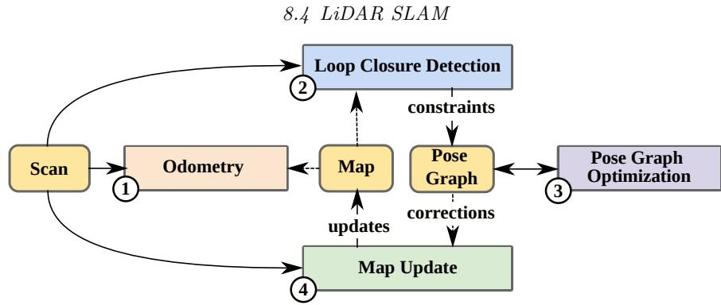
图 8.7 典型 LiDAR SLAM 系统的概念结构，由多个组件组成：(1) 里程计估计机器人/传感器位姿；(2) 回环检测确定是否重新访问某地点；(3) 位姿图优化使用回环约束，通过因子图优化校正位姿轨迹；(4) 地图更新使用最新位姿轨迹修正地图表示。

第 8.2 节讨论了 LiDAR 里程计方法的发展，其漂移率可低至每行驶一千米一米；第 8.3 节回顾了通过 LiDAR 地点识别确定回环的不同方法。LiDAR SLAM 包含将这些组件结合起来、维护一致轨迹和地图表示所需的技术，并且要求它们能在机器人、车辆或感知系统上实时、机载运行。

目前大多数 LiDAR SLAM 系统 [66, 846, 282, 265, 1253] 都由图 8.7 系统图所示组件构成。下一节将更详细讨论这一结构；第 8.4.2 节聚焦后端优化和地图更新的关键步骤，并介绍后端优化期间整合回环以校正机器人轨迹的常见技术。

LiDAR SLAM 的进阶主题包括多会话建图和多机器人建图。这些主题关注如何将多个建图会话融合到共同的全局参考系中：可以是并行的（多台机器人实时运行并实时求解），也可以是长期的（随时间对齐多个地图，以推断环境变化）。第 8.4.3 节将介绍多会话和多机器人 SLAM，并概述常见解决方案和挑战。

最后，随着 LiDAR SLAM 日趋成熟，其他进阶主题也得到关注。自动驾驶车辆等安全关键系统依赖 SLAM，因此必须考虑 LiDAR SLAM 系统的鲁棒性和可扩展性。本章最后的第 8.5 节将讨论这些主题。

### 8.4.1 LiDAR SLAM 系统的结构

实现 LiDAR SLAM 系统 [66, 846, 282, 265, 1253] 时，通常将其分解为若干模块：一个模块通过里程计估计器维护相对位姿估计，其他模块识别和利用回环，重新估计位姿轨迹，再根据修正后的位姿轨迹更新关联地图表示。LiDAR SLAM 系统通常包含一个以 LiDAR 传感器帧率（例如 10 Hz）运行的里程计估计模块，而其他模块以较低频率（例如 1 Hz）运行。

具体看图 8.7：(1) 里程计组件使用当前活动局部地图，以帧到地图的方式估计位姿。对里程计模块而言，最常见方法是将输入激光扫描配准到滚动/活动局部地图（如第 8.2 节所述）。里程计模块通常只能访问传感器直接邻域的数据，这些数据通常称为活动局部地图。

接着，(2) 基于 LiDAR 的地点识别方法确定潜在回环候选，如第 8.3 节所述。地点识别只能确定两个地点（更确切地说，是在这两个地点采集的观测）相似。要确定两地点之间精确的相对变换估计，还需要对相应 LiDAR 扫描进行精细配准（通常使用 ICP）。

为初始化配准，需要足够好的相对变换初始猜测。对小型位姿图，可以使用几何先验（取自已有位姿图）。在无法使用几何先验时，研究者已经提出不依赖初始猜测、但能够鲁棒估计相对变换的现代全局配准方法 [1223, 665]。当两次扫描重叠较少时，这些方法仍能良好工作。

可以使用回环候选之间的行驶距离或时间差，或使用基于 RANSAC 的几何验证对齐的置信度等启发式规则，确定回环候选的有效性，避免向位姿图加入错误回环。

模块 (3) 是后端位姿图优化（PGO）步骤。它使用完整 SLAM 约束集求解优化后的位姿图，并更新位姿轨迹。下一节将更详细讨论 PGO。

最后，(4) 地图更新机制根据校正后的轨迹，将传感器测量整合到组合地图表示中。对此有多种方法。最常见的方法是直接使用点 [256]；而 surfel [282, 846, 66] 和隐式表示 [1253, 265] 等方法则尝试提高底层地图质量，或为地图提供更强的概率基础。关于不同稠密地图表示的技术细节和讨论，参见第 5 章。

下一节将详细讨论后端位姿图优化，以及通常如何更新完整地图表示。

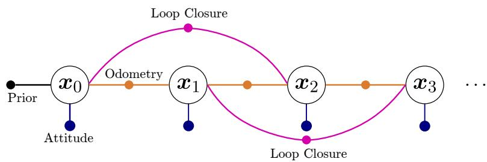
图 8.8 用位姿图表示的 SLAM 问题。每个节点表示传感器位姿，边表示来自里程计（橙色）和回环（洋红色）的约束。先验因子固定图的原点；有惯性感知时，可选的姿态因子用于约束俯仰角和滚转角。引自 [887]。

### 8.4.2 位姿图优化与地图更新

LiDAR SLAM 系统的关键部分，是在提出并验证回环后更新位姿轨迹和地图表示。由于局部位姿估计包含漂移，必须在更新后的位姿轨迹中考虑局部位姿估计误差。此外，整合过去测量的已有地图表示也需要更新。

SLAM 后端通常使用位姿图优化（PGO）。PGO 校正估计轨迹，使其同时满足里程计约束以及在重新访问已观测地点时识别的回环约束。如第一部分（见第 1 章）所述，可以用因子图表示这些约束，如图 8.8 所示。由于图仅由相对位姿约束组成，通常称为位姿图。图 8.9 展示了回环检测和位姿图优化前后的点云地图示例。

可以使用 g2o [614] 和 GTSAM [253] 等通用求解器优化约束集。为在位姿图不断增大时实现实时性能，需要迭代求解持续增长的优化问题。不过，约束集通常是稀疏的，只有少量互联边。对底层方程系统进行重排序和重新线性化的稀疏矩阵分解方法，可以在不到一秒的时间内更新包含 1000 个以上节点的图。更多内容参见第 1 章，以及 iSAM2 [534] 和 HOG-Man [401]。

需要注意，虽然 1000 个节点对应大型位姿图，但仍必须考虑可扩展性。通常只相对稀疏地添加里程计约束，而不是以传感器频率（例如 10 Hz）添加；可以改为每行驶数米添加一次。另一种方法是将已建图环境划分为固定物理尺寸的子地图（例如每行驶 30 m 一个子地图），每个子地图对应一个位姿图节点。假定子地图内部里程计局部准确，无需重新调整子地图内的轨迹。这种方法使位姿图 SLAM 能够扩展到城市规模地图。

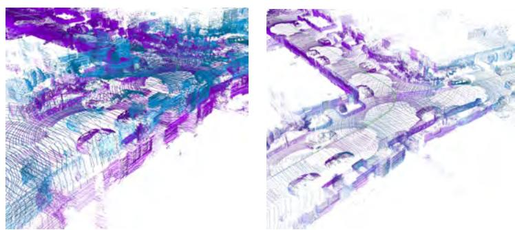
图 8.9 通过纳入回环约束，SLAM 系统可以创建重新访问地点的全局一致地图。左侧显示重新访问地点的纯里程计轨迹，在该路口原始访问（蓝色）与当前访问（紫色）之间存在明显错位。右侧显示整合回环后的位姿图优化结果，得到一致的道路路口地图。

在后端中，位姿图优化必须同时考虑里程计的位姿估计误差和回环约束误差。为正确建模里程计位姿的位姿估计不确定性，还可以估计数据驱动的协方差，以合理分配位姿图优化中的误差 [622, 159]，例如对漂移率可能较高的边约束使用较大的协方差。最后，为处理错误回环约束和位姿图的不良配置，研究者已开展大量鲁棒位姿图优化研究 [12, 153, 1059, 1060, 1221]，可以降低权重、禁用或忽略否则会导致地图退化或发散的位姿图约束（详见第 3 章）。

位姿图优化后，完整机器人轨迹已实现全局一致，但这一更新的影响也需要反映到地图本身。常见方法是利用过去观测简单地重建地图。这要求系统无限期存储过去观测，在大尺度环境中很快变得不适用。替代方法是使地图表示发生形变 [846]，或将地图元素（例如 surfel 或子地图）直接连接到位姿，以更可扩展地实现地图变形。

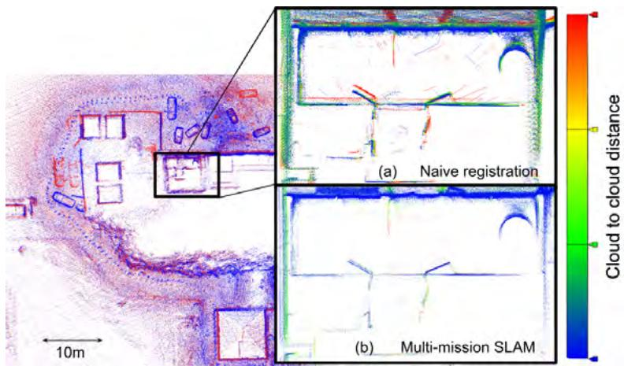
图 8.10 (a) 两个全局点云的朴素直接对齐与 (b) 多会话位姿图松弛的比较。(a) 两个全局点云之间的点到点距离产生“双墙”现象，虚构出环境变化。(b) 多会话松弛降低点到点距离，使结构得到更清晰重建。引自 [951]。（©2024 IEEE）

### 8.4.3 多机器人与多会话 LiDAR SLAM

随着单机器人、单会话 LiDAR SLAM 系统日趋成熟，研究者开始关注将其扩展到多机器人和多会话应用。这很有用：它可以将不完整地图扩展到新扫描区域，或使多台现场机器人利用共同地图表示协调活动。另一个用途是对同一区域在不同时间采集的地图进行共同配准，以推断长期环境变化，例如安全或监测应用中的变化。

首先需要指出，现代 LiDAR SLAM 系统越来越准确，在开阔空间中典型漂移为每千米一米，但 SLAM 地图中总会残留一些小误差。直接将两次独立 SLAM 任务的最终点云地图共同配准，会在某些位置产生不一致的点云对齐，如图 8.10 所示。

该领域的早期工作聚焦于如何对多个建图会话进行联合后端优化。一种方法是将多个 SLAM 实例的约束直接从各自约束集合转移到单一全局地图表示中。另一种方法是分别构建每个地图，每张地图有自己的坐标系、节点和边。为将它们彼此连接，Kim 等人 [562] 引入称为锚节点的辅助变量，以处理不同 SLAM 任务的地图坐标差异。该节点能够轻松实现每张地图的全局对齐，已用于多会话视觉 SLAM 和 LiDAR SLAM [749, 565]。

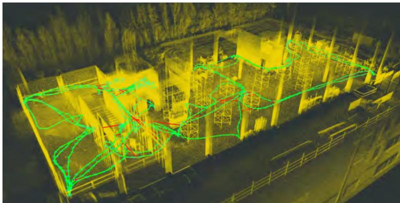
图 8.11 建设工地的多会话 SLAM 地图。通过建立会话间回环约束（红色）并联合优化五个建图会话的轨迹（绿色），将五个不同建图会话合并。

如 [284] 所述，除后端优化外，还必须确定如何在完全断开的 SLAM 任务之间建立回环约束。不同于单会话 SLAM，最初没有几何先验可用于形成首个会话间约束；多会话 SLAM 完全依赖地点识别将地图相互关联。

#### 8.4.3.1 多机器人 SLAM

实时多机器人 SLAM 更进一步：它解决多会话建图问题，但使用的是现场运行机器人实时采集的数据。从多个平台实时估计组合地图，可以使机器人团队协调任务规划、最佳选择探索前沿，并避免重复返回另一台机器人已建图的位置。该能力使机器人团队能够协同工作，高效探索区域、识别无障碍路线，并可能识别感兴趣的人员或物体。这对搜救和军事应用都很重要。

可以区分集中式系统和分散式系统。集中式系统可将传感器测量传输到基站，并在该处计算组合地图。这可以让现场机器人的计算和感知尽可能简单，例如 Amazon 和 Ocado 仓库作业中使用的移动机器人。另一方面，分散式（或分布式）系统在每台机器人上独立构建 SLAM 地图，再由基站合并机器人地图集合。

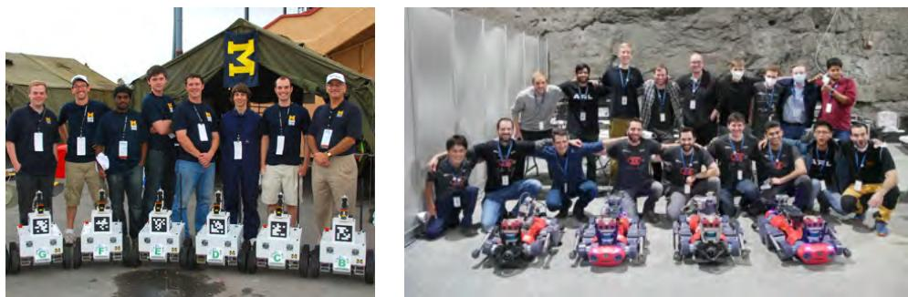
图 8.12 多机器人 SLAM 从 2010 年 MAGIC 挑战赛的二维系统发展到 2021 年 DARPA SubT 挑战赛的完整三维系统。图片展示两次挑战赛的获胜队伍：密歇根大学队和 Cerberus 队。图片由 Edwin Olson 和 Cerberus 队提供。

为描述最新技术的发展，我们参考两个重要的国际多机器人探索挑战赛。第一个是 2010 年在澳大利亚布里斯班举行的 Multi Autonomous Ground-robotic International Challenge（MAGIC）。该挑战要求轮式机器人队伍在 $500\,\mathrm{m} \times 500\,\mathrm{m}$ 的区域执行侦察任务，正确定位并分类模拟威胁。获胜的密歇根队部署了 14 台三维打印机器人，每台配备二维 LiDAR 扫描器 [828] 和用于识别回环的相机。每台机器人执行二维 LiDAR 里程计，并将位姿图约束传输到基站，由基站组装全局二维多机器人地图。

过去十年的研究进展由 2021 年在肯塔基州路易斯维尔举行的 DARPA Subterranean Challenge [600] 体现。与 MAGIC 类似，该挑战要求参赛队伍探索未知环境，但机器人需要在更复杂的三维地下环境中运行，其中包含楼梯、路缘和坡道。这里广泛使用三维多光束 LiDAR，同时辅以视觉里程计、轮式/足式里程计，有时还使用热成像里程计，以克服 LiDAR 里程计可能失败的退化情形，例如地下隧道中的狭窄环境。

SubT 队伍发表的综述文章比较了参赛系统 [299]。每个队伍都采用半分散式方法：每台机器人在机载设备上构建基于位姿图的 SLAM 地图，再由单一中央基站创建多机器人 SLAM 地图。关键挑战包括压缩和通信，因为机器人队伍需要维护动态无线网格网络，将数据传回基站。例如，CSIRO 的 WildCat SLAM 系统 [601] 采用压缩 surfel 表示来表示局部子地图。这些 surfel 地图比原始点云占用空间小得多，大幅降低了向基站计算机传输地图和位姿图约束所需的带宽。在决赛期间，每台机器人完整地图的大小仅为 21.5 MB。

如前所述，最复杂的问题是完全分布式 SLAM 系统：每台机器人平台都需要在通信和可扩展性约束下，构建和维护整体组合地图表示。一些现有方法 [493, 1095] 已探索如何实现这一目标，重点是逐步在每台机器人之间共享约束集合和局部子地图。该主题的核心问题是保持一致性。

## 8.5 延伸阅读与近期趋势

过去几十年，尤其是 LOAM [1269] 提出以来，LiDAR SLAM 取得了重大进展。研究者还开发了高精度里程计 [1211, 999, 1133, 256] 和高效位姿图 SLAM 系统 [66, 265, 846, 903]。然而，尽管取得这些进展，仍有许多未解决问题和挑战。

**鲁棒且韧性的感知。** Zhao 等人近期的鲁棒性评估 [1288] 发现，LiDAR SLAM 系统在杂乱、无结构环境中难以有效运行。无结构走廊、地下矿井以及雪、雾、尘等极端天气条件，也是 DARPA Subterranean Challenge 参赛者综述 [299] 指出的挑战场景。

此外，当前 LiDAR SLAM 系统的性能通常通过实验展示，缺乏正式鲁棒性评估。最佳性能依赖特征工程和手工参数调节；这些参数或许应像 KISS-ICP [1133] 那样，根据运行场景动态调整。未来改进应考虑主动调整算法行为，通过内省适应环境变化。

关于地点识别，研究方向十分广泛。[1007, 1249] 等重要综述论文为该主题提供了全面基础。当前研究包括能够跨不同 LiDAR 传感器类别泛化的鲁棒检索方法 [529]。另一些研究致力于实现 LiDAR 与雷达 [1248]、OpenStreetMap [211] 等其他模态之间的异构地点识别。研究者还成功利用 LiDAR 强度信息 [1000, 1151]，结合传统 XYZ 数据改善性能。跨多个建图会话的长期地点识别 [566]，以及变化检测和终身地图管理 [565, 1251]，也是有前景的研究主题。

**多传感器融合。** 融合具有互补特性的多种传感器，是构建更鲁棒、更具韧性机器人系统的关键途径。通过融合不同的互补传感器，可以缓解某一传感器感知退化，例如雷达在雨天或烟雾中表现良好，或在 LiDAR 失效的隧道中使用视觉特征跟踪 [1191, 1287]。不过，将更多传感器接入 LiDAR 后，必然会获得大量传感器数据，导致冗余。如何在冗余和轻量计算之间取得平衡，仍是开放问题；融合多个传感器估计时，还必须高效选择最可靠的信息。解决方案包括早期融合（使用单一紧耦合估计器）和后期融合（组合各个独立传感器的位姿估计）。

最后，多传感器系统可能缺乏准确标定，且各传感器不一定精确同步。这会给底层估计系统带来负担，使完整紧耦合传感器融合难以在长时间间隔内实际使用。这些有趣的研究问题仍有很大探索空间。

**不确定性与贝叶斯估计。** 与传感器如何可靠融合密切相关的另一个问题，是 LiDAR SLAM 中的不确定性估计。若要以概率方式融合多个位姿估计，需要经过适当标定的传感器不确定性度量。然而，大多数成功的基于 LiDAR 的方法依赖 ICP，而 ICP 并不能提供经过标定且鲁棒的位姿不确定性估计。

尽管已有一些用于近似协方差的早期方法 [622, 159]，LiDAR SLAM 系统中使用的估计不确定性通常并不可靠。因此，后端位姿图优化常使用固定的里程计协方差。对里程计过程中的不确定性进行更具内省性的处理，有望在更早阶段处理退化的位姿估计。关于不确定性估计仍有许多开放问题；鲁棒解决方案将支持更具韧性的 SLAM 系统和多模态 SLAM 的发展。

**闭环自主系统中的部署。** 最后需要考虑 LiDAR SLAM 在目标最终应用中的表现。这些应用十分多样，包括穿越森林的轻型空中飞行器、扫描建筑工地的手持设备，以及在恶劣天气中运行的自动驾驶汽车。传统的尺寸、重量和功耗（Size, Weight, and Power，SWaP）电子系统要求，还要与准确性、鲁棒性、计算量和延迟等参数共同考虑。例如，自动驾驶汽车尽可能低延迟地响应即将发生的碰撞的能力，会受到 LiDAR 系统计算延迟的影响。因此，在某些应用中，最准确且计算最复杂的系统不一定总是首选方案。
